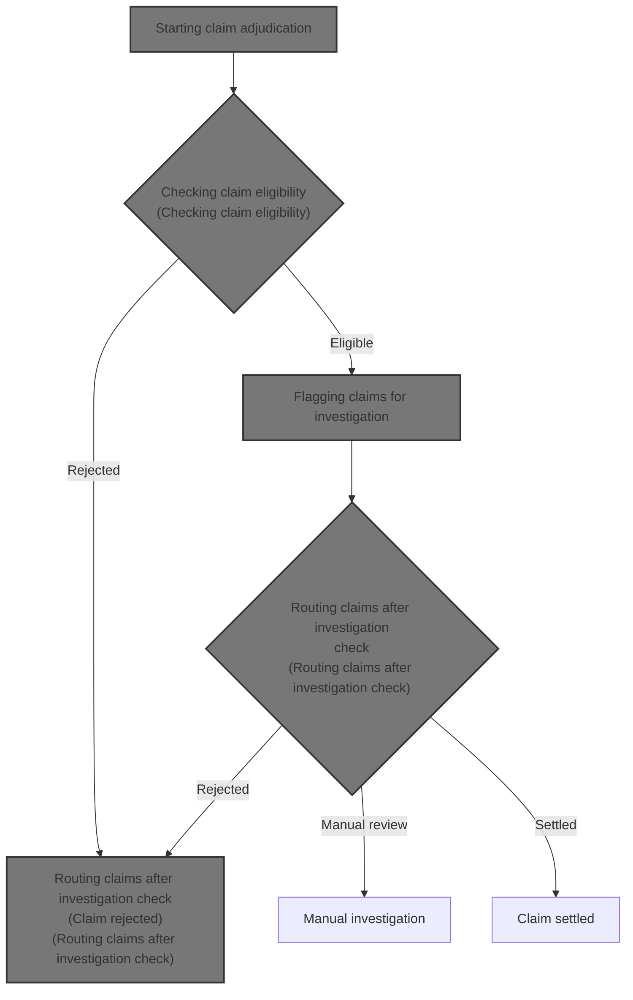
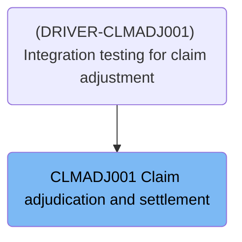
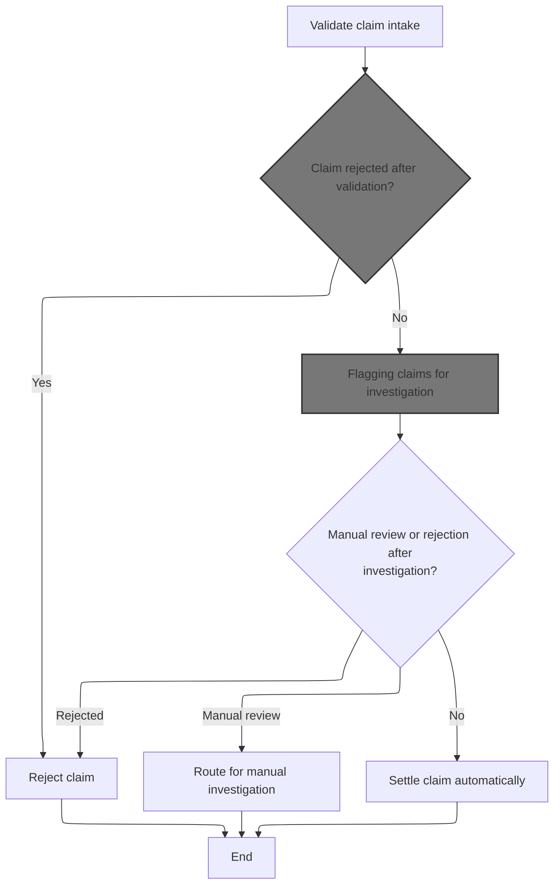
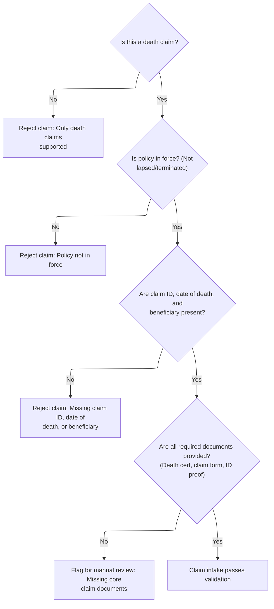
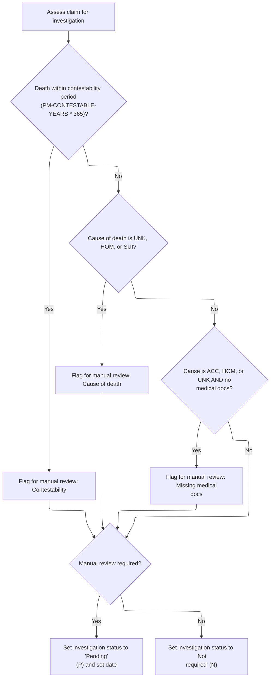
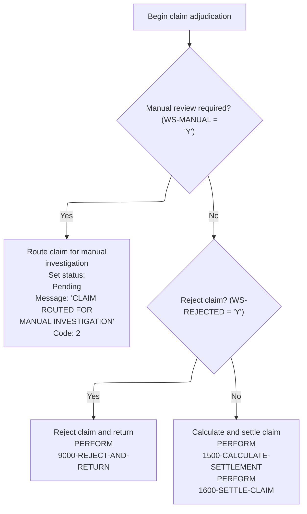

# Overview

This document describes the flow for processing term life insurance claims. Claims are validated for eligibility, flagged for investigation if contestability or documentation issues arise, and either routed for manual review, rejected, or settled automatically.



## Dependencies

### Program

- <SwmToken path="cobol/CLM-ADJ-001.cob" pos="2:6:6" line-data="       PROGRAM-ID. CLMADJ001.">`CLMADJ001`</SwmToken> (<SwmPath>[cobol/CLM-ADJ-001.cob](cobol/CLM-ADJ-001.cob)</SwmPath>)

### Copybook

- POLDATA (<SwmPath>[cpy/POLDATA.cpy](cpy/POLDATA.cpy)</SwmPath>)

# Where is this program used?

This program is used once, as represented in the following diagram:



# Workflow

# Starting claim adjudication



This section governs the initial adjudication of life insurance claims. It determines whether claims are accepted, rejected, flagged for investigation, routed for manual review, or settled automatically based on business rules and plan parameters.

| Rule ID | Category        | Rule Name              | Description                                                                                                                                                                                                                                           | Implementation Details                                                                                                                                                                      |
| ------- | --------------- | ---------------------- | ----------------------------------------------------------------------------------------------------------------------------------------------------------------------------------------------------------------------------------------------------- | ------------------------------------------------------------------------------------------------------------------------------------------------------------------------------------------- |
| BR-001  | Data validation | Claim intake rejection | If a claim fails intake validation (e.g., not a death claim, policy is lapsed or terminated, missing essential data, or missing mandatory documents), the claim is marked as rejected and an error message and code are set.                          | Rejection is indicated by a flag and accompanied by a reason code and message. Error messages are alphanumeric strings up to 100 characters. Error codes are numeric values up to 4 digits. |
| BR-002  | Decision Making | Flag for investigation | If a claim passes intake validation, it is evaluated for investigation based on contestable period, cause of death, and presence of required medical documents. If any investigation criteria are met, the claim is flagged for manual investigation. | Flagging for investigation is indicated by a status flag and a hold reason. Investigation status is an alphanumeric string, and hold reason is a descriptive string.                        |
| BR-003  | Decision Making | Manual review routing  | If a claim is flagged for manual investigation, it is routed for manual review and the process ends for this claim in this section.                                                                                                                   | Manual review status is indicated by a flag. Routing for manual review is a process outcome, not a data output.                                                                             |
| BR-004  | Decision Making | Automatic settlement   | If a claim passes both intake validation and investigation criteria (i.e., does not require manual review or rejection after investigation), it is settled automatically.                                                                             | Automatic settlement is indicated by a status flag. Settlement outcome is a process result, not a data output in this section.                                                              |

<SwmSnippet path="/cobol/CLM-ADJ-001.cob" line="41">

---

In <SwmToken path="cobol/CLM-ADJ-001.cob" pos="41:1:3" line-data="       MAIN-PROCESS.">`MAIN-PROCESS`</SwmToken>, we run initialization and load plan parameters, then call <SwmToken path="cobol/CLM-ADJ-001.cob" pos="44:3:9" line-data="           PERFORM 1200-VALIDATE-CLAIM-INTAKE">`1200-VALIDATE-CLAIM-INTAKE`</SwmToken> to check if the claim meets intake rules. Validation needs plan-specific info, so it has to come after loading those parameters.

```cobol
       MAIN-PROCESS.
           PERFORM 1000-INITIALIZE
           PERFORM 1100-LOAD-PLAN-PARAMETERS
           PERFORM 1200-VALIDATE-CLAIM-INTAKE
```

---

</SwmSnippet>

## Checking claim eligibility



This section validates claim eligibility for term life insurance policies, ensuring only valid death claims with all required information and documents proceed. It enforces business rules for claim intake and flags issues for rejection or manual review.

| Rule ID | Category        | Rule Name                      | Description                                                                                                                                | Implementation Details                                                                                                                                    |
| ------- | --------------- | ------------------------------ | ------------------------------------------------------------------------------------------------------------------------------------------ | --------------------------------------------------------------------------------------------------------------------------------------------------------- |
| BR-001  | Data validation | Death claim only               | Reject any claim that is not a death claim. Only death claims are supported for this domain.                                               | Rejection code is 12. Rejection message is 'ONLY DEATH CLAIMS SUPPORTED IN SAMPLE'. Output format: code (number), message (string, up to 100 characters). |
| BR-002  | Data validation | Policy in force                | Reject claims where the policy is not in force, specifically if the policy is lapsed or terminated.                                        | Rejection code is 13. Rejection message is 'POLICY NOT IN FORCE AT CLAIM INTAKE'. Output format: code (number), message (string, up to 100 characters).   |
| BR-003  | Data validation | Required claim fields          | Reject claims missing any of the following: claim ID, date of death, or beneficiary name.                                                  | Rejection code is 14. Rejection message is 'CLAIM ID DOB BENEFICIARY REQUIRED'. Output format: code (number), message (string, up to 100 characters).     |
| BR-004  | Data validation | Missing core claim documents   | Flag claims for manual review if any required document (death certificate, claim form, ID proof) is missing.                               | Hold reason is 'MISSING CORE CLAIM DOCUMENTS'. Output format: hold reason (string, up to 100 characters).                                                 |
| BR-005  | Decision Making | Claim intake passes validation | Claims that pass all eligibility checks and have all required documents are considered valid for intake and proceed to further processing. | No rejection or hold reason is set. Claim proceeds to next stage. Output format: claim status (string, e.g. 'valid').                                     |

<SwmSnippet path="/cobol/CLM-ADJ-001.cob" line="101">

---

In <SwmToken path="cobol/CLM-ADJ-001.cob" pos="101:1:7" line-data="       1200-VALIDATE-CLAIM-INTAKE.">`1200-VALIDATE-CLAIM-INTAKE`</SwmToken>, we start by checking if the claim is for death. If not, we reject it with code 12 and a message. The function relies on input flags being set correctly and uses domain-specific codes to signal validation failures.

```cobol
       1200-VALIDATE-CLAIM-INTAKE.
      * CL-201: Claim must be death claim for this sample domain.
           IF NOT PM-CLAIM-DEATH
              MOVE 'Y' TO WS-REJECT-CLAIM
              MOVE 12 TO PM-RETURN-CODE
              MOVE "ONLY DEATH CLAIMS SUPPORTED IN SAMPLE"
                   TO PM-RETURN-MESSAGE
              EXIT PARAGRAPH
           END-IF
```

---

</SwmSnippet>

<SwmSnippet path="/cobol/CLM-ADJ-001.cob" line="113">

---

After checking claim type, we check if the policy is lapsed or terminated. If so, we reject the claim with code 13 and a message, skipping the rest of the validation steps.

```cobol
           IF PM-STAT-LAPSED OR PM-STAT-TERMINATED
              MOVE 'Y' TO WS-REJECT-CLAIM
              MOVE 13 TO PM-RETURN-CODE
              MOVE "POLICY NOT IN FORCE AT CLAIM INTAKE"
                   TO PM-RETURN-MESSAGE
              EXIT PARAGRAPH
           END-IF
```

---

</SwmSnippet>

<SwmSnippet path="/cobol/CLM-ADJ-001.cob" line="122">

---

Here we check for missing claim ID, date of death, or beneficiary name. If any are missing, we reject the claim with code 14 and a specific message, using domain codes to indicate the failure.

```cobol
           IF PM-CLAIM-ID = SPACES OR PM-DATE-OF-DEATH = ZERO OR
              PM-BENEFICIARY-NAME = SPACES
              MOVE 'Y' TO WS-REJECT-CLAIM
              MOVE 14 TO PM-RETURN-CODE
              MOVE "CLAIM ID DOB BENEFICIARY REQUIRED"
                   TO PM-RETURN-MESSAGE
              EXIT PARAGRAPH
           END-IF
```

---

</SwmSnippet>

<SwmSnippet path="/cobol/CLM-ADJ-001.cob" line="132">

---

Now we check if the death certificate is missing. If it is, we flag the claim for manual review, but don't reject it immediately.

```cobol
           IF NOT PM-DOC-DEATH-CERT-YES
              MOVE 'Y' TO WS-MISSING-DOCS
           END-IF
```

---

</SwmSnippet>

<SwmSnippet path="/cobol/CLM-ADJ-001.cob" line="135">

---

Next we check for the claim form. If it's missing, we flag for manual review, just like with the death certificate.

```cobol
           IF NOT PM-DOC-CLAIM-FORM-YES
              MOVE 'Y' TO WS-MISSING-DOCS
           END-IF
```

---

</SwmSnippet>

<SwmSnippet path="/cobol/CLM-ADJ-001.cob" line="138">

---

Here we check for missing ID proof. Like the other document checks, it flags for manual review if not present, relying on input flags being set up correctly.

```cobol
           IF NOT PM-DOC-ID-PROOF-YES
              MOVE 'Y' TO WS-MISSING-DOCS
           END-IF
```

---

</SwmSnippet>

<SwmSnippet path="/cobol/CLM-ADJ-001.cob" line="141">

---

Finally, if any required document is missing, we flag the claim for manual review and set a hold reason. The function stops at the first failure, so only one error is reported.

```cobol
           IF WS-DOCS-MISSING
              MOVE 'Y' TO WS-MANUAL-REVIEW
              MOVE "MISSING CORE CLAIM DOCUMENTS"
                TO PM-CLAIM-HOLD-REASON
           END-IF.
```

---

</SwmSnippet>

## Handling validation outcomes

This section governs the process flow after claim validation, ensuring that rejected claims are not processed further and are routed to the rejection handling routine.

| Rule ID | Category        | Rule Name                 | Description                                                                                                                                                                                                           | Implementation Details                                                                                                                                                                                                      |
| ------- | --------------- | ------------------------- | --------------------------------------------------------------------------------------------------------------------------------------------------------------------------------------------------------------------- | --------------------------------------------------------------------------------------------------------------------------------------------------------------------------------------------------------------------------- |
| BR-001  | Decision Making | Rejected claim early exit | If a claim is marked as rejected after validation, the claim adjudication process stops and the rejection handling routine is invoked. No further claim processing steps are executed for that claim in this context. | The rejection status is indicated by a flag set to 'Y'. The process flow is terminated for the current claim, and the rejection handling routine is called. No output format or error message is specified in this section. |

<SwmSnippet path="/cobol/CLM-ADJ-001.cob" line="45">

---

Back in <SwmToken path="cobol/CLM-ADJ-001.cob" pos="41:1:3" line-data="       MAIN-PROCESS.">`MAIN-PROCESS`</SwmToken>, after returning from <SwmToken path="cobol/CLM-ADJ-001.cob" pos="44:3:9" line-data="           PERFORM 1200-VALIDATE-CLAIM-INTAKE">`1200-VALIDATE-CLAIM-INTAKE`</SwmToken>, if the claim was rejected, we call <SwmToken path="cobol/CLM-ADJ-001.cob" pos="46:3:9" line-data="              PERFORM 9000-REJECT-AND-RETURN">`9000-REJECT-AND-RETURN`</SwmToken> and exit. No more steps are run for rejected claims.

```cobol
           IF WS-REJECTED
              PERFORM 9000-REJECT-AND-RETURN
              GOBACK
           END-IF
```

---

</SwmSnippet>

<SwmSnippet path="/cobol/CLM-ADJ-001.cob" line="50">

---

Here we call <SwmToken path="cobol/CLM-ADJ-001.cob" pos="50:3:7" line-data="           PERFORM 1300-DETERMINE-INVESTIGATION">`1300-DETERMINE-INVESTIGATION`</SwmToken> to check if the claim needs manual investigation based on contestability period, cause of death, or missing medical docs.

```cobol
           PERFORM 1300-DETERMINE-INVESTIGATION
```

---

</SwmSnippet>

## Flagging claims for investigation



This section determines whether a claim requires investigation and flags it for manual review based on contestability, cause of death, and documentation criteria. It sets investigation status and hold reasons accordingly.

| Rule ID | Category        | Rule Name                                     | Description                                                                                                                                                                                                                                                                 | Implementation Details                                                                                                                                                          |
| ------- | --------------- | --------------------------------------------- | --------------------------------------------------------------------------------------------------------------------------------------------------------------------------------------------------------------------------------------------------------------------------- | ------------------------------------------------------------------------------------------------------------------------------------------------------------------------------- |
| BR-001  | Calculation     | Date-to-integer conversion for contestability | The section converts date fields (date of death and issue date) to integer values using an intrinsic function, enabling calculation of the days between dates for contestability checks.                                                                                    | Dates are converted from YYYYMMDD format to integer (days since base date) for arithmetic operations.                                                                           |
| BR-002  | Decision Making | Contestability period review                  | If the number of days between the date of death and the policy issue date is less than the contestability period (contestable years multiplied by 365), the claim is flagged for manual review and the hold reason is set to 'Death occurred within contestability period'. | The contestable years constant is 2 for all plan codes. The hold reason is set as a string: 'Death occurred within contestability period'.                                      |
| BR-003  | Decision Making | Cause of death review                         | If the cause of death is unknown, homicide, or suicide, the claim is flagged for manual review and the hold reason is set to 'Cause of death requires claims investigation'.                                                                                                | Hold reason is set as a string: 'Cause of death requires claims investigation'.                                                                                                 |
| BR-004  | Decision Making | Missing medical documentation review          | If the cause of death is accidental, homicide, or unknown and medical documentation is missing, the claim is flagged for manual review and the hold reason is set to 'Medical documentation required for this claim'.                                                       | Hold reason is set as a string: 'Medical documentation required for this claim'.                                                                                                |
| BR-005  | Writing Output  | Investigation status assignment               | If manual review is flagged, the claim investigation status is set to 'Pending' and the investigation date is set to the process date. Otherwise, the status is set to 'Not required'.                                                                                      | Investigation status is set as a single character: 'P' for pending, 'N' for not required. Investigation date is set as an 8-digit number (YYYYMMDD), matching the process date. |

<SwmSnippet path="/cobol/CLM-ADJ-001.cob" line="147">

---

In <SwmToken path="cobol/CLM-ADJ-001.cob" pos="147:1:5" line-data="       1300-DETERMINE-INVESTIGATION.">`1300-DETERMINE-INVESTIGATION`</SwmToken>, we calculate the days between death and policy issue date. If it's within the contestability period, we flag for manual review and set a hold reason.

```cobol
       1300-DETERMINE-INVESTIGATION.
      * CL-301: Contestable claims go to investigation.
           COMPUTE WS-DATE-DIFF =
                   FUNCTION INTEGER-OF-DATE(PM-DATE-OF-DEATH)
                 - FUNCTION INTEGER-OF-DATE(PM-ISSUE-DATE)
           IF WS-DATE-DIFF < (PM-CONTESTABLE-YEARS * 365)
              MOVE 'Y' TO WS-MANUAL-REVIEW
              MOVE "DEATH OCCURRED WITHIN CONTESTABILITY PERIOD"
                TO PM-CLAIM-HOLD-REASON
           END-IF
```

---

</SwmSnippet>

<SwmSnippet path="/cobol/CLM-ADJ-001.cob" line="159">

---

After contestability check, we look at cause of death codes. If it's unknown, homicide, or suicide, we flag for manual review and update the hold reason.

```cobol
           IF PM-CAUSE-OF-DEATH = "UNK" OR
              PM-CAUSE-OF-DEATH = "HOM" OR
              PM-CAUSE-OF-DEATH = "SUI"
              MOVE 'Y' TO WS-MANUAL-REVIEW
              MOVE "CAUSE OF DEATH REQUIRES CLAIMS INVESTIGATION"
                TO PM-CLAIM-HOLD-REASON
           END-IF
```

---

</SwmSnippet>

<SwmSnippet path="/cobol/CLM-ADJ-001.cob" line="169">

---

Next, if the cause of death is accidental, homicide, or unknown and medical docs are missing, we flag for manual review and set a specific hold reason.

```cobol
           IF (PM-CAUSE-OF-DEATH = "ACC" OR
               PM-CAUSE-OF-DEATH = "HOM" OR
               PM-CAUSE-OF-DEATH = "UNK") AND
              NOT PM-DOC-MEDICAL-YES
              MOVE 'Y' TO WS-MANUAL-REVIEW
              MOVE "MEDICAL DOCUMENTATION REQUIRED FOR THIS CLAIM"
                TO PM-CLAIM-HOLD-REASON
           END-IF
```

---

</SwmSnippet>

<SwmSnippet path="/cobol/CLM-ADJ-001.cob" line="178">

---

Finally, if manual review is flagged, we set the claim investigation status to pending and record the investigation date. Otherwise, status is set to not under investigation.

```cobol
           IF WS-MANUAL
              MOVE 'P' TO PM-CLAIM-INVEST-STATUS
              MOVE PM-PROCESS-DATE TO PM-CLAIM-INVEST-DATE
           ELSE
              MOVE 'N' TO PM-CLAIM-INVEST-STATUS
           END-IF.
```

---

</SwmSnippet>

## Routing claims after investigation check



This section determines the next step for a claim after the investigation check. It routes the claim for manual investigation, rejection, or settlement based on business conditions.

| Rule ID | Category        | Rule Name                            | Description                                                                                                                                                                                                                                                              | Implementation Details                                                                                                                                                                                                                                  |
| ------- | --------------- | ------------------------------------ | ------------------------------------------------------------------------------------------------------------------------------------------------------------------------------------------------------------------------------------------------------------------------ | ------------------------------------------------------------------------------------------------------------------------------------------------------------------------------------------------------------------------------------------------------- |
| BR-001  | Decision Making | Manual investigation routing         | When manual review is required, the claim is routed for manual investigation. The claim status and decision are set to 'P', the return message is set to 'CLAIM ROUTED FOR MANUAL INVESTIGATION', and the return code is set to 2. Processing stops after these updates. | Status and decision are set to 'P' (pending). Return message is the string 'CLAIM ROUTED FOR MANUAL INVESTIGATION' (alphanumeric, up to 100 characters). Return code is the number 2. No further processing occurs in this section after these updates. |
| BR-002  | Decision Making | Claim rejection after investigation  | If manual review is not required and the claim is marked for rejection, the claim is rejected and rejection processing is invoked. Processing stops after rejection.                                                                                                     | Rejection processing is invoked. No further processing occurs in this section after rejection.                                                                                                                                                          |
| BR-003  | Decision Making | Claim settlement after investigation | If manual review is not required and the claim is not rejected, the claim proceeds to settlement calculation and settlement processing.                                                                                                                                  | Settlement calculation and settlement processing are invoked in sequence. No status, message, or code updates are specified in this section for this path.                                                                                              |

<SwmSnippet path="/cobol/CLM-ADJ-001.cob" line="51">

---

Back in <SwmToken path="cobol/CLM-ADJ-001.cob" pos="41:1:3" line-data="       MAIN-PROCESS.">`MAIN-PROCESS`</SwmToken>, after returning from <SwmToken path="cobol/CLM-ADJ-001.cob" pos="50:3:7" line-data="           PERFORM 1300-DETERMINE-INVESTIGATION">`1300-DETERMINE-INVESTIGATION`</SwmToken>, if manual review is needed, we update claim status and decision, set a message, and exit. Claim goes to manual investigation.

```cobol
           IF WS-MANUAL
              MOVE 'P' TO LK-CLAIM-STATUS
              MOVE 'P' TO PM-CLAIM-DECISION
              MOVE "CLAIM ROUTED FOR MANUAL INVESTIGATION"
                TO PM-RETURN-MESSAGE
              MOVE 2 TO PM-RETURN-CODE
              GOBACK
           END-IF
```

---

</SwmSnippet>

<SwmSnippet path="/cobol/CLM-ADJ-001.cob" line="60">

---

Here we call <SwmToken path="cobol/CLM-ADJ-001.cob" pos="60:3:7" line-data="           PERFORM 1400-ADJUDICATE-COVERAGE">`1400-ADJUDICATE-COVERAGE`</SwmToken> to check for coverage exclusions, but only if the claim wasn't routed for manual investigation.

```cobol
           PERFORM 1400-ADJUDICATE-COVERAGE
```

---

</SwmSnippet>

<SwmSnippet path="/cobol/CLM-ADJ-001.cob" line="61">

---

After adjudication, we check if the claim was rejected. If so, we call <SwmToken path="cobol/CLM-ADJ-001.cob" pos="62:3:9" line-data="              PERFORM 9000-REJECT-AND-RETURN">`9000-REJECT-AND-RETURN`</SwmToken> and exit, just like after validation.

```cobol
           IF WS-REJECTED
              PERFORM 9000-REJECT-AND-RETURN
              GOBACK
           END-IF
```

---

</SwmSnippet>

<SwmSnippet path="/cobol/CLM-ADJ-001.cob" line="66">

---

Finally, we calculate the settlement amount, settle the claim, and exit. Claim is marked as settled and payout is processed.

```cobol
           PERFORM 1500-CALCULATE-SETTLEMENT
           PERFORM 1600-SETTLE-CLAIM
           GOBACK.
```

---

</SwmSnippet>

&nbsp;

*This is an auto-generated document by Swimm 🌊 and has not yet been verified by a human*

<SwmMeta version="3.0.0" repo-id="Z2l0aHViJTNBJTNBQ09CT0xfU2FtcGxlX01hcmNoXzIwMjYlM0ElM0FtdWRhc2luMQ==" repo-name="COBOL_Sample_March_2026"><sup>Powered by [Swimm](https://app.swimm.io/)</sup></SwmMeta>
