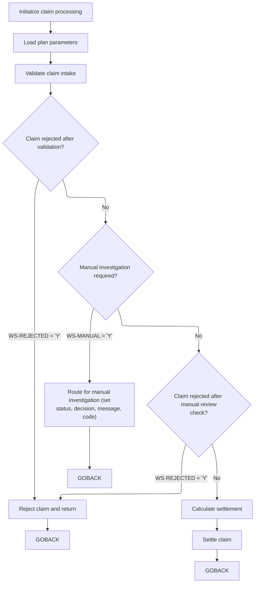
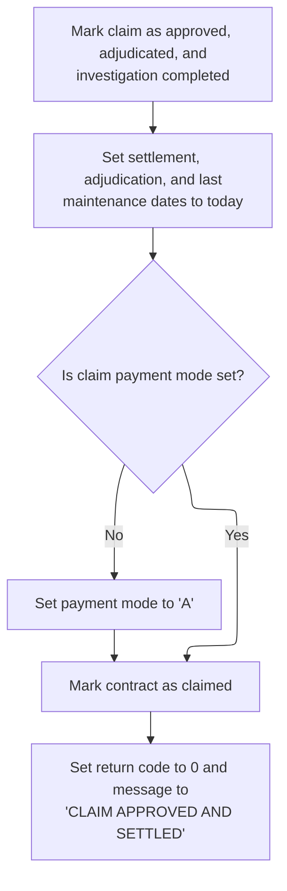

# Overview

This document describes the flow for processing term life insurance claims. The system validates claim intake, determines if claims require manual investigation, adjudicates coverage, calculates the net settlement payout, and finalizes claim approval. Claims may be rejected, routed for manual review, or settled with a payout depending on business rules and policy details.

## Dependencies

### Program

- <SwmToken path="CLM-ADJ-001.cob" pos="2:6:6" line-data="       PROGRAM-ID. CLMADJ001.">`CLMADJ001`</SwmToken> (<SwmPath>[CLM-ADJ-001.cob](CLM-ADJ-001.cob)</SwmPath>)

### Copybook

- POLDATA (<SwmPath>[POLDATA.cpy](POLDATA.cpy)</SwmPath>)

# Workflow

# Claim Intake and Routing



This section governs the main workflow for claim intake and routing, determining whether a claim is rejected, routed for manual investigation, or processed for settlement based on validation and adjudication outcomes.

| Rule ID | Category        | Rule Name                           | Description                                                                                                                                              | Implementation Details                                                                                                            |
| ------- | --------------- | ----------------------------------- | -------------------------------------------------------------------------------------------------------------------------------------------------------- | --------------------------------------------------------------------------------------------------------------------------------- |
| BR-001  | Decision Making | Reject on intake validation failure | If the claim is marked as rejected after intake validation, the claim is rejected and processing stops.                                                  | The claim is rejected if the rejection flag is set after validation. No further processing occurs for this claim in this context. |
| BR-002  | Decision Making | Route for manual investigation      | If the claim is marked for manual investigation, the claim is routed for manual review, and the status, decision, message, and code are set accordingly. | When routed for manual investigation, the following outputs are set:                                                              |

- Status: 'P' (pending)
- Decision: 'P' (pending)
- Message: 'CLAIM ROUTED FOR MANUAL INVESTIGATION' (string, 100 characters max)
- Code: 2 (number, 4 digits) Processing stops for this claim in this context. | | BR-003  | Decision Making | Reject on coverage adjudication failure  | If the claim is marked as rejected after coverage adjudication, the claim is rejected and processing stops.                                              | The claim is rejected if the rejection flag is set after coverage adjudication. No further processing occurs for this claim in this context.                                                                                                                                         | | BR-004  | Decision Making | Proceed to settlement if all checks pass | Claims that are not rejected and do not require manual investigation proceed to settlement calculation and finalization.                                 | Settlement calculation and finalization are performed for claims that pass all checks. No output values are set in this section; settlement is handled in subsequent steps.                                                                                                          |

<SwmSnippet path="/CLM-ADJ-001.cob" line="41">

---

In <SwmToken path="CLM-ADJ-001.cob" pos="41:1:3" line-data="       MAIN-PROCESS.">`MAIN-PROCESS`</SwmToken>, we kick off the claim adjudication by initializing claim fields, loading plan-specific parameters, and validating the intake data. Each step sets up the flags and data needed for the rest of the workflow. The process expects these called paragraphs to set <SwmToken path="CLM-ADJ-001.cob" pos="45:3:5" line-data="           IF WS-REJECTED">`WS-REJECTED`</SwmToken> and <SwmToken path="CLM-ADJ-001.cob" pos="51:3:5" line-data="           IF WS-MANUAL">`WS-MANUAL`</SwmToken> as needed, which will drive later decisions.

```cobol
       MAIN-PROCESS.
           PERFORM 1000-INITIALIZE
           PERFORM 1100-LOAD-PLAN-PARAMETERS
           PERFORM 1200-VALIDATE-CLAIM-INTAKE
```

---

</SwmSnippet>

<SwmSnippet path="/CLM-ADJ-001.cob" line="45">

---

If the claim is rejected after intake validation, we call the reject handler and bail out immediately.

```cobol
           IF WS-REJECTED
              PERFORM 9000-REJECT-AND-RETURN
              GOBACK
           END-IF
```

---

</SwmSnippet>

<SwmSnippet path="/CLM-ADJ-001.cob" line="50">

---

Next we call <SwmToken path="CLM-ADJ-001.cob" pos="50:3:7" line-data="           PERFORM 1300-DETERMINE-INVESTIGATION">`1300-DETERMINE-INVESTIGATION`</SwmToken> to see if the claim needs manual review based on contestability, death cause, or missing docs. This sets up the routing for claims that need extra scrutiny.

```cobol
           PERFORM 1300-DETERMINE-INVESTIGATION
```

---

</SwmSnippet>

<SwmSnippet path="/CLM-ADJ-001.cob" line="51">

---

If manual review is needed, we mark the claim as pending, set the message and code, and return.

```cobol
           IF WS-MANUAL
              MOVE 'P' TO LK-CLAIM-STATUS
              MOVE 'P' TO PM-CLAIM-DECISION
              MOVE "CLAIM ROUTED FOR MANUAL INVESTIGATION"
                TO PM-RETURN-MESSAGE
              MOVE 2 TO PM-RETURN-CODE
              GOBACK
           END-IF
```

---

</SwmSnippet>

<SwmSnippet path="/CLM-ADJ-001.cob" line="60">

---

After handling investigation, we call <SwmToken path="CLM-ADJ-001.cob" pos="60:3:7" line-data="           PERFORM 1400-ADJUDICATE-COVERAGE">`1400-ADJUDICATE-COVERAGE`</SwmToken> to check if the claim is valid based on policy rules. If coverage fails, the claim gets rejected before any payout is calculated.

```cobol
           PERFORM 1400-ADJUDICATE-COVERAGE
```

---

</SwmSnippet>

<SwmSnippet path="/CLM-ADJ-001.cob" line="61">

---

After adjudicating coverage, we check <SwmToken path="CLM-ADJ-001.cob" pos="61:3:5" line-data="           IF WS-REJECTED">`WS-REJECTED`</SwmToken> again. If coverage fails, we call the reject handler and exit, skipping settlement steps.

```cobol
           IF WS-REJECTED
              PERFORM 9000-REJECT-AND-RETURN
              GOBACK
           END-IF
```

---

</SwmSnippet>

<SwmSnippet path="/CLM-ADJ-001.cob" line="66">

---

Finally, we call <SwmToken path="CLM-ADJ-001.cob" pos="66:3:7" line-data="           PERFORM 1500-CALCULATE-SETTLEMENT">`1500-CALCULATE-SETTLEMENT`</SwmToken> to figure out the payout, then <SwmToken path="CLM-ADJ-001.cob" pos="67:3:7" line-data="           PERFORM 1600-SETTLE-CLAIM">`1600-SETTLE-CLAIM`</SwmToken> to finalize and approve the claim. Only claims that pass all checks reach this point.

```cobol
           PERFORM 1500-CALCULATE-SETTLEMENT
           PERFORM 1600-SETTLE-CLAIM
           GOBACK.
```

---

</SwmSnippet>

# Payout Calculation Logic

```mermaid
%%{init: {"flowchart": {"defaultRenderer": "elk"}} }%%
flowchart TD
    node1["Start settlement calculation"] --> node2["Set payout to sum assured"]
    click node1 openCode "CLM-ADJ-001.cob:201:203"
    click node2 openCode "CLM-ADJ-001.cob:203:204"
    node2 --> node3{"Cause of death is 'ACC'?"}
    click node3 openCode "CLM-ADJ-001.cob:207:208"
    node3 -->|"Yes"| node4["Check all riders"]
    node3 -->|"No"| node6{"Policy in grace status?"}
    
    subgraph loop1["For each rider"]
        node4 --> node5{"Is rider ADB01 and active?"}
        click node5 openCode "CLM-ADJ-001.cob:210:211"
        node5 -->|"Yes"| node7["Add rider sum assured to payout"]
        click node7 openCode "CLM-ADJ-001.cob:212:213"
        node7 --> node4
        node5 -->|"No"| node4
    end
    node4 --> node6
    click node6 openCode "CLM-ADJ-001.cob:219:220"
    node6 -->|"Yes"| node8["Subtract modal premium from payout"]
    click node8 openCode "CLM-ADJ-001.cob:220:221"
    node6 -->|"No"| node9{"Policy loan balance > 0?"}
    click node9 openCode "CLM-ADJ-001.cob:224:225"
    node8 --> node9
    node9 -->|"Yes"| node10["Subtract loan balance from payout"]
    click node10 openCode "CLM-ADJ-001.cob:225:226"
    node9 -->|"No"| node11{"Is payout negative?"}
    click node11 openCode "CLM-ADJ-001.cob:228:229"
    node10 --> node11
    node11 -->|"Yes"| node12["Set payout to zero"]
    click node12 openCode "CLM-ADJ-001.cob:229:230"
    node11 -->|"No"| node13["Set claim payment amount"]
    click node13 openCode "CLM-ADJ-001.cob:231:231"
    node12 --> node13
classDef HeadingStyle fill:#777777,stroke:#333,stroke-width:2px;

%% Swimm:
%% %%{init: {"flowchart": {"defaultRenderer": "elk"}} }%%
%% flowchart TD
%%     node1["Start settlement calculation"] --> node2["Set payout to sum assured"]
%%     click node1 openCode "<SwmPath>[CLM-ADJ-001.cob](CLM-ADJ-001.cob)</SwmPath>:201:203"
%%     click node2 openCode "<SwmPath>[CLM-ADJ-001.cob](CLM-ADJ-001.cob)</SwmPath>:203:204"
%%     node2 --> node3{"Cause of death is 'ACC'?"}
%%     click node3 openCode "<SwmPath>[CLM-ADJ-001.cob](CLM-ADJ-001.cob)</SwmPath>:207:208"
%%     node3 -->|"Yes"| node4["Check all riders"]
%%     node3 -->|"No"| node6{"Policy in grace status?"}
%%     
%%     subgraph loop1["For each rider"]
%%         node4 --> node5{"Is rider <SwmToken path="CLM-ADJ-001.cob" pos="210:19:19" line-data="                 IF PM-RIDER-CODE(WS-RIDER-IDX) = &quot;ADB01&quot; AND">`ADB01`</SwmToken> and active?"}
%%         click node5 openCode "<SwmPath>[CLM-ADJ-001.cob](CLM-ADJ-001.cob)</SwmPath>:210:211"
%%         node5 -->|"Yes"| node7["Add rider sum assured to payout"]
%%         click node7 openCode "<SwmPath>[CLM-ADJ-001.cob](CLM-ADJ-001.cob)</SwmPath>:212:213"
%%         node7 --> node4
%%         node5 -->|"No"| node4
%%     end
%%     node4 --> node6
%%     click node6 openCode "<SwmPath>[CLM-ADJ-001.cob](CLM-ADJ-001.cob)</SwmPath>:219:220"
%%     node6 -->|"Yes"| node8["Subtract modal premium from payout"]
%%     click node8 openCode "<SwmPath>[CLM-ADJ-001.cob](CLM-ADJ-001.cob)</SwmPath>:220:221"
%%     node6 -->|"No"| node9{"Policy loan balance > 0?"}
%%     click node9 openCode "<SwmPath>[CLM-ADJ-001.cob](CLM-ADJ-001.cob)</SwmPath>:224:225"
%%     node8 --> node9
%%     node9 -->|"Yes"| node10["Subtract loan balance from payout"]
%%     click node10 openCode "<SwmPath>[CLM-ADJ-001.cob](CLM-ADJ-001.cob)</SwmPath>:225:226"
%%     node9 -->|"No"| node11{"Is payout negative?"}
%%     click node11 openCode "<SwmPath>[CLM-ADJ-001.cob](CLM-ADJ-001.cob)</SwmPath>:228:229"
%%     node10 --> node11
%%     node11 -->|"Yes"| node12["Set payout to zero"]
%%     click node12 openCode "<SwmPath>[CLM-ADJ-001.cob](CLM-ADJ-001.cob)</SwmPath>:229:230"
%%     node11 -->|"No"| node13["Set claim payment amount"]
%%     click node13 openCode "<SwmPath>[CLM-ADJ-001.cob](CLM-ADJ-001.cob)</SwmPath>:231:231"
%%     node12 --> node13
%% classDef HeadingStyle fill:#777777,stroke:#333,stroke-width:2px;
```



This section determines the final payout amount for a term life insurance claim, applying business rules for base benefit, riders, deductions, and payout limits.

| Rule ID | Category        | Rule Name                      | Description                                                                                                                                                                                                                                                                      | Implementation Details                                                                                                                                                                                                                                                                                                            |
| ------- | --------------- | ------------------------------ | -------------------------------------------------------------------------------------------------------------------------------------------------------------------------------------------------------------------------------------------------------------------------------- | --------------------------------------------------------------------------------------------------------------------------------------------------------------------------------------------------------------------------------------------------------------------------------------------------------------------------------- |
| BR-001  | Calculation     | Base sum assured payout        | The payout starts with the base sum assured for the policy.                                                                                                                                                                                                                      | The sum assured is a numeric value representing the base death benefit. The payout field is initialized to zero before adding the sum assured.                                                                                                                                                                                    |
| BR-002  | Calculation     | Accidental death rider payout  | If the cause of death is accidental, add the sum assured for each active accidental death benefit rider (<SwmToken path="CLM-ADJ-001.cob" pos="210:19:19" line-data="                 IF PM-RIDER-CODE(WS-RIDER-IDX) = &quot;ADB01&quot; AND">`ADB01`</SwmToken>) to the payout. | Rider code <SwmToken path="CLM-ADJ-001.cob" pos="210:19:19" line-data="                 IF PM-RIDER-CODE(WS-RIDER-IDX) = &quot;ADB01&quot; AND">`ADB01`</SwmToken> identifies accidental death benefit riders. Rider status 'A' means active. Rider sum assured is a numeric value added to the payout for each qualifying rider. |
| BR-003  | Calculation     | Grace period premium deduction | If the policy is in grace status, subtract the unpaid modal premium from the payout.                                                                                                                                                                                             | Contract status 'GR' indicates grace period. Modal premium is a numeric value representing unpaid premium to be deducted.                                                                                                                                                                                                         |
| BR-004  | Calculation     | Policy loan deduction          | If there is an outstanding policy loan balance, subtract it from the payout.                                                                                                                                                                                                     | Policy loan balance is a numeric value representing debt to be deducted from payout.                                                                                                                                                                                                                                              |
| BR-005  | Decision Making | Negative payout reset          | If the calculated payout is negative, reset the payout to zero.                                                                                                                                                                                                                  | Payout is a numeric value. If negative, it is set to zero before final output.                                                                                                                                                                                                                                                    |
| BR-006  | Writing Output  | Set claim payment amount       | The final payout amount is set as the claim payment amount for downstream processing.                                                                                                                                                                                            | Claim payment amount is a numeric value reflecting the final payout after all additions and deductions.                                                                                                                                                                                                                           |

<SwmSnippet path="/CLM-ADJ-001.cob" line="201">

---

In <SwmToken path="CLM-ADJ-001.cob" pos="201:1:5" line-data="       1500-CALCULATE-SETTLEMENT.">`1500-CALCULATE-SETTLEMENT`</SwmToken>, we start by adding the base sum assured to the payout. If the death was accidental, we loop through all riders and add the sum assured for each active accidental death benefit rider (<SwmToken path="CLM-ADJ-001.cob" pos="210:19:19" line-data="                 IF PM-RIDER-CODE(WS-RIDER-IDX) = &quot;ADB01&quot; AND">`ADB01`</SwmToken>).

```cobol
       1500-CALCULATE-SETTLEMENT.
      * CL-501: Base death benefit starts with sum assured.
           MOVE ZERO TO WS-CLAIM-PAYOUT
           ADD PM-SUM-ASSURED TO WS-CLAIM-PAYOUT

      * CL-502: Active ADB rider pays extra on accidental death.
           IF PM-CAUSE-OF-DEATH = "ACC"
              PERFORM VARYING WS-RIDER-IDX FROM 1 BY 1
                      UNTIL WS-RIDER-IDX > PM-RIDER-COUNT
                 IF PM-RIDER-CODE(WS-RIDER-IDX) = "ADB01" AND
                    PM-RIDER-STATUS(WS-RIDER-IDX) = "A"
                    ADD PM-RIDER-SUM-ASSURED(WS-RIDER-IDX)
                      TO WS-CLAIM-PAYOUT
                 END-IF
              END-PERFORM
           END-IF
```

---

</SwmSnippet>

<SwmSnippet path="/CLM-ADJ-001.cob" line="219">

---

After adding rider payouts, we check if the policy is in grace. If so, we subtract the unpaid modal premium from the payout to account for overdue amounts.

```cobol
           IF PM-STAT-GRACE
              SUBTRACT PM-MODAL-PREMIUM FROM WS-CLAIM-PAYOUT
           END-IF
```

---

</SwmSnippet>

<SwmSnippet path="/CLM-ADJ-001.cob" line="224">

---

Next we check for any policy loan balance. If there's an outstanding loan, we subtract it from the payout so debts are settled before the beneficiary gets paid.

```cobol
           IF PM-POLICY-LOAN-BALANCE > 0
              SUBTRACT PM-POLICY-LOAN-BALANCE FROM WS-CLAIM-PAYOUT
           END-IF
```

---

</SwmSnippet>

<SwmSnippet path="/CLM-ADJ-001.cob" line="228">

---

After all calculations, if the payout is negative, we reset it to zero. Then we move the final payout to the claim payment amount field for downstream use.

```cobol
           IF WS-CLAIM-PAYOUT < 0
              MOVE ZERO TO WS-CLAIM-PAYOUT
           END-IF
           MOVE WS-CLAIM-PAYOUT TO PM-CLAIM-PAYMENT-AMOUNT.
```

---

</SwmSnippet>

# Claim Approval and Settlement



This section finalizes claim approval, updates all relevant statuses and dates, ensures payment mode is set, and marks the contract as claimed, signaling successful settlement.

| Rule ID | Category        | Rule Name                               | Description                                                                                                         | Implementation Details                                                                                                                      |
| ------- | --------------- | --------------------------------------- | ------------------------------------------------------------------------------------------------------------------- | ------------------------------------------------------------------------------------------------------------------------------------------- |
| BR-001  | Data validation | Default payment mode assignment         | If claim payment mode is blank, it is set to 'A'.                                                                   | Payment mode value: 'A' (alphanumeric, 1 character).                                                                                        |
| BR-002  | Calculation     | Settlement and adjudication date update | Settlement, adjudication, and last maintenance dates are set to the current process date when a claim is settled.   | Dates are set to the current process date, which is an 8-digit number (YYYYMMDD).                                                           |
| BR-003  | Decision Making | Claim approval status update            | When a claim is approved, its status is set to 'A', decision is set to 'A', and investigation status is set to 'C'. | Status values: 'A' for approved, 'A' for adjudicated, 'C' for investigation completed. These are alphanumeric codes, each 1 character long. |
| BR-004  | Decision Making | Contract claimed status update          | When a claim is settled, the contract status is marked as claimed ('CL').                                           | Contract status value: 'CL' (alphanumeric, 2 characters).                                                                                   |
| BR-005  | Writing Output  | Claim settlement success response       | When a claim is settled, the return code is set to 0 and the return message is set to 'CLAIM APPROVED AND SETTLED'. | Return code: 0 (numeric, 4 digits). Return message: 'CLAIM APPROVED AND SETTLED' (string, up to 100 characters).                            |

<SwmSnippet path="/CLM-ADJ-001.cob" line="233">

---

In <SwmToken path="CLM-ADJ-001.cob" pos="233:1:5" line-data="       1600-SETTLE-CLAIM.">`1600-SETTLE-CLAIM`</SwmToken>, we mark the claim as approved, set investigation and contract statuses, update all relevant dates to the current process date, and make sure payment mode is set if it was blank.

```cobol
       1600-SETTLE-CLAIM.
      * CL-601: Approved claims are adjudicated and settled.
           MOVE 'A' TO LK-CLAIM-STATUS
           MOVE 'A' TO PM-CLAIM-DECISION
           MOVE 'C' TO PM-CLAIM-INVEST-STATUS
           MOVE PM-PROCESS-DATE TO PM-CLAIM-ADJUDICATE-DATE
                                 PM-CLAIM-SETTLE-DATE
                                 PM-LAST-MAINT-DATE
           MOVE PM-CLAIM-PAYMENT-AMOUNT TO PM-CLAIM-PAYMENT-AMOUNT
           IF PM-CLAIM-PAYMENT-MODE = SPACES
              MOVE 'A' TO PM-CLAIM-PAYMENT-MODE
           END-IF
```

---

</SwmSnippet>

<SwmSnippet path="/CLM-ADJ-001.cob" line="245">

---

We mark the contract as claimed and return a success code and message.

```cobol
           MOVE "CL" TO PM-CONTRACT-STATUS
           MOVE 0 TO PM-RETURN-CODE
           MOVE "CLAIM APPROVED AND SETTLED" TO PM-RETURN-MESSAGE.
```

---

</SwmSnippet>

&nbsp;

*This is an auto-generated document by Swimm 🌊 and has not yet been verified by a human*

<SwmMeta version="3.0.0" repo-id="Z2l0aHViJTNBJTNBQ09CT0xfU2FtcGxlX01hcmNoXzIwMjYlM0ElM0FtdWRhc2luMQ==" repo-name="COBOL_Sample_March_2026"><sup>Powered by [Swimm](https://app.swimm.io/)</sup></SwmMeta>
