# Overview

This document describes the flow for processing term life insurance claims. The system prepares the claim record, validates its details, adjudicates coverage, calculates settlement, and reports the adjudication results. The flow receives a policy claim record as input and outputs a structured adjudication result report.

## Dependencies

### Programs

- DRIVECLM (<SwmPath>[cobol/drivers/DRIVER-CLMADJ001.cob](cobol/drivers/DRIVER-CLMADJ001.cob)</SwmPath>)
- <SwmToken path="cobol/drivers/DRIVER-CLMADJ001.cob" pos="18:4:4" line-data="           CALL &quot;CLMADJ001&quot; USING WS-POLICY-MASTER-REC">`CLMADJ001`</SwmToken> (<SwmPath>[cobol/CLM-ADJ-001.cob](cobol/CLM-ADJ-001.cob)</SwmPath>)

### Copybook

- POLDATA (<SwmPath>[cpy/POLDATA.cpy](cpy/POLDATA.cpy)</SwmPath>)

# Workflow

# Preparing and Triggering Claim Processing

This section coordinates the preparation of a claim record, triggers the claim adjudication process, and formats the adjudication results for reporting. It ensures that the claim processing flow is initiated and that the results are presented in a clear, structured format.

| Rule ID | Category                        | Rule Name                     | Description                                                                                                                           | Implementation Details                                                                                                                                                                                           |
| ------- | ------------------------------- | ----------------------------- | ------------------------------------------------------------------------------------------------------------------------------------- | ---------------------------------------------------------------------------------------------------------------------------------------------------------------------------------------------------------------- |
| BR-001  | Writing Output                  | Adjudication result reporting | The adjudication results are formatted into a report line with fields separated by pipe ('                                            | ') delimiters and displayed to the user.                                                                                                                                                                         |
| BR-002  | Invoking a Service or a Process | Claim record preparation      | The claim record is prepared with all necessary details for an approved claim adjustment before adjudication is triggered.            | The claim record must contain all required details for an approved claim adjustment. No specific field values or formats are enforced in this section, but the preparation step is required before adjudication. |
| BR-003  | Invoking a Service or a Process | Trigger claim adjudication    | The claim adjudication process is triggered using the prepared claim record, and the adjudication results are captured for reporting. | The adjudication process uses the prepared claim record and returns results including claim status, decision, return code, payment amount, and contract status.                                                  |

<SwmSnippet path="/cobol/drivers/DRIVER-CLMADJ001.cob" line="16">

---

In MAIN, we kick off the flow by running <SwmToken path="cobol/drivers/DRIVER-CLMADJ001.cob" pos="17:3:7" line-data="           PERFORM SEED-CLM-APPROVE">`SEED-CLM-APPROVE`</SwmToken>, which sets up the policy claim record with all the necessary details for an approved claim adjustment. This ensures the downstream adjudication logic has the right data to work with.

```cobol
       MAIN.
           PERFORM SEED-CLM-APPROVE
```

---

</SwmSnippet>

<SwmSnippet path="/cobol/drivers/DRIVER-CLMADJ001.cob" line="18">

---

After prepping the claim record, we call <SwmToken path="cobol/drivers/DRIVER-CLMADJ001.cob" pos="18:4:4" line-data="           CALL &quot;CLMADJ001&quot; USING WS-POLICY-MASTER-REC">`CLMADJ001`</SwmToken> to run the actual adjudication and settlement logic. The results are then formatted into a report line and displayed, so we can see the outcome of the claim processing.

```cobol
           CALL "CLMADJ001" USING WS-POLICY-MASTER-REC
                                   LK-CLAIM-STATUS
           STRING "CLM_OK|" DELIMITED BY SIZE
                  LK-CLAIM-STATUS DELIMITED BY SIZE
                  "|" DELIMITED BY SIZE
                  PM-CLAIM-DECISION DELIMITED BY SIZE
                  "|" DELIMITED BY SIZE
                  PM-RETURN-CODE DELIMITED BY SIZE
                  "|" DELIMITED BY SIZE
                  PM-CLAIM-PAYMENT-AMOUNT DELIMITED BY SIZE
                  "|" DELIMITED BY SIZE
                  PM-CONTRACT-STATUS DELIMITED BY SIZE
                  INTO RPT-LINE
           END-STRING
           DISPLAY FUNCTION TRIM(RPT-LINE TRAILING)
           STOP RUN.
```

---

</SwmSnippet>

# Claim Validation, Investigation, and Settlement

```mermaid
%%{init: {"flowchart": {"defaultRenderer": "elk"}} }%%
flowchart TD
    node1["Start claim processing"] --> node2["Validate claim intake"]
    click node1 openCode "cobol/CLM-ADJ-001.cob:41:42"
    click node2 openCode "cobol/CLM-ADJ-001.cob:44:44"
    node2 --> node3{"Is claim valid?"}
    click node3 openCode "cobol/CLM-ADJ-001.cob:45:48"
    node3 -->|"No (e.g., not death claim, policy not in
force, missing docs)"| node4["Reject claim and return"]
    click node4 openCode "cobol/CLM-ADJ-001.cob:46:47"
    node3 -->|"Yes"| node5["Check for manual investigation"]
    click node5 openCode "cobol/CLM-ADJ-001.cob:50:50"
    node5 --> node6{"Manual review required?"}
    click node6 openCode "cobol/CLM-ADJ-001.cob:51:58"
    node6 -->|"Yes (missing docs)"| node7["Route for manual investigation and
return"]
    click node7 openCode "cobol/CLM-ADJ-001.cob:52:57"
    node6 -->|"No"| node8["Adjudicate coverage"]
    click node8 openCode "cobol/CLM-ADJ-001.cob:60:60"
    node8 --> node9{"Coverage rejected? (e.g., suicide
exclusion, expired policy)"}
    click node9 openCode "cobol/CLM-ADJ-001.cob:61:64"
    node9 -->|"Yes"| node4
    node9 -->|"No"| node10["Calculate settlement"]
    click node10 openCode "cobol/CLM-ADJ-001.cob:66:66"
    subgraph loop1["For each eligible ADB rider"]
      node10 --> node11{"Accidental death?"}
      click node11 openCode "cobol/CLM-ADJ-001.cob:213:214"
      node11 -->|"Yes"| node12["Add ADB payout"]
      click node12 openCode "cobol/CLM-ADJ-001.cob:215:221"
      node12 --> node11
      node11 -->|"No or all riders processed"| node13["Deduct unpaid premium if in grace"]
      click node13 openCode "cobol/CLM-ADJ-001.cob:225:227"
    end
    node13 --> node14["Deduct outstanding loan balance"]
    click node14 openCode "cobol/CLM-ADJ-001.cob:230:232"
    node14 --> node15{"Is payout negative?"}
    click node15 openCode "cobol/CLM-ADJ-001.cob:234:236"
    node15 -->|"Yes"| node16["Set payout to zero"]
    click node16 openCode "cobol/CLM-ADJ-001.cob:235:235"
    node16 --> node17["Settle claim and return"]
    click node17 openCode "cobol/CLM-ADJ-001.cob:67:68"
    node15 -->|"No"| node17
classDef HeadingStyle fill:#777777,stroke:#333,stroke-width:2px;

%% Swimm:
%% %%{init: {"flowchart": {"defaultRenderer": "elk"}} }%%
%% flowchart TD
%%     node1["Start claim processing"] --> node2["Validate claim intake"]
%%     click node1 openCode "<SwmPath>[cobol/CLM-ADJ-001.cob](cobol/CLM-ADJ-001.cob)</SwmPath>:41:42"
%%     click node2 openCode "<SwmPath>[cobol/CLM-ADJ-001.cob](cobol/CLM-ADJ-001.cob)</SwmPath>:44:44"
%%     node2 --> node3{"Is claim valid?"}
%%     click node3 openCode "<SwmPath>[cobol/CLM-ADJ-001.cob](cobol/CLM-ADJ-001.cob)</SwmPath>:45:48"
%%     node3 -->|"No (e.g., not death claim, policy not in
%% force, missing docs)"| node4["Reject claim and return"]
%%     click node4 openCode "<SwmPath>[cobol/CLM-ADJ-001.cob](cobol/CLM-ADJ-001.cob)</SwmPath>:46:47"
%%     node3 -->|"Yes"| node5["Check for manual investigation"]
%%     click node5 openCode "<SwmPath>[cobol/CLM-ADJ-001.cob](cobol/CLM-ADJ-001.cob)</SwmPath>:50:50"
%%     node5 --> node6{"Manual review required?"}
%%     click node6 openCode "<SwmPath>[cobol/CLM-ADJ-001.cob](cobol/CLM-ADJ-001.cob)</SwmPath>:51:58"
%%     node6 -->|"Yes (missing docs)"| node7["Route for manual investigation and
%% return"]
%%     click node7 openCode "<SwmPath>[cobol/CLM-ADJ-001.cob](cobol/CLM-ADJ-001.cob)</SwmPath>:52:57"
%%     node6 -->|"No"| node8["Adjudicate coverage"]
%%     click node8 openCode "<SwmPath>[cobol/CLM-ADJ-001.cob](cobol/CLM-ADJ-001.cob)</SwmPath>:60:60"
%%     node8 --> node9{"Coverage rejected? (e.g., suicide
%% exclusion, expired policy)"}
%%     click node9 openCode "<SwmPath>[cobol/CLM-ADJ-001.cob](cobol/CLM-ADJ-001.cob)</SwmPath>:61:64"
%%     node9 -->|"Yes"| node4
%%     node9 -->|"No"| node10["Calculate settlement"]
%%     click node10 openCode "<SwmPath>[cobol/CLM-ADJ-001.cob](cobol/CLM-ADJ-001.cob)</SwmPath>:66:66"
%%     subgraph loop1["For each eligible ADB rider"]
%%       node10 --> node11{"Accidental death?"}
%%       click node11 openCode "<SwmPath>[cobol/CLM-ADJ-001.cob](cobol/CLM-ADJ-001.cob)</SwmPath>:213:214"
%%       node11 -->|"Yes"| node12["Add ADB payout"]
%%       click node12 openCode "<SwmPath>[cobol/CLM-ADJ-001.cob](cobol/CLM-ADJ-001.cob)</SwmPath>:215:221"
%%       node12 --> node11
%%       node11 -->|"No or all riders processed"| node13["Deduct unpaid premium if in grace"]
%%       click node13 openCode "<SwmPath>[cobol/CLM-ADJ-001.cob](cobol/CLM-ADJ-001.cob)</SwmPath>:225:227"
%%     end
%%     node13 --> node14["Deduct outstanding loan balance"]
%%     click node14 openCode "<SwmPath>[cobol/CLM-ADJ-001.cob](cobol/CLM-ADJ-001.cob)</SwmPath>:230:232"
%%     node14 --> node15{"Is payout negative?"}
%%     click node15 openCode "<SwmPath>[cobol/CLM-ADJ-001.cob](cobol/CLM-ADJ-001.cob)</SwmPath>:234:236"
%%     node15 -->|"Yes"| node16["Set payout to zero"]
%%     click node16 openCode "<SwmPath>[cobol/CLM-ADJ-001.cob](cobol/CLM-ADJ-001.cob)</SwmPath>:235:235"
%%     node16 --> node17["Settle claim and return"]
%%     click node17 openCode "<SwmPath>[cobol/CLM-ADJ-001.cob](cobol/CLM-ADJ-001.cob)</SwmPath>:67:68"
%%     node15 -->|"No"| node17
%% classDef HeadingStyle fill:#777777,stroke:#333,stroke-width:2px;
```



This section governs the business logic for validating, investigating, adjudicating, and settling term life insurance claims.

| Rule ID | Category        | Rule Name                                  | Description                                                                                                                                                                                          | Implementation Details                                                                                                                             |
| ------- | --------------- | ------------------------------------------ | ---------------------------------------------------------------------------------------------------------------------------------------------------------------------------------------------------- | -------------------------------------------------------------------------------------------------------------------------------------------------- |
| BR-001  | Data validation | Death claim only acceptance                | Claims are only accepted if they are for death events. Claims for other events are rejected with a specific code and message.                                                                        | Return code is 12. Return message is 'ONLY DEATH CLAIMS SUPPORTED IN SAMPLE'.                                                                      |
| BR-002  | Data validation | Policy status validation                   | Claims are only accepted if the policy is active or in grace. Claims for lapsed or terminated policies are rejected with a specific code and message.                                                | Return code is 13. Return message is 'POLICY NOT IN FORCE AT CLAIM INTAKE'.                                                                        |
| BR-003  | Data validation | Core claim data required                   | Claims are only accepted if claim ID, date of death, and beneficiary name are present. Missing any of these results in rejection with a specific code and message.                                   | Return code is 14. Return message is 'CLAIM ID DOB BENEFICIARY REQUIRED'.                                                                          |
| BR-004  | Data validation | Suicide exclusion period                   | Claims are rejected if the cause of death is suicide and the death occurred within the suicide exclusion period. The exclusion period is calculated as the number of exclusion years times 365 days. | Return code is 21. Return message is 'SUICIDE EXCLUSION APPLIES WITHIN 2 YEARS'. Exclusion period is calculated as exclusion years times 365 days. |
| BR-005  | Data validation | Policy expiry validation                   | Claims are rejected if the date of death is after the policy expiry date. Claims after expiry are not payable.                                                                                       | Return code is 22. Return message is 'DATE OF DEATH IS AFTER POLICY EXPIRY'.                                                                       |
| BR-006  | Calculation     | Base death benefit payout                  | The base death benefit payout is equal to the sum assured for the policy.                                                                                                                            | Payout is equal to the sum assured. Format is numeric, up to 13 digits including decimals.                                                         |
| BR-007  | Calculation     | Accidental death rider payout              | Accidental death rider benefits are added to the payout if the cause of death is accidental and the rider is active.                                                                                 | Rider payout is added to the base payout. Format is numeric, up to 13 digits including decimals.                                                   |
| BR-008  | Calculation     | Deduct unpaid premium in grace             | Unpaid modal premium is deducted from the payout if the death occurs while the policy is in grace.                                                                                                   | Deduction is equal to the unpaid modal premium. Format is numeric, up to 13 digits including decimals.                                             |
| BR-009  | Calculation     | Deduct outstanding loan balance            | Outstanding policy loan balance is deducted from the payout if the loan balance is greater than zero.                                                                                                | Deduction is equal to the outstanding loan balance. Format is numeric, up to 13 digits including decimals.                                         |
| BR-010  | Calculation     | Minimum payout is zero                     | If the calculated payout is negative, the payout is set to zero.                                                                                                                                     | Minimum payout is zero. Format is numeric, up to 13 digits including decimals.                                                                     |
| BR-011  | Decision Making | Manual investigation for missing documents | Claims are routed for manual investigation if any required documents (death certificate, claim form, ID proof) are missing. The claim is placed on hold with a specific reason.                      | Hold reason is 'MISSING CORE CLAIM DOCUMENTS'.                                                                                                     |

<SwmSnippet path="/cobol/CLM-ADJ-001.cob" line="41">

---

<SwmToken path="cobol/CLM-ADJ-001.cob" pos="41:1:3" line-data="       MAIN-PROCESS.">`MAIN-PROCESS`</SwmToken> runs the full claim adjudication flow: it validates the claim, checks for investigation needs, adjudicates coverage, calculates settlement, and settles the claim. The <SwmToken path="cobol/CLM-ADJ-001.cob" pos="45:3:5" line-data="           IF WS-REJECTED">`WS-REJECTED`</SwmToken> and <SwmToken path="cobol/CLM-ADJ-001.cob" pos="51:3:5" line-data="           IF WS-MANUAL">`WS-MANUAL`</SwmToken> flags control whether the claim gets rejected or routed for manual review at each step, using domain-specific codes and messages.

```cobol
       MAIN-PROCESS.
           PERFORM 1000-INITIALIZE
           PERFORM 1100-LOAD-PLAN-PARAMETERS
           PERFORM 1200-VALIDATE-CLAIM-INTAKE
           IF WS-REJECTED
              PERFORM 9000-REJECT-AND-RETURN
              GOBACK
           END-IF

           PERFORM 1300-DETERMINE-INVESTIGATION
           IF WS-MANUAL
              MOVE 'P' TO LK-CLAIM-STATUS
              MOVE 'P' TO PM-CLAIM-DECISION
              MOVE "CLAIM ROUTED FOR MANUAL INVESTIGATION"
                TO PM-RETURN-MESSAGE
              MOVE 2 TO PM-RETURN-CODE
              GOBACK
           END-IF

           PERFORM 1400-ADJUDICATE-COVERAGE
           IF WS-REJECTED
              PERFORM 9000-REJECT-AND-RETURN
              GOBACK
           END-IF

           PERFORM 1500-CALCULATE-SETTLEMENT
           PERFORM 1600-SETTLE-CLAIM
           GOBACK.
```

---

</SwmSnippet>

<SwmSnippet path="/cobol/CLM-ADJ-001.cob" line="101">

---

<SwmToken path="cobol/CLM-ADJ-001.cob" pos="101:1:7" line-data="       1200-VALIDATE-CLAIM-INTAKE.">`1200-VALIDATE-CLAIM-INTAKE`</SwmToken> checks if the claim is a death claim, the policy is active, core data is present, and required documents are attached. Failures set reject flags and return codes/messages, while missing docs trigger manual review.

```cobol
       1200-VALIDATE-CLAIM-INTAKE.
      * CL-201: Claim must be death claim for this sample domain.
           IF NOT PM-CLAIM-DEATH
              MOVE 'Y' TO WS-REJECT-CLAIM
              MOVE 12 TO PM-RETURN-CODE
              MOVE "ONLY DEATH CLAIMS SUPPORTED IN SAMPLE"
                   TO PM-RETURN-MESSAGE
              EXIT PARAGRAPH
           END-IF

      * CL-202: Policy must be active or in grace. Lapsed and terminated
      *         claims are not payable in this sample.
           IF PM-STAT-LAPSED OR PM-STAT-TERMINATED
              MOVE 'Y' TO WS-REJECT-CLAIM
              MOVE 13 TO PM-RETURN-CODE
              MOVE "POLICY NOT IN FORCE AT CLAIM INTAKE"
                   TO PM-RETURN-MESSAGE
              EXIT PARAGRAPH
           END-IF

      * CL-203: Core claim data must be present.
           IF PM-CLAIM-ID = SPACES OR PM-DATE-OF-DEATH = ZERO OR
              PM-BENEFICIARY-NAME = SPACES
              MOVE 'Y' TO WS-REJECT-CLAIM
              MOVE 14 TO PM-RETURN-CODE
              MOVE "CLAIM ID DOB BENEFICIARY REQUIRED"
                   TO PM-RETURN-MESSAGE
              EXIT PARAGRAPH
           END-IF

      * CL-204: Required documents.
           IF NOT PM-DOC-DEATH-CERT-YES
              MOVE 'Y' TO WS-MISSING-DOCS
           END-IF
           IF NOT PM-DOC-CLAIM-FORM-YES
              MOVE 'Y' TO WS-MISSING-DOCS
           END-IF
           IF NOT PM-DOC-ID-PROOF-YES
              MOVE 'Y' TO WS-MISSING-DOCS
           END-IF
           IF WS-DOCS-MISSING
              MOVE 'Y' TO WS-MANUAL-REVIEW
              MOVE "MISSING CORE CLAIM DOCUMENTS"
                TO PM-CLAIM-HOLD-REASON
           END-IF.
```

---

</SwmSnippet>

<SwmSnippet path="/cobol/CLM-ADJ-001.cob" line="185">

---

<SwmToken path="cobol/CLM-ADJ-001.cob" pos="185:1:5" line-data="       1400-ADJUDICATE-COVERAGE.">`1400-ADJUDICATE-COVERAGE`</SwmToken> rejects claims for suicide within the exclusion period (using 365 days per year) and for deaths after policy expiry. It assumes input dates and exclusion years are valid and uses domain-specific codes and messages for rejection.

```cobol
       1400-ADJUDICATE-COVERAGE.
      * CL-401: Suicide within exclusion period is rejected.
           IF PM-CAUSE-OF-DEATH = "SUI"
              COMPUTE WS-DATE-DIFF =
                      FUNCTION INTEGER-OF-DATE(PM-DATE-OF-DEATH)
                    - FUNCTION INTEGER-OF-DATE(PM-ISSUE-DATE)
              IF WS-DATE-DIFF < (PM-SUICIDE-EXCL-YEARS * 365)
                 MOVE 'Y' TO WS-REJECT-CLAIM
                 MOVE 21 TO PM-RETURN-CODE
                 MOVE "SUICIDE EXCLUSION APPLIES WITHIN 2 YEARS"
                   TO PM-RETURN-MESSAGE
              END-IF
           END-IF

      * CL-402: Expired policies are not payable after expiry date.
           IF PM-DATE-OF-DEATH > PM-EXPIRY-DATE
              MOVE 'Y' TO WS-REJECT-CLAIM
              MOVE 22 TO PM-RETURN-CODE
              MOVE "DATE OF DEATH IS AFTER POLICY EXPIRY"
                TO PM-RETURN-MESSAGE
           END-IF.
```

---

</SwmSnippet>

<SwmSnippet path="/cobol/CLM-ADJ-001.cob" line="207">

---

<SwmToken path="cobol/CLM-ADJ-001.cob" pos="207:1:5" line-data="       1500-CALCULATE-SETTLEMENT.">`1500-CALCULATE-SETTLEMENT`</SwmToken> figures out the claim payout: base sum assured, adds accidental death rider benefits for 'ACC' deaths and active <SwmToken path="cobol/CLM-ADJ-001.cob" pos="216:19:19" line-data="                 IF PM-RIDER-CODE(WS-RIDER-IDX) = &quot;ADB01&quot; AND">`ADB01`</SwmToken> riders, deducts unpaid premiums and loans, and ensures the payout isn't negative.

```cobol
       1500-CALCULATE-SETTLEMENT.
      * CL-501: Base death benefit starts with sum assured.
           MOVE ZERO TO WS-CLAIM-PAYOUT
           ADD PM-SUM-ASSURED TO WS-CLAIM-PAYOUT

      * CL-502: Active ADB rider pays extra on accidental death.
           IF PM-CAUSE-OF-DEATH = "ACC"
              PERFORM VARYING WS-RIDER-IDX FROM 1 BY 1
                      UNTIL WS-RIDER-IDX > PM-RIDER-COUNT
                 IF PM-RIDER-CODE(WS-RIDER-IDX) = "ADB01" AND
                    PM-RIDER-STATUS(WS-RIDER-IDX) = "A"
                    ADD PM-RIDER-SUM-ASSURED(WS-RIDER-IDX)
                      TO WS-CLAIM-PAYOUT
                 END-IF
              END-PERFORM
           END-IF

      * CL-503: Deduct unpaid modal premium when death occurs in grace.
           IF PM-STAT-GRACE
              SUBTRACT PM-MODAL-PREMIUM FROM WS-CLAIM-PAYOUT
           END-IF

      * CL-504: Deduct outstanding policy loan balance.
           IF PM-POLICY-LOAN-BALANCE > 0
              SUBTRACT PM-POLICY-LOAN-BALANCE FROM WS-CLAIM-PAYOUT
           END-IF

           IF WS-CLAIM-PAYOUT < 0
              MOVE ZERO TO WS-CLAIM-PAYOUT
           END-IF
           MOVE WS-CLAIM-PAYOUT TO PM-CLAIM-PAYMENT-AMOUNT.
```

---

</SwmSnippet>

&nbsp;

*This is an auto-generated document by Swimm 🌊 and has not yet been verified by a human*

<SwmMeta version="3.0.0" repo-id="Z2l0aHViJTNBJTNBQ09CT0xfU2FtcGxlX01hcmNoXzIwMjYlM0ElM0FtdWRhc2luMQ==" repo-name="COBOL_Sample_March_2026"><sup>Powered by [Swimm](https://app.swimm.io/)</sup></SwmMeta>
