# Overview

This document explains the flow for testing the underwriting and issuance process for new term life insurance policies. A sample policy record is created, the process is run, and the result is reported in a structured format.

## Dependencies

### Programs

- DRIVENBUW (<SwmPath>[cobol/drivers/DRIVER-NBUW001.cob](cobol/drivers/DRIVER-NBUW001.cob)</SwmPath>)
- <SwmToken path="cobol/drivers/DRIVER-NBUW001.cob" pos="16:4:4" line-data="           CALL &quot;NBUW001&quot; USING WS-POLICY-MASTER-REC">`NBUW001`</SwmToken> (<SwmPath>[cobol/NB-UW-001.cob](cobol/NB-UW-001.cob)</SwmPath>)

### Copybook

- POLDATA (<SwmPath>[cpy/POLDATA.cpy](cpy/POLDATA.cpy)</SwmPath>)

# Workflow

# Starting the integration test

This section initiates an integration test by creating a sample policy record, invoking the underwriting and issuance process, and displaying the outcome in a structured report line.

| Rule ID | Category                        | Rule Name                            | Description                                                                                                                                        | Implementation Details                                                                                                                                                                                                                              |
| ------- | ------------------------------- | ------------------------------------ | -------------------------------------------------------------------------------------------------------------------------------------------------- | --------------------------------------------------------------------------------------------------------------------------------------------------------------------------------------------------------------------------------------------------- |
| BR-001  | Writing Output                  | Report line formatting and display   | The result of the underwriting and issuance process is formatted into a report line with specific fields and delimiters, and displayed for review. | The report line format is: '<SwmToken path="cobol/drivers/DRIVER-NBUW001.cob" pos="19:4:4" line-data="           STRING &quot;NB_ISSUE_OK\|&quot; DELIMITED BY SIZE">`NB_ISSUE_OK`</SwmToken>                                                       |
| BR-002  | Invoking a Service or a Process | Seeded sample policy creation        | A fixed sample policy record is created to ensure all required fields are populated for downstream underwriting and issuance logic.                | The sample policy record includes fields such as policy ID, application ID, process date, plan code, contract status, issue channel, currency code, return code, and plan parameters. Values are fixed to ensure predictable downstream processing. |
| BR-003  | Invoking a Service or a Process | Underwriting and issuance invocation | The underwriting and issuance logic is invoked using the seeded policy record, and the result is captured for reporting.                           | The result includes a result code and error message, which are captured for reporting.                                                                                                                                                              |

<SwmSnippet path="/cobol/drivers/DRIVER-NBUW001.cob" line="14">

---

In <SwmToken path="cobol/drivers/DRIVER-NBUW001.cob" pos="14:1:1" line-data="       MAIN.">`MAIN`</SwmToken>, we kick off the integration test by creating a fixed sample policy record using <SwmToken path="cobol/drivers/DRIVER-NBUW001.cob" pos="15:3:9" line-data="           PERFORM SEED-NB-ISSUE-HAPPY">`SEED-NB-ISSUE-HAPPY`</SwmToken>. This sets up all the required fields so the downstream underwriting logic can run on predictable input.

```cobol
       MAIN.
           PERFORM SEED-NB-ISSUE-HAPPY
```

---

</SwmSnippet>

<SwmSnippet path="/cobol/drivers/DRIVER-NBUW001.cob" line="16">

---

Next, we call <SwmToken path="cobol/drivers/DRIVER-NBUW001.cob" pos="16:4:4" line-data="           CALL &quot;NBUW001&quot; USING WS-POLICY-MASTER-REC">`NBUW001`</SwmToken> to run the underwriting and issuance logic on the seeded policy. The result is formatted into a report line and displayed, so we can check if the process worked as expected.

```cobol
           CALL "NBUW001" USING WS-POLICY-MASTER-REC
                                 LK-UW-RESULT-CODE
                                 LK-UW-ERROR-MSG
           STRING "NB_ISSUE_OK|" DELIMITED BY SIZE
                  LK-UW-RESULT-CODE DELIMITED BY SIZE
                  "|" DELIMITED BY SIZE
                  PM-RETURN-CODE DELIMITED BY SIZE
                  "|" DELIMITED BY SIZE
                  PM-CONTRACT-STATUS DELIMITED BY SIZE
                  "|" DELIMITED BY SIZE
                  PM-MODAL-PREMIUM DELIMITED BY SIZE
                  "|" DELIMITED BY SIZE
                  PM-TOTAL-ANNUAL-PREMIUM DELIMITED BY SIZE
                  INTO RPT-LINE
           END-STRING
           DISPLAY FUNCTION TRIM(RPT-LINE TRAILING)
           STOP RUN.
```

---

</SwmSnippet>

# Running the full underwriting flow

```mermaid
%%{init: {"flowchart": {"defaultRenderer": "elk"}} }%%
flowchart TD
    node1["Start new policy issuance process"]
    click node1 openCode "cobol/NB-UW-001.cob:42:43"
    node2["Load plan rules for selected plan code
(10/20/To-65)"]
    click node2 openCode "cobol/NB-UW-001.cob:44:45"
    node3["Validate application fields and
eligibility (age, sum assured, etc.)"]
    click node3 openCode "cobol/NB-UW-001.cob:45:46"
    node4{"All fields valid and within plan
limits?"}
    click node4 openCode "cobol/NB-UW-001.cob:46:49"
    node5["Determine underwriting class
(Preferred/Standard/Table/Decline)"]
    click node5 openCode "cobol/NB-UW-001.cob:51:52"
    node6{"Declined by underwriting rules?"}
    click node6 openCode "cobol/NB-UW-001.cob:52:59"
    node7["Load rate factors (age, gender, smoker,
occupation, class)"]
    click node7 openCode "cobol/NB-UW-001.cob:61:62"
    node8["Validate attached riders"]
    click node8 openCode "cobol/NB-UW-001.cob:62:63"
    node9{"Any rider validation errors?"}
    click node9 openCode "cobol/NB-UW-001.cob:63:66"
    node10["Calculate base premium"]
    click node10 openCode "cobol/NB-UW-001.cob:68:69"
    node11["Calculate rider premiums"]
    click node11 openCode "cobol/NB-UW-001.cob:69:70"
    subgraph loop1["For each rider attached to the policy"]
      node8 --> node11
    end
    node12["Calculate total premium (base + riders +
fees + tax)"]
    click node12 openCode "cobol/NB-UW-001.cob:70:71"
    node13["Evaluate if referral is needed (large
case, table, avocation)"]
    click node13 openCode "cobol/NB-UW-001.cob:71:72"
    node14{"Referred for manual UW or reinsurance?"}
    click node14 openCode "cobol/NB-UW-001.cob:73:80"
    node15["Set policy status to Pending and return
referral result"]
    click node15 openCode "cobol/NB-UW-001.cob:74:79"
    node16["Set policy status to Active and return
success"]
    click node16 openCode "cobol/NB-UW-001.cob:82:86"
    node17["Set policy status to Declined and return
error"]
    click node17 openCode "cobol/NB-UW-001.cob:53:58"
    node1 --> node2
    node2 --> node3
    node3 --> node4
    node4 -->|"Yes"| node5
    node4 -->|"No"| node17
    node5 --> node6
    node6 -->|"Yes"| node17
    node6 -->|"No"| node7
    node7 --> node8
    node8 --> node9
    node9 -->|"Yes"| node17
    node9 -->|"No"| node10
    node10 --> node11
    node11 --> node12
    node12 --> node13
    node13 --> node14
    node14 -->|"Yes"| node15
    node14 -->|"No"| node16

classDef HeadingStyle fill:#777777,stroke:#333,stroke-width:2px;

%% Swimm:
%% %%{init: {"flowchart": {"defaultRenderer": "elk"}} }%%
%% flowchart TD
%%     node1["Start new policy issuance process"]
%%     click node1 openCode "<SwmPath>[cobol/NB-UW-001.cob](cobol/NB-UW-001.cob)</SwmPath>:42:43"
%%     node2["Load plan rules for selected plan code
%% (10/20/To-65)"]
%%     click node2 openCode "<SwmPath>[cobol/NB-UW-001.cob](cobol/NB-UW-001.cob)</SwmPath>:44:45"
%%     node3["Validate application fields and
%% eligibility (age, sum assured, etc.)"]
%%     click node3 openCode "<SwmPath>[cobol/NB-UW-001.cob](cobol/NB-UW-001.cob)</SwmPath>:45:46"
%%     node4{"All fields valid and within plan
%% limits?"}
%%     click node4 openCode "<SwmPath>[cobol/NB-UW-001.cob](cobol/NB-UW-001.cob)</SwmPath>:46:49"
%%     node5["Determine underwriting class
%% (Preferred/Standard/Table/Decline)"]
%%     click node5 openCode "<SwmPath>[cobol/NB-UW-001.cob](cobol/NB-UW-001.cob)</SwmPath>:51:52"
%%     node6{"Declined by underwriting rules?"}
%%     click node6 openCode "<SwmPath>[cobol/NB-UW-001.cob](cobol/NB-UW-001.cob)</SwmPath>:52:59"
%%     node7["Load rate factors (age, gender, smoker,
%% occupation, class)"]
%%     click node7 openCode "<SwmPath>[cobol/NB-UW-001.cob](cobol/NB-UW-001.cob)</SwmPath>:61:62"
%%     node8["Validate attached riders"]
%%     click node8 openCode "<SwmPath>[cobol/NB-UW-001.cob](cobol/NB-UW-001.cob)</SwmPath>:62:63"
%%     node9{"Any rider validation errors?"}
%%     click node9 openCode "<SwmPath>[cobol/NB-UW-001.cob](cobol/NB-UW-001.cob)</SwmPath>:63:66"
%%     node10["Calculate base premium"]
%%     click node10 openCode "<SwmPath>[cobol/NB-UW-001.cob](cobol/NB-UW-001.cob)</SwmPath>:68:69"
%%     node11["Calculate rider premiums"]
%%     click node11 openCode "<SwmPath>[cobol/NB-UW-001.cob](cobol/NB-UW-001.cob)</SwmPath>:69:70"
%%     subgraph loop1["For each rider attached to the policy"]
%%       node8 --> node11
%%     end
%%     node12["Calculate total premium (base + riders +
%% fees + tax)"]
%%     click node12 openCode "<SwmPath>[cobol/NB-UW-001.cob](cobol/NB-UW-001.cob)</SwmPath>:70:71"
%%     node13["Evaluate if referral is needed (large
%% case, table, avocation)"]
%%     click node13 openCode "<SwmPath>[cobol/NB-UW-001.cob](cobol/NB-UW-001.cob)</SwmPath>:71:72"
%%     node14{"Referred for manual UW or reinsurance?"}
%%     click node14 openCode "<SwmPath>[cobol/NB-UW-001.cob](cobol/NB-UW-001.cob)</SwmPath>:73:80"
%%     node15["Set policy status to Pending and return
%% referral result"]
%%     click node15 openCode "<SwmPath>[cobol/NB-UW-001.cob](cobol/NB-UW-001.cob)</SwmPath>:74:79"
%%     node16["Set policy status to Active and return
%% success"]
%%     click node16 openCode "<SwmPath>[cobol/NB-UW-001.cob](cobol/NB-UW-001.cob)</SwmPath>:82:86"
%%     node17["Set policy status to Declined and return
%% error"]
%%     click node17 openCode "<SwmPath>[cobol/NB-UW-001.cob](cobol/NB-UW-001.cob)</SwmPath>:53:58"
%%     node1 --> node2
%%     node2 --> node3
%%     node3 --> node4
%%     node4 -->|"Yes"| node5
%%     node4 -->|"No"| node17
%%     node5 --> node6
%%     node6 -->|"Yes"| node17
%%     node6 -->|"No"| node7
%%     node7 --> node8
%%     node8 --> node9
%%     node9 -->|"Yes"| node17
%%     node9 -->|"No"| node10
%%     node10 --> node11
%%     node11 --> node12
%%     node12 --> node13
%%     node13 --> node14
%%     node14 -->|"Yes"| node15
%%     node14 -->|"No"| node16
%% 
%% classDef HeadingStyle fill:#777777,stroke:#333,stroke-width:2px;
```



This section manages the end-to-end underwriting process for new term life insurance policies, ensuring all business rules for eligibility, pricing, and issuance are enforced. It controls the flow from application intake through validation, risk assessment, premium calculation, referral, and final policy issuance or decline.

| Rule ID | Category        | Rule Name                                | Description                                                                                                                                                                                                                                                                                       | Implementation Details                                                                                                                                                                                                                                                                                                                                                                                                                                                                                                                                                                                                                                                                                                                                                                                                                                                                                                                                                                                                                                                                                                                                                                                                                                                                                                                                                                                                                                                                                                                                                                                                                                                                                                                                                                                                                                                                       |
| ------- | --------------- | ---------------------------------------- | ------------------------------------------------------------------------------------------------------------------------------------------------------------------------------------------------------------------------------------------------------------------------------------------------- | -------------------------------------------------------------------------------------------------------------------------------------------------------------------------------------------------------------------------------------------------------------------------------------------------------------------------------------------------------------------------------------------------------------------------------------------------------------------------------------------------------------------------------------------------------------------------------------------------------------------------------------------------------------------------------------------------------------------------------------------------------------------------------------------------------------------------------------------------------------------------------------------------------------------------------------------------------------------------------------------------------------------------------------------------------------------------------------------------------------------------------------------------------------------------------------------------------------------------------------------------------------------------------------------------------------------------------------------------------------------------------------------------------------------------------------------------------------------------------------------------------------------------------------------------------------------------------------------------------------------------------------------------------------------------------------------------------------------------------------------------------------------------------------------------------------------------------------------------------------------------------------------- |
| BR-001  | Data validation | Mandatory field validation               | All required application fields (policy ID, insured name, gender, smoker status, billing mode) are validated. If any are missing or invalid, a specific error code and message are set, and processing stops.                                                                                     | Required fields: policy ID (string, 12 chars), insured name (string), gender (must be male or female), smoker indicator (must be smoker or non-smoker), billing mode (must be annual, semi, quarterly, or monthly). Each failure triggers a unique error code (12-16) and message. Output: result code and message reflect the first missing/invalid field.                                                                                                                                                                                                                                                                                                                                                                                                                                                                                                                                                                                                                                                                                                                                                                                                                                                                                                                                                                                                                                                                                                                                                                                                                                                                                                                                                                                                                                                                                                                                  |
| BR-002  | Data validation | Issue age eligibility                    | The insured's age at issue must be within the plan's minimum and maximum age limits. If not, an error code and message are set, and processing stops.                                                                                                                                             | Age limits are set per plan (see plan parameter setup). Output: result code 17 and message 'ISSUE AGE OUTSIDE PLAN LIMITS' if outside bounds.                                                                                                                                                                                                                                                                                                                                                                                                                                                                                                                                                                                                                                                                                                                                                                                                                                                                                                                                                                                                                                                                                                                                                                                                                                                                                                                                                                                                                                                                                                                                                                                                                                                                                                                                                |
| BR-003  | Data validation | Sum assured eligibility                  | The sum assured must be within the plan's minimum and maximum limits. If not, an error code and message are set, and processing stops.                                                                                                                                                            | Sum assured limits are set per plan (see plan parameter setup). Output: result code 18 and message 'SUM ASSURED OUTSIDE PLAN LIMITS' if outside bounds.                                                                                                                                                                                                                                                                                                                                                                                                                                                                                                                                                                                                                                                                                                                                                                                                                                                                                                                                                                                                                                                                                                                                                                                                                                                                                                                                                                                                                                                                                                                                                                                                                                                                                                                                      |
| BR-004  | Data validation | Maturity age rule                        | The policy term (insured's age at issue plus term years) must not exceed the plan's maturity age. If it does, an error code and message are set, and processing stops.                                                                                                                            | Maturity age is set per plan (see plan parameter setup). Output: result code 19 and message 'TERM EXCEEDS ALLOWED MATURITY AGE' if exceeded.                                                                                                                                                                                                                                                                                                                                                                                                                                                                                                                                                                                                                                                                                                                                                                                                                                                                                                                                                                                                                                                                                                                                                                                                                                                                                                                                                                                                                                                                                                                                                                                                                                                                                                                                                 |
| BR-005  | Data validation | Hazardous occupation exclusion for To-65 | The 'To-65' plan is not available for hazardous occupations. If selected with a hazardous occupation, an error code and message are set, and processing stops.                                                                                                                                    | Output: result code 20 and message '<SwmToken path="cobol/NB-UW-001.cob" pos="218:8:8" line-data="      * NB-205: T65 disallows hazardous occupations.">`T65`</SwmToken> NOT AVAILABLE FOR HAZARDOUS OCCUPATION'.                                                                                                                                                                                                                                                                                                                                                                                                                                                                                                                                                                                                                                                                                                                                                                                                                                                                                                                                                                                                                                                                                                                                                                                                                                                                                                                                                                                                                                                                                                                                                                                                                                                                            |
| BR-006  | Data validation | Rider count limit                        | No more than 5 riders may be attached to a policy. If exceeded, an error code and message are set, and processing stops.                                                                                                                                                                          | Output: result code 22 and message 'RIDER COUNT EXCEEDS PRODUCT LIMIT'.                                                                                                                                                                                                                                                                                                                                                                                                                                                                                                                                                                                                                                                                                                                                                                                                                                                                                                                                                                                                                                                                                                                                                                                                                                                                                                                                                                                                                                                                                                                                                                                                                                                                                                                                                                                                                      |
| BR-007  | Data validation | Rider eligibility validation             | Each rider is validated for code, age, and sum assured limits. Specific rules: ADB not allowed above age 60, WOP allowed only for ages 18-55, CI max sum assured 500,000. Unknown rider codes trigger an error. On first error, processing stops.                                                 | <SwmToken path="cobol/NB-UW-001.cob" pos="322:4:4" line-data="                 WHEN &quot;ADB01&quot;">`ADB01`</SwmToken>: max age 60; <SwmToken path="cobol/NB-UW-001.cob" pos="329:4:4" line-data="                 WHEN &quot;WOP01&quot;">`WOP01`</SwmToken>: age 18-55; <SwmToken path="cobol/NB-UW-001.cob" pos="337:4:4" line-data="                 WHEN &quot;CI001&quot;">`CI001`</SwmToken>: max sum assured 500,000. Output: result codes 23-26 and messages for each failure type.                                                                                                                                                                                                                                                                                                                                                                                                                                                                                                                                                                                                                                                                                                                                                                                                                                                                                                                                                                                                                                                                                                                                                                                                                                                                                                                                                                                              |
| BR-008  | Calculation     | Rate factor assignment                   | The base mortality rate, gender factor, smoker factor, occupation factor, and underwriting class factor are set using defined constants based on the applicant's attributes. These factors are used in premium calculation.                                                                       | Base mortality rates by age: <=30: 0.8500, <=40: 1.2000, <=50: 2.1500, <=60: 4.1000, >60: 7.2500. Gender factor: female <SwmToken path="cobol/NB-UW-001.cob" pos="273:3:5" line-data="              MOVE 0.9200 TO PM-GENDER-FACTOR">`0.9200`</SwmToken>, male <SwmToken path="cobol/NB-UW-001.cob" pos="275:3:5" line-data="              MOVE 1.0000 TO PM-GENDER-FACTOR">`1.0000`</SwmToken>. Smoker factor: smoker <SwmToken path="cobol/NB-UW-001.cob" pos="280:3:5" line-data="              MOVE 1.7500 TO PM-SMOKER-FACTOR">`1.7500`</SwmToken>, non-smoker <SwmToken path="cobol/NB-UW-001.cob" pos="275:3:5" line-data="              MOVE 1.0000 TO PM-GENDER-FACTOR">`1.0000`</SwmToken>. Occupation factor: professional <SwmToken path="cobol/NB-UW-001.cob" pos="275:3:5" line-data="              MOVE 1.0000 TO PM-GENDER-FACTOR">`1.0000`</SwmToken>, standard <SwmToken path="cobol/NB-UW-001.cob" pos="290:3:5" line-data="                 MOVE 1.1500 TO PM-OCC-FACTOR">`1.1500`</SwmToken>, hazardous <SwmToken path="cobol/NB-UW-001.cob" pos="292:3:5" line-data="                 MOVE 1.4000 TO PM-OCC-FACTOR">`1.4000`</SwmToken>, other <SwmToken path="cobol/NB-UW-001.cob" pos="275:3:5" line-data="              MOVE 1.0000 TO PM-GENDER-FACTOR">`1.0000`</SwmToken>. UW class factor: preferred <SwmToken path="cobol/NB-UW-001.cob" pos="300:3:5" line-data="                 MOVE 0.9000 TO PM-UW-FACTOR">`0.9000`</SwmToken>, standard <SwmToken path="cobol/NB-UW-001.cob" pos="275:3:5" line-data="              MOVE 1.0000 TO PM-GENDER-FACTOR">`1.0000`</SwmToken>, table <SwmToken path="cobol/NB-UW-001.cob" pos="304:3:5" line-data="                 MOVE 1.2500 TO PM-UW-FACTOR">`1.2500`</SwmToken>, other <SwmToken path="cobol/NB-UW-001.cob" pos="275:3:5" line-data="              MOVE 1.0000 TO PM-GENDER-FACTOR">`1.0000`</SwmToken>. |
| BR-009  | Calculation     | Premium calculation                      | The base premium, rider premiums, and total premium (including fees and tax) are calculated using the assigned rate factors and constants. The modal premium is calculated based on billing mode using divisors and load factors.                                                                 | Modal premium divisors and load factors: annual (1, <SwmToken path="cobol/NB-UW-001.cob" pos="275:3:5" line-data="              MOVE 1.0000 TO PM-GENDER-FACTOR">`1.0000`</SwmToken>), semi (2, <SwmToken path="cobol/NB-UW-001.cob" pos="425:3:5" line-data="                 MOVE 1.0150 TO WS-MODAL-FACTOR">`1.0150`</SwmToken>), quarterly (4, <SwmToken path="cobol/NB-UW-001.cob" pos="428:3:5" line-data="                 MOVE 1.0300 TO WS-MODAL-FACTOR">`1.0300`</SwmToken>), monthly (12, <SwmToken path="cobol/NB-UW-001.cob" pos="431:3:5" line-data="                 MOVE 1.0800 TO WS-MODAL-FACTOR">`1.0800`</SwmToken>). Output: base, rider, total, and modal premiums as numbers with two decimals.                                                                                                                                                                                                                                                                                                                                                                                                                                                                                                                                                                                                                                                                                                                                                                                                                                                                                                                                                                                                                                                                                                                                                                       |
| BR-010  | Decision Making | Plan parameter setup                     | The plan parameters (issue age, sum assured, maturity, fees, tax) are set based on the selected plan code. If the plan code is invalid, the process is halted with an error code and message. For the 'To-65' plan, the term years are recalculated as maturity age minus insured's age at issue. | Plan codes and constants: <SwmToken path="cobol/NB-UW-001.cob" pos="113:7:9" line-data="              WHEN PM-PLAN-TERM-10">`TERM-10`</SwmToken> (min age 18, max age 60, min SA 10,000,000.00, max SA 50,000,000,000.00, term 10, maturity age 70, annual fee 45.00, tax rate <SwmToken path="cobol/NB-UW-001.cob" pos="126:3:5" line-data="                 MOVE 0.0200 TO PM-TAX-RATE">`0.0200`</SwmToken>), <SwmToken path="cobol/NB-UW-001.cob" pos="127:7:9" line-data="              WHEN PM-PLAN-TERM-20">`TERM-20`</SwmToken> (min age 18, max age 55, min SA 10,000,000.00, max SA 90,000,000,000.00, term 20, maturity age 75, annual fee 55.00, tax rate <SwmToken path="cobol/NB-UW-001.cob" pos="126:3:5" line-data="                 MOVE 0.0200 TO PM-TAX-RATE">`0.0200`</SwmToken>), <SwmToken path="cobol/NB-UW-001.cob" pos="141:7:9" line-data="              WHEN PM-PLAN-TO-65">`TO-65`</SwmToken> (min age 18, max age 50, min SA 10,000,000.00, max SA 75,000,000,000.00, maturity age 65, annual fee 60.00, tax rate <SwmToken path="cobol/NB-UW-001.cob" pos="126:3:5" line-data="                 MOVE 0.0200 TO PM-TAX-RATE">`0.0200`</SwmToken>). Output: plan parameters are set for the policy; if invalid, result code 11 and message 'INVALID PLAN CODE'.                                                                                                                                                                                                                                                                                                                                                                                                                                                                                                                                                                                                   |
| BR-011  | Decision Making | Severe occupation decline                | If the occupation is classified as severe, the underwriting class is set to Decline ('DP').                                                                                                                                                                                                       | Output: underwriting class is set to 'DP' (decline).                                                                                                                                                                                                                                                                                                                                                                                                                                                                                                                                                                                                                                                                                                                                                                                                                                                                                                                                                                                                                                                                                                                                                                                                                                                                                                                                                                                                                                                                                                                                                                                                                                                                                                                                                                                                                                         |
| BR-012  | Decision Making | Underwriting decline handling            | If the underwriting class is Decline ('DP'), the application is declined, the policy status is set to Declined ('RJ'), and an error code and message are returned.                                                                                                                                | Output: result code 21, message 'APPLICATION DECLINED BY UNDERWRITING RULES', policy status 'RJ'.                                                                                                                                                                                                                                                                                                                                                                                                                                                                                                                                                                                                                                                                                                                                                                                                                                                                                                                                                                                                                                                                                                                                                                                                                                                                                                                                                                                                                                                                                                                                                                                                                                                                                                                                                                                            |
| BR-013  | Decision Making | Referral triggers                        | If the sum assured is greater than 45,000,000,000.00, the case is flagged for reinsurance referral. If the underwriting class is table-rated, high-risk avocation is present, or flat extra rate exceeds 2.50, the case is flagged for manual underwriting referral.                              | Sum assured threshold for reinsurance: 45,000,000,000.00. Manual UW triggers: table-rated, high-risk avocation, flat extra > 2.50. Output: referral flags set to 'Y'.                                                                                                                                                                                                                                                                                                                                                                                                                                                                                                                                                                                                                                                                                                                                                                                                                                                                                                                                                                                                                                                                                                                                                                                                                                                                                                                                                                                                                                                                                                                                                                                                                                                                                                                        |
| BR-014  | Decision Making | Referral outcome handling                | If the case is referred for manual underwriting or reinsurance, the policy status is set to Pending ('PE'), a referral result code and message are returned, and processing stops.                                                                                                                | Output: result code 2, message 'REFERRED FOR MANUAL UW OR REINSURANCE REVIEW', policy status 'PE'.                                                                                                                                                                                                                                                                                                                                                                                                                                                                                                                                                                                                                                                                                                                                                                                                                                                                                                                                                                                                                                                                                                                                                                                                                                                                                                                                                                                                                                                                                                                                                                                                                                                                                                                                                                                           |
| BR-015  | Writing Output  | Policy issuance                          | If all validations pass and no referral or decline is triggered, the policy is issued: all key dates are set to the process date, expiry is calculated, status is set to Active ('AC'), and a success result code and message are returned.                                                       | Output: status 'AC', result code 0, message 'POLICY ISSUED SUCCESSFULLY', all dates set to process date, expiry calculated as effective date plus term years times 365 days.                                                                                                                                                                                                                                                                                                                                                                                                                                                                                                                                                                                                                                                                                                                                                                                                                                                                                                                                                                                                                                                                                                                                                                                                                                                                                                                                                                                                                                                                                                                                                                                                                                                                                                                 |

<SwmSnippet path="/cobol/NB-UW-001.cob" line="42">

---

<SwmToken path="cobol/NB-UW-001.cob" pos="42:1:3" line-data="       MAIN-PROCESS.">`MAIN-PROCESS`</SwmToken> runs the full underwriting sequence: it initializes the policy, loads plan parameters, validates the application, determines risk class, loads rate factors, checks riders, calculates premiums, evaluates referrals, and issues the policy. It uses numeric codes and status flags to control flow and signal outcomes like decline, referral, or success.

```cobol
       MAIN-PROCESS.
           PERFORM 1000-INITIALIZE
           PERFORM 1100-LOAD-PLAN-PARAMETERS
           PERFORM 1200-VALIDATE-APPLICATION
           IF WS-RESULT-CODE NOT = 0
              PERFORM 9000-RETURN-ERROR
              GOBACK
           END-IF

           PERFORM 1300-DETERMINE-UW-CLASS
           IF PM-UW-DECLINE
              MOVE 21 TO WS-RESULT-CODE
              MOVE "APPLICATION DECLINED BY UNDERWRITING RULES"
                TO WS-RESULT-MESSAGE
              MOVE "RJ" TO PM-CONTRACT-STATUS
              PERFORM 9000-RETURN-ERROR
              GOBACK
           END-IF

           PERFORM 1400-LOAD-RATE-FACTORS
           PERFORM 1500-VALIDATE-RIDERS
           IF WS-RESULT-CODE NOT = 0
              PERFORM 9000-RETURN-ERROR
              GOBACK
           END-IF

           PERFORM 1600-CALCULATE-BASE-PREMIUM
           PERFORM 1700-CALCULATE-RIDER-PREMIUM
           PERFORM 1800-CALCULATE-TOTAL-PREMIUM
           PERFORM 1900-EVALUATE-REFERRALS

           IF WS-REFERRED OR WS-MANUAL-UW
              MOVE 2 TO WS-RESULT-CODE
              MOVE "REFERRED FOR MANUAL UW OR REINSURANCE REVIEW"
                TO WS-RESULT-MESSAGE
              MOVE "PE" TO PM-CONTRACT-STATUS
              PERFORM 9100-RETURN-SUCCESS
              GOBACK
           END-IF

           PERFORM 2000-ISSUE-POLICY
           MOVE 0 TO WS-RESULT-CODE
           MOVE "POLICY ISSUED SUCCESSFULLY" TO WS-RESULT-MESSAGE
           PERFORM 9100-RETURN-SUCCESS
           GOBACK.
```

---

</SwmSnippet>

<SwmSnippet path="/cobol/NB-UW-001.cob" line="88">

---

<SwmToken path="cobol/NB-UW-001.cob" pos="88:1:3" line-data="       1000-INITIALIZE.">`1000-INITIALIZE`</SwmToken> resets all premium, message, and referral fields, sets the process date to today if not already set, and records the action user as <SwmToken path="cobol/NB-UW-001.cob" pos="107:4:6" line-data="           MOVE &quot;NB-UW001&quot; TO PM-LAST-ACTION-USER.">`NB-UW001`</SwmToken>. This clears any previous state and ensures the policy starts clean.

```cobol
       1000-INITIALIZE.
           MOVE ZERO TO PM-RETURN-CODE
                        PM-BASE-ANNUAL-PREMIUM
                        PM-RIDER-ANNUAL-TOTAL
                        PM-GROSS-ANNUAL-PREMIUM
                        PM-TAX-AMOUNT
                        PM-TOTAL-ANNUAL-PREMIUM
                        PM-MODAL-PREMIUM
                        PM-PREMIUM-DELTA
           MOVE SPACES TO PM-RETURN-MESSAGE
                          WS-RESULT-MESSAGE
           MOVE 0 TO WS-RESULT-CODE
           MOVE 'N' TO WS-REINSURANCE-REFERRAL
                        WS-UW-REFERRAL
           ACCEPT WS-CURR-DATE FROM DATE YYYYMMDD
           IF PM-PROCESS-DATE = ZERO
              MOVE WS-CURR-DATE TO PM-PROCESS-DATE
           END-IF
           MOVE PM-PROCESS-DATE TO PM-LAST-ACTION-DATE
           MOVE "NB-UW001" TO PM-LAST-ACTION-USER.
```

---

</SwmSnippet>

<SwmSnippet path="/cobol/NB-UW-001.cob" line="109">

---

<SwmToken path="cobol/NB-UW-001.cob" pos="109:1:7" line-data="       1100-LOAD-PLAN-PARAMETERS.">`1100-LOAD-PLAN-PARAMETERS`</SwmToken> sets up all the business constants for the selected plan code using EVALUATE TRUE. For T6501, it also recalculates the term years based on maturity age minus insured's age at issue.

```cobol
       1100-LOAD-PLAN-PARAMETERS.
      * NB-101: Each plan carries its own issue age, sum assured,
      *         maturity, fee, and tax rules.
           EVALUATE TRUE
              WHEN PM-PLAN-TERM-10
                 MOVE 018 TO PM-MIN-ISSUE-AGE
                 MOVE 060 TO PM-MAX-ISSUE-AGE
                 MOVE 10000000.00 TO PM-MIN-SUM-ASSURED
                 MOVE 50000000000.00 TO PM-MAX-SUM-ASSURED
                 MOVE 010 TO PM-TERM-YEARS
                 MOVE 070 TO PM-MATURITY-AGE
                 MOVE 031 TO PM-GRACE-DAYS
                 MOVE 02  TO PM-CONTESTABLE-YEARS
                 MOVE 02  TO PM-SUICIDE-EXCL-YEARS
                 MOVE 730 TO PM-REINSTATE-DAYS
                 MOVE 0000045.00 TO PM-POLICY-FEE-ANNUAL
                 MOVE 0000015.00 TO PM-SERVICE-FEE-STD
                 MOVE 0.0200 TO PM-TAX-RATE
              WHEN PM-PLAN-TERM-20
                 MOVE 018 TO PM-MIN-ISSUE-AGE
                 MOVE 055 TO PM-MAX-ISSUE-AGE
                 MOVE 10000000.00 TO PM-MIN-SUM-ASSURED
                 MOVE 90000000000.00 TO PM-MAX-SUM-ASSURED
                 MOVE 020 TO PM-TERM-YEARS
                 MOVE 075 TO PM-MATURITY-AGE
                 MOVE 031 TO PM-GRACE-DAYS
                 MOVE 02  TO PM-CONTESTABLE-YEARS
                 MOVE 02  TO PM-SUICIDE-EXCL-YEARS
                 MOVE 730 TO PM-REINSTATE-DAYS
                 MOVE 0000055.00 TO PM-POLICY-FEE-ANNUAL
                 MOVE 0000015.00 TO PM-SERVICE-FEE-STD
                 MOVE 0.0200 TO PM-TAX-RATE
              WHEN PM-PLAN-TO-65
                 MOVE 018 TO PM-MIN-ISSUE-AGE
                 MOVE 050 TO PM-MAX-ISSUE-AGE
                 MOVE 10000000.00 TO PM-MIN-SUM-ASSURED
                 MOVE 75000000000.00 TO PM-MAX-SUM-ASSURED
                 MOVE 065 TO PM-MATURITY-AGE
                 MOVE 031 TO PM-GRACE-DAYS
                 MOVE 02  TO PM-CONTESTABLE-YEARS
                 MOVE 02  TO PM-SUICIDE-EXCL-YEARS
                 MOVE 730 TO PM-REINSTATE-DAYS
                 MOVE 0000060.00 TO PM-POLICY-FEE-ANNUAL
                 MOVE 0000015.00 TO PM-SERVICE-FEE-STD
                 MOVE 0.0200 TO PM-TAX-RATE
              WHEN OTHER
                 MOVE 11 TO WS-RESULT-CODE
                 MOVE "INVALID PLAN CODE" TO WS-RESULT-MESSAGE
           END-EVALUATE

           IF PM-PLAN-TO-65 AND WS-RESULT-CODE = 0
              COMPUTE PM-TERM-YEARS = PM-MATURITY-AGE
                                     - PM-INSURED-AGE-ISSUE
           END-IF.
```

---

</SwmSnippet>

<SwmSnippet path="/cobol/NB-UW-001.cob" line="164">

---

<SwmToken path="cobol/NB-UW-001.cob" pos="164:1:5" line-data="       1200-VALIDATE-APPLICATION.">`1200-VALIDATE-APPLICATION`</SwmToken> checks all the key fields and business rules for eligibility, assigns a unique error code and message for each failure, and exits early if any validation fails. It also marks severe occupations as declined.

```cobol
       1200-VALIDATE-APPLICATION.
      * NB-201: Basic mandatory field checks.
           IF PM-POLICY-ID = SPACES
              MOVE 12 TO WS-RESULT-CODE
              MOVE "POLICY ID IS REQUIRED" TO WS-RESULT-MESSAGE
              EXIT PARAGRAPH
           END-IF
           IF PM-INSURED-NAME = SPACES
              MOVE 13 TO WS-RESULT-CODE
              MOVE "INSURED NAME IS REQUIRED" TO WS-RESULT-MESSAGE
              EXIT PARAGRAPH
           END-IF
           IF NOT PM-MALE AND NOT PM-FEMALE
              MOVE 14 TO WS-RESULT-CODE
              MOVE "INVALID GENDER CODE" TO WS-RESULT-MESSAGE
              EXIT PARAGRAPH
           END-IF
           IF NOT PM-SMOKER AND NOT PM-NON-SMOKER
              MOVE 15 TO WS-RESULT-CODE
              MOVE "INVALID SMOKER INDICATOR" TO WS-RESULT-MESSAGE
              EXIT PARAGRAPH
           END-IF
           IF NOT PM-MODE-ANNUAL AND NOT PM-MODE-SEMI
              AND NOT PM-MODE-QUARTERLY AND NOT PM-MODE-MONTHLY
              MOVE 16 TO WS-RESULT-CODE
              MOVE "INVALID BILLING MODE" TO WS-RESULT-MESSAGE
              EXIT PARAGRAPH
           END-IF

      * NB-202: Issue age must fall within plan parameters.
           IF PM-INSURED-AGE-ISSUE < PM-MIN-ISSUE-AGE OR
              PM-INSURED-AGE-ISSUE > PM-MAX-ISSUE-AGE
              MOVE 17 TO WS-RESULT-CODE
              MOVE "ISSUE AGE OUTSIDE PLAN LIMITS" TO WS-RESULT-MESSAGE
              EXIT PARAGRAPH
           END-IF

      * NB-203: Face amount must fall within plan parameters.
           IF PM-SUM-ASSURED < PM-MIN-SUM-ASSURED OR
              PM-SUM-ASSURED > PM-MAX-SUM-ASSURED
              MOVE 18 TO WS-RESULT-CODE
              MOVE "SUM ASSURED OUTSIDE PLAN LIMITS"
                TO WS-RESULT-MESSAGE
              EXIT PARAGRAPH
           END-IF

      * NB-204: Maturity age rule for term products.
           IF PM-INSURED-AGE-ISSUE + PM-TERM-YEARS > PM-MATURITY-AGE
              MOVE 19 TO WS-RESULT-CODE
              MOVE "TERM EXCEEDS ALLOWED MATURITY AGE"
                TO WS-RESULT-MESSAGE
              EXIT PARAGRAPH
           END-IF

      * NB-205: T65 disallows hazardous occupations.
           IF PM-PLAN-TO-65 AND PM-OCC-HAZARD
              MOVE 20 TO WS-RESULT-CODE
              MOVE "T65 NOT AVAILABLE FOR HAZARDOUS OCCUPATION"
                TO WS-RESULT-MESSAGE
              EXIT PARAGRAPH
           END-IF

      * NB-206: Severe occupation class is declined.
           IF PM-OCC-SEVERE
              MOVE "DP" TO PM-UW-CLASS
           END-IF.
```

---

</SwmSnippet>

<SwmSnippet path="/cobol/NB-UW-001.cob" line="231">

---

<SwmToken path="cobol/NB-UW-001.cob" pos="231:1:7" line-data="       1300-DETERMINE-UW-CLASS.">`1300-DETERMINE-UW-CLASS`</SwmToken> sets the risk class for the applicant using domain-specific codes and thresholds. It checks for decline first, then assigns preferred, standard, table, or decline based on age, smoking, occupation, and sum assured.

```cobol
       1300-DETERMINE-UW-CLASS.
      * NB-301: Preferred, standard, table, or decline.
           IF PM-UW-DECLINE
              EXIT PARAGRAPH
           END-IF

           IF PM-NON-SMOKER AND PM-OCC-PROF AND
              PM-INSURED-AGE-ISSUE <= 45 AND
              PM-HIGH-RISK-AVOC-IND NOT = 'Y'
              MOVE "PR" TO PM-UW-CLASS
           ELSE
              MOVE "ST" TO PM-UW-CLASS
           END-IF

      * NB-302: Smoker, hazardous occupation, or avocation trigger table.
           IF PM-SMOKER OR PM-OCC-HAZARD OR PM-HIGH-RISK-AVOC
              MOVE "TB" TO PM-UW-CLASS
           END-IF

      * NB-303: Older smoker with high face amount is declined.
           IF PM-SMOKER AND PM-INSURED-AGE-ISSUE > 60 AND
              PM-SUM-ASSURED > 25000000000.00
              MOVE "DP" TO PM-UW-CLASS
           END-IF.
```

---

</SwmSnippet>

<SwmSnippet path="/cobol/NB-UW-001.cob" line="256">

---

<SwmToken path="cobol/NB-UW-001.cob" pos="256:1:7" line-data="       1400-LOAD-RATE-FACTORS.">`1400-LOAD-RATE-FACTORS`</SwmToken> sets all the pricing factors for the policy based on age, gender, smoker status, occupation, and underwriting class, using hardcoded constants for each mapping.

```cobol
       1400-LOAD-RATE-FACTORS.
      * NB-401: Base mortality rate by issue age band.
           EVALUATE TRUE
              WHEN PM-INSURED-AGE-ISSUE <= 30
                 MOVE 00000.8500 TO PM-BASE-RATE-PER-THOU
              WHEN PM-INSURED-AGE-ISSUE <= 40
                 MOVE 00001.2000 TO PM-BASE-RATE-PER-THOU
              WHEN PM-INSURED-AGE-ISSUE <= 50
                 MOVE 00002.1500 TO PM-BASE-RATE-PER-THOU
              WHEN PM-INSURED-AGE-ISSUE <= 60
                 MOVE 00004.1000 TO PM-BASE-RATE-PER-THOU
              WHEN OTHER
                 MOVE 00007.2500 TO PM-BASE-RATE-PER-THOU
           END-EVALUATE

      * NB-402: Female pricing factor.
           IF PM-FEMALE
              MOVE 0.9200 TO PM-GENDER-FACTOR
           ELSE
              MOVE 1.0000 TO PM-GENDER-FACTOR
           END-IF

      * NB-403: Smoker factor.
           IF PM-SMOKER
              MOVE 1.7500 TO PM-SMOKER-FACTOR
           ELSE
              MOVE 1.0000 TO PM-SMOKER-FACTOR
           END-IF

      * NB-404: Occupation loading factor.
           EVALUATE TRUE
              WHEN PM-OCC-PROF
                 MOVE 1.0000 TO PM-OCC-FACTOR
              WHEN PM-OCC-STANDARD
                 MOVE 1.1500 TO PM-OCC-FACTOR
              WHEN PM-OCC-HAZARD
                 MOVE 1.4000 TO PM-OCC-FACTOR
              WHEN OTHER
                 MOVE 1.0000 TO PM-OCC-FACTOR
           END-EVALUATE

      * NB-405: Underwriting class factor.
           EVALUATE TRUE
              WHEN PM-UW-PREFERRED
                 MOVE 0.9000 TO PM-UW-FACTOR
              WHEN PM-UW-STANDARD
                 MOVE 1.0000 TO PM-UW-FACTOR
              WHEN PM-UW-TABLE-B
                 MOVE 1.2500 TO PM-UW-FACTOR
              WHEN OTHER
                 MOVE 1.0000 TO PM-UW-FACTOR
           END-EVALUATE.
```

---

</SwmSnippet>

<SwmSnippet path="/cobol/NB-UW-001.cob" line="309">

---

<SwmToken path="cobol/NB-UW-001.cob" pos="309:1:5" line-data="       1500-VALIDATE-RIDERS.">`1500-VALIDATE-RIDERS`</SwmToken> checks that there are no more than 5 riders, then validates each rider code and applies specific rules for age and sum assured. It stops at the first error and sets the result code and message.

```cobol
       1500-VALIDATE-RIDERS.
      * NB-501: Limit rider count.
           IF PM-RIDER-COUNT > 5
              MOVE 22 TO WS-RESULT-CODE
              MOVE "RIDER COUNT EXCEEDS PRODUCT LIMIT"
                TO WS-RESULT-MESSAGE
              EXIT PARAGRAPH
           END-IF

           PERFORM VARYING WS-RIDER-IDX FROM 1 BY 1
                   UNTIL WS-RIDER-IDX > PM-RIDER-COUNT OR
                         WS-RESULT-CODE NOT = 0
              EVALUATE PM-RIDER-CODE(WS-RIDER-IDX)
                 WHEN "ADB01"
      * NB-502: Accidental death rider issue age cap 60.
                    IF PM-INSURED-AGE-ISSUE > 60
                       MOVE 23 TO WS-RESULT-CODE
                       MOVE "ADB RIDER NOT ALLOWED ABOVE AGE 60"
                         TO WS-RESULT-MESSAGE
                    END-IF
                 WHEN "WOP01"
      * NB-503: Waiver of premium rider age band 18 to 55.
                    IF PM-INSURED-AGE-ISSUE < 18 OR
                       PM-INSURED-AGE-ISSUE > 55
                       MOVE 24 TO WS-RESULT-CODE
                       MOVE "WOP RIDER AGE OUTSIDE ALLOWED BAND"
                         TO WS-RESULT-MESSAGE
                    END-IF
                 WHEN "CI001"
      * NB-504: Critical illness rider cap 500,000.
                    IF PM-RIDER-SUM-ASSURED(WS-RIDER-IDX)
                       > 0000500000.00
                       MOVE 25 TO WS-RESULT-CODE
                       MOVE "CI RIDER EXCEEDS MAXIMUM RIDER SA"
                         TO WS-RESULT-MESSAGE
                    END-IF
                 WHEN SPACES
                    CONTINUE
                 WHEN OTHER
                    MOVE 26 TO WS-RESULT-CODE
                    MOVE "UNKNOWN RIDER CODE" TO WS-RESULT-MESSAGE
              END-EVALUATE
           END-PERFORM.
```

---

</SwmSnippet>

<SwmSnippet path="/cobol/NB-UW-001.cob" line="371">

---

<SwmToken path="cobol/NB-UW-001.cob" pos="371:1:7" line-data="       1700-CALCULATE-RIDER-PREMIUM.">`1700-CALCULATE-RIDER-PREMIUM`</SwmToken> loops through all riders, applies hardcoded rates and formulas for each rider code, and sums up the total rider annual premium.

```cobol
       1700-CALCULATE-RIDER-PREMIUM.
           MOVE ZERO TO PM-RIDER-ANNUAL-TOTAL
           PERFORM VARYING WS-RIDER-IDX FROM 1 BY 1
                   UNTIL WS-RIDER-IDX > PM-RIDER-COUNT
              EVALUATE PM-RIDER-CODE(WS-RIDER-IDX)
                 WHEN "ADB01"
      * NB-701: ADB premium priced per thousand on rider SA.
                    MOVE 00000.1800 TO PM-RIDER-RATE(WS-RIDER-IDX)
                    COMPUTE PM-RIDER-ANNUAL-PREM(WS-RIDER-IDX) ROUNDED =
                           (PM-RIDER-SUM-ASSURED(WS-RIDER-IDX) / 1000)
                         * PM-RIDER-RATE(WS-RIDER-IDX)
                    MOVE "A" TO PM-RIDER-STATUS(WS-RIDER-IDX)
                 WHEN "WOP01"
      * NB-702: WOP premium set at 6 percent of base annual premium.
                    MOVE 00000.0600 TO PM-RIDER-RATE(WS-RIDER-IDX)
                    COMPUTE PM-RIDER-ANNUAL-PREM(WS-RIDER-IDX) ROUNDED =
                           PM-BASE-ANNUAL-PREMIUM * 0.0600
                    MOVE "A" TO PM-RIDER-STATUS(WS-RIDER-IDX)
                 WHEN "CI001"
      * NB-703: CI premium priced per thousand on rider SA.
                    MOVE 00001.2500 TO PM-RIDER-RATE(WS-RIDER-IDX)
                    COMPUTE PM-RIDER-ANNUAL-PREM(WS-RIDER-IDX) ROUNDED =
                           (PM-RIDER-SUM-ASSURED(WS-RIDER-IDX) / 1000)
                         * PM-RIDER-RATE(WS-RIDER-IDX)
                    MOVE "A" TO PM-RIDER-STATUS(WS-RIDER-IDX)
                 WHEN OTHER
                    MOVE ZERO TO PM-RIDER-ANNUAL-PREM(WS-RIDER-IDX)
                    MOVE SPACE TO PM-RIDER-STATUS(WS-RIDER-IDX)
              END-EVALUATE
              ADD PM-RIDER-ANNUAL-PREM(WS-RIDER-IDX)
                TO PM-RIDER-ANNUAL-TOTAL
           END-PERFORM.
```

---

</SwmSnippet>

<SwmSnippet path="/cobol/NB-UW-001.cob" line="404">

---

<SwmToken path="cobol/NB-UW-001.cob" pos="404:1:7" line-data="       1800-CALCULATE-TOTAL-PREMIUM.">`1800-CALCULATE-TOTAL-PREMIUM`</SwmToken> adds up base, rider, and fee premiums, applies tax, then calculates the modal premium using hardcoded divisors and load factors for each billing mode.

```cobol
       1800-CALCULATE-TOTAL-PREMIUM.
      * NB-801: Gross annual premium includes base, riders, and fee.
           COMPUTE PM-GROSS-ANNUAL-PREMIUM ROUNDED =
                   PM-BASE-ANNUAL-PREMIUM
                 + PM-RIDER-ANNUAL-TOTAL
                 + PM-POLICY-FEE-ANNUAL

      * NB-802: Tax is calculated on the gross annual premium.
           COMPUTE PM-TAX-AMOUNT ROUNDED =
                   PM-GROSS-ANNUAL-PREMIUM * PM-TAX-RATE

           COMPUTE PM-TOTAL-ANNUAL-PREMIUM ROUNDED =
                   PM-GROSS-ANNUAL-PREMIUM + PM-TAX-AMOUNT

      * NB-803: Billing mode determines divisor and modal load factor.
           EVALUATE TRUE
              WHEN PM-MODE-ANNUAL
                 MOVE 1 TO WS-MODAL-DIVISOR
                 MOVE 1.0000 TO WS-MODAL-FACTOR
              WHEN PM-MODE-SEMI
                 MOVE 2 TO WS-MODAL-DIVISOR
                 MOVE 1.0150 TO WS-MODAL-FACTOR
              WHEN PM-MODE-QUARTERLY
                 MOVE 4 TO WS-MODAL-DIVISOR
                 MOVE 1.0300 TO WS-MODAL-FACTOR
              WHEN PM-MODE-MONTHLY
                 MOVE 12 TO WS-MODAL-DIVISOR
                 MOVE 1.0800 TO WS-MODAL-FACTOR
           END-EVALUATE

           COMPUTE PM-MODAL-PREMIUM ROUNDED =
                   (PM-TOTAL-ANNUAL-PREMIUM / WS-MODAL-DIVISOR)
                 * WS-MODAL-FACTOR.
```

---

</SwmSnippet>

<SwmSnippet path="/cobol/NB-UW-001.cob" line="438">

---

<SwmToken path="cobol/NB-UW-001.cob" pos="438:1:5" line-data="       1900-EVALUATE-REFERRALS.">`1900-EVALUATE-REFERRALS`</SwmToken> checks if the sum assured is huge or if certain risk factors are present, and sets referral flags for reinsurance or manual underwriting as needed.

```cobol
       1900-EVALUATE-REFERRALS.
      * NB-901: Large cases require facultative reinsurance review.
           IF PM-SUM-ASSURED > 45000000000.00
              MOVE 'Y' TO WS-REINSURANCE-REFERRAL
           END-IF

      * NB-902: Table-rated or large avocation cases require manual UW.
           IF PM-UW-TABLE-B OR PM-HIGH-RISK-AVOC OR
              PM-FLAT-EXTRA-RATE > 00002.50
              MOVE 'Y' TO WS-UW-REFERRAL
           END-IF.
```

---

</SwmSnippet>

<SwmSnippet path="/cobol/NB-UW-001.cob" line="450">

---

<SwmToken path="cobol/NB-UW-001.cob" pos="450:1:5" line-data="       2000-ISSUE-POLICY.">`2000-ISSUE-POLICY`</SwmToken> sets all key dates to the process date, calculates expiry by adding term years times 365 days, and marks the contract as active ('AC').

```cobol
       2000-ISSUE-POLICY.
      * NB-1001: Successful issue sets policy active and populates dates.
           MOVE PM-PROCESS-DATE TO PM-ISSUE-DATE
                                 PM-EFFECTIVE-DATE
                                 PM-PAID-TO-DATE
                                 PM-LAST-MAINT-DATE
           COMPUTE WS-DATE-INT =
               FUNCTION INTEGER-OF-DATE (PM-EFFECTIVE-DATE)
               + (PM-TERM-YEARS * 365)
           COMPUTE PM-EXPIRY-DATE =
               FUNCTION DATE-OF-INTEGER (WS-DATE-INT)
           MOVE "AC" TO PM-CONTRACT-STATUS.
```

---

</SwmSnippet>

&nbsp;

*This is an auto-generated document by Swimm 🌊 and has not yet been verified by a human*

<SwmMeta version="3.0.0" repo-id="Z2l0aHViJTNBJTNBQ09CT0xfU2FtcGxlX01hcmNoXzIwMjYlM0ElM0FtdWRhc2luMQ==" repo-name="COBOL_Sample_March_2026"><sup>Powered by [Swimm](https://app.swimm.io/)</sup></SwmMeta>
