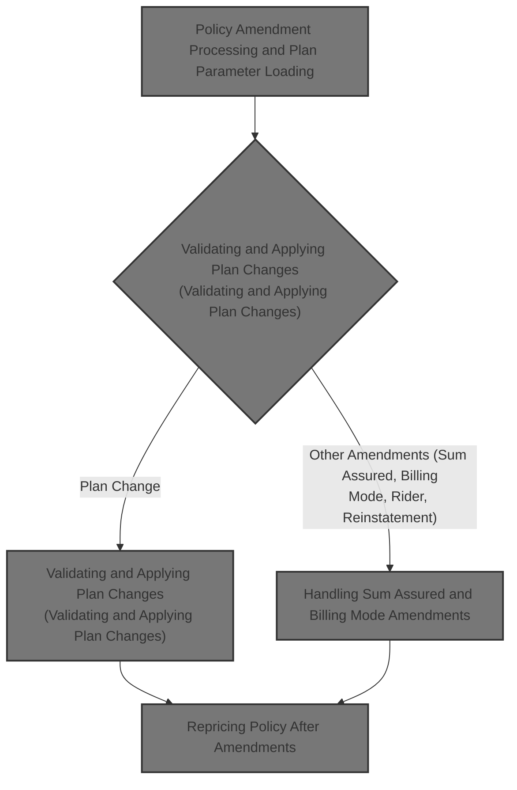
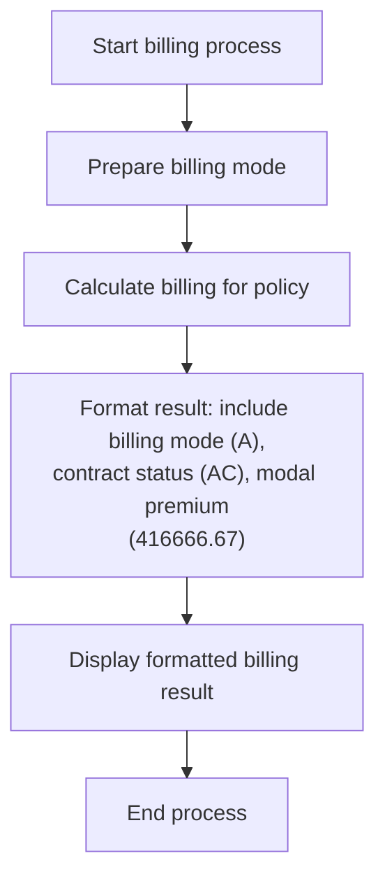
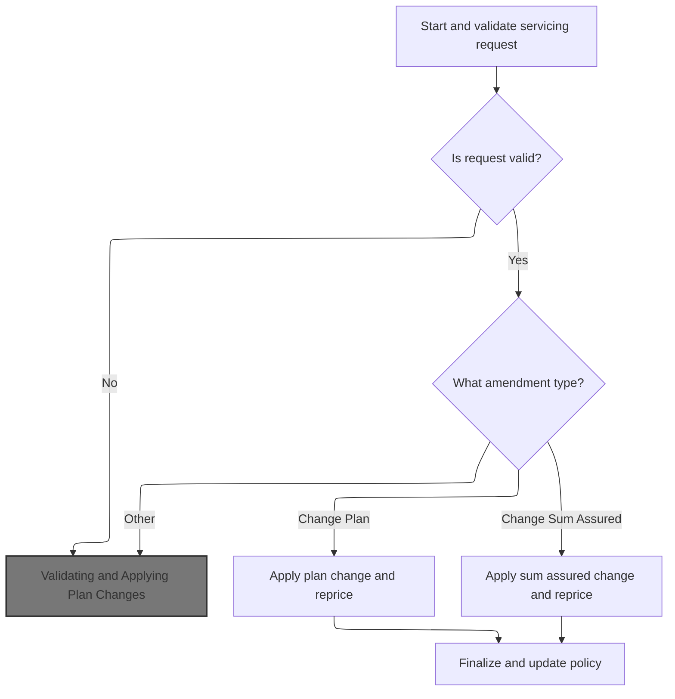
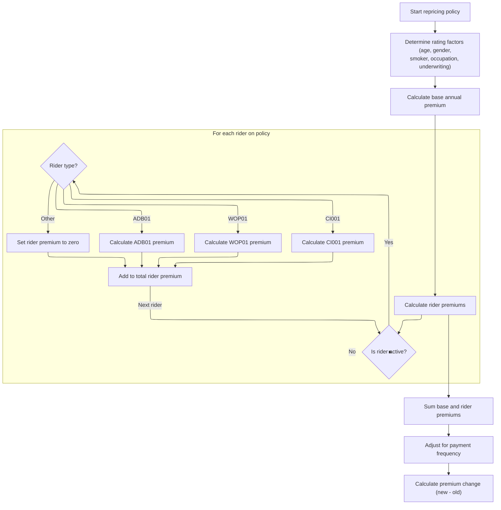

# Overview

This document explains the flow of processing policy amendments and calculating updated billing information for insurance policies. The flow validates servicing requests, applies business rules, reprices the policy after amendments, and produces a formatted billing result for review.



## Dependencies

### Programs

- DRIVESVC (<SwmPath>[cobol/drivers/DRIVER-SVCBILL001.cob](cobol/drivers/DRIVER-SVCBILL001.cob)</SwmPath>)
- <SwmToken path="cobol/drivers/DRIVER-SVCBILL001.cob" pos="14:4:4" line-data="           CALL &quot;SVCBILL001&quot; USING WS-POLICY-MASTER-REC">`SVCBILL001`</SwmToken> (<SwmPath>[cobol/SVC-BILL-001.cob](cobol/SVC-BILL-001.cob)</SwmPath>)

### Copybook

- POLDATA (<SwmPath>[cpy/POLDATA.cpy](cpy/POLDATA.cpy)</SwmPath>)

# Workflow

# Setting Up and Triggering Billing Service



This section sets up a sample policy record and triggers the billing service, then formats and displays the billing result for review.

| Rule ID | Category                        | Rule Name                  | Description                                                                                                                                                                                   | Implementation Details                                                                                                                                                                                         |
| ------- | ------------------------------- | -------------------------- | --------------------------------------------------------------------------------------------------------------------------------------------------------------------------------------------- | -------------------------------------------------------------------------------------------------------------------------------------------------------------------------------------------------------------- |
| BR-001  | Writing Output                  | Billing result format      | The billing result must include the billing mode, contract status, modal premium, premium delta, and service fee, each separated by a pipe ('                                                 | ') character.                                                                                                                                                                                                  |
| BR-002  | Writing Output                  | Billing mode value         | The billing mode in the result is set to 'A'.                                                                                                                                                 | Billing mode is included as a string value 'A' in the output.                                                                                                                                                  |
| BR-003  | Writing Output                  | Contract status value      | The contract status in the result is set to 'AC'.                                                                                                                                             | Contract status is included as a string value 'AC' in the output.                                                                                                                                              |
| BR-004  | Writing Output                  | Modal premium value        | The modal premium in the result is set to <SwmToken path="cobol/drivers/DRIVER-SVCBILL001.cob" pos="50:3:5" line-data="           MOVE 416666.67 TO PM-MODAL-PREMIUM">`416666.67`</SwmToken>. | Modal premium is included as a numeric value <SwmToken path="cobol/drivers/DRIVER-SVCBILL001.cob" pos="50:3:5" line-data="           MOVE 416666.67 TO PM-MODAL-PREMIUM">`416666.67`</SwmToken> in the output. |
| BR-005  | Invoking a Service or a Process | Billing service invocation | The billing service is triggered using the policy record prepared by the seeding routine.                                                                                                     | The billing service is called with the policy record containing all necessary attributes.                                                                                                                      |

<SwmSnippet path="/cobol/drivers/DRIVER-SVCBILL001.cob" line="12">

---

In <SwmToken path="cobol/drivers/DRIVER-SVCBILL001.cob" pos="12:1:1" line-data="       MAIN.">`MAIN`</SwmToken>, we kick things off by calling <SwmToken path="cobol/drivers/DRIVER-SVCBILL001.cob" pos="13:3:9" line-data="           PERFORM SEED-SVC-BILLING-MODE">`SEED-SVC-BILLING-MODE`</SwmToken> to prep a sample policy record. This sets up all the key attributes needed for billing mode tests, so the downstream service call has something to work with.

```cobol
       MAIN.
           PERFORM SEED-SVC-BILLING-MODE
```

---

</SwmSnippet>

<SwmSnippet path="/cobol/drivers/DRIVER-SVCBILL001.cob" line="14">

---

After seeding, we call <SwmToken path="cobol/drivers/DRIVER-SVCBILL001.cob" pos="14:4:4" line-data="           CALL &quot;SVCBILL001&quot; USING WS-POLICY-MASTER-REC">`SVCBILL001`</SwmToken> with the policy record. This runs the amendment logic, grabs the updated billing mode and status, and then formats the result for display. That's how we check if the service does what we expect.

```cobol
           CALL "SVCBILL001" USING WS-POLICY-MASTER-REC
           STRING "SVC_BM_OK|" DELIMITED BY SIZE
                  PM-RETURN-CODE DELIMITED BY SIZE
                  "|" DELIMITED BY SIZE
                  PM-CONTRACT-STATUS DELIMITED BY SIZE
                  "|" DELIMITED BY SIZE
                  PM-BILLING-MODE DELIMITED BY SIZE
                  "|" DELIMITED BY SIZE
                  PM-MODAL-PREMIUM DELIMITED BY SIZE
                  "|" DELIMITED BY SIZE
                  PM-PREMIUM-DELTA DELIMITED BY SIZE
                  "|" DELIMITED BY SIZE
                  PM-SERVICE-FEE DELIMITED BY SIZE
                  INTO RPT-LINE
           END-STRING
           DISPLAY FUNCTION TRIM(RPT-LINE TRAILING)
           STOP RUN.
```

---

</SwmSnippet>

# Policy Amendment Processing and Plan Parameter Loading



This section governs how servicing requests for policy amendments are validated, routed, and processed, and how plan parameters are loaded and checked for eligibility. It ensures only supported plan codes and amendment types are processed, and sets error codes/messages for invalid inputs.

| Rule ID | Category        | Rule Name                               | Description                                                                                                                                     | Implementation Details                                                                                                                                                                                                                                                                                                                                                                                                                                        |
| ------- | --------------- | --------------------------------------- | ----------------------------------------------------------------------------------------------------------------------------------------------- | ------------------------------------------------------------------------------------------------------------------------------------------------------------------------------------------------------------------------------------------------------------------------------------------------------------------------------------------------------------------------------------------------------------------------------------------------------------- |
| BR-001  | Data validation | Servicing request validation            | If the servicing request is invalid, processing stops and no amendments are applied.                                                            | Error code is set in <SwmToken path="cobol/drivers/DRIVER-SVCBILL001.cob" pos="16:1:5" line-data="                  PM-RETURN-CODE DELIMITED BY SIZE">`PM-RETURN-CODE`</SwmToken>, and error message is set in <SwmToken path="cobol/SVC-BILL-001.cob" pos="62:3:7" line-data="                   TO PM-RETURN-MESSAGE">`PM-RETURN-MESSAGE`</SwmToken>. Both are alphanumeric fields; error code is a number, error message is a string up to 100 characters. |
| BR-002  | Decision Making | Plan code support and parameter loading | Plan parameters are loaded based on the plan code. If the plan code is not recognized, an error code and message are set, and processing stops. | Supported plan codes and their parameters:                                                                                                                                                                                                                                                                                                                                                                                                                    |

- <SwmToken path="cobol/SVC-BILL-001.cob" pos="89:4:4" line-data="              WHEN &quot;T1001&quot;">`T1001`</SwmToken>: min age 18, max age 60, min sum assured 10,000,000.00, max sum assured 50,000,000,000.00, term 10 years, maturity age 70, grace days 31, reinstate days 730, annual policy fee 45.00, standard service fee 15.00, tax rate <SwmToken path="cobol/SVC-BILL-001.cob" pos="100:3:5" line-data="                 MOVE 0.0200 TO PM-TAX-RATE">`0.0200`</SwmToken>
- <SwmToken path="cobol/SVC-BILL-001.cob" pos="101:4:4" line-data="              WHEN &quot;T2001&quot;">`T2001`</SwmToken>: min age 18, max age 55, min sum assured 10,000,000.00, max sum assured 90,000,000,000.00, term 20 years, maturity age 75, grace days 31, reinstate days 730, annual policy fee 55.00, standard service fee 15.00, tax rate <SwmToken path="cobol/SVC-BILL-001.cob" pos="100:3:5" line-data="                 MOVE 0.0200 TO PM-TAX-RATE">`0.0200`</SwmToken>
- <SwmToken path="cobol/SVC-BILL-001.cob" pos="113:4:4" line-data="              WHEN &quot;T6501&quot;">`T6501`</SwmToken>: min age 18, max age 50, min sum assured 10,000,000.00, max sum assured 75,000,000,000.00, maturity age 65, grace days 31, reinstate days 730, annual policy fee 60.00, standard service fee 15.00, tax rate <SwmToken path="cobol/SVC-BILL-001.cob" pos="100:3:5" line-data="                 MOVE 0.0200 TO PM-TAX-RATE">`0.0200`</SwmToken> If plan code is unsupported, error code 11 and message 'UNSUPPORTED EXISTING PLAN CODE' are set. | | BR-003  | Decision Making | Amendment type routing                  | Amendment processing is routed based on the amendment type. If the amendment type is not recognized, an error code and message are set.                | Supported amendment types:
- 'PL': Change Plan
- 'SA': Change Sum Assured
- 'BM': Change Billing Mode
- 'AR': Add Rider
- 'RR': Remove Rider
- 'RI': Reinstate If amendment type is not recognized, error code 41 and message 'INVALID OR MISSING AMENDMENT TYPE' are set.                                                                                                                                                                                                                                                                                                                                                                                                                                                                                                                                                                                          | | BR-004  | Writing Output  | Policy maintenance update               | If amendment processing is successful, the policy maintenance and action dates are updated to the current processing date, and the action user is set. | Maintenance and action dates are set to the current processing date (numeric, 8 digits). Action user is set to <SwmToken path="cobol/SVC-BILL-001.cob" pos="68:4:4" line-data="              MOVE &quot;SVC001&quot; TO PM-LAST-ACTION-USER">`SVC001`</SwmToken> (string, 6 characters).                                                                                                                                                                                                                                                                                                                                                                                                                                                                                                                                                                                                                                                                                                                     |

<SwmSnippet path="/cobol/SVC-BILL-001.cob" line="36">

---

<SwmToken path="cobol/SVC-BILL-001.cob" pos="36:1:3" line-data="       MAIN-PROCESS.">`MAIN-PROCESS`</SwmToken> runs the full servicing logic: it loads plan parameters, checks age and payment status, validates the request, and then routes to the right amendment handler. If plan parameters aren't valid, it bails out before any changes.

```cobol
       MAIN-PROCESS.
           PERFORM 1000-INITIALIZE
           PERFORM 1100-LOAD-PLAN-PARAMETERS
           PERFORM 1200-CALCULATE-ATTAINED-AGE
           PERFORM 1300-EVALUATE-PAYMENT-STATUS
           PERFORM 1400-VALIDATE-SERVICING-REQUEST
           IF PM-RETURN-CODE NOT = 0
              GOBACK
           END-IF

           EVALUATE TRUE
              WHEN PM-AMEND-CHANGE-PLAN
                 PERFORM 2100-CHANGE-PLAN
              WHEN PM-AMEND-CHANGE-SA
                 PERFORM 2200-CHANGE-SUM-ASSURED
              WHEN PM-AMEND-BILLING-MODE
                 PERFORM 2300-CHANGE-BILLING-MODE
              WHEN PM-AMEND-ADD-RIDER
                 PERFORM 2400-ADD-RIDER
              WHEN PM-AMEND-REMOVE-RIDER
                 PERFORM 2500-REMOVE-RIDER
              WHEN PM-AMEND-REINSTATE
                 PERFORM 2600-PROCESS-REINSTATEMENT
              WHEN OTHER
                 MOVE 41 TO PM-RETURN-CODE
                 MOVE "INVALID OR MISSING AMENDMENT TYPE"
                   TO PM-RETURN-MESSAGE
           END-EVALUATE

           IF PM-RETURN-CODE = 0
              MOVE PM-PROCESS-DATE TO PM-LAST-MAINT-DATE
              MOVE PM-PROCESS-DATE TO PM-LAST-ACTION-DATE
              MOVE "SVC001" TO PM-LAST-ACTION-USER
           END-IF
           GOBACK.
```

---

</SwmSnippet>

<SwmSnippet path="/cobol/SVC-BILL-001.cob" line="86">

---

<SwmToken path="cobol/SVC-BILL-001.cob" pos="86:1:7" line-data="       1100-LOAD-PLAN-PARAMETERS.">`1100-LOAD-PLAN-PARAMETERS`</SwmToken> uses a switch-case (EVALUATE) to set plan limits and fees based on the plan code. All values are hardcoded, so if the code isn't recognized, it flags an error and stops further processing.

```cobol
       1100-LOAD-PLAN-PARAMETERS.
      * SV-101: Servicing uses the same plan parameters as issue.
           EVALUATE PM-PLAN-CODE
              WHEN "T1001"
                 MOVE 018 TO PM-MIN-ISSUE-AGE
                 MOVE 060 TO PM-MAX-ISSUE-AGE
                 MOVE 10000000.00 TO PM-MIN-SUM-ASSURED
                 MOVE 50000000000.00 TO PM-MAX-SUM-ASSURED
                 MOVE 010 TO PM-TERM-YEARS
                 MOVE 070 TO PM-MATURITY-AGE
                 MOVE 031 TO PM-GRACE-DAYS
                 MOVE 730 TO PM-REINSTATE-DAYS
                 MOVE 0000045.00 TO PM-POLICY-FEE-ANNUAL
                 MOVE 0000015.00 TO PM-SERVICE-FEE-STD
                 MOVE 0.0200 TO PM-TAX-RATE
              WHEN "T2001"
                 MOVE 018 TO PM-MIN-ISSUE-AGE
                 MOVE 055 TO PM-MAX-ISSUE-AGE
                 MOVE 10000000.00 TO PM-MIN-SUM-ASSURED
                 MOVE 90000000000.00 TO PM-MAX-SUM-ASSURED
                 MOVE 020 TO PM-TERM-YEARS
                 MOVE 075 TO PM-MATURITY-AGE
                 MOVE 031 TO PM-GRACE-DAYS
                 MOVE 730 TO PM-REINSTATE-DAYS
                 MOVE 0000055.00 TO PM-POLICY-FEE-ANNUAL
                 MOVE 0000015.00 TO PM-SERVICE-FEE-STD
                 MOVE 0.0200 TO PM-TAX-RATE
              WHEN "T6501"
                 MOVE 018 TO PM-MIN-ISSUE-AGE
                 MOVE 050 TO PM-MAX-ISSUE-AGE
                 MOVE 10000000.00 TO PM-MIN-SUM-ASSURED
                 MOVE 75000000000.00 TO PM-MAX-SUM-ASSURED
                 MOVE 065 TO PM-MATURITY-AGE
                 MOVE 031 TO PM-GRACE-DAYS
                 MOVE 730 TO PM-REINSTATE-DAYS
                 MOVE 0000060.00 TO PM-POLICY-FEE-ANNUAL
                 MOVE 0000015.00 TO PM-SERVICE-FEE-STD
                 MOVE 0.0200 TO PM-TAX-RATE
              WHEN OTHER
                 MOVE 11 TO PM-RETURN-CODE
                 MOVE "UNSUPPORTED EXISTING PLAN CODE"
                   TO PM-RETURN-MESSAGE
           END-EVALUATE.
```

---

</SwmSnippet>

## Validating and Applying Plan Changes

```mermaid
%%{init: {"flowchart": {"defaultRenderer": "elk"}} }%%
flowchart TD
    node1["Start plan change process"]
    click node1 openCode "cobol/SVC-BILL-001.cob:182:183"
    node1 --> node2{"Policy status is 'Active' (AC) or
'Grace' (GR)?"}
    click node2 openCode "cobol/SVC-BILL-001.cob:184:189"
    node2 -->|"No (Other status)"| node3["Reject: Only active or grace policies
allowed"]
    click node3 openCode "cobol/SVC-BILL-001.cob:185:188"
    node2 -->|"Yes (AC/GR)"| node4["Set new plan code, load parameters"]
    click node4 openCode "cobol/SVC-BILL-001.cob:191:193"
    node4 --> node5{"Did loading succeed? (PM-RETURN-CODE =
0)"}
    click node5 openCode "cobol/SVC-BILL-001.cob:194:197"
    node5 -->|"No"| node6["Reject: Invalid plan, restore old plan"]
    click node6 openCode "cobol/SVC-BILL-001.cob:195:196"
    node5 -->|"Yes"| node7{"Attained age > max issue age for new
plan? (PM-ATTAINED-AGE >
PM-MAX-ISSUE-AGE, not T65)"}
    click node7 openCode "cobol/SVC-BILL-001.cob:200:206"
    node7 -->|"Yes"| node8["Reject: Age exceeds new plan limit"]
    click node8 openCode "cobol/SVC-BILL-001.cob:201:205"
    node7 -->|"No"| node9{"Is new plan 'to age 65'? (PM-PLAN-TO-65
= T6501)"}
    click node9 openCode "cobol/SVC-BILL-001.cob:207:216"
    node9 -->|"No"| node12["Reprice policy"]
    node9 -->|"Yes"| node10{"Is remaining term positive?
(PM-TERM-YEARS > 0)"}
    click node10 openCode "cobol/SVC-BILL-001.cob:208:215"
    node10 -->|"No"| node11["Reject: No term remains under T65 plan"]
    click node11 openCode "cobol/SVC-BILL-001.cob:210:214"
    node10 -->|"Yes"| node12["Reprice policy"]
    click node12 openCode "cobol/SVC-BILL-001.cob:218:218"
    node12 --> node13{"Did repricing succeed? (PM-RETURN-CODE
= 0)"}
    click node13 openCode "cobol/SVC-BILL-001.cob:219:223"
    node13 -->|"No"| node14["Reject: Repricing failed"]
    click node14 openCode "cobol/SVC-BILL-001.cob:219:219"
    node13 -->|"Yes"| node15["Plan change applied, service fee set,
amendment marked applied"]
    click node15 openCode "cobol/SVC-BILL-001.cob:220:223"

classDef HeadingStyle fill:#777777,stroke:#333,stroke-width:2px;

%% Swimm:
%% %%{init: {"flowchart": {"defaultRenderer": "elk"}} }%%
%% flowchart TD
%%     node1["Start plan change process"]
%%     click node1 openCode "<SwmPath>[cobol/SVC-BILL-001.cob](cobol/SVC-BILL-001.cob)</SwmPath>:182:183"
%%     node1 --> node2{"Policy status is 'Active' (AC) or
%% 'Grace' (GR)?"}
%%     click node2 openCode "<SwmPath>[cobol/SVC-BILL-001.cob](cobol/SVC-BILL-001.cob)</SwmPath>:184:189"
%%     node2 -->|"No (Other status)"| node3["Reject: Only active or grace policies
%% allowed"]
%%     click node3 openCode "<SwmPath>[cobol/SVC-BILL-001.cob](cobol/SVC-BILL-001.cob)</SwmPath>:185:188"
%%     node2 -->|"Yes (AC/GR)"| node4["Set new plan code, load parameters"]
%%     click node4 openCode "<SwmPath>[cobol/SVC-BILL-001.cob](cobol/SVC-BILL-001.cob)</SwmPath>:191:193"
%%     node4 --> node5{"Did loading succeed? (<SwmToken path="cobol/drivers/DRIVER-SVCBILL001.cob" pos="16:1:5" line-data="                  PM-RETURN-CODE DELIMITED BY SIZE">`PM-RETURN-CODE`</SwmToken> =
%% 0)"}
%%     click node5 openCode "<SwmPath>[cobol/SVC-BILL-001.cob](cobol/SVC-BILL-001.cob)</SwmPath>:194:197"
%%     node5 -->|"No"| node6["Reject: Invalid plan, restore old plan"]
%%     click node6 openCode "<SwmPath>[cobol/SVC-BILL-001.cob](cobol/SVC-BILL-001.cob)</SwmPath>:195:196"
%%     node5 -->|"Yes"| node7{"Attained age > max issue age for new
%% plan? (<SwmToken path="cobol/SVC-BILL-001.cob" pos="200:3:7" line-data="           IF PM-ATTAINED-AGE &gt; PM-MAX-ISSUE-AGE AND NOT PM-PLAN-TO-65">`PM-ATTAINED-AGE`</SwmToken> >
%% <SwmToken path="cobol/SVC-BILL-001.cob" pos="91:7:13" line-data="                 MOVE 060 TO PM-MAX-ISSUE-AGE">`PM-MAX-ISSUE-AGE`</SwmToken>, not <SwmToken path="cobol/SVC-BILL-001.cob" pos="211:12:12" line-data="                 MOVE &quot;NO TERM REMAINS UNDER T65 PLAN&quot;">`T65`</SwmToken>)"}
%%     click node7 openCode "<SwmPath>[cobol/SVC-BILL-001.cob](cobol/SVC-BILL-001.cob)</SwmPath>:200:206"
%%     node7 -->|"Yes"| node8["Reject: Age exceeds new plan limit"]
%%     click node8 openCode "<SwmPath>[cobol/SVC-BILL-001.cob](cobol/SVC-BILL-001.cob)</SwmPath>:201:205"
%%     node7 -->|"No"| node9{"Is new plan 'to age 65'? (<SwmToken path="cobol/SVC-BILL-001.cob" pos="200:23:29" line-data="           IF PM-ATTAINED-AGE &gt; PM-MAX-ISSUE-AGE AND NOT PM-PLAN-TO-65">`PM-PLAN-TO-65`</SwmToken>
%% = <SwmToken path="cobol/SVC-BILL-001.cob" pos="113:4:4" line-data="              WHEN &quot;T6501&quot;">`T6501`</SwmToken>)"}
%%     click node9 openCode "<SwmPath>[cobol/SVC-BILL-001.cob](cobol/SVC-BILL-001.cob)</SwmPath>:207:216"
%%     node9 -->|"No"| node12["Reprice policy"]
%%     node9 -->|"Yes"| node10{"Is remaining term positive?
%% (<SwmToken path="cobol/SVC-BILL-001.cob" pos="94:7:11" line-data="                 MOVE 010 TO PM-TERM-YEARS">`PM-TERM-YEARS`</SwmToken> > 0)"}
%%     click node10 openCode "<SwmPath>[cobol/SVC-BILL-001.cob](cobol/SVC-BILL-001.cob)</SwmPath>:208:215"
%%     node10 -->|"No"| node11["Reject: No term remains under <SwmToken path="cobol/SVC-BILL-001.cob" pos="211:12:12" line-data="                 MOVE &quot;NO TERM REMAINS UNDER T65 PLAN&quot;">`T65`</SwmToken> plan"]
%%     click node11 openCode "<SwmPath>[cobol/SVC-BILL-001.cob](cobol/SVC-BILL-001.cob)</SwmPath>:210:214"
%%     node10 -->|"Yes"| node12["Reprice policy"]
%%     click node12 openCode "<SwmPath>[cobol/SVC-BILL-001.cob](cobol/SVC-BILL-001.cob)</SwmPath>:218:218"
%%     node12 --> node13{"Did repricing succeed? (<SwmToken path="cobol/drivers/DRIVER-SVCBILL001.cob" pos="16:1:5" line-data="                  PM-RETURN-CODE DELIMITED BY SIZE">`PM-RETURN-CODE`</SwmToken>
%% = 0)"}
%%     click node13 openCode "<SwmPath>[cobol/SVC-BILL-001.cob](cobol/SVC-BILL-001.cob)</SwmPath>:219:223"
%%     node13 -->|"No"| node14["Reject: Repricing failed"]
%%     click node14 openCode "<SwmPath>[cobol/SVC-BILL-001.cob](cobol/SVC-BILL-001.cob)</SwmPath>:219:219"
%%     node13 -->|"Yes"| node15["Plan change applied, service fee set,
%% amendment marked applied"]
%%     click node15 openCode "<SwmPath>[cobol/SVC-BILL-001.cob](cobol/SVC-BILL-001.cob)</SwmPath>:220:223"
%% 
%% classDef HeadingStyle fill:#777777,stroke:#333,stroke-width:2px;
```



This section governs the business logic for changing a policy's plan, ensuring eligibility, validating age and term constraints, and applying repricing and amendment updates. It enforces business rules for plan changes and handles error scenarios with specific codes and messages.

| Rule ID | Category        | Rule Name                                                                                                                                                                       | Description                                                                                                                                                                                 | Implementation Details                                                                                                                                                                                                                                                                                                                                                               |
| ------- | --------------- | ------------------------------------------------------------------------------------------------------------------------------------------------------------------------------- | ------------------------------------------------------------------------------------------------------------------------------------------------------------------------------------------- | ------------------------------------------------------------------------------------------------------------------------------------------------------------------------------------------------------------------------------------------------------------------------------------------------------------------------------------------------------------------------------------ |
| BR-001  | Data validation | Policy status eligibility                                                                                                                                                       | Plan changes are allowed only if the policy status is 'Active' or 'Grace'. If the status is any other value, the plan change is rejected and an error message is set.                       | Allowed statuses: 'AC' (Active), 'GR' (Grace). Error code: 21. Error message: 'PLAN CHANGE ALLOWED ONLY ON ACTIVE OR GRACE'.                                                                                                                                                                                                                                                         |
| BR-002  | Data validation | Plan parameter loading validation                                                                                                                                               | If loading new plan parameters fails, the plan change is rejected, the old plan code is restored, and the process exits.                                                                    | Error code is determined by the loading process. Old plan code is restored. No specific error message is set in this step.                                                                                                                                                                                                                                                           |
| BR-003  | Data validation | Age limit validation                                                                                                                                                            | If the attained age exceeds the maximum issue age for the new plan (except for 'to age 65' plans), the plan change is rejected, an error message is set, and the old plan code is restored. | Error code: 22. Error message: 'CURRENT ATTAINED AGE EXCEEDS NEW PLAN LIMIT'. Max issue age values: 60 for <SwmToken path="cobol/SVC-BILL-001.cob" pos="89:4:4" line-data="              WHEN &quot;T1001&quot;">`T1001`</SwmToken>, 55 for <SwmToken path="cobol/SVC-BILL-001.cob" pos="101:4:4" line-data="              WHEN &quot;T2001&quot;">`T2001`</SwmToken>, 50 otherwise. |
| BR-004  | Data validation | Term validation for <SwmToken path="cobol/SVC-BILL-001.cob" pos="211:12:12" line-data="                 MOVE &quot;NO TERM REMAINS UNDER T65 PLAN&quot;">`T65`</SwmToken> plans | For 'to age 65' plans, if the remaining term is not positive, the plan change is rejected, an error message is set, and the old plan code is restored.                                      | Error code: 23. Error message: 'NO TERM REMAINS UNDER <SwmToken path="cobol/SVC-BILL-001.cob" pos="211:12:12" line-data="                 MOVE &quot;NO TERM REMAINS UNDER T65 PLAN&quot;">`T65`</SwmToken> PLAN'. Remaining term is calculated as maturity age minus attained age.                                                                                                  |
| BR-005  | Data validation | Repricing validation                                                                                                                                                            | If repricing fails, the plan change is rejected and an error message is set.                                                                                                                | Error code is determined by the repricing process. Error message is set to indicate failure.                                                                                                                                                                                                                                                                                         |
| BR-006  | Decision Making | Apply plan change and update amendment                                                                                                                                          | If all validations and repricing succeed, the plan change is applied, the standard service fee is set, amendment status is updated to 'AP', and a success message is set.                   | Service fee: 15.00 for all plans. Amendment status: 'AP'. Success message: 'PLAN CHANGE APPLIED'.                                                                                                                                                                                                                                                                                    |

<SwmSnippet path="/cobol/SVC-BILL-001.cob" line="182">

---

<SwmToken path="cobol/SVC-BILL-001.cob" pos="182:1:5" line-data="       2100-CHANGE-PLAN.">`2100-CHANGE-PLAN`</SwmToken> checks if the policy is eligible for a plan change, updates the plan code, reloads parameters, and validates age/maturity. If any check fails, it restores the old plan and sets a specific error code. If all checks pass, it reprices the policy and updates amendment status.

```cobol
       2100-CHANGE-PLAN.
      * SV-401: Change plan only on active or grace policies.
           IF NOT PM-STAT-ACTIVE AND NOT PM-STAT-GRACE
              MOVE 21 TO PM-RETURN-CODE
              MOVE "PLAN CHANGE ALLOWED ONLY ON ACTIVE OR GRACE"
                TO PM-RETURN-MESSAGE
              EXIT PARAGRAPH
           END-IF

           MOVE PM-PLAN-CODE TO PM-OLD-PLAN-CODE
           MOVE PM-NEW-PLAN-CODE TO PM-PLAN-CODE
           PERFORM 1100-LOAD-PLAN-PARAMETERS
           IF PM-RETURN-CODE NOT = 0
              MOVE PM-OLD-PLAN-CODE TO PM-PLAN-CODE
              EXIT PARAGRAPH
           END-IF

      * SV-402: New plan must still satisfy age and maturity limits.
           IF PM-ATTAINED-AGE > PM-MAX-ISSUE-AGE AND NOT PM-PLAN-TO-65
              MOVE 22 TO PM-RETURN-CODE
              MOVE "CURRENT ATTAINED AGE EXCEEDS NEW PLAN LIMIT"
                TO PM-RETURN-MESSAGE
              MOVE PM-OLD-PLAN-CODE TO PM-PLAN-CODE
              EXIT PARAGRAPH
           END-IF
           IF PM-PLAN-TO-65
              COMPUTE PM-TERM-YEARS = PM-MATURITY-AGE - PM-ATTAINED-AGE
              IF PM-TERM-YEARS <= 0
                 MOVE 23 TO PM-RETURN-CODE
                 MOVE "NO TERM REMAINS UNDER T65 PLAN"
                   TO PM-RETURN-MESSAGE
                 MOVE PM-OLD-PLAN-CODE TO PM-PLAN-CODE
                 EXIT PARAGRAPH
              END-IF
           END-IF

           PERFORM 3100-REPRICE-POLICY
           IF PM-RETURN-CODE = 0
              MOVE PM-SERVICE-FEE-STD TO PM-SERVICE-FEE
              MOVE "AP" TO PM-AMENDMENT-STATUS
              MOVE "PLAN CHANGE APPLIED" TO PM-RETURN-MESSAGE
           END-IF.
```

---

</SwmSnippet>

## Repricing Policy After Amendments



This section recalculates the policy premium after any amendments by applying business rules for rating factors, base and rider premiums, and computing the premium change.

| Rule ID | Category    | Rule Name                        | Description                                                                                                                                                                                                                                                                                                                                                                                                                                                                                                                                                                                                                                                   | Implementation Details                                                                                                                                                                                                                                                                                                                                                                                                                                                                                                                   |
| ------- | ----------- | -------------------------------- | ------------------------------------------------------------------------------------------------------------------------------------------------------------------------------------------------------------------------------------------------------------------------------------------------------------------------------------------------------------------------------------------------------------------------------------------------------------------------------------------------------------------------------------------------------------------------------------------------------------------------------------------------------------- | ---------------------------------------------------------------------------------------------------------------------------------------------------------------------------------------------------------------------------------------------------------------------------------------------------------------------------------------------------------------------------------------------------------------------------------------------------------------------------------------------------------------------------------------- |
| BR-001  | Calculation | Age-based base rate              | Set the base rate per thousand based on the insured's attained age. The rate increases in defined bands: up to 30 (0.85), up to 40 (1.20), up to 50 (2.15), up to 60 (4.10), and above 60 (7.25).                                                                                                                                                                                                                                                                                                                                                                                                                                                             | Rates per thousand: 0.85 (<=30), 1.20 (<=40), 2.15 (<=50), 4.10 (<=60), 7.25 (>60).                                                                                                                                                                                                                                                                                                                                                                                                                                                      |
| BR-002  | Calculation | Gender factor                    | Apply a gender factor to the premium: 0.92 for female, 1.00 for male.                                                                                                                                                                                                                                                                                                                                                                                                                                                                                                                                                                                         | Gender factor: 0.92 for female, 1.00 for male.                                                                                                                                                                                                                                                                                                                                                                                                                                                                                           |
| BR-003  | Calculation | Smoker factor                    | Apply a smoker factor to the premium: 1.75 for smokers, 1.00 for non-smokers.                                                                                                                                                                                                                                                                                                                                                                                                                                                                                                                                                                                 | Smoker factor: 1.75 for smokers, 1.00 for non-smokers.                                                                                                                                                                                                                                                                                                                                                                                                                                                                                   |
| BR-004  | Calculation | Occupation factor                | Apply an occupation factor to the premium: 1.00 for class 1, 1.15 for class 2, 1.40 for class 3, 1.00 for other classes.                                                                                                                                                                                                                                                                                                                                                                                                                                                                                                                                      | Occupation factor: 1.00 (class 1), 1.15 (class 2), 1.40 (class 3), 1.00 (other).                                                                                                                                                                                                                                                                                                                                                                                                                                                         |
| BR-005  | Calculation | Underwriting class factor        | Apply an underwriting class factor to the premium: 0.90 for 'PR', 1.25 for 'TB', 1.00 for other classes.                                                                                                                                                                                                                                                                                                                                                                                                                                                                                                                                                      | Underwriting factor: 0.90 ('PR'), 1.25 ('TB'), 1.00 (other).                                                                                                                                                                                                                                                                                                                                                                                                                                                                             |
| BR-006  | Calculation | Rider premium calculation        | For each active rider, calculate the annual premium based on the rider code. Supported codes: <SwmToken path="cobol/SVC-BILL-001.cob" pos="298:4:4" line-data="           MOVE &quot;ADB01&quot; TO PM-RIDER-CODE(PM-RIDER-COUNT)">`ADB01`</SwmToken> (rate 0.18 per thousand sum assured), <SwmToken path="cobol/SVC-BILL-001.cob" pos="447:4:4" line-data="                    WHEN &quot;WOP01&quot;">`WOP01`</SwmToken> (6% of base annual premium), <SwmToken path="cobol/SVC-BILL-001.cob" pos="452:4:4" line-data="                    WHEN &quot;CI001&quot;">`CI001`</SwmToken> (1.25 per thousand sum assured). Other codes result in zero premium. | <SwmToken path="cobol/SVC-BILL-001.cob" pos="298:4:4" line-data="           MOVE &quot;ADB01&quot; TO PM-RIDER-CODE(PM-RIDER-COUNT)">`ADB01`</SwmToken>: 0.18 per thousand sum assured; <SwmToken path="cobol/SVC-BILL-001.cob" pos="447:4:4" line-data="                    WHEN &quot;WOP01&quot;">`WOP01`</SwmToken>: 6% of base annual premium; <SwmToken path="cobol/SVC-BILL-001.cob" pos="452:4:4" line-data="                    WHEN &quot;CI001&quot;">`CI001`</SwmToken>: 1.25 per thousand sum assured; Other: zero premium. |
| BR-007  | Calculation | Total annual premium calculation | Sum the base annual premium and total rider annual premium to determine the total annual premium.                                                                                                                                                                                                                                                                                                                                                                                                                                                                                                                                                             | The total annual premium is the sum of the base and all rider premiums. Output as a number with two decimal places.                                                                                                                                                                                                                                                                                                                                                                                                                      |
| BR-008  | Calculation | Payment frequency adjustment     | Adjust the total annual premium for the selected payment frequency to determine the modal premium.                                                                                                                                                                                                                                                                                                                                                                                                                                                                                                                                                            | The modal premium is the total annual premium adjusted for payment frequency (e.g., monthly, quarterly, etc.). Output as a number with two decimal places.                                                                                                                                                                                                                                                                                                                                                                               |
| BR-009  | Calculation | Premium change calculation       | Calculate the premium change (delta) as the difference between the new total annual premium and the old annual premium.                                                                                                                                                                                                                                                                                                                                                                                                                                                                                                                                       | Premium delta = new total annual premium - old annual premium. Output as a number with two decimal places.                                                                                                                                                                                                                                                                                                                                                                                                                               |

<SwmSnippet path="/cobol/SVC-BILL-001.cob" line="372">

---

<SwmToken path="cobol/SVC-BILL-001.cob" pos="372:1:5" line-data="       3100-REPRICE-POLICY.">`3100-REPRICE-POLICY`</SwmToken> runs through rating factor loading, base and rider premium calculations, totals everything, recalculates modal premium, and computes the premium change. This keeps pricing in sync with any amendments.

```cobol
       3100-REPRICE-POLICY.
      * SV-1001: Servicing repricing reuses the issue rating approach.
           PERFORM 3110-LOAD-RATING-FACTORS
           PERFORM 3120-CALCULATE-BASE-ANNUAL
           PERFORM 3130-CALCULATE-RIDER-ANNUAL
           PERFORM 3140-CALCULATE-TOTAL-ANNUAL
           PERFORM 3200-RECALCULATE-MODAL-PREMIUM
           COMPUTE PM-PREMIUM-DELTA ROUNDED =
                   PM-TOTAL-ANNUAL-PREMIUM - WS-OLD-ANNUAL-PREMIUM.
```

---

</SwmSnippet>

<SwmSnippet path="/cobol/SVC-BILL-001.cob" line="382">

---

<SwmToken path="cobol/SVC-BILL-001.cob" pos="382:1:7" line-data="       3110-LOAD-RATING-FACTORS.">`3110-LOAD-RATING-FACTORS`</SwmToken> sets up all the rating multipliers based on age, gender, smoker status, occupation, and underwriting class. All values are hardcoded, so the premium calculation depends entirely on these business rules.

```cobol
       3110-LOAD-RATING-FACTORS.
           EVALUATE TRUE
              WHEN PM-ATTAINED-AGE <= 30
                 MOVE 00000.8500 TO PM-BASE-RATE-PER-THOU
              WHEN PM-ATTAINED-AGE <= 40
                 MOVE 00001.2000 TO PM-BASE-RATE-PER-THOU
              WHEN PM-ATTAINED-AGE <= 50
                 MOVE 00002.1500 TO PM-BASE-RATE-PER-THOU
              WHEN PM-ATTAINED-AGE <= 60
                 MOVE 00004.1000 TO PM-BASE-RATE-PER-THOU
              WHEN OTHER
                 MOVE 00007.2500 TO PM-BASE-RATE-PER-THOU
           END-EVALUATE

           IF PM-FEMALE
              MOVE 0.9200 TO PM-GENDER-FACTOR
           ELSE
              MOVE 1.0000 TO PM-GENDER-FACTOR
           END-IF

           IF PM-SMOKER
              MOVE 1.7500 TO PM-SMOKER-FACTOR
           ELSE
              MOVE 1.0000 TO PM-SMOKER-FACTOR
           END-IF

           EVALUATE PM-OCCUPATION-CLASS
              WHEN 1 MOVE 1.0000 TO PM-OCC-FACTOR
              WHEN 2 MOVE 1.1500 TO PM-OCC-FACTOR
              WHEN 3 MOVE 1.4000 TO PM-OCC-FACTOR
              WHEN OTHER MOVE 1.0000 TO PM-OCC-FACTOR
           END-EVALUATE

           EVALUATE PM-UW-CLASS
              WHEN "PR" MOVE 0.9000 TO PM-UW-FACTOR
              WHEN "TB" MOVE 1.2500 TO PM-UW-FACTOR
              WHEN OTHER MOVE 1.0000 TO PM-UW-FACTOR
           END-EVALUATE.
```

---

</SwmSnippet>

<SwmSnippet path="/cobol/SVC-BILL-001.cob" line="435">

---

<SwmToken path="cobol/SVC-BILL-001.cob" pos="435:1:7" line-data="       3130-CALCULATE-RIDER-ANNUAL.">`3130-CALCULATE-RIDER-ANNUAL`</SwmToken> loops through all active riders, applies domain-specific rates based on their code, and adds up their annual premiums. Only certain codes are supported, and all rates are hardcoded.

```cobol
       3130-CALCULATE-RIDER-ANNUAL.
           MOVE ZERO TO PM-RIDER-ANNUAL-TOTAL
           PERFORM VARYING WS-RIDER-IDX FROM 1 BY 1
                   UNTIL WS-RIDER-IDX > PM-RIDER-COUNT
              IF PM-RIDER-STATUS(WS-RIDER-IDX) = "A"
                 EVALUATE PM-RIDER-CODE(WS-RIDER-IDX)
                    WHEN "ADB01"
                       MOVE 00000.1800 TO PM-RIDER-RATE(WS-RIDER-IDX)
                       COMPUTE PM-RIDER-ANNUAL-PREM(WS-RIDER-IDX)
                               ROUNDED =
                             (PM-RIDER-SUM-ASSURED(WS-RIDER-IDX) / 1000)
                           * PM-RIDER-RATE(WS-RIDER-IDX)
                    WHEN "WOP01"
                       MOVE 00000.0600 TO PM-RIDER-RATE(WS-RIDER-IDX)
                       COMPUTE PM-RIDER-ANNUAL-PREM(WS-RIDER-IDX)
                               ROUNDED =
                             PM-BASE-ANNUAL-PREMIUM * 0.0600
                    WHEN "CI001"
                       MOVE 00001.2500 TO PM-RIDER-RATE(WS-RIDER-IDX)
                       COMPUTE PM-RIDER-ANNUAL-PREM(WS-RIDER-IDX)
                               ROUNDED =
                             (PM-RIDER-SUM-ASSURED(WS-RIDER-IDX) / 1000)
                           * PM-RIDER-RATE(WS-RIDER-IDX)
                    WHEN OTHER
                       MOVE ZERO TO PM-RIDER-ANNUAL-PREM(WS-RIDER-IDX)
                 END-EVALUATE
                 ADD PM-RIDER-ANNUAL-PREM(WS-RIDER-IDX)
                   TO PM-RIDER-ANNUAL-TOTAL
              END-IF
           END-PERFORM.
```

---

</SwmSnippet>

## Handling Sum Assured and Billing Mode Amendments

```mermaid
%%{init: {"flowchart": {"defaultRenderer": "elk"}} }%%
flowchart TD
    node1["Start policy amendment process"]
    click node1 openCode "cobol/SVC-BILL-001.cob:225:347"
    node1 --> node2{"Amendment type?"}
    click node2 openCode "cobol/SVC-BILL-001.cob:225:347"
    node2 -->|"Change Sum Assured"| node3{"Is new sum assured provided?"}
    click node3 openCode "cobol/SVC-BILL-001.cob:229:233"
    node3 -->|"No"| node18["Reject: New sum assured required"]
    click node18 openCode "cobol/SVC-BILL-001.cob:230:233"
    node3 -->|"Yes"| node4{"Within plan limits? (min/max)"}
    click node4 openCode "cobol/SVC-BILL-001.cob:234:240"
    node4 -->|"No"| node19["Reject: Sum assured outside limits"]
    click node19 openCode "cobol/SVC-BILL-001.cob:236:240"
    node4 -->|"Yes"| node5{"Large increase (>25% or >25B)?"}
    click node5 openCode "cobol/SVC-BILL-001.cob:243:255"
    node5 -->|"Yes"| node20["Underwriting required, pending approval"]
    click node20 openCode "cobol/SVC-BILL-001.cob:247:254"
    node5 -->|"No"| node6["Apply new sum assured, reprice policy,
approve (fee: 15)"]
    click node6 openCode "cobol/SVC-BILL-001.cob:257:263"
    node2 -->|"Change Billing Mode"| node7{"Is new billing mode provided?"}
    click node7 openCode "cobol/SVC-BILL-001.cob:267:271"
    node7 -->|"No"| node21["Reject: New billing mode required"]
    click node21 openCode "cobol/SVC-BILL-001.cob:268:271"
    node7 -->|"Yes"| node8{"Billing mode valid (A/S/Q/M)?"}
    click node8 openCode "cobol/SVC-BILL-001.cob:272:279"
    node8 -->|"No"| node22["Reject: Invalid billing mode"]
    click node22 openCode "cobol/SVC-BILL-001.cob:276:279"
    node8 -->|"Yes"| node9["Apply new billing mode, recalculate
premium, approve (fee: 10)"]
    click node9 openCode "cobol/SVC-BILL-001.cob:281:286"
    node2 -->|"Add Rider"| node10{"Rider capacity < 5?"}
    click node10 openCode "cobol/SVC-BILL-001.cob:290:295"
    node10 -->|"No"| node23["Reject: No capacity"]
    click node23 openCode "cobol/SVC-BILL-001.cob:291:295"
    node10 -->|"Yes"| node27["Add rider"]
    click node27 openCode "cobol/SVC-BILL-001.cob:297:300"
    node27 --> node28{"Attained age > 60?"}
    click node28 openCode "cobol/SVC-BILL-001.cob:303:309"
    node28 -->|"Yes"| node29["Reject: Rider cannot be added above age
60"]
    click node29 openCode "cobol/SVC-BILL-001.cob:304:308"
    node28 -->|"No"| node11["Reprice policy, approve (fee: 12)"]
    click node11 openCode "cobol/SVC-BILL-001.cob:311:317"
    node2 -->|"Remove Rider"| node12["Search for active ADB01 rider"]
    click node12 openCode "cobol/SVC-BILL-001.cob:321:326"
    subgraph loop1["For each rider"]
      node12 --> node13{"Active ADB01 rider found?"}
      click node13 openCode "cobol/SVC-BILL-001.cob:323:324"
      node13 -->|"No"| node24["Reject: Rider not found"]
      click node24 openCode "cobol/SVC-BILL-001.cob:329:333"
      node13 -->|"Yes"| node14["Remove rider, reprice policy, approve
(fee: 10)"]
      click node14 openCode "cobol/SVC-BILL-001.cob:335:345"
    end
    node2 -->|"Reinstate Policy"| node15{"Policy lapsed?"}
    click node15 openCode "cobol/SVC-BILL-001.cob:349:354"
    node15 -->|"No"| node25["Reject: Only lapsed policies"]
    click node25 openCode "cobol/SVC-BILL-001.cob:350:354"
    node15 -->|"Yes"| node16{"Within reinstatement window?"}
    click node16 openCode "cobol/SVC-BILL-001.cob:355:361"
    node16 -->|"No"| node26["Reject: Exceeds reinstatement window"]
    click node26 openCode "cobol/SVC-BILL-001.cob:356:360"
    node16 -->|"Yes"| node17["Reinstate policy, update status, approve
(fee: 25)"]
    click node17 openCode "cobol/SVC-BILL-001.cob:364:370"

classDef HeadingStyle fill:#777777,stroke:#333,stroke-width:2px;

%% Swimm:
%% %%{init: {"flowchart": {"defaultRenderer": "elk"}} }%%
%% flowchart TD
%%     node1["Start policy amendment process"]
%%     click node1 openCode "<SwmPath>[cobol/SVC-BILL-001.cob](cobol/SVC-BILL-001.cob)</SwmPath>:225:347"
%%     node1 --> node2{"Amendment type?"}
%%     click node2 openCode "<SwmPath>[cobol/SVC-BILL-001.cob](cobol/SVC-BILL-001.cob)</SwmPath>:225:347"
%%     node2 -->|"Change Sum Assured"| node3{"Is new sum assured provided?"}
%%     click node3 openCode "<SwmPath>[cobol/SVC-BILL-001.cob](cobol/SVC-BILL-001.cob)</SwmPath>:229:233"
%%     node3 -->|"No"| node18["Reject: New sum assured required"]
%%     click node18 openCode "<SwmPath>[cobol/SVC-BILL-001.cob](cobol/SVC-BILL-001.cob)</SwmPath>:230:233"
%%     node3 -->|"Yes"| node4{"Within plan limits? (min/max)"}
%%     click node4 openCode "<SwmPath>[cobol/SVC-BILL-001.cob](cobol/SVC-BILL-001.cob)</SwmPath>:234:240"
%%     node4 -->|"No"| node19["Reject: Sum assured outside limits"]
%%     click node19 openCode "<SwmPath>[cobol/SVC-BILL-001.cob](cobol/SVC-BILL-001.cob)</SwmPath>:236:240"
%%     node4 -->|"Yes"| node5{"Large increase (>25% or >25B)?"}
%%     click node5 openCode "<SwmPath>[cobol/SVC-BILL-001.cob](cobol/SVC-BILL-001.cob)</SwmPath>:243:255"
%%     node5 -->|"Yes"| node20["Underwriting required, pending approval"]
%%     click node20 openCode "<SwmPath>[cobol/SVC-BILL-001.cob](cobol/SVC-BILL-001.cob)</SwmPath>:247:254"
%%     node5 -->|"No"| node6["Apply new sum assured, reprice policy,
%% approve (fee: 15)"]
%%     click node6 openCode "<SwmPath>[cobol/SVC-BILL-001.cob](cobol/SVC-BILL-001.cob)</SwmPath>:257:263"
%%     node2 -->|"Change Billing Mode"| node7{"Is new billing mode provided?"}
%%     click node7 openCode "<SwmPath>[cobol/SVC-BILL-001.cob](cobol/SVC-BILL-001.cob)</SwmPath>:267:271"
%%     node7 -->|"No"| node21["Reject: New billing mode required"]
%%     click node21 openCode "<SwmPath>[cobol/SVC-BILL-001.cob](cobol/SVC-BILL-001.cob)</SwmPath>:268:271"
%%     node7 -->|"Yes"| node8{"Billing mode valid (A/S/Q/M)?"}
%%     click node8 openCode "<SwmPath>[cobol/SVC-BILL-001.cob](cobol/SVC-BILL-001.cob)</SwmPath>:272:279"
%%     node8 -->|"No"| node22["Reject: Invalid billing mode"]
%%     click node22 openCode "<SwmPath>[cobol/SVC-BILL-001.cob](cobol/SVC-BILL-001.cob)</SwmPath>:276:279"
%%     node8 -->|"Yes"| node9["Apply new billing mode, recalculate
%% premium, approve (fee: 10)"]
%%     click node9 openCode "<SwmPath>[cobol/SVC-BILL-001.cob](cobol/SVC-BILL-001.cob)</SwmPath>:281:286"
%%     node2 -->|"Add Rider"| node10{"Rider capacity < 5?"}
%%     click node10 openCode "<SwmPath>[cobol/SVC-BILL-001.cob](cobol/SVC-BILL-001.cob)</SwmPath>:290:295"
%%     node10 -->|"No"| node23["Reject: No capacity"]
%%     click node23 openCode "<SwmPath>[cobol/SVC-BILL-001.cob](cobol/SVC-BILL-001.cob)</SwmPath>:291:295"
%%     node10 -->|"Yes"| node27["Add rider"]
%%     click node27 openCode "<SwmPath>[cobol/SVC-BILL-001.cob](cobol/SVC-BILL-001.cob)</SwmPath>:297:300"
%%     node27 --> node28{"Attained age > 60?"}
%%     click node28 openCode "<SwmPath>[cobol/SVC-BILL-001.cob](cobol/SVC-BILL-001.cob)</SwmPath>:303:309"
%%     node28 -->|"Yes"| node29["Reject: Rider cannot be added above age
%% 60"]
%%     click node29 openCode "<SwmPath>[cobol/SVC-BILL-001.cob](cobol/SVC-BILL-001.cob)</SwmPath>:304:308"
%%     node28 -->|"No"| node11["Reprice policy, approve (fee: 12)"]
%%     click node11 openCode "<SwmPath>[cobol/SVC-BILL-001.cob](cobol/SVC-BILL-001.cob)</SwmPath>:311:317"
%%     node2 -->|"Remove Rider"| node12["Search for active <SwmToken path="cobol/SVC-BILL-001.cob" pos="298:4:4" line-data="           MOVE &quot;ADB01&quot; TO PM-RIDER-CODE(PM-RIDER-COUNT)">`ADB01`</SwmToken> rider"]
%%     click node12 openCode "<SwmPath>[cobol/SVC-BILL-001.cob](cobol/SVC-BILL-001.cob)</SwmPath>:321:326"
%%     subgraph loop1["For each rider"]
%%       node12 --> node13{"Active <SwmToken path="cobol/SVC-BILL-001.cob" pos="298:4:4" line-data="           MOVE &quot;ADB01&quot; TO PM-RIDER-CODE(PM-RIDER-COUNT)">`ADB01`</SwmToken> rider found?"}
%%       click node13 openCode "<SwmPath>[cobol/SVC-BILL-001.cob](cobol/SVC-BILL-001.cob)</SwmPath>:323:324"
%%       node13 -->|"No"| node24["Reject: Rider not found"]
%%       click node24 openCode "<SwmPath>[cobol/SVC-BILL-001.cob](cobol/SVC-BILL-001.cob)</SwmPath>:329:333"
%%       node13 -->|"Yes"| node14["Remove rider, reprice policy, approve
%% (fee: 10)"]
%%       click node14 openCode "<SwmPath>[cobol/SVC-BILL-001.cob](cobol/SVC-BILL-001.cob)</SwmPath>:335:345"
%%     end
%%     node2 -->|"Reinstate Policy"| node15{"Policy lapsed?"}
%%     click node15 openCode "<SwmPath>[cobol/SVC-BILL-001.cob](cobol/SVC-BILL-001.cob)</SwmPath>:349:354"
%%     node15 -->|"No"| node25["Reject: Only lapsed policies"]
%%     click node25 openCode "<SwmPath>[cobol/SVC-BILL-001.cob](cobol/SVC-BILL-001.cob)</SwmPath>:350:354"
%%     node15 -->|"Yes"| node16{"Within reinstatement window?"}
%%     click node16 openCode "<SwmPath>[cobol/SVC-BILL-001.cob](cobol/SVC-BILL-001.cob)</SwmPath>:355:361"
%%     node16 -->|"No"| node26["Reject: Exceeds reinstatement window"]
%%     click node26 openCode "<SwmPath>[cobol/SVC-BILL-001.cob](cobol/SVC-BILL-001.cob)</SwmPath>:356:360"
%%     node16 -->|"Yes"| node17["Reinstate policy, update status, approve
%% (fee: 25)"]
%%     click node17 openCode "<SwmPath>[cobol/SVC-BILL-001.cob](cobol/SVC-BILL-001.cob)</SwmPath>:364:370"
%% 
%% classDef HeadingStyle fill:#777777,stroke:#333,stroke-width:2px;
```



This section governs the business rules for processing policy amendments, ensuring each amendment type is validated, processed, and results in appropriate status updates, fees, and messages.

| Rule ID | Category        | Rule Name                               | Description                                                                                                                                                                                                                                                                                        | Implementation Details                                                                                                                                                                 |
| ------- | --------------- | --------------------------------------- | -------------------------------------------------------------------------------------------------------------------------------------------------------------------------------------------------------------------------------------------------------------------------------------------------- | -------------------------------------------------------------------------------------------------------------------------------------------------------------------------------------- |
| BR-001  | Data validation | Sum Assured Required                    | A new sum assured value is required for sum assured amendments. If not provided, the amendment is rejected with a specific error code and message.                                                                                                                                                 | Error code: 24. Error message: 'NEW SUM ASSURED IS REQUIRED'. The output message is a string up to 100 characters.                                                                     |
| BR-002  | Data validation | Sum Assured Plan Limits                 | The new sum assured must be within the plan's minimum and maximum limits. If outside these limits, the amendment is rejected with a specific error code and message.                                                                                                                               | Error code: 25. Error message: 'NEW SUM ASSURED OUTSIDE PLAN LIMITS'. The output message is a string up to 100 characters.                                                             |
| BR-003  | Data validation | Billing Mode Required                   | A new billing mode value is required for billing mode amendments. If not provided, the amendment is rejected with a specific error code and message.                                                                                                                                               | Error code: 26. Error message: 'NEW BILLING MODE IS REQUIRED'. The output message is a string up to 100 characters.                                                                    |
| BR-004  | Data validation | Billing Mode Valid Values               | The new billing mode must be one of the allowed values: Annual (A), Semi-Annual (S), Quarterly (Q), or Monthly (M). If not, the amendment is rejected with a specific error code and message.                                                                                                      | Allowed values: 'A', 'S', 'Q', 'M'. Error code: 27. Error message: 'INVALID NEW BILLING MODE'. The output message is a string up to 100 characters.                                    |
| BR-005  | Data validation | Rider Capacity Limit                    | A new rider can only be added if the current rider count is less than 5. If capacity is exceeded, the amendment is rejected with a specific error code and message.                                                                                                                                | Maximum rider capacity: 5. Error code: 28. Error message: 'NO ADDITIONAL RIDER CAPACITY REMAINS'. The output message is a string up to 100 characters.                                 |
| BR-006  | Data validation | Rider Age Limit                         | An ADB rider cannot be added if the attained age is over 60. If attempted, the addition is undone and the amendment is rejected with a specific error code and message.                                                                                                                            | Maximum attained age: 60. Error code: 29. Error message: 'ADB RIDER CANNOT BE ADDED ABOVE AGE 60'. The output message is a string up to 100 characters.                                |
| BR-007  | Data validation | Rider Removal Eligibility               | A rider can only be removed if an active <SwmToken path="cobol/SVC-BILL-001.cob" pos="298:4:4" line-data="           MOVE &quot;ADB01&quot; TO PM-RIDER-CODE(PM-RIDER-COUNT)">`ADB01`</SwmToken> rider is present. If not found, the amendment is rejected with a specific error code and message. | Error code: 30. Error message: 'REQUESTED RIDER NOT FOUND FOR REMOVAL'. The output message is a string up to 100 characters.                                                           |
| BR-008  | Data validation | Reinstatement Lapsed Status             | A policy can only be reinstated if it is currently lapsed. If not lapsed, the amendment is rejected with a specific error code and message.                                                                                                                                                        | Error code: 31. Error message: 'ONLY LAPSED POLICIES CAN BE REINSTATED'. The output message is a string up to 100 characters.                                                          |
| BR-009  | Data validation | Reinstatement Window                    | A policy can only be reinstated if the number of days since last paid is within the allowed reinstatement window. If exceeded, the amendment is rejected, the policy is terminated, and a specific error code and message are set.                                                                 | Error code: 32. Error message: 'POLICY EXCEEDS REINSTATEMENT WINDOW'. The output message is a string up to 100 characters. Contract status is set to 'TE' (terminated).                |
| BR-010  | Decision Making | Large Sum Assured Increase Underwriting | If the sum assured increase is more than 25% or exceeds 25,000,000,000, the amendment is flagged for underwriting review and marked as pending approval.                                                                                                                                           | Thresholds: 25% increase, 25,000,000,000 sum assured. Status: 'PE' (pending). Underwriting required indicator set to 'Y'. Return message: 'SUM ASSURED INCREASE REQUIRES UW APPROVAL'. |

<SwmSnippet path="/cobol/SVC-BILL-001.cob" line="225">

---

<SwmToken path="cobol/SVC-BILL-001.cob" pos="225:1:7" line-data="       2200-CHANGE-SUM-ASSURED.">`2200-CHANGE-SUM-ASSURED`</SwmToken> checks if the new sum assured is present and within plan limits, flags for underwriting if the increase is big, and then updates the value. If all checks pass, it reprices the policy and updates amendment status.

```cobol
       2200-CHANGE-SUM-ASSURED.
           MOVE PM-SUM-ASSURED TO PM-OLD-SUM-ASSURED

      * SV-501: New sum assured must be present and within plan limits.
           IF PM-NEW-SUM-ASSURED = ZERO
              MOVE 24 TO PM-RETURN-CODE
              MOVE "NEW SUM ASSURED IS REQUIRED" TO PM-RETURN-MESSAGE
              EXIT PARAGRAPH
           END-IF
           IF PM-NEW-SUM-ASSURED < PM-MIN-SUM-ASSURED OR
              PM-NEW-SUM-ASSURED > PM-MAX-SUM-ASSURED
              MOVE 25 TO PM-RETURN-CODE
              MOVE "NEW SUM ASSURED OUTSIDE PLAN LIMITS"
                TO PM-RETURN-MESSAGE
              EXIT PARAGRAPH
           END-IF

      * SV-502: Large increases require underwriting review.
           IF PM-NEW-SUM-ASSURED > PM-OLD-SUM-ASSURED
              COMPUTE WS-SA-INCREASE-PCT ROUNDED =
                      ((PM-NEW-SUM-ASSURED - PM-OLD-SUM-ASSURED)
                       / PM-OLD-SUM-ASSURED) * 100
              IF WS-SA-INCREASE-PCT > 25.00 OR
                 PM-NEW-SUM-ASSURED > 25000000000.00
                 MOVE "Y" TO PM-UW-REQUIRED-IND
                 MOVE "PE" TO PM-AMENDMENT-STATUS
                 MOVE "SUM ASSURED INCREASE REQUIRES UW APPROVAL"
                   TO PM-RETURN-MESSAGE
                 EXIT PARAGRAPH
              END-IF
           END-IF

           MOVE PM-NEW-SUM-ASSURED TO PM-SUM-ASSURED
           PERFORM 3100-REPRICE-POLICY
           IF PM-RETURN-CODE = 0
              MOVE 0000015.00 TO PM-SERVICE-FEE
              MOVE "AP" TO PM-AMENDMENT-STATUS
              MOVE "SUM ASSURED CHANGE APPLIED" TO PM-RETURN-MESSAGE
           END-IF.
```

---

</SwmSnippet>

<SwmSnippet path="/cobol/SVC-BILL-001.cob" line="265">

---

<SwmToken path="cobol/SVC-BILL-001.cob" pos="265:1:7" line-data="       2300-CHANGE-BILLING-MODE.">`2300-CHANGE-BILLING-MODE`</SwmToken> validates the new billing mode, updates it if valid, recalculates modal premium, and sets a fixed service fee and amendment status. Only certain modes are allowed, and errors are flagged with specific codes.

```cobol
       2300-CHANGE-BILLING-MODE.
      * SV-601: Mode changes do not require UW, but must be valid.
           IF PM-NEW-BILLING-MODE = SPACES
              MOVE 26 TO PM-RETURN-CODE
              MOVE "NEW BILLING MODE IS REQUIRED" TO PM-RETURN-MESSAGE
              EXIT PARAGRAPH
           END-IF
           IF PM-NEW-BILLING-MODE NOT = "A" AND
              PM-NEW-BILLING-MODE NOT = "S" AND
              PM-NEW-BILLING-MODE NOT = "Q" AND
              PM-NEW-BILLING-MODE NOT = "M"
              MOVE 27 TO PM-RETURN-CODE
              MOVE "INVALID NEW BILLING MODE" TO PM-RETURN-MESSAGE
              EXIT PARAGRAPH
           END-IF

           MOVE PM-BILLING-MODE TO PM-OLD-BILLING-MODE
           MOVE PM-NEW-BILLING-MODE TO PM-BILLING-MODE
           PERFORM 3200-RECALCULATE-MODAL-PREMIUM
           MOVE 0000010.00 TO PM-SERVICE-FEE
           MOVE "AP" TO PM-AMENDMENT-STATUS
           MOVE "BILLING MODE CHANGE APPLIED" TO PM-RETURN-MESSAGE.
```

---

</SwmSnippet>

<SwmSnippet path="/cobol/SVC-BILL-001.cob" line="288">

---

<SwmToken path="cobol/SVC-BILL-001.cob" pos="288:1:5" line-data="       2400-ADD-RIDER.">`2400-ADD-RIDER`</SwmToken> checks for rider capacity, adds a new ADB rider if allowed, enforces an age limit, and reprices the policy. If any rule fails, it undoes the addition and sets an error code.

```cobol
       2400-ADD-RIDER.
      * SV-701: Add rider only if capacity remains and rider is eligible.
           IF PM-RIDER-COUNT >= 5
              MOVE 28 TO PM-RETURN-CODE
              MOVE "NO ADDITIONAL RIDER CAPACITY REMAINS"
                TO PM-RETURN-MESSAGE
              EXIT PARAGRAPH
           END-IF

           ADD 1 TO PM-RIDER-COUNT
           MOVE "ADB01" TO PM-RIDER-CODE(PM-RIDER-COUNT)
           MOVE PM-SUM-ASSURED TO PM-RIDER-SUM-ASSURED(PM-RIDER-COUNT)
           MOVE "A" TO PM-RIDER-STATUS(PM-RIDER-COUNT)

      * SV-702: ADB rider cannot be added above age 60.
           IF PM-ATTAINED-AGE > 60
              MOVE 29 TO PM-RETURN-CODE
              MOVE "ADB RIDER CANNOT BE ADDED ABOVE AGE 60"
                TO PM-RETURN-MESSAGE
              SUBTRACT 1 FROM PM-RIDER-COUNT
              EXIT PARAGRAPH
           END-IF

           PERFORM 3100-REPRICE-POLICY
           IF PM-RETURN-CODE = 0
              MOVE 0000012.00 TO PM-SERVICE-FEE
              MOVE "AP" TO PM-AMENDMENT-STATUS
              MOVE "RIDER ADDED AND POLICY REPRICED"
                TO PM-RETURN-MESSAGE
           END-IF.
```

---

</SwmSnippet>

<SwmSnippet path="/cobol/SVC-BILL-001.cob" line="319">

---

<SwmToken path="cobol/SVC-BILL-001.cob" pos="319:1:5" line-data="       2500-REMOVE-RIDER.">`2500-REMOVE-RIDER`</SwmToken> scans for the first active ADB rider, marks it as removed, resets its values, and reprices the policy. If no matching rider is found, it flags an error.

```cobol
       2500-REMOVE-RIDER.
      * SV-801: Remove the first active rider matching rider code.
           PERFORM VARYING WS-RIDER-IDX FROM 1 BY 1
                   UNTIL WS-RIDER-IDX > PM-RIDER-COUNT OR
                      (PM-RIDER-CODE(WS-RIDER-IDX) = "ADB01" AND
                       PM-RIDER-STATUS(WS-RIDER-IDX) = "A")
              CONTINUE
           END-PERFORM

           IF WS-RIDER-IDX > PM-RIDER-COUNT
              MOVE 30 TO PM-RETURN-CODE
              MOVE "REQUESTED RIDER NOT FOUND FOR REMOVAL"
                TO PM-RETURN-MESSAGE
              EXIT PARAGRAPH
           END-IF

           MOVE "R" TO PM-RIDER-STATUS(WS-RIDER-IDX)
           MOVE ZERO TO PM-RIDER-SUM-ASSURED(WS-RIDER-IDX)
                        PM-RIDER-RATE(WS-RIDER-IDX)
                        PM-RIDER-ANNUAL-PREM(WS-RIDER-IDX)
           PERFORM 3100-REPRICE-POLICY
           IF PM-RETURN-CODE = 0
              MOVE 0000010.00 TO PM-SERVICE-FEE
              MOVE "AP" TO PM-AMENDMENT-STATUS
              MOVE "RIDER REMOVED AND POLICY REPRICED"
                TO PM-RETURN-MESSAGE
           END-IF.
```

---

</SwmSnippet>

<SwmSnippet path="/cobol/SVC-BILL-001.cob" line="347">

---

<SwmToken path="cobol/SVC-BILL-001.cob" pos="347:1:5" line-data="       2600-PROCESS-REINSTATEMENT.">`2600-PROCESS-REINSTATEMENT`</SwmToken> checks if the policy is lapsed and within the allowed window. If not, it sets an error and may terminate the policy. If eligible, it updates fees, status, and dates for reinstatement, marking it as subject to collection.

```cobol
       2600-PROCESS-REINSTATEMENT.
      * SV-901: Reinstatement only for lapsed policies within window.
           IF NOT PM-STAT-LAPSED
              MOVE 31 TO PM-RETURN-CODE
              MOVE "ONLY LAPSED POLICIES CAN BE REINSTATED"
                TO PM-RETURN-MESSAGE
              EXIT PARAGRAPH
           END-IF
           IF WS-DAYS-SINCE-PAID > PM-REINSTATE-DAYS
              MOVE 32 TO PM-RETURN-CODE
              MOVE "POLICY EXCEEDS REINSTATEMENT WINDOW"
                TO PM-RETURN-MESSAGE
              MOVE "TE" TO PM-CONTRACT-STATUS
              EXIT PARAGRAPH
           END-IF

      * SV-902: Reinstatement requires outstanding premium plus fee.
           COMPUTE PM-SERVICE-FEE = PM-SERVICE-FEE-STD + 25.00
           MOVE PM-MODAL-PREMIUM TO PM-OUTSTANDING-PREMIUM
           MOVE "RS" TO PM-CONTRACT-STATUS
           MOVE PM-PROCESS-DATE TO PM-PAID-TO-DATE
           MOVE "AP" TO PM-AMENDMENT-STATUS
           MOVE "POLICY REINSTATED SUBJECT TO COLLECTION"
             TO PM-RETURN-MESSAGE.
```

---

</SwmSnippet>

&nbsp;

*This is an auto-generated document by Swimm 🌊 and has not yet been verified by a human*

<SwmMeta version="3.0.0" repo-id="Z2l0aHViJTNBJTNBQ09CT0xfU2FtcGxlX01hcmNoXzIwMjYlM0ElM0FtdWRhc2luMQ==" repo-name="COBOL_Sample_March_2026"><sup>Powered by [Swimm](https://app.swimm.io/)</sup></SwmMeta>
