# Overview

This document describes the flow for processing new term life insurance applications. The flow validates eligibility, assigns risk categories, calculates premiums, checks rider eligibility, and determines whether the policy is issued, referred, or declined.

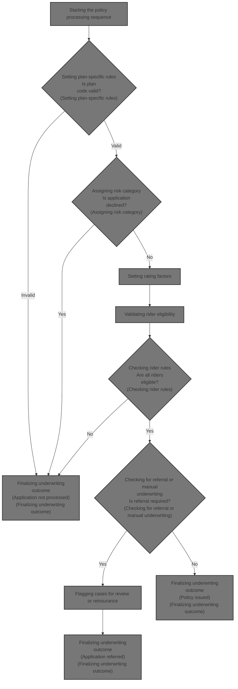

## Dependencies

### Program

- <SwmToken path="NB-UW-001.cob" pos="2:6:6" line-data="       PROGRAM-ID. NBUW001.">`NBUW001`</SwmToken> (<SwmPath>[NB-UW-001.cob](NB-UW-001.cob)</SwmPath>)

### Copybook

- POLDATA (<SwmPath>[POLDATA.cpy](POLDATA.cpy)</SwmPath>)

# Workflow

# Starting the policy processing sequence

```mermaid
%%{init: {"flowchart": {"defaultRenderer": "elk"}} }%%
flowchart TD
    node1["Initialize and load plan parameters"] --> node2["Setting plan-specific rules"]
    click node1 openCode "NB-UW-001.cob:42:45"
    
    node2 --> node3{"WS-RESULT-CODE != 0?"}
    click node3 openCode "NB-UW-001.cob:46:49"
    node3 -->|"Yes"| node4["Return error (Pending)"]
    click node4 openCode "NB-UW-001.cob:47:49"
    node3 -->|"No"| node5["Assigning risk category"]
    
    node5 --> node6{"PM-UW-DECLINE = true?"}
    click node6 openCode "NB-UW-001.cob:52:59"
    node6 -->|"Yes"| node7["Decline application ('RJ')"]
    click node7 openCode "NB-UW-001.cob:53:59"
    node6 -->|"No"| node8["Setting rating factors"]
    
    node8 --> node9["Checking rider rules"]
    
    node9 --> node10{"WS-RESULT-CODE != 0 after riders?"}
    click node10 openCode "NB-UW-001.cob:63:66"
    node10 -->|"Yes"| node11["Return error (Pending)"]
    click node11 openCode "NB-UW-001.cob:64:66"
    node10 -->|"No"| node12["Pricing insurance riders"]
    
    node12 --> node13["Flagging cases for review or reinsurance"]
    
    node13 --> node14{"WS-REFERRED or WS-MANUAL-UW = true?"}
    click node14 openCode "NB-UW-001.cob:73:80"
    node14 -->|"Yes"| node15["Refer for manual UW/reinsurance ('PE')"]
    click node15 openCode "NB-UW-001.cob:74:79"
    node14 -->|"No"| node16["Issue policy successfully ('AC')"]
    click node16 openCode "NB-UW-001.cob:83:86"

classDef HeadingStyle fill:#777777,stroke:#333,stroke-width:2px;
click node2 goToHeading "Setting plan-specific rules"
node2:::HeadingStyle
click node5 goToHeading "Assigning risk category"
node5:::HeadingStyle
click node8 goToHeading "Setting rating factors"
node8:::HeadingStyle
click node9 goToHeading "Checking rider rules"
node9:::HeadingStyle
click node12 goToHeading "Pricing insurance riders"
node12:::HeadingStyle
click node13 goToHeading "Flagging cases for review or reinsurance"
node13:::HeadingStyle

%% Swimm:
%% %%{init: {"flowchart": {"defaultRenderer": "elk"}} }%%
%% flowchart TD
%%     node1["Initialize and load plan parameters"] --> node2["Setting plan-specific rules"]
%%     click node1 openCode "<SwmPath>[NB-UW-001.cob](NB-UW-001.cob)</SwmPath>:42:45"
%%     
%%     node2 --> node3{"<SwmToken path="NB-UW-001.cob" pos="46:3:7" line-data="           IF WS-RESULT-CODE NOT = 0">`WS-RESULT-CODE`</SwmToken> != 0?"}
%%     click node3 openCode "<SwmPath>[NB-UW-001.cob](NB-UW-001.cob)</SwmPath>:46:49"
%%     node3 -->|"Yes"| node4["Return error (Pending)"]
%%     click node4 openCode "<SwmPath>[NB-UW-001.cob](NB-UW-001.cob)</SwmPath>:47:49"
%%     node3 -->|"No"| node5["Assigning risk category"]
%%     
%%     node5 --> node6{"<SwmToken path="NB-UW-001.cob" pos="52:3:7" line-data="           IF PM-UW-DECLINE">`PM-UW-DECLINE`</SwmToken> = true?"}
%%     click node6 openCode "<SwmPath>[NB-UW-001.cob](NB-UW-001.cob)</SwmPath>:52:59"
%%     node6 -->|"Yes"| node7["Decline application ('RJ')"]
%%     click node7 openCode "<SwmPath>[NB-UW-001.cob](NB-UW-001.cob)</SwmPath>:53:59"
%%     node6 -->|"No"| node8["Setting rating factors"]
%%     
%%     node8 --> node9["Checking rider rules"]
%%     
%%     node9 --> node10{"<SwmToken path="NB-UW-001.cob" pos="46:3:7" line-data="           IF WS-RESULT-CODE NOT = 0">`WS-RESULT-CODE`</SwmToken> != 0 after riders?"}
%%     click node10 openCode "<SwmPath>[NB-UW-001.cob](NB-UW-001.cob)</SwmPath>:63:66"
%%     node10 -->|"Yes"| node11["Return error (Pending)"]
%%     click node11 openCode "<SwmPath>[NB-UW-001.cob](NB-UW-001.cob)</SwmPath>:64:66"
%%     node10 -->|"No"| node12["Pricing insurance riders"]
%%     
%%     node12 --> node13["Flagging cases for review or reinsurance"]
%%     
%%     node13 --> node14{"<SwmToken path="NB-UW-001.cob" pos="73:3:5" line-data="           IF WS-REFERRED OR WS-MANUAL-UW">`WS-REFERRED`</SwmToken> or <SwmToken path="NB-UW-001.cob" pos="73:9:13" line-data="           IF WS-REFERRED OR WS-MANUAL-UW">`WS-MANUAL-UW`</SwmToken> = true?"}
%%     click node14 openCode "<SwmPath>[NB-UW-001.cob](NB-UW-001.cob)</SwmPath>:73:80"
%%     node14 -->|"Yes"| node15["Refer for manual UW/reinsurance ('PE')"]
%%     click node15 openCode "<SwmPath>[NB-UW-001.cob](NB-UW-001.cob)</SwmPath>:74:79"
%%     node14 -->|"No"| node16["Issue policy successfully ('AC')"]
%%     click node16 openCode "<SwmPath>[NB-UW-001.cob](NB-UW-001.cob)</SwmPath>:83:86"
%% 
%% classDef HeadingStyle fill:#777777,stroke:#333,stroke-width:2px;
%% click node2 goToHeading "Setting plan-specific rules"
%% node2:::HeadingStyle
%% click node5 goToHeading "Assigning risk category"
%% node5:::HeadingStyle
%% click node8 goToHeading "Setting rating factors"
%% node8:::HeadingStyle
%% click node9 goToHeading "Checking rider rules"
%% node9:::HeadingStyle
%% click node12 goToHeading "Pricing insurance riders"
%% node12:::HeadingStyle
%% click node13 goToHeading "Flagging cases for review or reinsurance"
%% node13:::HeadingStyle
```

This section initiates the policy processing workflow, loading plan parameters and orchestrating the main business decisions for policy issuance, including error handling, risk categorization, rider validation, premium calculation, and referral or issuance outcomes.

| Rule ID | Category        | Rule Name                                   | Description                                                                                                                                                              | Implementation Details                                                                                        |
| ------- | --------------- | ------------------------------------------- | ------------------------------------------------------------------------------------------------------------------------------------------------------------------------ | ------------------------------------------------------------------------------------------------------------- |
| BR-001  | Data validation | Plan parameter loading error                | If plan parameters cannot be loaded due to an invalid plan code or missing requirements, the policy processing returns an error and sets the contract status to pending. | The contract status is set to 'PE' (pending). The error message is returned as a string up to 100 characters. |
| BR-002  | Data validation | Rider validation error                      | If rider validation fails after checking rider rules, the policy processing returns an error and sets the contract status to pending.                                    | The contract status is set to 'PE' (pending). The error message is returned as a string up to 100 characters. |
| BR-003  | Decision Making | Application decline decision                | If the risk category assignment results in a decline, the application is declined and the contract status is set to 'RJ'.                                                | The contract status is set to 'RJ' (declined).                                                                |
| BR-004  | Decision Making | Manual underwriting or reinsurance referral | If the policy is flagged for manual underwriting or reinsurance review, the contract status is set to pending and the policy is referred for further review.             | The contract status is set to 'PE' (pending).                                                                 |
| BR-005  | Decision Making | Successful policy issuance                  | If all validations and checks pass and no referral is required, the policy is issued successfully and the contract status is set to active.                              | The contract status is set to 'AC' (active).                                                                  |

<SwmSnippet path="/NB-UW-001.cob" line="42">

---

In <SwmToken path="NB-UW-001.cob" pos="42:1:3" line-data="       MAIN-PROCESS.">`MAIN-PROCESS`</SwmToken>, we kick off the policy workflow by initializing the environment and then calling <SwmToken path="NB-UW-001.cob" pos="44:3:9" line-data="           PERFORM 1100-LOAD-PLAN-PARAMETERS">`1100-LOAD-PLAN-PARAMETERS`</SwmToken>. This step is needed because the plan parameters (like age limits, sum assured, fees, and tax rates) are required for all subsequent validation and calculation steps. The function assumes global variables are set and updated by each subroutine, so the state of these variables controls the flow and error handling throughout the process.

```cobol
       MAIN-PROCESS.
           PERFORM 1000-INITIALIZE
           PERFORM 1100-LOAD-PLAN-PARAMETERS
           PERFORM 1200-VALIDATE-APPLICATION
```

---

</SwmSnippet>

## Setting plan-specific rules

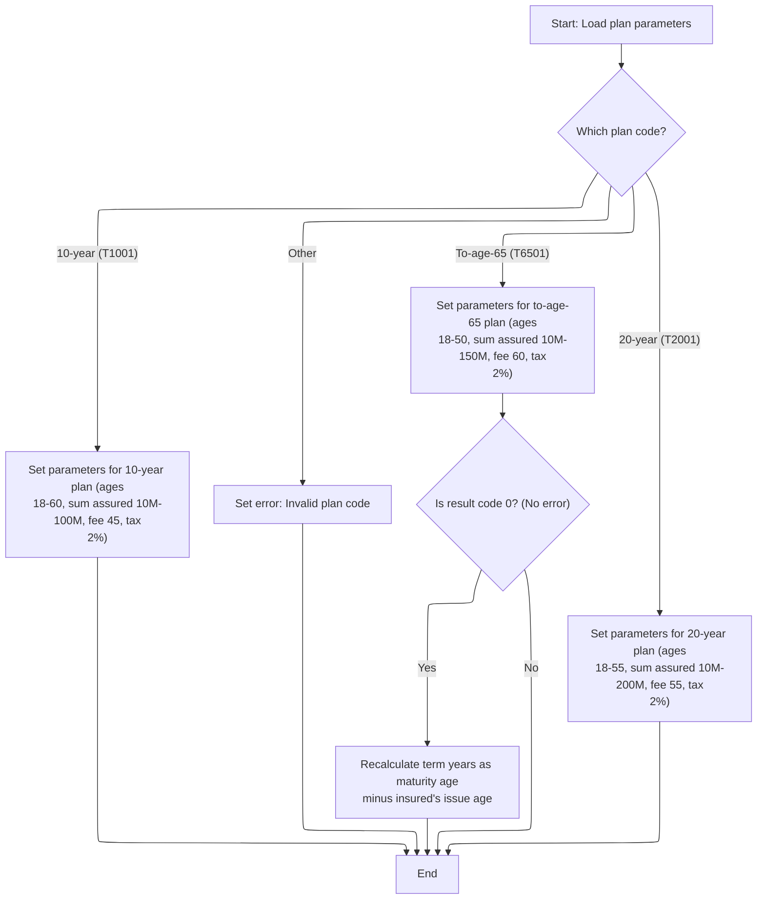

This section sets up all plan-specific parameters for a term life insurance policy based on the selected plan code. It ensures that each plan type has the correct eligibility and pricing values, and handles errors for unsupported plan codes.

| Rule ID | Category        | Rule Name                    | Description                                                                                                                                                                                                                                                                                                                                                                  | Implementation Details                                                                                                                                                                                                                                                                                                                                  |
| ------- | --------------- | ---------------------------- | ---------------------------------------------------------------------------------------------------------------------------------------------------------------------------------------------------------------------------------------------------------------------------------------------------------------------------------------------------------------------------- | ------------------------------------------------------------------------------------------------------------------------------------------------------------------------------------------------------------------------------------------------------------------------------------------------------------------------------------------------------- |
| BR-001  | Calculation     | To-age-65 term recalculation | For the to-age-65 plan, if no error is present, recalculate the term years as the maturity age minus the insured's issue age.                                                                                                                                                                                                                                                | Term years is recalculated as an integer: maturity age minus insured's issue age. This makes the term dynamic based on the insured's age at issue.                                                                                                                                                                                                      |
| BR-002  | Decision Making | 10-year plan parameters      | For the 10-year plan, set minimum issue age to 18, maximum issue age to 60, minimum sum assured to 10,000,000.00, maximum sum assured to 100,000,000.00, term years to 10, maturity age to 70, grace days to 31, contestable years to 2, suicide exclusion years to 2, reinstate days to 730, annual policy fee to 45.00, standard service fee to 15.00, and tax rate to 2%. | All values are hardcoded: min age 18, max age 60, min sum assured 10,000,000.00, max sum assured 100,000,000.00, term years 10, maturity age 70, grace days 31, contestable years 2, suicide exclusion years 2, reinstate days 730, annual policy fee 45.00, standard service fee 15.00, tax rate 2%. All values are numbers except tax rate (decimal). |
| BR-003  | Decision Making | 20-year plan parameters      | For the 20-year plan, set minimum issue age to 18, maximum issue age to 55, minimum sum assured to 10,000,000.00, maximum sum assured to 200,000,000.00, term years to 20, maturity age to 75, grace days to 31, contestable years to 2, suicide exclusion years to 2, reinstate days to 730, annual policy fee to 55.00, standard service fee to 15.00, and tax rate to 2%. | All values are hardcoded: min age 18, max age 55, min sum assured 10,000,000.00, max sum assured 200,000,000.00, term years 20, maturity age 75, grace days 31, contestable years 2, suicide exclusion years 2, reinstate days 730, annual policy fee 55.00, standard service fee 15.00, tax rate 2%. All values are numbers except tax rate (decimal). |
| BR-004  | Decision Making | To-age-65 plan parameters    | For the to-age-65 plan, set minimum issue age to 18, maximum issue age to 50, minimum sum assured to 10,000,000.00, maximum sum assured to 150,000,000.00, maturity age to 65, grace days to 31, contestable years to 2, suicide exclusion years to 2, reinstate days to 730, annual policy fee to 60.00, standard service fee to 15.00, and tax rate to 2%.                 | All values are hardcoded: min age 18, max age 50, min sum assured 10,000,000.00, max sum assured 150,000,000.00, maturity age 65, grace days 31, contestable years 2, suicide exclusion years 2, reinstate days 730, annual policy fee 60.00, standard service fee 15.00, tax rate 2%. All values are numbers except tax rate (decimal).                |
| BR-005  | Decision Making | Invalid plan code error      | If the plan code is not recognized, set an error code and message indicating an invalid plan code.                                                                                                                                                                                                                                                                           | Error code is set to 11, error message is set to 'INVALID PLAN CODE'. Error code is a number, message is a string.                                                                                                                                                                                                                                      |

<SwmSnippet path="/NB-UW-001.cob" line="109">

---

In <SwmToken path="NB-UW-001.cob" pos="109:1:7" line-data="       1100-LOAD-PLAN-PARAMETERS.">`1100-LOAD-PLAN-PARAMETERS`</SwmToken>, we use EVALUATE to set all the plan-specific parameters like age limits, sum assured, fees, and tax rates based on the plan term. These values are hardcoded and control eligibility and pricing for each plan. The function expects <SwmToken path="NB-UW-001.cob" pos="113:3:7" line-data="              WHEN PM-PLAN-TERM-10">`PM-PLAN-TERM`</SwmToken> to be set and uses global error variables for reporting issues.

```cobol
       1100-LOAD-PLAN-PARAMETERS.
      * NB-101: Each plan carries its own issue age, sum assured,
      *         maturity, fee, and tax rules.
           EVALUATE TRUE
              WHEN PM-PLAN-TERM-10
                 MOVE 018 TO PM-MIN-ISSUE-AGE
                 MOVE 060 TO PM-MAX-ISSUE-AGE
                 MOVE 0000100000000.00 TO PM-MIN-SUM-ASSURED
                 MOVE 0001000000000.00 TO PM-MAX-SUM-ASSURED
                 MOVE 010 TO PM-TERM-YEARS
                 MOVE 070 TO PM-MATURITY-AGE
                 MOVE 031 TO PM-GRACE-DAYS
                 MOVE 02  TO PM-CONTESTABLE-YEARS
                 MOVE 02  TO PM-SUICIDE-EXCL-YEARS
                 MOVE 730 TO PM-REINSTATE-DAYS
                 MOVE 0000045.00 TO PM-POLICY-FEE-ANNUAL
                 MOVE 0000015.00 TO PM-SERVICE-FEE-STD
                 MOVE 0.0200 TO PM-TAX-RATE
```

---

</SwmSnippet>

<SwmSnippet path="/NB-UW-001.cob" line="127">

---

This part handles the plan term '20', assigning its specific limits and fees. It follows the same structure as the previous snippet for term '10', and sets up the parameters needed for later validation and calculations.

```cobol
              WHEN PM-PLAN-TERM-20
                 MOVE 018 TO PM-MIN-ISSUE-AGE
                 MOVE 055 TO PM-MAX-ISSUE-AGE
                 MOVE 0000100000000.00 TO PM-MIN-SUM-ASSURED
                 MOVE 0002000000000.00 TO PM-MAX-SUM-ASSURED
                 MOVE 020 TO PM-TERM-YEARS
                 MOVE 075 TO PM-MATURITY-AGE
                 MOVE 031 TO PM-GRACE-DAYS
                 MOVE 02  TO PM-CONTESTABLE-YEARS
                 MOVE 02  TO PM-SUICIDE-EXCL-YEARS
                 MOVE 730 TO PM-REINSTATE-DAYS
                 MOVE 0000055.00 TO PM-POLICY-FEE-ANNUAL
                 MOVE 0000015.00 TO PM-SERVICE-FEE-STD
                 MOVE 0.0200 TO PM-TAX-RATE
```

---

</SwmSnippet>

<SwmSnippet path="/NB-UW-001.cob" line="141">

---

This section sets the parameters for the 'to 65' plan, using domain-specific constants for age, sum assured, fees, and tax. These values are different from the previous plan terms and are critical for eligibility and pricing checks.

```cobol
              WHEN PM-PLAN-TO-65
                 MOVE 018 TO PM-MIN-ISSUE-AGE
                 MOVE 050 TO PM-MAX-ISSUE-AGE
                 MOVE 0000100000000.00 TO PM-MIN-SUM-ASSURED
                 MOVE 0001500000000.00 TO PM-MAX-SUM-ASSURED
                 MOVE 065 TO PM-MATURITY-AGE
                 MOVE 031 TO PM-GRACE-DAYS
                 MOVE 02  TO PM-CONTESTABLE-YEARS
                 MOVE 02  TO PM-SUICIDE-EXCL-YEARS
                 MOVE 730 TO PM-REINSTATE-DAYS
                 MOVE 0000060.00 TO PM-POLICY-FEE-ANNUAL
                 MOVE 0000015.00 TO PM-SERVICE-FEE-STD
                 MOVE 0.0200 TO PM-TAX-RATE
```

---

</SwmSnippet>

<SwmSnippet path="/NB-UW-001.cob" line="154">

---

This handles invalid plan codes and sets an error so the flow can exit early.

```cobol
              WHEN OTHER
                 MOVE 11 TO WS-RESULT-CODE
                 MOVE "INVALID PLAN CODE" TO WS-RESULT-MESSAGE
           END-EVALUATE
```

---

</SwmSnippet>

<SwmSnippet path="/NB-UW-001.cob" line="159">

---

After setting plan parameters, if the plan is 'to 65' and no error occurred, the term years are recalculated based on the insured's age. This makes the term dynamic for this plan type, which is a business rule.

```cobol
           IF PM-PLAN-TO-65 AND WS-RESULT-CODE = 0
              COMPUTE PM-TERM-YEARS = PM-MATURITY-AGE
                                     - PM-INSURED-AGE-ISSUE
           END-IF.
```

---

</SwmSnippet>

## Handling plan validation results

This section governs the flow after plan validation, ensuring that errors are handled before proceeding to underwriting class determination. It ensures that only valid applications are processed for underwriting class assignment, which impacts downstream eligibility and pricing decisions.

| Rule ID | Category        | Rule Name                      | Description                                                                                                                             | Implementation Details                                                                                                                                                                        |
| ------- | --------------- | ------------------------------ | --------------------------------------------------------------------------------------------------------------------------------------- | --------------------------------------------------------------------------------------------------------------------------------------------------------------------------------------------- |
| BR-001  | Data validation | Plan validation error handling | If any validation error is detected in the plan parameters, the process stops and an error is returned to the user.                     | The result code is a number. If it is not zero, an error message is returned and processing stops. The error message format is not specified in this section.                                 |
| BR-002  | Decision Making | Underwriting class assignment  | If no validation errors are present, the underwriting class is determined based on risk factors, which affects eligibility and pricing. | The underwriting class is determined by risk factors. The specific risk factors and class values are not detailed in this section. The underwriting class influences eligibility and pricing. |

<SwmSnippet path="/NB-UW-001.cob" line="46">

---

After loading plan parameters, <SwmToken path="NB-UW-001.cob" pos="42:1:3" line-data="       MAIN-PROCESS.">`MAIN-PROCESS`</SwmToken> checks for errors and exits if any were set.

```cobol
           IF WS-RESULT-CODE NOT = 0
              PERFORM 9000-RETURN-ERROR
              GOBACK
           END-IF
```

---

</SwmSnippet>

<SwmSnippet path="/NB-UW-001.cob" line="51">

---

Next in <SwmToken path="NB-UW-001.cob" pos="42:1:3" line-data="       MAIN-PROCESS.">`MAIN-PROCESS`</SwmToken>, we call <SwmToken path="NB-UW-001.cob" pos="51:3:9" line-data="           PERFORM 1300-DETERMINE-UW-CLASS">`1300-DETERMINE-UW-CLASS`</SwmToken> to assign the underwriting class based on risk factors. This step is needed because the underwriting class affects eligibility, pricing, and whether the application is declined or referred.

```cobol
           PERFORM 1300-DETERMINE-UW-CLASS
```

---

</SwmSnippet>

## Assigning risk category

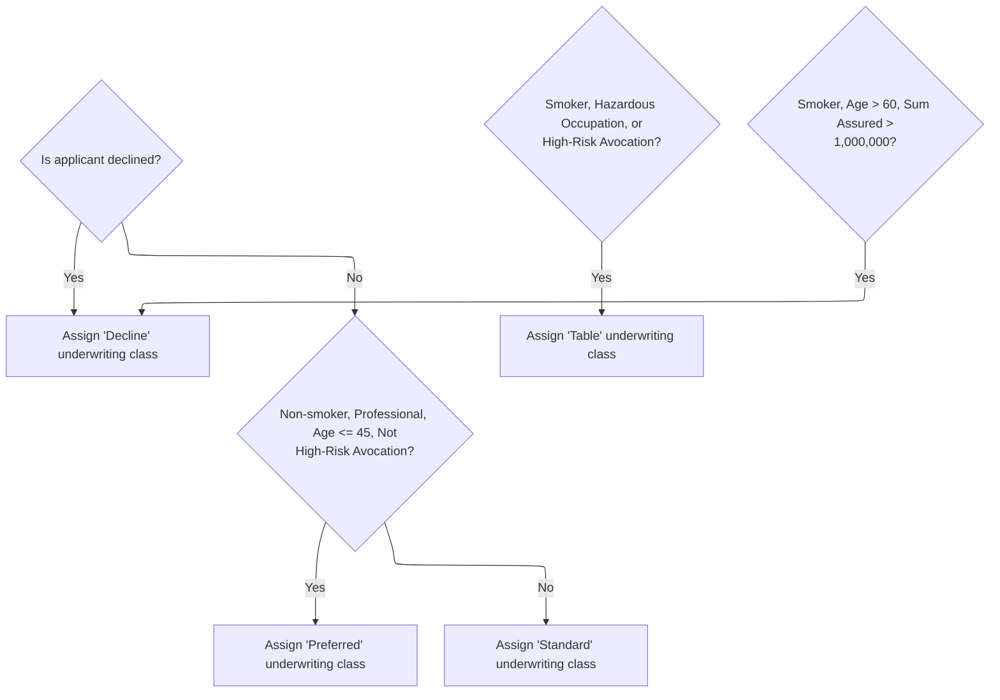

This section determines the underwriting risk category for an insurance application based on applicant risk factors. The assigned risk class impacts pricing and eligibility for the policy.

| Rule ID | Category        | Rule Name                 | Description                                                                                                                                                                | Implementation Details                                                                                                                                                                                                                            |
| ------- | --------------- | ------------------------- | -------------------------------------------------------------------------------------------------------------------------------------------------------------------------- | ------------------------------------------------------------------------------------------------------------------------------------------------------------------------------------------------------------------------------------------------- |
| BR-001  | Decision Making | Decline assignment        | If the application is flagged for decline, the underwriting class is set to 'Decline'.                                                                                     | The output is the underwriting class code 'DP', a 2-character string. This code is used for declined applications.                                                                                                                                |
| BR-002  | Decision Making | Preferred risk assignment | If the applicant is a non-smoker, has a professional occupation, is age 45 or younger, and does not have a high-risk avocation, assign the 'Preferred' underwriting class. | The output is the underwriting class code 'PR', a 2-character string. Age threshold is 45. Professional occupation is indicated by occupation class 1. Non-smoker is indicated by smoker indicator 'N'. High-risk avocation indicator is not 'Y'. |
| BR-003  | Decision Making | Standard risk assignment  | If the applicant does not meet the preferred risk criteria, assign the 'Standard' underwriting class.                                                                      | The output is the underwriting class code 'ST', a 2-character string. This is the default assignment if preferred criteria are not met.                                                                                                           |
| BR-004  | Decision Making | Table rating assignment   | If the applicant is a smoker, has a hazardous occupation, or has a high-risk avocation, assign the 'Table' underwriting class.                                             | The output is the underwriting class code 'TB', a 2-character string. Hazardous occupation is indicated by occupation class 3. Smoker is indicated by smoker indicator 'S'. High-risk avocation indicator is 'Y'.                                 |
| BR-005  | Decision Making | High-risk smoker decline  | If the applicant is a smoker, over age 60, and the sum assured is greater than 1,000,000, assign the 'Decline' underwriting class.                                         | The output is the underwriting class code 'DP', a 2-character string. Age threshold is 60. Sum assured threshold is 1,000,000.00 (twelve digits including decimals).                                                                              |

<SwmSnippet path="/NB-UW-001.cob" line="231">

---

In <SwmToken path="NB-UW-001.cob" pos="231:1:7" line-data="       1300-DETERMINE-UW-CLASS.">`1300-DETERMINE-UW-CLASS`</SwmToken>, we first check if the application is already flagged for decline. If not, we use risk factors like smoking status, occupation, age, and avocation to assign a risk class. These codes drive pricing and eligibility downstream.

```cobol
       1300-DETERMINE-UW-CLASS.
      * NB-301: Preferred, standard, table, or decline.
           IF PM-UW-DECLINE
              EXIT PARAGRAPH
           END-IF
```

---

</SwmSnippet>

<SwmSnippet path="/NB-UW-001.cob" line="237">

---

This part assigns 'PR' for preferred risk if the insured meets strict criteria, otherwise 'ST' for standard. These codes are used later for pricing and eligibility checks.

```cobol
           IF PM-NON-SMOKER AND PM-OCC-PROF AND
              PM-INSURED-AGE-ISSUE <= 45 AND
              PM-HIGH-RISK-AVOC-IND NOT = 'Y'
              MOVE "PR" TO PM-UW-CLASS
           ELSE
              MOVE "ST" TO PM-UW-CLASS
           END-IF
```

---

</SwmSnippet>

<SwmSnippet path="/NB-UW-001.cob" line="246">

---

Here we check for smoker, hazardous occupation, or high-risk avocation and set the risk class to 'TB' (table rating). This overrides previous assignments and is used for pricing adjustments.

```cobol
           IF PM-SMOKER OR PM-OCC-HAZARD OR PM-HIGH-RISK-AVOC
              MOVE "TB" TO PM-UW-CLASS
           END-IF
```

---

</SwmSnippet>

<SwmSnippet path="/NB-UW-001.cob" line="251">

---

This part flags the policy for decline if the insured is a high-risk smoker with a big coverage amount.

```cobol
           IF PM-SMOKER AND PM-INSURED-AGE-ISSUE > 60 AND
              PM-SUM-ASSURED > 0001000000000.00
              MOVE "DP" TO PM-UW-CLASS
           END-IF.
```

---

</SwmSnippet>

## Handling underwriting decisions

This section governs the business logic for handling applications that are declined after underwriting. It ensures that declined applications are flagged, appropriate messages and statuses are set, and the process exits with an error indication.

| Rule ID | Category        | Rule Name                     | Description                                                                                                                                                                                                                                                                       | Implementation Details                                                                                                                                                                                              |
| ------- | --------------- | ----------------------------- | --------------------------------------------------------------------------------------------------------------------------------------------------------------------------------------------------------------------------------------------------------------------------------- | ------------------------------------------------------------------------------------------------------------------------------------------------------------------------------------------------------------------- |
| BR-001  | Decision Making | Underwriting Decline Handling | When an application is flagged for decline after underwriting, the system sets the result code to 21, updates the result message to indicate the application was declined by underwriting rules, sets the contract status to 'declined', and triggers the error handling process. | The result code is set to 21. The result message is set to 'APPLICATION DECLINED BY UNDERWRITING RULES' (alphanumeric, up to 100 characters). The contract status is set to 'RJ' (2-character code for 'declined'). |

<SwmSnippet path="/NB-UW-001.cob" line="52">

---

<SwmToken path="NB-UW-001.cob" pos="42:1:3" line-data="       MAIN-PROCESS.">`MAIN-PROCESS`</SwmToken> checks for decline after underwriting and exits if flagged.

```cobol
           IF PM-UW-DECLINE
              MOVE 21 TO WS-RESULT-CODE
              MOVE "APPLICATION DECLINED BY UNDERWRITING RULES"
                TO WS-RESULT-MESSAGE
              MOVE "RJ" TO PM-CONTRACT-STATUS
              PERFORM 9000-RETURN-ERROR
              GOBACK
           END-IF
```

---

</SwmSnippet>

<SwmSnippet path="/NB-UW-001.cob" line="61">

---

Next, <SwmToken path="NB-UW-001.cob" pos="42:1:3" line-data="       MAIN-PROCESS.">`MAIN-PROCESS`</SwmToken> calls <SwmToken path="NB-UW-001.cob" pos="61:3:9" line-data="           PERFORM 1400-LOAD-RATE-FACTORS">`1400-LOAD-RATE-FACTORS`</SwmToken> to set up all the rate and adjustment factors needed for premium calculation. This step is required because the premium depends on age, gender, smoker status, occupation, and underwriting class.

```cobol
           PERFORM 1400-LOAD-RATE-FACTORS
           PERFORM 1500-VALIDATE-RIDERS
```

---

</SwmSnippet>

## Setting rating factors

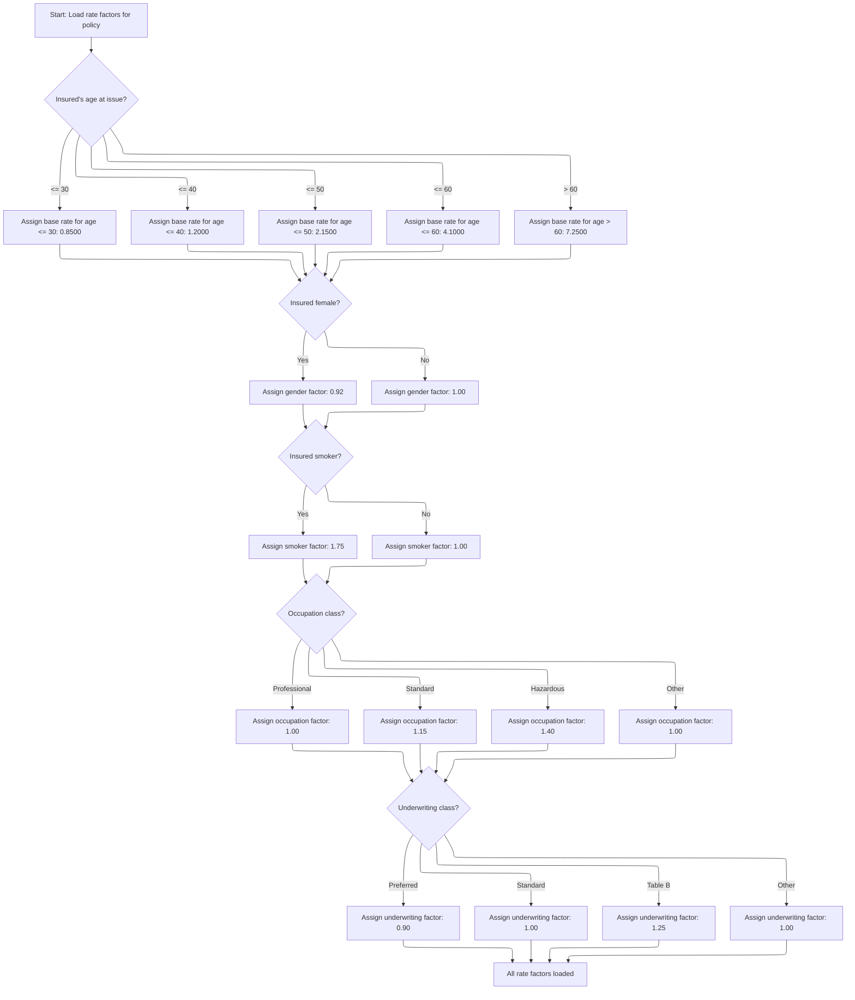

This section sets all rating factors that determine the premium for a new or amended term life insurance policy. It applies business rules to assign each factor based on the insured's attributes.

| Rule ID | Category    | Rule Name                      | Description                                                                                                                                                                                         | Implementation Details                                                                                                                                                                                    |
| ------- | ----------- | ------------------------------ | --------------------------------------------------------------------------------------------------------------------------------------------------------------------------------------------------- | --------------------------------------------------------------------------------------------------------------------------------------------------------------------------------------------------------- |
| BR-001  | Calculation | Base rate by age band          | Assign the base rate per thousand sum assured according to the insured's age at issue, using defined age bands and corresponding rates.                                                             | The base rate is set as follows: 0.8500 for age <= 30, 1.2000 for age <= 40, 2.1500 for age <= 50, 4.1000 for age <= 60, and 7.2500 for age > 60. The output is a numeric value with four decimal places. |
| BR-002  | Calculation | Gender factor assignment       | Assign a gender factor based on whether the insured is female. Female insureds receive a lower factor, reducing the premium.                                                                        | The gender factor is set to 0.92 if the insured is female, otherwise 1.00. The output is a numeric value with two decimal places.                                                                         |
| BR-003  | Calculation | Smoker factor assignment       | Assign a smoker factor based on whether the insured is a smoker. Smokers receive a higher factor, increasing the premium.                                                                           | The smoker factor is set to 1.75 if the insured is a smoker, otherwise 1.00. The output is a numeric value with two decimal places.                                                                       |
| BR-004  | Calculation | Occupation factor assignment   | Assign an occupation factor based on the insured's occupation class. Hazardous jobs get a higher factor, standard jobs get a moderate factor, and professional or other jobs get the lowest factor. | The occupation factor is set to 1.00 for professional or other, 1.15 for standard, and 1.40 for hazardous. The output is a numeric value with two decimal places.                                         |
| BR-005  | Calculation | Underwriting factor assignment | Assign an underwriting factor based on the insured's underwriting class. Preferred gets a discount, standard is neutral, table gets a surcharge, and other classes are neutral.                     | The underwriting factor is set to 0.90 for preferred, 1.00 for standard or other, and 1.25 for table B. The output is a numeric value with two decimal places.                                            |

<SwmSnippet path="/NB-UW-001.cob" line="256">

---

In <SwmToken path="NB-UW-001.cob" pos="256:1:7" line-data="       1400-LOAD-RATE-FACTORS.">`1400-LOAD-RATE-FACTORS`</SwmToken>, we set the base rate per thousand sum assured based on the insured's age. The age bands are hardcoded and control how much the policy costs for different ages.

```cobol
       1400-LOAD-RATE-FACTORS.
      * NB-401: Base mortality rate by issue age band.
           EVALUATE TRUE
              WHEN PM-INSURED-AGE-ISSUE <= 30
                 MOVE 00000.8500 TO PM-BASE-RATE-PER-THOU
              WHEN PM-INSURED-AGE-ISSUE <= 40
                 MOVE 00001.2000 TO PM-BASE-RATE-PER-THOU
              WHEN PM-INSURED-AGE-ISSUE <= 50
                 MOVE 00002.1500 TO PM-BASE-RATE-PER-THOU
              WHEN PM-INSURED-AGE-ISSUE <= 60
                 MOVE 00004.1000 TO PM-BASE-RATE-PER-THOU
              WHEN OTHER
                 MOVE 00007.2500 TO PM-BASE-RATE-PER-THOU
           END-EVALUATE
```

---

</SwmSnippet>

<SwmSnippet path="/NB-UW-001.cob" line="272">

---

After setting the base rate, we assign the gender factor. Female insureds get a lower factor, which reduces their premium. This is a business rule for gender-based pricing.

```cobol
           IF PM-FEMALE
              MOVE 0.9200 TO PM-GENDER-FACTOR
           ELSE
              MOVE 1.0000 TO PM-GENDER-FACTOR
           END-IF
```

---

</SwmSnippet>

<SwmSnippet path="/NB-UW-001.cob" line="279">

---

Next we set the smoker factor. Smokers get a higher adjustment, which increases their premium. This is a standard risk pricing rule.

```cobol
           IF PM-SMOKER
              MOVE 1.7500 TO PM-SMOKER-FACTOR
           ELSE
              MOVE 1.0000 TO PM-SMOKER-FACTOR
           END-IF
```

---

</SwmSnippet>

<SwmSnippet path="/NB-UW-001.cob" line="286">

---

Here we set the occupation factor based on the insured's job class. Hazardous jobs get a higher factor, standard jobs get a moderate bump, and professional jobs get the lowest. This affects the premium calculation.

```cobol
           EVALUATE TRUE
              WHEN PM-OCC-PROF
                 MOVE 1.0000 TO PM-OCC-FACTOR
              WHEN PM-OCC-STANDARD
                 MOVE 1.1500 TO PM-OCC-FACTOR
              WHEN PM-OCC-HAZARD
                 MOVE 1.4000 TO PM-OCC-FACTOR
              WHEN OTHER
                 MOVE 1.0000 TO PM-OCC-FACTOR
           END-EVALUATE
```

---

</SwmSnippet>

<SwmSnippet path="/NB-UW-001.cob" line="298">

---

Finally, we set the underwriting factor based on the assigned risk class. Preferred gets a discount, standard is neutral, table gets a surcharge. This wraps up all the adjustments needed for premium calculation.

```cobol
           EVALUATE TRUE
              WHEN PM-UW-PREFERRED
                 MOVE 0.9000 TO PM-UW-FACTOR
              WHEN PM-UW-STANDARD
                 MOVE 1.0000 TO PM-UW-FACTOR
              WHEN PM-UW-TABLE-B
                 MOVE 1.2500 TO PM-UW-FACTOR
              WHEN OTHER
                 MOVE 1.0000 TO PM-UW-FACTOR
           END-EVALUATE.
```

---

</SwmSnippet>

## Validating rider eligibility

This section ensures that all riders attached to a policy meet the product's eligibility rules before premium calculation. It enforces business constraints and communicates any eligibility failures through result codes and messages.

| Rule ID | Category        | Rule Name                     | Description                                                                                                                                                                                                               | Implementation Details                                                                                                                                                                        |
| ------- | --------------- | ----------------------------- | ------------------------------------------------------------------------------------------------------------------------------------------------------------------------------------------------------------------------- | --------------------------------------------------------------------------------------------------------------------------------------------------------------------------------------------- |
| BR-001  | Data validation | Rider eligibility enforcement | Each attached rider is checked to ensure it meets all product eligibility rules before premium calculation proceeds. If a rider does not meet eligibility, an error code and message are set in the policy master record. | Error codes are numeric and messages are alphanumeric strings. The result code is a number and the result message is a string up to 100 characters, left-aligned and space-padded if shorter. |

<SwmSnippet path="/NB-UW-001.cob" line="61">

---

Back in <SwmToken path="NB-UW-001.cob" pos="42:1:3" line-data="       MAIN-PROCESS.">`MAIN-PROCESS`</SwmToken>, after loading rate factors, we call <SwmToken path="NB-UW-001.cob" pos="62:3:7" line-data="           PERFORM 1500-VALIDATE-RIDERS">`1500-VALIDATE-RIDERS`</SwmToken> to check if all attached riders meet product rules. This step is needed because riders have their own eligibility limits and business rules that must be enforced before calculating premiums.

```cobol
           PERFORM 1400-LOAD-RATE-FACTORS
           PERFORM 1500-VALIDATE-RIDERS
```

---

</SwmSnippet>

## Checking rider rules

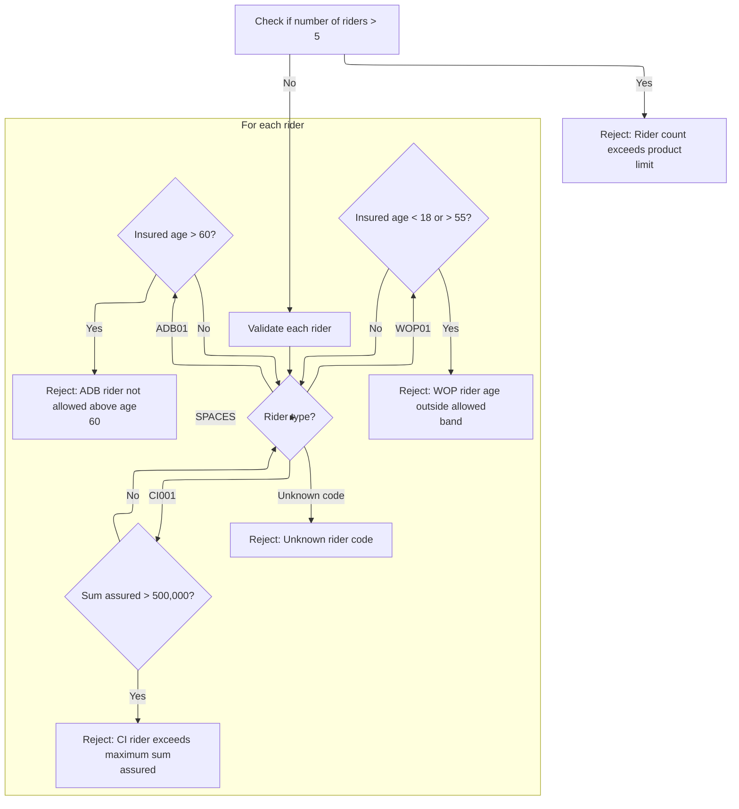

This section validates attached riders for a term life insurance policy. It enforces product limits and eligibility criteria for each rider type, ensuring compliance with business rules before policy issuance.

| Rule ID | Category        | Rule Name                | Description                                                                                                                                                                                                                                                                                                                                                                                                                              | Implementation Details                                                                                                                                                                                                                                 |
| ------- | --------------- | ------------------------ | ---------------------------------------------------------------------------------------------------------------------------------------------------------------------------------------------------------------------------------------------------------------------------------------------------------------------------------------------------------------------------------------------------------------------------------------- | ------------------------------------------------------------------------------------------------------------------------------------------------------------------------------------------------------------------------------------------------------ |
| BR-001  | Data validation | Rider count limit        | Reject the policy if the number of attached riders exceeds 5, as per product constraints.                                                                                                                                                                                                                                                                                                                                                | The maximum allowed number of riders is 5. If this rule is triggered, the result code is set to 22 and the message is set to 'RIDER COUNT EXCEEDS PRODUCT LIMIT'. The output message is a string, and the result code is a number.                     |
| BR-002  | Data validation | ADB rider age cap        | Reject the policy if an <SwmToken path="NB-UW-001.cob" pos="322:4:4" line-data="                 WHEN &quot;ADB01&quot;">`ADB01`</SwmToken> rider is attached and the insured's age at issue is above 60.                                                                                                                                                                                                                                | The maximum allowed age for the ADB rider is 60. If this rule is triggered, the result code is set to 23 and the message is set to 'ADB RIDER NOT ALLOWED ABOVE AGE 60'. The output message is a string, and the result code is a number.              |
| BR-003  | Data validation | WOP rider age band       | Reject the policy if a <SwmToken path="NB-UW-001.cob" pos="329:4:4" line-data="                 WHEN &quot;WOP01&quot;">`WOP01`</SwmToken> rider is attached and the insured's age at issue is less than 18 or greater than 55.                                                                                                                                                                                                          | The allowed age band for the WOP rider is 18 to 55 inclusive. If this rule is triggered, the result code is set to 24 and the message is set to 'WOP RIDER AGE OUTSIDE ALLOWED BAND'. The output message is a string, and the result code is a number. |
| BR-004  | Data validation | CI rider sum assured cap | Reject the policy if a <SwmToken path="NB-UW-001.cob" pos="337:4:4" line-data="                 WHEN &quot;CI001&quot;">`CI001`</SwmToken> rider is attached and the sum assured for that rider exceeds 500,000.                                                                                                                                                                                                                         | The maximum allowed sum assured for the CI rider is 500,000. If this rule is triggered, the result code is set to 25 and the message is set to 'CI RIDER EXCEEDS MAXIMUM RIDER SA'. The output message is a string, and the result code is a number.   |
| BR-005  | Data validation | Unknown rider code       | Reject the policy if a rider code is not recognized (i.e., not <SwmToken path="NB-UW-001.cob" pos="322:4:4" line-data="                 WHEN &quot;ADB01&quot;">`ADB01`</SwmToken>, <SwmToken path="NB-UW-001.cob" pos="329:4:4" line-data="                 WHEN &quot;WOP01&quot;">`WOP01`</SwmToken>, <SwmToken path="NB-UW-001.cob" pos="337:4:4" line-data="                 WHEN &quot;CI001&quot;">`CI001`</SwmToken>, or blank). | If this rule is triggered, the result code is set to 26 and the message is set to 'UNKNOWN RIDER CODE'. The output message is a string, and the result code is a number.                                                                               |

<SwmSnippet path="/NB-UW-001.cob" line="309">

---

In <SwmToken path="NB-UW-001.cob" pos="309:1:5" line-data="       1500-VALIDATE-RIDERS.">`1500-VALIDATE-RIDERS`</SwmToken>, we first check if the rider count exceeds 5. If it does, we set an error and exit. This enforces the product limit for attached riders.

```cobol
       1500-VALIDATE-RIDERS.
      * NB-501: Limit rider count.
           IF PM-RIDER-COUNT > 5
              MOVE 22 TO WS-RESULT-CODE
              MOVE "RIDER COUNT EXCEEDS PRODUCT LIMIT"
                TO WS-RESULT-MESSAGE
              EXIT PARAGRAPH
           END-IF
```

---

</SwmSnippet>

<SwmSnippet path="/NB-UW-001.cob" line="318">

---

Here we start looping through each rider and apply validation rules. For <SwmToken path="NB-UW-001.cob" pos="322:4:4" line-data="                 WHEN &quot;ADB01&quot;">`ADB01`</SwmToken>, we check if the insured's age is above 60 and reject if so. This is the first rider-specific check in the loop.

```cobol
           PERFORM VARYING WS-RIDER-IDX FROM 1 BY 1
                   UNTIL WS-RIDER-IDX > PM-RIDER-COUNT OR
                         WS-RESULT-CODE NOT = 0
              EVALUATE PM-RIDER-CODE(WS-RIDER-IDX)
                 WHEN "ADB01"
      * NB-502: Accidental death rider issue age cap 60.
                    IF PM-INSURED-AGE-ISSUE > 60
                       MOVE 23 TO WS-RESULT-CODE
                       MOVE "ADB RIDER NOT ALLOWED ABOVE AGE 60"
                         TO WS-RESULT-MESSAGE
                    END-IF
```

---

</SwmSnippet>

<SwmSnippet path="/NB-UW-001.cob" line="329">

---

Next in the loop, we check for <SwmToken path="NB-UW-001.cob" pos="329:4:4" line-data="                 WHEN &quot;WOP01&quot;">`WOP01`</SwmToken> and enforce the age band rule (18 to 55). If the insured's age is outside this range, we set an error and exit.

```cobol
                 WHEN "WOP01"
      * NB-503: Waiver of premium rider age band 18 to 55.
                    IF PM-INSURED-AGE-ISSUE < 18 OR
                       PM-INSURED-AGE-ISSUE > 55
                       MOVE 24 TO WS-RESULT-CODE
                       MOVE "WOP RIDER AGE OUTSIDE ALLOWED BAND"
                         TO WS-RESULT-MESSAGE
                    END-IF
```

---

</SwmSnippet>

<SwmSnippet path="/NB-UW-001.cob" line="337">

---

Here we check for <SwmToken path="NB-UW-001.cob" pos="337:4:4" line-data="                 WHEN &quot;CI001&quot;">`CI001`</SwmToken> and enforce the sum assured cap. If the rider's sum assured is above 500,000, we set an error and exit.

```cobol
                 WHEN "CI001"
      * NB-504: Critical illness rider cap 500,000.
                    IF PM-RIDER-SUM-ASSURED(WS-RIDER-IDX)
                       > 0000500000.00
                       MOVE 25 TO WS-RESULT-CODE
                       MOVE "CI RIDER EXCEEDS MAXIMUM RIDER SA"
                         TO WS-RESULT-MESSAGE
                    END-IF
```

---

</SwmSnippet>

<SwmSnippet path="/NB-UW-001.cob" line="345">

---

This part flags unknown rider codes and wraps up the rider validation loop.

```cobol
                 WHEN SPACES
                    CONTINUE
                 WHEN OTHER
                    MOVE 26 TO WS-RESULT-CODE
                    MOVE "UNKNOWN RIDER CODE" TO WS-RESULT-MESSAGE
              END-EVALUATE
           END-PERFORM.
```

---

</SwmSnippet>

## Handling rider validation results

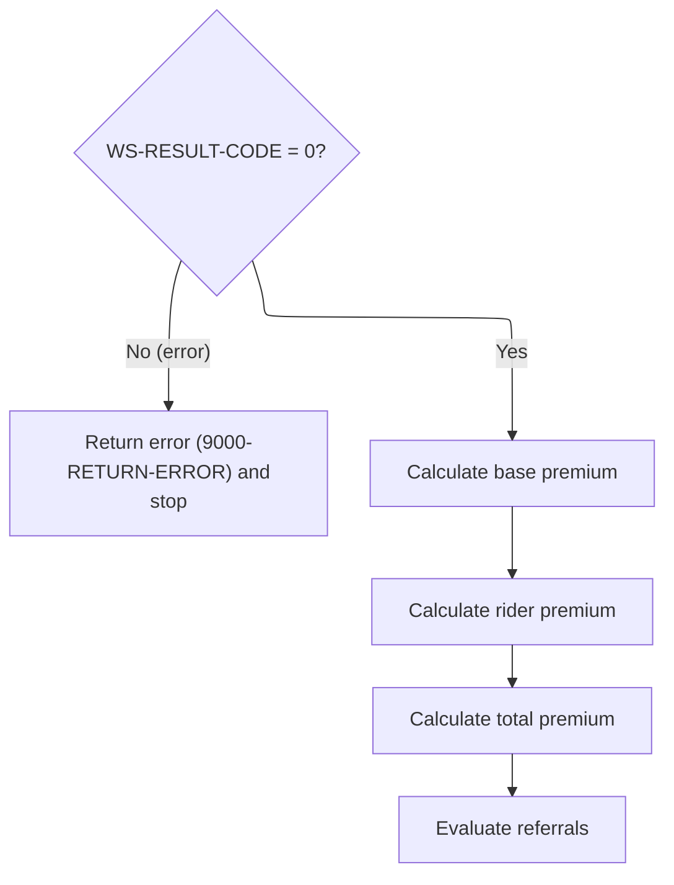

This section governs the transition from rider validation to premium and referral processing. It ensures that only valid riders proceed to premium calculation and referral evaluation.

| Rule ID | Category        | Rule Name                                     | Description                                                                                                                                                                                     | Implementation Details                                                                                                                                                                              |
| ------- | --------------- | --------------------------------------------- | ----------------------------------------------------------------------------------------------------------------------------------------------------------------------------------------------- | --------------------------------------------------------------------------------------------------------------------------------------------------------------------------------------------------- |
| BR-001  | Data validation | Rider validation error handling               | If any errors are detected during rider validation (result code not zero), the process stops and an error is returned. Premium calculations and referral checks are not performed in this case. | The result code is a number. If it is not zero, an error response is triggered and further processing is halted.                                                                                    |
| BR-002  | Calculation     | Premium calculation sequence                  | If no errors are detected during rider validation (result code is zero), the process continues to calculate the base premium, then the rider premium, then the total premium, in that order.    | Premium calculations are performed in the following order: base premium, rider premium, total premium. Each calculation step depends on the completion of the previous step.                        |
| BR-003  | Decision Making | Referral evaluation after premium calculation | After all premium calculations are completed, the process evaluates whether the case requires referral for further review.                                                                      | Referral evaluation is performed after all premium calculations are done. The outcome may affect policy issuance or require manual review, depending on referral logic (not shown in this section). |

<SwmSnippet path="/NB-UW-001.cob" line="63">

---

Back in <SwmToken path="NB-UW-001.cob" pos="42:1:3" line-data="       MAIN-PROCESS.">`MAIN-PROCESS`</SwmToken>, after validating riders, we check for errors. If any were set, we call the error handler and exit. This prevents invalid riders from affecting premium calculations.

```cobol
           IF WS-RESULT-CODE NOT = 0
              PERFORM 9000-RETURN-ERROR
              GOBACK
           END-IF
```

---

</SwmSnippet>

<SwmSnippet path="/NB-UW-001.cob" line="68">

---

Next, <SwmToken path="NB-UW-001.cob" pos="42:1:3" line-data="       MAIN-PROCESS.">`MAIN-PROCESS`</SwmToken> calls the premium calculation routines. We start with base premium, then rider premium, then total premium, and finally referral checks. Calculating rider premium is needed because each rider adds cost and must be priced according to its rules.

```cobol
           PERFORM 1600-CALCULATE-BASE-PREMIUM
           PERFORM 1700-CALCULATE-RIDER-PREMIUM
           PERFORM 1800-CALCULATE-TOTAL-PREMIUM
           PERFORM 1900-EVALUATE-REFERRALS
```

---

</SwmSnippet>

## Pricing insurance riders

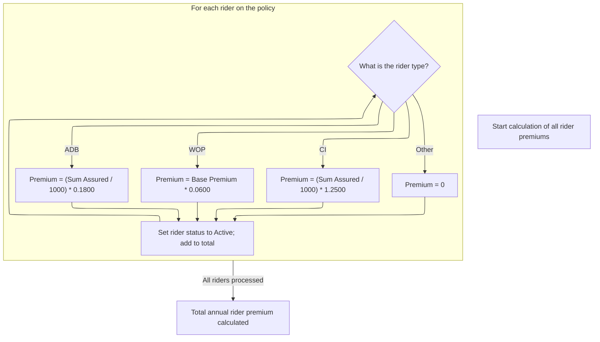

This section calculates the annual premium for each insurance rider on a policy, applying business-specific pricing rules based on rider type and aggregating the results.

| Rule ID | Category        | Rule Name                        | Description                                                                                                                                                                                                                                                                                                                                                             | Implementation Details                                                                                                                                                                                                                                                                                                                                                                                                               |
| ------- | --------------- | -------------------------------- | ----------------------------------------------------------------------------------------------------------------------------------------------------------------------------------------------------------------------------------------------------------------------------------------------------------------------------------------------------------------------- | ------------------------------------------------------------------------------------------------------------------------------------------------------------------------------------------------------------------------------------------------------------------------------------------------------------------------------------------------------------------------------------------------------------------------------------ |
| BR-001  | Calculation     | ADB rider pricing                | For riders with code <SwmToken path="NB-UW-001.cob" pos="322:4:4" line-data="                 WHEN &quot;ADB01&quot;">`ADB01`</SwmToken>, the annual premium is calculated as the sum assured divided by 1000, multiplied by a fixed rate of 0.1800.                                                                                                                    | The rate used is 0.1800. The sum assured is a number. The premium is calculated as (sum assured / 1000) \* 0.1800 and rounded. Output is a number.                                                                                                                                                                                                                                                                                   |
| BR-002  | Calculation     | WOP rider pricing                | For riders with code <SwmToken path="NB-UW-001.cob" pos="329:4:4" line-data="                 WHEN &quot;WOP01&quot;">`WOP01`</SwmToken>, the annual premium is calculated as 6% of the base annual premium.                                                                                                                                                            | The rate used is <SwmToken path="NB-UW-001.cob" pos="385:11:13" line-data="                           PM-BASE-ANNUAL-PREMIUM * 0.0600">`0.0600`</SwmToken> (6%). The base annual premium is a number. The premium is calculated as base annual premium \* <SwmToken path="NB-UW-001.cob" pos="385:11:13" line-data="                           PM-BASE-ANNUAL-PREMIUM * 0.0600">`0.0600`</SwmToken> and rounded. Output is a number. |
| BR-003  | Calculation     | CI rider pricing                 | For riders with code <SwmToken path="NB-UW-001.cob" pos="337:4:4" line-data="                 WHEN &quot;CI001&quot;">`CI001`</SwmToken>, the annual premium is calculated as the sum assured divided by 1000, multiplied by a fixed rate of <SwmToken path="NB-UW-001.cob" pos="304:3:5" line-data="                 MOVE 1.2500 TO PM-UW-FACTOR">`1.2500`</SwmToken>. | The rate used is <SwmToken path="NB-UW-001.cob" pos="304:3:5" line-data="                 MOVE 1.2500 TO PM-UW-FACTOR">`1.2500`</SwmToken>. The sum assured is a number. The premium is calculated as (sum assured / 1000) \* <SwmToken path="NB-UW-001.cob" pos="304:3:5" line-data="                 MOVE 1.2500 TO PM-UW-FACTOR">`1.2500`</SwmToken> and rounded. Output is a number.                                             |
| BR-004  | Decision Making | Unknown rider pricing            | For any rider code not explicitly handled, the annual premium is set to zero.                                                                                                                                                                                                                                                                                           | Premium is set to zero. Output is a number.                                                                                                                                                                                                                                                                                                                                                                                          |
| BR-005  | Writing Output  | Rider activation and aggregation | After pricing, each rider is marked as active and its premium is added to the total annual rider premium for the policy.                                                                                                                                                                                                                                                | Rider status is set to 'A' (active). Premium is added to the total annual rider premium. Status is a string, premium and total are numbers.                                                                                                                                                                                                                                                                                          |

<SwmSnippet path="/NB-UW-001.cob" line="370">

---

In <SwmToken path="NB-UW-001.cob" pos="370:1:7" line-data="       1700-CALCULATE-RIDER-PREMIUM.">`1700-CALCULATE-RIDER-PREMIUM`</SwmToken>, we loop through all riders and price each one based on its code. For <SwmToken path="NB-UW-001.cob" pos="375:4:4" line-data="                 WHEN &quot;ADB01&quot;">`ADB01`</SwmToken>, we use a per-thousand rate; for <SwmToken path="NB-UW-001.cob" pos="329:4:4" line-data="                 WHEN &quot;WOP01&quot;">`WOP01`</SwmToken>, a percentage of base premium; for <SwmToken path="NB-UW-001.cob" pos="337:4:4" line-data="                 WHEN &quot;CI001&quot;">`CI001`</SwmToken>, another per-thousand rate. All rates are hardcoded and tied to business rules.

```cobol
       1700-CALCULATE-RIDER-PREMIUM.
           MOVE ZERO TO PM-RIDER-ANNUAL-TOTAL
           PERFORM VARYING WS-RIDER-IDX FROM 1 BY 1
                   UNTIL WS-RIDER-IDX > PM-RIDER-COUNT
              EVALUATE PM-RIDER-CODE(WS-RIDER-IDX)
                 WHEN "ADB01"
      * NB-701: ADB premium priced per thousand on rider SA.
                    MOVE 00000.1800 TO PM-RIDER-RATE(WS-RIDER-IDX)
                    COMPUTE PM-RIDER-ANNUAL-PREM(WS-RIDER-IDX) ROUNDED =
                           (PM-RIDER-SUM-ASSURED(WS-RIDER-IDX) / 1000)
                         * PM-RIDER-RATE(WS-RIDER-IDX)
```

---

</SwmSnippet>

<SwmSnippet path="/NB-UW-001.cob" line="381">

---

Here we handle <SwmToken path="NB-UW-001.cob" pos="381:4:4" line-data="                 WHEN &quot;WOP01&quot;">`WOP01`</SwmToken> riders, pricing them at 6% of the base premium. This is a different calculation from the previous rider and shows how each rider type has its own pricing logic.

```cobol
                 WHEN "WOP01"
      * NB-702: WOP premium set at 6 percent of base annual premium.
                    MOVE 00000.0600 TO PM-RIDER-RATE(WS-RIDER-IDX)
                    COMPUTE PM-RIDER-ANNUAL-PREM(WS-RIDER-IDX) ROUNDED =
                           PM-BASE-ANNUAL-PREMIUM * 0.0600
```

---

</SwmSnippet>

<SwmSnippet path="/NB-UW-001.cob" line="386">

---

Next we handle <SwmToken path="NB-UW-001.cob" pos="386:4:4" line-data="                 WHEN &quot;CI001&quot;">`CI001`</SwmToken> riders, pricing them per thousand sum assured at a fixed rate. This is another rider-specific calculation, using its own hardcoded rate.

```cobol
                 WHEN "CI001"
      * NB-703: CI premium priced per thousand on rider SA.
                    MOVE 00001.2500 TO PM-RIDER-RATE(WS-RIDER-IDX)
                    COMPUTE PM-RIDER-ANNUAL-PREM(WS-RIDER-IDX) ROUNDED =
                           (PM-RIDER-SUM-ASSURED(WS-RIDER-IDX) / 1000)
                         * PM-RIDER-RATE(WS-RIDER-IDX)
```

---

</SwmSnippet>

<SwmSnippet path="/NB-UW-001.cob" line="392">

---

This section sets the premium to zero for any unknown rider codes, making sure only valid riders are priced before updating statuses and totals.

```cobol
                 WHEN OTHER
                    MOVE ZERO TO PM-RIDER-ANNUAL-PREM(WS-RIDER-IDX)
              END-EVALUATE
```

---

</SwmSnippet>

<SwmSnippet path="/NB-UW-001.cob" line="395">

---

After pricing, each rider is marked active and its premium is added to the total, finalizing the rider premium calculation.

```cobol
              MOVE "A" TO PM-RIDER-STATUS(WS-RIDER-IDX)
              ADD PM-RIDER-ANNUAL-PREM(WS-RIDER-IDX)
                TO PM-RIDER-ANNUAL-TOTAL
           END-PERFORM.
```

---

</SwmSnippet>

## Calculating the total policyholder premium

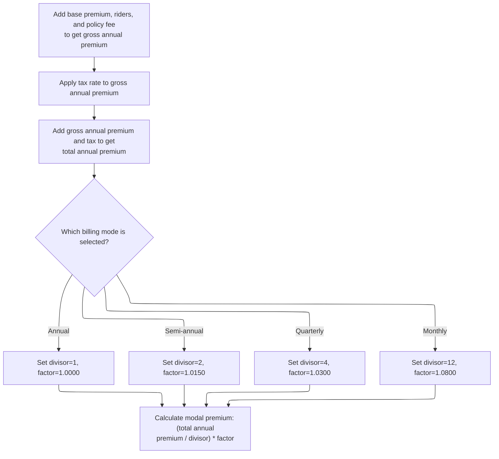

This section determines the final premium amount a policyholder pays per billing cycle by aggregating all premium components, applying tax, and adjusting for the selected billing frequency.

| Rule ID | Category        | Rule Name                               | Description                                                                                                                                                                                                                                                                                                                                                                                                                                                                                                                                                                                                                                                                                                                                                      | Implementation Details                                                                                                                                                                                                                                                                                                                                                                                                                                                                                                                                                                                            |
| ------- | --------------- | --------------------------------------- | ---------------------------------------------------------------------------------------------------------------------------------------------------------------------------------------------------------------------------------------------------------------------------------------------------------------------------------------------------------------------------------------------------------------------------------------------------------------------------------------------------------------------------------------------------------------------------------------------------------------------------------------------------------------------------------------------------------------------------------------------------------------- | ----------------------------------------------------------------------------------------------------------------------------------------------------------------------------------------------------------------------------------------------------------------------------------------------------------------------------------------------------------------------------------------------------------------------------------------------------------------------------------------------------------------------------------------------------------------------------------------------------------------- |
| BR-001  | Calculation     | Gross annual premium calculation        | The gross annual premium is calculated by summing the base annual premium, all rider premiums, and the annual policy fee.                                                                                                                                                                                                                                                                                                                                                                                                                                                                                                                                                                                                                                        | The gross annual premium is a number with two decimal places. All components are summed before any further calculations.                                                                                                                                                                                                                                                                                                                                                                                                                                                                                          |
| BR-002  | Calculation     | Tax calculation on premium              | The tax amount is calculated by multiplying the gross annual premium by the tax rate.                                                                                                                                                                                                                                                                                                                                                                                                                                                                                                                                                                                                                                                                            | The tax rate is <SwmToken path="NB-UW-001.cob" pos="126:3:5" line-data="                 MOVE 0.0200 TO PM-TAX-RATE">`0.0200`</SwmToken> for all plan terms. The tax amount is a number with two decimal places.                                                                                                                                                                                                                                                                                                                                                                                                  |
| BR-003  | Calculation     | Total annual premium calculation        | The total annual premium is calculated by adding the gross annual premium and the tax amount.                                                                                                                                                                                                                                                                                                                                                                                                                                                                                                                                                                                                                                                                    | The total annual premium is a number with two decimal places. It is the sum of gross annual premium and tax amount.                                                                                                                                                                                                                                                                                                                                                                                                                                                                                               |
| BR-004  | Calculation     | Modal premium calculation               | The modal premium is calculated by dividing the total annual premium by the divisor and multiplying by the factor determined by the billing mode.                                                                                                                                                                                                                                                                                                                                                                                                                                                                                                                                                                                                                | The modal premium is a number with two decimal places. It is calculated as (total annual premium / divisor) \* factor.                                                                                                                                                                                                                                                                                                                                                                                                                                                                                            |
| BR-005  | Decision Making | Billing mode divisor and factor mapping | The billing mode determines the divisor and factor used to calculate the modal premium. Annual mode uses divisor 1 and factor <SwmToken path="NB-UW-001.cob" pos="275:3:5" line-data="              MOVE 1.0000 TO PM-GENDER-FACTOR">`1.0000`</SwmToken>; semi-annual uses divisor 2 and factor <SwmToken path="NB-UW-001.cob" pos="421:3:5" line-data="                 MOVE 1.0150 TO WS-MODAL-FACTOR">`1.0150`</SwmToken>; quarterly uses divisor 4 and factor <SwmToken path="NB-UW-001.cob" pos="424:3:5" line-data="                 MOVE 1.0300 TO WS-MODAL-FACTOR">`1.0300`</SwmToken>; monthly uses divisor 12 and factor <SwmToken path="NB-UW-001.cob" pos="427:3:5" line-data="                 MOVE 1.0800 TO WS-MODAL-FACTOR">`1.0800`</SwmToken>. | Divisor and factor are constants: Annual (1, <SwmToken path="NB-UW-001.cob" pos="275:3:5" line-data="              MOVE 1.0000 TO PM-GENDER-FACTOR">`1.0000`</SwmToken>), Semi-annual (2, <SwmToken path="NB-UW-001.cob" pos="421:3:5" line-data="                 MOVE 1.0150 TO WS-MODAL-FACTOR">`1.0150`</SwmToken>), Quarterly (4, <SwmToken path="NB-UW-001.cob" pos="424:3:5" line-data="                 MOVE 1.0300 TO WS-MODAL-FACTOR">`1.0300`</SwmToken>), Monthly (12, <SwmToken path="NB-UW-001.cob" pos="427:3:5" line-data="                 MOVE 1.0800 TO WS-MODAL-FACTOR">`1.0800`</SwmToken>). |

<SwmSnippet path="/NB-UW-001.cob" line="400">

---

In <SwmToken path="NB-UW-001.cob" pos="400:1:7" line-data="       1800-CALCULATE-TOTAL-PREMIUM.">`1800-CALCULATE-TOTAL-PREMIUM`</SwmToken>, we sum up the base premium, rider premiums, and policy fee to get the gross annual premium. Then we calculate the tax amount based on this gross premium and add it to get the total annual premium. This sets up the final premium before adjusting for billing frequency.

```cobol
       1800-CALCULATE-TOTAL-PREMIUM.
      * NB-801: Gross annual premium includes base, riders, and fee.
           COMPUTE PM-GROSS-ANNUAL-PREMIUM ROUNDED =
                   PM-BASE-ANNUAL-PREMIUM
                 + PM-RIDER-ANNUAL-TOTAL
                 + PM-POLICY-FEE-ANNUAL

      * NB-802: Tax is calculated on the gross annual premium.
           COMPUTE PM-TAX-AMOUNT ROUNDED =
                   PM-GROSS-ANNUAL-PREMIUM * PM-TAX-RATE

           COMPUTE PM-TOTAL-ANNUAL-PREMIUM ROUNDED =
                   PM-GROSS-ANNUAL-PREMIUM + PM-TAX-AMOUNT
```

---

</SwmSnippet>

<SwmSnippet path="/NB-UW-001.cob" line="415">

---

Here we set the modal divisor and factor based on the billing mode. This determines how the annual premium is split and adjusted for payment frequency, using fixed business rules for each mode before calculating the modal premium.

```cobol
           EVALUATE TRUE
              WHEN PM-MODE-ANNUAL
                 MOVE 1 TO WS-MODAL-DIVISOR
                 MOVE 1.0000 TO WS-MODAL-FACTOR
              WHEN PM-MODE-SEMI
                 MOVE 2 TO WS-MODAL-DIVISOR
                 MOVE 1.0150 TO WS-MODAL-FACTOR
              WHEN PM-MODE-QUARTERLY
                 MOVE 4 TO WS-MODAL-DIVISOR
                 MOVE 1.0300 TO WS-MODAL-FACTOR
              WHEN PM-MODE-MONTHLY
                 MOVE 12 TO WS-MODAL-DIVISOR
                 MOVE 1.0800 TO WS-MODAL-FACTOR
           END-EVALUATE
```

---

</SwmSnippet>

<SwmSnippet path="/NB-UW-001.cob" line="430">

---

Finally we calculate the modal premium by dividing the total annual premium by the divisor and multiplying by the modal factor. This gives the actual premium amount the customer pays per billing cycle, adjusted for frequency.

```cobol
           COMPUTE PM-MODAL-PREMIUM ROUNDED =
                   (PM-TOTAL-ANNUAL-PREMIUM / WS-MODAL-DIVISOR)
                 * WS-MODAL-FACTOR.
```

---

</SwmSnippet>

## Checking for referral or manual underwriting

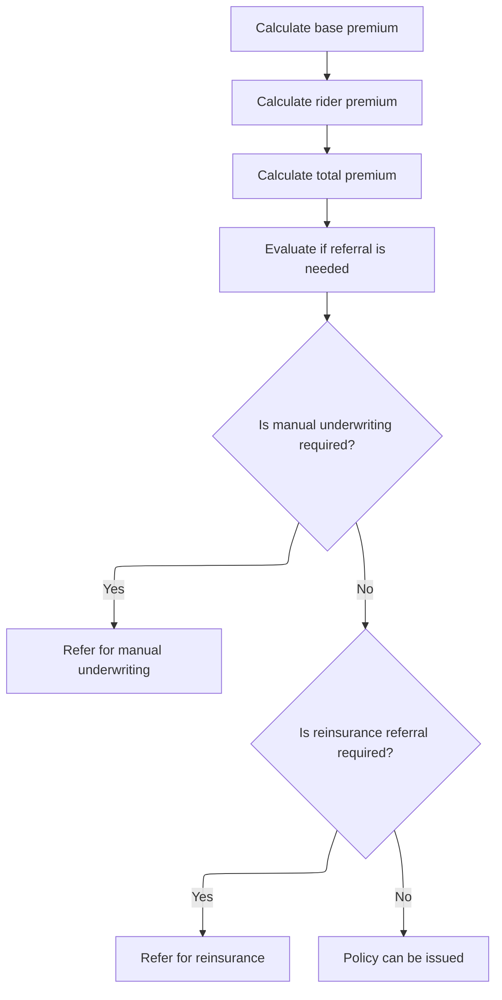

This section evaluates whether a policy application should be referred for manual underwriting or reinsurance review based on business-defined thresholds and criteria. It ensures that high-risk or high-coverage cases are flagged for additional review before policy issuance.

| Rule ID | Category        | Rule Name                        | Description                                                                                                                                                               | Implementation Details                                                                                                                                                                                                 |
| ------- | --------------- | -------------------------------- | ------------------------------------------------------------------------------------------------------------------------------------------------------------------------- | ---------------------------------------------------------------------------------------------------------------------------------------------------------------------------------------------------------------------- |
| BR-001  | Decision Making | Manual underwriting referral     | If the policy application meets criteria for manual underwriting referral, the case is flagged for manual underwriting review before proceeding.                          | The criteria for manual underwriting referral are based on business thresholds, which may include age, sum assured, or other risk factors. The output is a referral status indicating manual underwriting is required. |
| BR-002  | Decision Making | Reinsurance referral             | If the policy application does not require manual underwriting but meets criteria for reinsurance referral, the case is flagged for reinsurance review before proceeding. | The criteria for reinsurance referral are based on business thresholds, which may include sum assured or other risk factors. The output is a referral status indicating reinsurance review is required.                |
| BR-003  | Decision Making | Policy issuance without referral | If the policy application does not require manual underwriting or reinsurance referral, the policy can proceed to issuance.                                               | If no referral is required, the output is a status indicating the policy can be issued. No additional review is triggered.                                                                                             |

<SwmSnippet path="/NB-UW-001.cob" line="68">

---

After calculating the total premium in <SwmToken path="NB-UW-001.cob" pos="42:1:3" line-data="       MAIN-PROCESS.">`MAIN-PROCESS`</SwmToken>, we call <SwmToken path="NB-UW-001.cob" pos="71:3:7" line-data="           PERFORM 1900-EVALUATE-REFERRALS">`1900-EVALUATE-REFERRALS`</SwmToken> to check if the policy needs manual underwriting or reinsurance review. This step uses risk and coverage thresholds to flag cases for referral before moving to policy issuance.

```cobol
           PERFORM 1600-CALCULATE-BASE-PREMIUM
           PERFORM 1700-CALCULATE-RIDER-PREMIUM
           PERFORM 1800-CALCULATE-TOTAL-PREMIUM
           PERFORM 1900-EVALUATE-REFERRALS
```

---

</SwmSnippet>

## Flagging cases for review or reinsurance

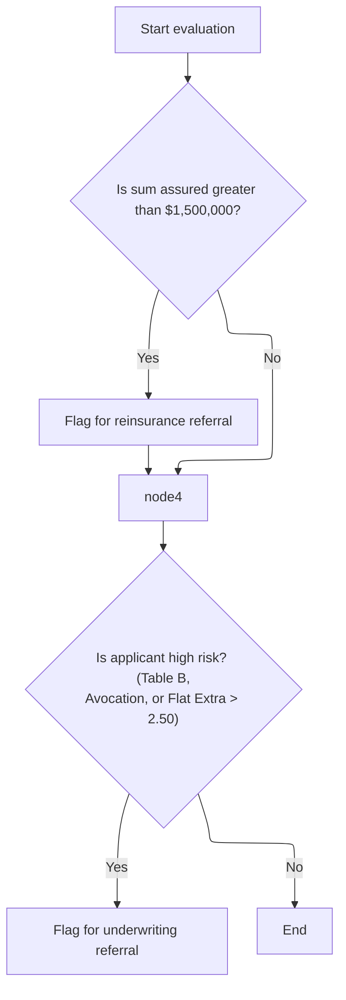

This section determines if a policy application should be flagged for reinsurance or underwriting review based on sum assured and risk factors. The referral flags guide subsequent manual review processes.

| Rule ID | Category        | Rule Name                              | Description                                                                                                                                                                         | Implementation Details                                                                                                                                                                                                                                                                     |
| ------- | --------------- | -------------------------------------- | ----------------------------------------------------------------------------------------------------------------------------------------------------------------------------------- | ------------------------------------------------------------------------------------------------------------------------------------------------------------------------------------------------------------------------------------------------------------------------------------------ |
| BR-001  | Decision Making | Large sum assured reinsurance referral | Flag the policy for reinsurance referral if the sum assured is greater than $1,500,000.                                                                                             | The threshold for sum assured is $1,500,000. The output is a referral flag set to 'Y' (yes) when the condition is met. The flag is used by downstream processes to determine if reinsurance review is required.                                                                            |
| BR-002  | Decision Making | High risk underwriting referral        | Flag the policy for underwriting referral if the applicant is high risk, defined as having underwriting class Table B, high-risk avocation, or a flat extra rate greater than 2.50. | The underwriting class Table B, high-risk avocation indicator, and flat extra rate threshold of 2.50 are the criteria. The output is a referral flag set to 'Y' (yes) when any condition is met. The flag is used by downstream processes to determine if underwriting review is required. |

<SwmSnippet path="/NB-UW-001.cob" line="434">

---

We check sum assured and risk factors to flag policies for reinsurance or underwriting review.

```cobol
       1900-EVALUATE-REFERRALS.
      * NB-901: Large cases require facultative reinsurance review.
           IF PM-SUM-ASSURED > 0001500000000.00
              MOVE 'Y' TO WS-REINSURANCE-REFERRAL
           END-IF
```

---

</SwmSnippet>

<SwmSnippet path="/NB-UW-001.cob" line="441">

---

After checking thresholds and risk factors, we set referral flags for reinsurance or underwriting review. These flags are used by <SwmToken path="NB-UW-001.cob" pos="42:1:3" line-data="       MAIN-PROCESS.">`MAIN-PROCESS`</SwmToken> to decide if the policy needs manual handling or can be issued directly.

```cobol
           IF PM-UW-TABLE-B OR PM-HIGH-RISK-AVOC OR
              PM-FLAT-EXTRA-RATE > 00002.50
              MOVE 'Y' TO WS-UW-REFERRAL
           END-IF.
```

---

</SwmSnippet>

## Finalizing underwriting outcome

This section determines the final underwriting outcome for a policy. It either refers the policy for manual review or issues it, updating all relevant status fields and dates accordingly.

| Rule ID | Category        | Rule Name                            | Description                                                                                                                                                                                                                                                                                                                    | Implementation Details                                                                                                                                                                                                                                                                                       |
| ------- | --------------- | ------------------------------------ | ------------------------------------------------------------------------------------------------------------------------------------------------------------------------------------------------------------------------------------------------------------------------------------------------------------------------------ | ------------------------------------------------------------------------------------------------------------------------------------------------------------------------------------------------------------------------------------------------------------------------------------------------------------ |
| BR-001  | Calculation     | Policy issuance and date calculation | If no referral is detected, the policy is issued successfully. All key policy dates (issue, effective, paid-to, last maintenance) are set to the process date. The expiry date is calculated by adding the term years times 365 days to the effective date, ignoring leap years. The contract status is set to 'AC' (active).  | All key policy dates are set to the process date (8-digit number, YYYYMMDD). The expiry date is calculated as effective date plus (term years \* 365 days), formatted as an 8-digit number (YYYYMMDD). The contract status is set to 'AC' (active). Leap years are not considered in the expiry calculation. |
| BR-002  | Decision Making | Referral outcome handling            | If a referral for manual underwriting or reinsurance is detected, the policy is not issued. Instead, the result code is set to 2, the result message is set to 'REFERRED FOR MANUAL UW OR REINSURANCE REVIEW', and the contract status is set to 'PE' (pending). The process then exits, routing the policy for manual review. | The result code is set to 2 (number). The result message is set to the string 'REFERRED FOR MANUAL UW OR REINSURANCE REVIEW'. The contract status is set to 'PE' (pending).                                                                                                                                  |
| BR-003  | Writing Output  | Successful issuance outcome          | After issuing the policy, the result code is set to 0 and the result message is set to 'POLICY ISSUED SUCCESSFULLY'. The process then calls the success handler and exits, indicating a successful underwriting outcome.                                                                                                       | The result code is set to 0 (number). The result message is set to the string 'POLICY ISSUED SUCCESSFULLY'.                                                                                                                                                                                                  |

<SwmSnippet path="/NB-UW-001.cob" line="73">

---

After returning from <SwmToken path="NB-UW-001.cob" pos="71:3:7" line-data="           PERFORM 1900-EVALUATE-REFERRALS">`1900-EVALUATE-REFERRALS`</SwmToken>, <SwmToken path="NB-UW-001.cob" pos="42:1:3" line-data="       MAIN-PROCESS.">`MAIN-PROCESS`</SwmToken> checks if referral flags are set. If so, it updates the result code and message, marks the contract as pending, and exits, routing the policy for manual review instead of issuing it.

```cobol
           IF WS-REFERRED OR WS-MANUAL-UW
              MOVE 2 TO WS-RESULT-CODE
              MOVE "REFERRED FOR MANUAL UW OR REINSURANCE REVIEW"
                TO WS-RESULT-MESSAGE
              MOVE "PE" TO PM-CONTRACT-STATUS
              PERFORM 9100-RETURN-SUCCESS
              GOBACK
           END-IF
```

---

</SwmSnippet>

<SwmSnippet path="/NB-UW-001.cob" line="82">

---

<SwmToken path="NB-UW-001.cob" pos="42:1:3" line-data="       MAIN-PROCESS.">`MAIN-PROCESS`</SwmToken> calls <SwmToken path="NB-UW-001.cob" pos="82:3:7" line-data="           PERFORM 2000-ISSUE-POLICY">`2000-ISSUE-POLICY`</SwmToken> to finalize and activate the policy.

```cobol
           PERFORM 2000-ISSUE-POLICY
```

---

</SwmSnippet>

<SwmSnippet path="/NB-UW-001.cob" line="446">

---

<SwmToken path="NB-UW-001.cob" pos="446:1:5" line-data="       2000-ISSUE-POLICY.">`2000-ISSUE-POLICY`</SwmToken> sets all key policy dates to the process date, calculates the expiry date by adding term years times 365 days, and marks the contract as active. This finalizes the policy record for issuance, but ignores leap years in expiry calculation.

```cobol
       2000-ISSUE-POLICY.
      * NB-1001: Successful issue sets policy active and populates dates.
           MOVE PM-PROCESS-DATE TO PM-ISSUE-DATE
                                 PM-EFFECTIVE-DATE
                                 PM-PAID-TO-DATE
                                 PM-LAST-MAINT-DATE
           COMPUTE WS-DATE-INT = FUNCTION INTEGER-OF-DATE(PM-EFFECTIVE-DATE)
                               + (PM-TERM-YEARS * 365)
           MOVE FUNCTION DATE-OF-INTEGER(WS-DATE-INT) TO PM-EXPIRY-DATE
           MOVE "AC" TO PM-CONTRACT-STATUS.
```

---

</SwmSnippet>

<SwmSnippet path="/NB-UW-001.cob" line="83">

---

After returning from <SwmToken path="NB-UW-001.cob" pos="82:3:7" line-data="           PERFORM 2000-ISSUE-POLICY">`2000-ISSUE-POLICY`</SwmToken>, <SwmToken path="NB-UW-001.cob" pos="42:1:3" line-data="       MAIN-PROCESS.">`MAIN-PROCESS`</SwmToken> sets the result code and message for successful issuance, calls the success handler, and exits. This wraps up the flow, using domain-specific codes and messages to indicate the underwriting outcome.

```cobol
           MOVE 0 TO WS-RESULT-CODE
           MOVE "POLICY ISSUED SUCCESSFULLY" TO WS-RESULT-MESSAGE
           PERFORM 9100-RETURN-SUCCESS
           GOBACK.
```

---

</SwmSnippet>

&nbsp;

*This is an auto-generated document by Swimm 🌊 and has not yet been verified by a human*

<SwmMeta version="3.0.0" repo-id="Z2l0aHViJTNBJTNBQ09CT0xfU2FtcGxlX01hcmNoXzIwMjYlM0ElM0FtdWRhc2luMQ==" repo-name="COBOL_Sample_March_2026"><sup>Powered by [Swimm](https://app.swimm.io/)</sup></SwmMeta>
