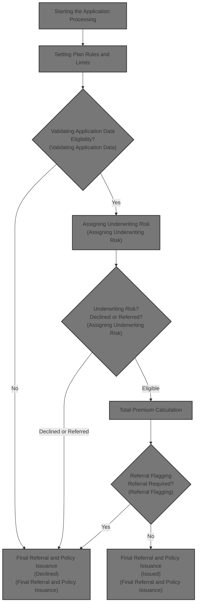

# Overview

This document describes the flow for processing new term life insurance applications. The flow validates eligibility, assigns risk, calculates premiums, checks rider eligibility, and determines whether the policy is issued, referred, or declined.

## Dependencies

### Program

- NBUW001 (<SwmPath>[NB-UW-001.cob](NB-UW-001.cob)</SwmPath>)

### Copybook

- POLDATA (<SwmPath>[POLDATA.cpy](POLDATA.cpy)</SwmPath>)

&nbsp;

*This is an auto-generated document by Swimm 🌊 and has not yet been verified by a human*

<SwmMeta version="3.0.0" repo-id="Z2l0aHViJTNBJTNBQ09CT0xfU2FtcGxlX01hcmNoXzIwMjYlM0ElM0FtdWRhc2luMQ==" repo-name="COBOL_Sample_March_2026">Powered by [Swimm](https://app.swimm.io/)</SwmMeta>
