# Overview

This document explains the flow for evaluating new term life insurance applications. The process checks eligibility, assigns risk category, calculates premiums, validates riders, and determines whether the policy is issued, referred, or declined. The flow receives application data and outputs the policy status and calculated premiums.

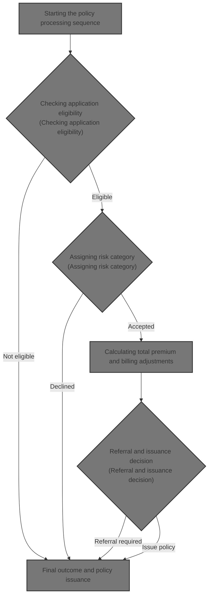

## Dependencies

### Program

- <SwmToken path="NB-UW-001.cob" pos="2:6:6" line-data="       PROGRAM-ID. NBUW001.">`NBUW001`</SwmToken> (<SwmPath>[NB-UW-001.cob](NB-UW-001.cob)</SwmPath>)

### Copybook

- POLDATA (<SwmPath>[POLDATA.cpy](POLDATA.cpy)</SwmPath>)

# Workflow

# Starting the policy processing sequence

```mermaid
%%{init: {"flowchart": {"defaultRenderer": "elk"}} }%%
flowchart TD
    node1["Start: Initialize and load plan
parameters"]
    click node1 openCode "NB-UW-001.cob:42:44"
    node1 --> node2["Checking application eligibility"]
    
    node2 --> node3{"Is application valid? (WS-RESULT-CODE =
0)"}
    click node3 openCode "NB-UW-001.cob:46:49"
    node3 -->|"No"| node4["Return error and stop"]
    click node4 openCode "NB-UW-001.cob:47:49"
    node3 -->|"Yes"| node5["Assigning risk category"]
    
    node5 --> node6{"Declined by underwriting?
(PM-UW-DECLINE)"}
    click node6 openCode "NB-UW-001.cob:52:59"
    node6 -->|"Yes"| node4
    node6 -->|"No"| node7["Setting pricing multipliers"]
    
    node7 --> node8{"Rider validation error? (WS-RESULT-CODE
= 0)"}
    
    node8 -->|"No"| node4
    node8 -->|"Yes"| node9["Calculate all premiums"]
    click node9 openCode "NB-UW-001.cob:68:71"
    node9 --> node10["Calculating rider premiums"]
    
    node10 --> node11{"Manual UW or Reinsurance referral?
(WS-REFERRED or WS-MANUAL-UW)"}
    
    node11 -->|"Yes"| node12["Referral checks for high-risk cases"]
    
    node11 -->|"No"| node13["Set status to Active, return issued,
stop"]
    click node13 openCode "NB-UW-001.cob:83:86"
classDef HeadingStyle fill:#777777,stroke:#333,stroke-width:2px;
click node2 goToHeading "Checking application eligibility"
node2:::HeadingStyle
click node5 goToHeading "Assigning risk category"
node5:::HeadingStyle
click node7 goToHeading "Setting pricing multipliers"
node7:::HeadingStyle
click node8 goToHeading "Enforcing rider rules"
node8:::HeadingStyle
click node10 goToHeading "Calculating rider premiums"
node10:::HeadingStyle
click node11 goToHeading "Calculating total premium and billing adjustments"
node11:::HeadingStyle
click node12 goToHeading "Referral checks for high-risk cases"
node12:::HeadingStyle

%% Swimm:
%% %%{init: {"flowchart": {"defaultRenderer": "elk"}} }%%
%% flowchart TD
%%     node1["Start: Initialize and load plan
%% parameters"]
%%     click node1 openCode "<SwmPath>[NB-UW-001.cob](NB-UW-001.cob)</SwmPath>:42:44"
%%     node1 --> node2["Checking application eligibility"]
%%     
%%     node2 --> node3{"Is application valid? (<SwmToken path="NB-UW-001.cob" pos="46:3:7" line-data="           IF WS-RESULT-CODE NOT = 0">`WS-RESULT-CODE`</SwmToken> =
%% 0)"}
%%     click node3 openCode "<SwmPath>[NB-UW-001.cob](NB-UW-001.cob)</SwmPath>:46:49"
%%     node3 -->|"No"| node4["Return error and stop"]
%%     click node4 openCode "<SwmPath>[NB-UW-001.cob](NB-UW-001.cob)</SwmPath>:47:49"
%%     node3 -->|"Yes"| node5["Assigning risk category"]
%%     
%%     node5 --> node6{"Declined by underwriting?
%% (<SwmToken path="NB-UW-001.cob" pos="52:3:7" line-data="           IF PM-UW-DECLINE">`PM-UW-DECLINE`</SwmToken>)"}
%%     click node6 openCode "<SwmPath>[NB-UW-001.cob](NB-UW-001.cob)</SwmPath>:52:59"
%%     node6 -->|"Yes"| node4
%%     node6 -->|"No"| node7["Setting pricing multipliers"]
%%     
%%     node7 --> node8{"Rider validation error? (<SwmToken path="NB-UW-001.cob" pos="46:3:7" line-data="           IF WS-RESULT-CODE NOT = 0">`WS-RESULT-CODE`</SwmToken>
%% = 0)"}
%%     
%%     node8 -->|"No"| node4
%%     node8 -->|"Yes"| node9["Calculate all premiums"]
%%     click node9 openCode "<SwmPath>[NB-UW-001.cob](NB-UW-001.cob)</SwmPath>:68:71"
%%     node9 --> node10["Calculating rider premiums"]
%%     
%%     node10 --> node11{"Manual UW or Reinsurance referral?
%% (<SwmToken path="NB-UW-001.cob" pos="73:3:5" line-data="           IF WS-REFERRED OR WS-MANUAL-UW">`WS-REFERRED`</SwmToken> or <SwmToken path="NB-UW-001.cob" pos="73:9:13" line-data="           IF WS-REFERRED OR WS-MANUAL-UW">`WS-MANUAL-UW`</SwmToken>)"}
%%     
%%     node11 -->|"Yes"| node12["Referral checks for high-risk cases"]
%%     
%%     node11 -->|"No"| node13["Set status to Active, return issued,
%% stop"]
%%     click node13 openCode "<SwmPath>[NB-UW-001.cob](NB-UW-001.cob)</SwmPath>:83:86"
%% classDef HeadingStyle fill:#777777,stroke:#333,stroke-width:2px;
%% click node2 goToHeading "Checking application eligibility"
%% node2:::HeadingStyle
%% click node5 goToHeading "Assigning risk category"
%% node5:::HeadingStyle
%% click node7 goToHeading "Setting pricing multipliers"
%% node7:::HeadingStyle
%% click node8 goToHeading "Enforcing rider rules"
%% node8:::HeadingStyle
%% click node10 goToHeading "Calculating rider premiums"
%% node10:::HeadingStyle
%% click node11 goToHeading "Calculating total premium and billing adjustments"
%% node11:::HeadingStyle
%% click node12 goToHeading "Referral checks for high-risk cases"
%% node12:::HeadingStyle
```

This section manages the end-to-end process for new policy application evaluation, including eligibility checks, risk assessment, pricing, and final status assignment. It ensures that only valid, eligible applications proceed to issuance, and that declined or referred cases are handled according to business rules.

| Rule ID | Category        | Rule Name                        | Description                                                                                                                      | Implementation Details                                                                                                                         |
| ------- | --------------- | -------------------------------- | -------------------------------------------------------------------------------------------------------------------------------- | ---------------------------------------------------------------------------------------------------------------------------------------------- |
| BR-001  | Data validation | Eligibility failure stop         | If the application fails eligibility validation, the process stops and an error is returned.                                     | The result code is a number. The error message is a string. The process does not proceed to risk assessment if validation fails.               |
| BR-002  | Data validation | Rider validation failure stop    | If rider validation fails, the process stops and an error is returned.                                                           | The result code is a number. The error message is a string. The process does not proceed to premium calculation if rider validation fails.     |
| BR-003  | Decision Making | Underwriting decline stop        | If the application is declined by underwriting, the process stops and an error is returned.                                      | The underwriting class code 'DP' indicates a declined application. The process does not proceed to pricing or premium calculation if declined. |
| BR-004  | Decision Making | Referral check for flagged cases | If the case is flagged for manual underwriting or reinsurance referral, referral checks are performed before proceeding.         | The referral indicators are single-character flags. Referral checks are performed for high-risk cases before finalizing the policy status.     |
| BR-005  | Writing Output  | Policy activation on success     | If all validations pass and no referral is required, the policy status is set to Active and the process completes with issuance. | The policy status is set to 'AC' (Active). The process completes with the policy issued.                                                       |

<SwmSnippet path="/NB-UW-001.cob" line="42">

---

In <SwmToken path="NB-UW-001.cob" pos="42:1:3" line-data="       MAIN-PROCESS.">`MAIN-PROCESS`</SwmToken>, we kick off by initializing the policy record and loading plan-specific parameters. Right after that, we call <SwmToken path="NB-UW-001.cob" pos="45:3:7" line-data="           PERFORM 1200-VALIDATE-APPLICATION">`1200-VALIDATE-APPLICATION`</SwmToken> because we need to check the application data against the plan rules we just loaded. The function depends on global variables for state, so the validation step uses those updated values to decide if the application can proceed. If validation fails, the flow stops here; otherwise, we move on to risk assessment.

```cobol
       MAIN-PROCESS.
           PERFORM 1000-INITIALIZE
           PERFORM 1100-LOAD-PLAN-PARAMETERS
           PERFORM 1200-VALIDATE-APPLICATION
```

---

</SwmSnippet>

## Checking application eligibility

```mermaid
%%{init: {"flowchart": {"defaultRenderer": "elk"}} }%%
flowchart TD
    node1["Start application validation"]
    click node1 openCode "NB-UW-001.cob:164:165"
    node1 --> node2{"Is policy ID provided?"}
    click node2 openCode "NB-UW-001.cob:166:170"
    node2 -->|"No"| node10["Reject: Policy ID is required"]
    click node10 openCode "NB-UW-001.cob:167:169"
    node2 -->|"Yes"| node3{"Is insured name provided?"}
    click node3 openCode "NB-UW-001.cob:171:175"
    node3 -->|"No"| node11["Reject: Insured name is required"]
    click node11 openCode "NB-UW-001.cob:172:174"
    node3 -->|"Yes"| node4{"Is gender code valid? (male/female)"}
    click node4 openCode "NB-UW-001.cob:176:180"
    node4 -->|"No"| node12["Reject: Invalid gender code"]
    click node12 openCode "NB-UW-001.cob:177:179"
    node4 -->|"Yes"| node5{"Is smoker indicator valid?
(smoker/non-smoker)"}
    click node5 openCode "NB-UW-001.cob:181:185"
    node5 -->|"No"| node13["Reject: Invalid smoker indicator"]
    click node13 openCode "NB-UW-001.cob:182:184"
    node5 -->|"Yes"| node6{"Is billing mode valid?
(annual/semi/quarterly/monthly)"}
    click node6 openCode "NB-UW-001.cob:186:191"
    node6 -->|"No"| node14["Reject: Invalid billing mode"]
    click node14 openCode "NB-UW-001.cob:188:190"
    node6 -->|"Yes"| node7{"Is insured age at issue within plan
limits?"}
    click node7 openCode "NB-UW-001.cob:194:199"
    node7 -->|"No"| node15["Reject: Issue age outside plan limits"]
    click node15 openCode "NB-UW-001.cob:196:198"
    node7 -->|"Yes"| node8{"Is sum assured within plan limits?"}
    click node8 openCode "NB-UW-001.cob:202:208"
    node8 -->|"No"| node16["Reject: Sum assured outside plan
limits"]
    click node16 openCode "NB-UW-001.cob:204:207"
    node8 -->|"Yes"| node9{"Does term exceed allowed maturity age?"}
    click node9 openCode "NB-UW-001.cob:211:216"
    node9 -->|"Yes"| node17["Reject: Term exceeds allowed maturity
age"]
    click node17 openCode "NB-UW-001.cob:212:215"
    node9 -->|"No"| node18{"Is plan T65 with hazardous occupation?"}
    click node18 openCode "NB-UW-001.cob:219:224"
    node18 -->|"Yes"| node19["Reject: T65 not available for hazardous
occupation"]
    click node19 openCode "NB-UW-001.cob:220:223"
    node18 -->|"No"| node20{"Is occupation severe?"}
    click node20 openCode "NB-UW-001.cob:227:229"
    node20 -->|"Yes"| node21["Set underwriting class to DP"]
    click node21 openCode "NB-UW-001.cob:228:228"
    node21 --> node22["Accept application"]
    click node22 openCode "NB-UW-001.cob:229:229"
    node20 -->|"No"| node22
classDef HeadingStyle fill:#777777,stroke:#333,stroke-width:2px;

%% Swimm:
%% %%{init: {"flowchart": {"defaultRenderer": "elk"}} }%%
%% flowchart TD
%%     node1["Start application validation"]
%%     click node1 openCode "<SwmPath>[NB-UW-001.cob](NB-UW-001.cob)</SwmPath>:164:165"
%%     node1 --> node2{"Is policy ID provided?"}
%%     click node2 openCode "<SwmPath>[NB-UW-001.cob](NB-UW-001.cob)</SwmPath>:166:170"
%%     node2 -->|"No"| node10["Reject: Policy ID is required"]
%%     click node10 openCode "<SwmPath>[NB-UW-001.cob](NB-UW-001.cob)</SwmPath>:167:169"
%%     node2 -->|"Yes"| node3{"Is insured name provided?"}
%%     click node3 openCode "<SwmPath>[NB-UW-001.cob](NB-UW-001.cob)</SwmPath>:171:175"
%%     node3 -->|"No"| node11["Reject: Insured name is required"]
%%     click node11 openCode "<SwmPath>[NB-UW-001.cob](NB-UW-001.cob)</SwmPath>:172:174"
%%     node3 -->|"Yes"| node4{"Is gender code valid? (male/female)"}
%%     click node4 openCode "<SwmPath>[NB-UW-001.cob](NB-UW-001.cob)</SwmPath>:176:180"
%%     node4 -->|"No"| node12["Reject: Invalid gender code"]
%%     click node12 openCode "<SwmPath>[NB-UW-001.cob](NB-UW-001.cob)</SwmPath>:177:179"
%%     node4 -->|"Yes"| node5{"Is smoker indicator valid?
%% (smoker/non-smoker)"}
%%     click node5 openCode "<SwmPath>[NB-UW-001.cob](NB-UW-001.cob)</SwmPath>:181:185"
%%     node5 -->|"No"| node13["Reject: Invalid smoker indicator"]
%%     click node13 openCode "<SwmPath>[NB-UW-001.cob](NB-UW-001.cob)</SwmPath>:182:184"
%%     node5 -->|"Yes"| node6{"Is billing mode valid?
%% (annual/semi/quarterly/monthly)"}
%%     click node6 openCode "<SwmPath>[NB-UW-001.cob](NB-UW-001.cob)</SwmPath>:186:191"
%%     node6 -->|"No"| node14["Reject: Invalid billing mode"]
%%     click node14 openCode "<SwmPath>[NB-UW-001.cob](NB-UW-001.cob)</SwmPath>:188:190"
%%     node6 -->|"Yes"| node7{"Is insured age at issue within plan
%% limits?"}
%%     click node7 openCode "<SwmPath>[NB-UW-001.cob](NB-UW-001.cob)</SwmPath>:194:199"
%%     node7 -->|"No"| node15["Reject: Issue age outside plan limits"]
%%     click node15 openCode "<SwmPath>[NB-UW-001.cob](NB-UW-001.cob)</SwmPath>:196:198"
%%     node7 -->|"Yes"| node8{"Is sum assured within plan limits?"}
%%     click node8 openCode "<SwmPath>[NB-UW-001.cob](NB-UW-001.cob)</SwmPath>:202:208"
%%     node8 -->|"No"| node16["Reject: Sum assured outside plan
%% limits"]
%%     click node16 openCode "<SwmPath>[NB-UW-001.cob](NB-UW-001.cob)</SwmPath>:204:207"
%%     node8 -->|"Yes"| node9{"Does term exceed allowed maturity age?"}
%%     click node9 openCode "<SwmPath>[NB-UW-001.cob](NB-UW-001.cob)</SwmPath>:211:216"
%%     node9 -->|"Yes"| node17["Reject: Term exceeds allowed maturity
%% age"]
%%     click node17 openCode "<SwmPath>[NB-UW-001.cob](NB-UW-001.cob)</SwmPath>:212:215"
%%     node9 -->|"No"| node18{"Is plan <SwmToken path="NB-UW-001.cob" pos="221:4:4" line-data="              MOVE &quot;T65 NOT AVAILABLE FOR HAZARDOUS OCCUPATION&quot;">`T65`</SwmToken> with hazardous occupation?"}
%%     click node18 openCode "<SwmPath>[NB-UW-001.cob](NB-UW-001.cob)</SwmPath>:219:224"
%%     node18 -->|"Yes"| node19["Reject: <SwmToken path="NB-UW-001.cob" pos="221:4:4" line-data="              MOVE &quot;T65 NOT AVAILABLE FOR HAZARDOUS OCCUPATION&quot;">`T65`</SwmToken> not available for hazardous
%% occupation"]
%%     click node19 openCode "<SwmPath>[NB-UW-001.cob](NB-UW-001.cob)</SwmPath>:220:223"
%%     node18 -->|"No"| node20{"Is occupation severe?"}
%%     click node20 openCode "<SwmPath>[NB-UW-001.cob](NB-UW-001.cob)</SwmPath>:227:229"
%%     node20 -->|"Yes"| node21["Set underwriting class to DP"]
%%     click node21 openCode "<SwmPath>[NB-UW-001.cob](NB-UW-001.cob)</SwmPath>:228:228"
%%     node21 --> node22["Accept application"]
%%     click node22 openCode "<SwmPath>[NB-UW-001.cob](NB-UW-001.cob)</SwmPath>:229:229"
%%     node20 -->|"No"| node22
%% classDef HeadingStyle fill:#777777,stroke:#333,stroke-width:2px;
```

This section determines whether a new insurance application meets all business eligibility requirements before proceeding to underwriting or issuance.

| Rule ID | Category        | Rule Name                                                                                                                                                                            | Description                                                                                                                                                                                                                         | Implementation Details                                                                                                                                                                                                                                                                        |
| ------- | --------------- | ------------------------------------------------------------------------------------------------------------------------------------------------------------------------------------ | ----------------------------------------------------------------------------------------------------------------------------------------------------------------------------------------------------------------------------------- | --------------------------------------------------------------------------------------------------------------------------------------------------------------------------------------------------------------------------------------------------------------------------------------------- |
| BR-001  | Data validation | Policy ID required                                                                                                                                                                   | Reject the application if the policy ID is not provided.                                                                                                                                                                            | Policy ID must be a non-empty string of up to 12 characters. Error code is 12, message is 'POLICY ID IS REQUIRED'.                                                                                                                                                                            |
| BR-002  | Data validation | Insured name required                                                                                                                                                                | Reject the application if the insured name is not provided.                                                                                                                                                                         | Insured name must be a non-empty string of up to 50 characters (based on typical name field sizes). Error code is 13, message is 'INSURED NAME IS REQUIRED'.                                                                                                                                  |
| BR-003  | Data validation | Valid gender code                                                                                                                                                                    | Reject the application if the gender code is invalid (not male or female).                                                                                                                                                          | Gender code must be 'M' or 'F'. Error code is 14, message is 'INVALID GENDER CODE'.                                                                                                                                                                                                           |
| BR-004  | Data validation | Valid smoker indicator                                                                                                                                                               | Reject the application if the smoker indicator is invalid (not smoker or non-smoker).                                                                                                                                               | Smoker indicator must be 'S' or 'N'. Error code is 15, message is 'INVALID SMOKER INDICATOR'.                                                                                                                                                                                                 |
| BR-005  | Data validation | Valid billing mode                                                                                                                                                                   | Reject the application if the billing mode is invalid (not annual, semi, quarterly, or monthly).                                                                                                                                    | Billing mode must be 'A', 'S', 'Q', or 'M'. Error code is 16, message is 'INVALID BILLING MODE'.                                                                                                                                                                                              |
| BR-006  | Data validation | Issue age within plan limits                                                                                                                                                         | Reject the application if the insured's age at issue is outside the plan's minimum and maximum age limits.                                                                                                                          | Minimum issue age is 18 for all plans. Maximum issue age is 60 for T1001, 55 for T2001, 50 for T6501. Error code is 17, message is 'ISSUE AGE OUTSIDE PLAN LIMITS'.                                                                                                                           |
| BR-007  | Data validation | Sum assured within plan limits                                                                                                                                                       | Reject the application if the sum assured is outside the plan's minimum and maximum limits.                                                                                                                                         | Minimum sum assured is 10,000,000,000.00 for all plans. Maximum sum assured is 100,000,000,000.00 for T1001, 200,000,000,000.00 for T2001, 150,000,000,000.00 for T6501. Error code is 18, message is 'SUM ASSURED OUTSIDE PLAN LIMITS'.                                                      |
| BR-008  | Data validation | Term within maturity age                                                                                                                                                             | Reject the application if the policy term plus issue age exceeds the plan's allowed maturity age.                                                                                                                                   | Maturity age is 70 for T1001, 75 for T2001, 65 for T6501. Error code is 19, message is 'TERM EXCEEDS ALLOWED MATURITY AGE'.                                                                                                                                                                   |
| BR-009  | Data validation | <SwmToken path="NB-UW-001.cob" pos="221:4:4" line-data="              MOVE &quot;T65 NOT AVAILABLE FOR HAZARDOUS OCCUPATION&quot;">`T65`</SwmToken> hazardous occupation restriction | Reject the application if the <SwmToken path="NB-UW-001.cob" pos="221:4:4" line-data="              MOVE &quot;T65 NOT AVAILABLE FOR HAZARDOUS OCCUPATION&quot;">`T65`</SwmToken> plan is selected and the occupation is hazardous. | Plan code T6501 is not available for hazardous occupation class 3. Error code is 20, message is '<SwmToken path="NB-UW-001.cob" pos="221:4:4" line-data="              MOVE &quot;T65 NOT AVAILABLE FOR HAZARDOUS OCCUPATION&quot;">`T65`</SwmToken> NOT AVAILABLE FOR HAZARDOUS OCCUPATION'. |
| BR-010  | Decision Making | Severe occupation underwriting class                                                                                                                                                 | Set the underwriting class to 'DP' if the occupation class is severe.                                                                                                                                                               | If occupation class is severe, underwriting class is set to 'DP'.                                                                                                                                                                                                                             |

<SwmSnippet path="/NB-UW-001.cob" line="164">

---

In <SwmToken path="NB-UW-001.cob" pos="164:1:5" line-data="       1200-VALIDATE-APPLICATION.">`1200-VALIDATE-APPLICATION`</SwmToken>, we start by checking if the policy ID is present. If it's missing, we set a specific error code and message, then exit right away. This early exit pattern is used throughout the function to catch and report the first validation failure.

```cobol
       1200-VALIDATE-APPLICATION.
      * NB-201: Basic mandatory field checks.
           IF PM-POLICY-ID = SPACES
              MOVE 12 TO WS-RESULT-CODE
              MOVE "POLICY ID IS REQUIRED" TO WS-RESULT-MESSAGE
              EXIT PARAGRAPH
           END-IF
```

---

</SwmSnippet>

<SwmSnippet path="/NB-UW-001.cob" line="171">

---

After checking policy ID, we immediately check if the insured name is present. If it's missing, we set a new error code and message, then exit. Each check is sequential and only the first failure is reported.

```cobol
           IF PM-INSURED-NAME = SPACES
              MOVE 13 TO WS-RESULT-CODE
              MOVE "INSURED NAME IS REQUIRED" TO WS-RESULT-MESSAGE
              EXIT PARAGRAPH
           END-IF
```

---

</SwmSnippet>

<SwmSnippet path="/NB-UW-001.cob" line="176">

---

After mandatory fields, we check gender using <SwmToken path="NB-UW-001.cob" pos="176:5:7" line-data="           IF NOT PM-MALE AND NOT PM-FEMALE">`PM-MALE`</SwmToken> and <SwmToken path="NB-UW-001.cob" pos="176:13:15" line-data="           IF NOT PM-MALE AND NOT PM-FEMALE">`PM-FEMALE`</SwmToken> flags. If neither is set, we flag it as an invalid gender code and exit. This prevents invalid gender values from affecting later calculations.

```cobol
           IF NOT PM-MALE AND NOT PM-FEMALE
              MOVE 14 TO WS-RESULT-CODE
              MOVE "INVALID GENDER CODE" TO WS-RESULT-MESSAGE
              EXIT PARAGRAPH
           END-IF
```

---

</SwmSnippet>

<SwmSnippet path="/NB-UW-001.cob" line="181">

---

Right after gender, we check smoker status using <SwmToken path="NB-UW-001.cob" pos="181:5:7" line-data="           IF NOT PM-SMOKER AND NOT PM-NON-SMOKER">`PM-SMOKER`</SwmToken> and <SwmToken path="NB-UW-001.cob" pos="181:13:17" line-data="           IF NOT PM-SMOKER AND NOT PM-NON-SMOKER">`PM-NON-SMOKER`</SwmToken> flags. If both are unset, we mark it as an invalid smoker indicator and exit. This keeps the risk assessment clean.

```cobol
           IF NOT PM-SMOKER AND NOT PM-NON-SMOKER
              MOVE 15 TO WS-RESULT-CODE
              MOVE "INVALID SMOKER INDICATOR" TO WS-RESULT-MESSAGE
              EXIT PARAGRAPH
           END-IF
```

---

</SwmSnippet>

<SwmSnippet path="/NB-UW-001.cob" line="186">

---

We check billing mode flags next, and exit if none are set, marking it as invalid.

```cobol
           IF NOT PM-MODE-ANNUAL AND NOT PM-MODE-SEMI
              AND NOT PM-MODE-QUARTERLY AND NOT PM-MODE-MONTHLY
              MOVE 16 TO WS-RESULT-CODE
              MOVE "INVALID BILLING MODE" TO WS-RESULT-MESSAGE
              EXIT PARAGRAPH
           END-IF
```

---

</SwmSnippet>

<SwmSnippet path="/NB-UW-001.cob" line="194">

---

After billing mode, we check if the insured's issue age falls within the plan's min and max limits. If not, we set an error code and message, then exit. This ties eligibility directly to plan rules.

```cobol
           IF PM-INSURED-AGE-ISSUE < PM-MIN-ISSUE-AGE OR
              PM-INSURED-AGE-ISSUE > PM-MAX-ISSUE-AGE
              MOVE 17 TO WS-RESULT-CODE
              MOVE "ISSUE AGE OUTSIDE PLAN LIMITS" TO WS-RESULT-MESSAGE
              EXIT PARAGRAPH
           END-IF
```

---

</SwmSnippet>

<SwmSnippet path="/NB-UW-001.cob" line="202">

---

After age, we check if the sum assured is within the plan's min and max limits. If not, we set an error code and message, then exit. This enforces plan-specific coverage limits.

```cobol
           IF PM-SUM-ASSURED < PM-MIN-SUM-ASSURED OR
              PM-SUM-ASSURED > PM-MAX-SUM-ASSURED
              MOVE 18 TO WS-RESULT-CODE
              MOVE "SUM ASSURED OUTSIDE PLAN LIMITS"
                TO WS-RESULT-MESSAGE
              EXIT PARAGRAPH
           END-IF
```

---

</SwmSnippet>

<SwmSnippet path="/NB-UW-001.cob" line="211">

---

After sum assured, we check if the policy term plus issue age exceeds the plan's maturity age. If it does, we set an error code and message, then exit. This keeps the policy within allowed age bands.

```cobol
           IF PM-INSURED-AGE-ISSUE + PM-TERM-YEARS > PM-MATURITY-AGE
              MOVE 19 TO WS-RESULT-CODE
              MOVE "TERM EXCEEDS ALLOWED MATURITY AGE"
                TO WS-RESULT-MESSAGE
              EXIT PARAGRAPH
           END-IF
```

---

</SwmSnippet>

<SwmSnippet path="/NB-UW-001.cob" line="219">

---

After maturity age, we check if the <SwmToken path="NB-UW-001.cob" pos="221:4:4" line-data="              MOVE &quot;T65 NOT AVAILABLE FOR HAZARDOUS OCCUPATION&quot;">`T65`</SwmToken> plan is selected for a hazardous occupation. If so, we set an error code and message, then exit. This enforces plan restrictions based on occupation risk.

```cobol
           IF PM-PLAN-TO-65 AND PM-OCC-HAZARD
              MOVE 20 TO WS-RESULT-CODE
              MOVE "T65 NOT AVAILABLE FOR HAZARDOUS OCCUPATION"
                TO WS-RESULT-MESSAGE
              EXIT PARAGRAPH
           END-IF
```

---

</SwmSnippet>

<SwmSnippet path="/NB-UW-001.cob" line="227">

---

At the end of validation, if the occupation class is severe, we set the underwriting class to 'DP'. The function returns a result code and message for any validation failure, or moves on if everything checks out. These codes are used by <SwmToken path="NB-UW-001.cob" pos="42:1:3" line-data="       MAIN-PROCESS.">`MAIN-PROCESS`</SwmToken> to decide next steps.

```cobol
           IF PM-OCC-SEVERE
              MOVE "DP" TO PM-UW-CLASS
           END-IF.
```

---

</SwmSnippet>

## Handling validation outcomes

This section governs the business logic for handling validation outcomes in the new business insurance application process. It determines whether to report an error and exit, or proceed to underwriting classification.

| Rule ID | Category        | Rule Name               | Description                                                                            | Implementation Details                                                                                                                                                        |
| ------- | --------------- | ----------------------- | -------------------------------------------------------------------------------------- | ----------------------------------------------------------------------------------------------------------------------------------------------------------------------------- |
| BR-001  | Decision Making | Validation failure exit | If the validation result code is not zero, report the error and terminate the process. | Domain-specific error codes and messages are used for reporting. The error output includes a numeric code and a message string. The process terminates after error reporting. |

<SwmSnippet path="/NB-UW-001.cob" line="46">

---

Back in <SwmToken path="NB-UW-001.cob" pos="42:1:3" line-data="       MAIN-PROCESS.">`MAIN-PROCESS`</SwmToken>, after returning from <SwmToken path="NB-UW-001.cob" pos="45:3:7" line-data="           PERFORM 1200-VALIDATE-APPLICATION">`1200-VALIDATE-APPLICATION`</SwmToken>, we check if <SwmToken path="NB-UW-001.cob" pos="46:3:7" line-data="           IF WS-RESULT-CODE NOT = 0">`WS-RESULT-CODE`</SwmToken> is non-zero. If so, we call <SwmToken path="NB-UW-001.cob" pos="47:3:7" line-data="              PERFORM 9000-RETURN-ERROR">`9000-RETURN-ERROR`</SwmToken> to report the error and exit. This uses domain-specific codes and messages set during validation.

```cobol
           IF WS-RESULT-CODE NOT = 0
              PERFORM 9000-RETURN-ERROR
              GOBACK
           END-IF
```

---

</SwmSnippet>

<SwmSnippet path="/NB-UW-001.cob" line="51">

---

We call <SwmToken path="NB-UW-001.cob" pos="51:3:9" line-data="           PERFORM 1300-DETERMINE-UW-CLASS">`1300-DETERMINE-UW-CLASS`</SwmToken> to set the risk category for the policy.

```cobol
           PERFORM 1300-DETERMINE-UW-CLASS
```

---

</SwmSnippet>

## Assigning risk category

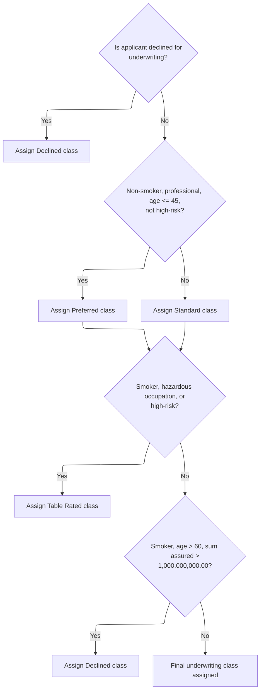

This section determines the applicant's underwriting risk class based on business-driven criteria. The assigned class code is used in subsequent processing to drive eligibility and pricing decisions.

| Rule ID | Category        | Rule Name                    | Description                                                                                                                                                         | Implementation Details                                                                                                                                                                                         |
| ------- | --------------- | ---------------------------- | ------------------------------------------------------------------------------------------------------------------------------------------------------------------- | -------------------------------------------------------------------------------------------------------------------------------------------------------------------------------------------------------------- |
| BR-001  | Decision Making | Pre-existing Decline Exit    | If the applicant is already declined for underwriting, the risk class is not reassessed and the process exits without further checks.                               | The decline indicator is represented by the underwriting class code 'DP'. No further risk assessment is performed if this is set.                                                                              |
| BR-002  | Decision Making | Preferred Class Assignment   | Applicants who are non-smokers, have a professional occupation, are age 45 or younger, and do not have a high-risk avocation are assigned the Preferred risk class. | Preferred class is represented by the code 'PR'. Age threshold is 45. Non-smoker means smoker indicator is 'N'. Professional occupation means occupation class is 1. High-risk avocation indicator is not 'Y'. |
| BR-003  | Decision Making | Standard Class Assignment    | Applicants who do not meet all Preferred class criteria are assigned the Standard risk class.                                                                       | Standard class is represented by the code 'ST'. This is the default assignment if Preferred criteria are not met.                                                                                              |
| BR-004  | Decision Making | Table Rated Class Assignment | Applicants who are smokers, have a hazardous occupation, or have a high-risk avocation are assigned the Table Rated risk class.                                     | Table Rated class is represented by the code 'TB'. Smoker means smoker indicator is 'S'. Hazardous occupation means occupation class is 3. High-risk avocation indicator is 'Y'.                               |
| BR-005  | Decision Making | High Value Smoker Decline    | Applicants who are smokers, over age 60, and have a sum assured greater than 1,000,000,000.00 are assigned the Declined risk class.                                 | Declined class is represented by the code 'DP'. Age threshold is 60. Sum assured threshold is 1,000,000,000.00. Smoker means smoker indicator is 'S'.                                                          |

<SwmSnippet path="/NB-UW-001.cob" line="231">

---

In <SwmToken path="NB-UW-001.cob" pos="231:1:7" line-data="       1300-DETERMINE-UW-CLASS.">`1300-DETERMINE-UW-CLASS`</SwmToken>, we first check if <SwmToken path="NB-UW-001.cob" pos="233:3:7" line-data="           IF PM-UW-DECLINE">`PM-UW-DECLINE`</SwmToken> is set. If so, we exit right away, since the case is already declined. Otherwise, we move on to risk factor checks.

```cobol
       1300-DETERMINE-UW-CLASS.
      * NB-301: Preferred, standard, table, or decline.
           IF PM-UW-DECLINE
              EXIT PARAGRAPH
           END-IF
```

---

</SwmSnippet>

<SwmSnippet path="/NB-UW-001.cob" line="237">

---

After checking for decline, we look at risk factors: if the insured meets strict criteria (non-smoker, professional, <=45, no high-risk avocation), we assign 'PR'. Otherwise, it's 'ST'. These codes drive downstream premium and eligibility.

```cobol
           IF PM-NON-SMOKER AND PM-OCC-PROF AND
              PM-INSURED-AGE-ISSUE <= 45 AND
              PM-HIGH-RISK-AVOC-IND NOT = 'Y'
              MOVE "PR" TO PM-UW-CLASS
           ELSE
              MOVE "ST" TO PM-UW-CLASS
           END-IF
```

---

</SwmSnippet>

<SwmSnippet path="/NB-UW-001.cob" line="246">

---

After assigning Preferred or Standard, we check for smoker, hazardous occupation, or high-risk avocation. If any are true, we set 'TB' for Table class, marking the applicant as higher risk.

```cobol
           IF PM-SMOKER OR PM-OCC-HAZARD OR PM-HIGH-RISK-AVOC
              MOVE "TB" TO PM-UW-CLASS
           END-IF
```

---

</SwmSnippet>

<SwmSnippet path="/NB-UW-001.cob" line="251">

---

At the end of risk assessment, if the applicant is a smoker, over 60, and has a huge sum assured, we set 'DP' for Decline. The function returns the assigned class code, which drives the next steps in <SwmToken path="NB-UW-001.cob" pos="42:1:3" line-data="       MAIN-PROCESS.">`MAIN-PROCESS`</SwmToken>.

```cobol
           IF PM-SMOKER AND PM-INSURED-AGE-ISSUE > 60 AND
              PM-SUM-ASSURED > 0001000000000.00
              MOVE "DP" TO PM-UW-CLASS
           END-IF.
```

---

</SwmSnippet>

## Handling risk assessment outcomes

This section determines the business outcome for cases declined by underwriting. It sets the appropriate status and communicates the decline to downstream processes.

| Rule ID | Category        | Rule Name                    | Description                                                                                                                                                                                                                                | Implementation Details                                                                                                                                                                                                                                                                                                                              |
| ------- | --------------- | ---------------------------- | ------------------------------------------------------------------------------------------------------------------------------------------------------------------------------------------------------------------------------------------ | --------------------------------------------------------------------------------------------------------------------------------------------------------------------------------------------------------------------------------------------------------------------------------------------------------------------------------------------------- |
| BR-001  | Decision Making | Underwriting Decline Outcome | When a case is declined by underwriting, set the result code to 21, set the result message to 'APPLICATION DECLINED BY UNDERWRITING RULES', set the contract status to 'RJ', invoke the error handling process, and exit the main process. | Result code is set to 21 (number). Result message is set to 'APPLICATION DECLINED BY UNDERWRITING RULES' (string, left-aligned, up to 100 characters). Contract status is set to 'RJ' (string, 2 characters). These values are domain-specific and signal a declined application. The error handling process is invoked after setting these values. |

<SwmSnippet path="/NB-UW-001.cob" line="52">

---

Back in <SwmToken path="NB-UW-001.cob" pos="42:1:3" line-data="       MAIN-PROCESS.">`MAIN-PROCESS`</SwmToken>, after returning from <SwmToken path="NB-UW-001.cob" pos="51:3:9" line-data="           PERFORM 1300-DETERMINE-UW-CLASS">`1300-DETERMINE-UW-CLASS`</SwmToken>, we check if the case is declined. If so, we set result and contract status codes, call <SwmToken path="NB-UW-001.cob" pos="57:3:7" line-data="              PERFORM 9000-RETURN-ERROR">`9000-RETURN-ERROR`</SwmToken>, and exit. These codes are domain-specific and signal a declined application.

```cobol
           IF PM-UW-DECLINE
              MOVE 21 TO WS-RESULT-CODE
              MOVE "APPLICATION DECLINED BY UNDERWRITING RULES"
                TO WS-RESULT-MESSAGE
              MOVE "RJ" TO PM-CONTRACT-STATUS
              PERFORM 9000-RETURN-ERROR
              GOBACK
           END-IF
```

---

</SwmSnippet>

<SwmSnippet path="/NB-UW-001.cob" line="61">

---

After risk assessment, we call <SwmToken path="NB-UW-001.cob" pos="61:3:9" line-data="           PERFORM 1400-LOAD-RATE-FACTORS">`1400-LOAD-RATE-FACTORS`</SwmToken> to set up all the pricing multipliers based on applicant attributes. This step is needed before premium calculation, since the factors directly affect the price.

```cobol
           PERFORM 1400-LOAD-RATE-FACTORS
           PERFORM 1500-VALIDATE-RIDERS
```

---

</SwmSnippet>

## Setting pricing multipliers

```mermaid
%%{init: {"flowchart": {"defaultRenderer": "elk"}} }%%
flowchart TD
    node1["Start: Load rate factors"] --> node2{"Insured's age at issue?"}
    click node1 openCode "NB-UW-001.cob:256:258"
    node2 -->|"#lt;= 30 (0.8500)"| node3["Set base rate per thousand"]
    node2 -->|"#lt;= 40 (1.2000)"| node3
    node2 -->|"#lt;= 50 (2.1500)"| node3
    node2 -->|"#lt;= 60 (4.1000)"| node3
    node2 -->|"#gt; 60 (7.2500)"| node3
    click node2 openCode "NB-UW-001.cob:258:269"
    click node3 openCode "NB-UW-001.cob:259:268"
    node3 --> node4{"Is insured female?"}
    node4 -->|"Yes (0.92)"| node5["Set gender factor"]
    node4 -->|"No (1.00)"| node5
    click node4 openCode "NB-UW-001.cob:272:276"
    click node5 openCode "NB-UW-001.cob:273:275"
    node5 --> node6{"Is insured a smoker?"}
    node6 -->|"Yes (1.75)"| node7["Set smoker factor"]
    node6 -->|"No (1.00)"| node7
    click node6 openCode "NB-UW-001.cob:279:283"
    click node7 openCode "NB-UW-001.cob:280:282"
    node7 --> node8{"Occupation class?"}
    node8 -->|"Professional (1.00)"| node9["Set occupation factor"]
    node8 -->|"Standard (1.15)"| node9
    node8 -->|"Hazard (1.40)"| node9
    node8 -->|"Other (1.00)"| node9
    click node8 openCode "NB-UW-001.cob:286:295"
    click node9 openCode "NB-UW-001.cob:288:294"
    node9 --> node10{"Underwriting class?"}
    node10 -->|"Preferred (0.90)"| node11["Set underwriting factor"]
    node10 -->|"Standard (1.00)"| node11
    node10 -->|"Table B (1.25)"| node11
    node10 -->|"Other (1.00)"| node11
    click node10 openCode "NB-UW-001.cob:298:307"
    click node11 openCode "NB-UW-001.cob:300:306"
    node11 --> node12["All rate factors loaded"]
    click node12 openCode "NB-UW-001.cob:307:307"

classDef HeadingStyle fill:#777777,stroke:#333,stroke-width:2px;

%% Swimm:
%% %%{init: {"flowchart": {"defaultRenderer": "elk"}} }%%
%% flowchart TD
%%     node1["Start: Load rate factors"] --> node2{"Insured's age at issue?"}
%%     click node1 openCode "<SwmPath>[NB-UW-001.cob](NB-UW-001.cob)</SwmPath>:256:258"
%%     node2 -->|"#lt;= 30 (0.8500)"| node3["Set base rate per thousand"]
%%     node2 -->|"#lt;= 40 (1.2000)"| node3
%%     node2 -->|"#lt;= 50 (2.1500)"| node3
%%     node2 -->|"#lt;= 60 (4.1000)"| node3
%%     node2 -->|"#gt; 60 (7.2500)"| node3
%%     click node2 openCode "<SwmPath>[NB-UW-001.cob](NB-UW-001.cob)</SwmPath>:258:269"
%%     click node3 openCode "<SwmPath>[NB-UW-001.cob](NB-UW-001.cob)</SwmPath>:259:268"
%%     node3 --> node4{"Is insured female?"}
%%     node4 -->|"Yes (0.92)"| node5["Set gender factor"]
%%     node4 -->|"No (1.00)"| node5
%%     click node4 openCode "<SwmPath>[NB-UW-001.cob](NB-UW-001.cob)</SwmPath>:272:276"
%%     click node5 openCode "<SwmPath>[NB-UW-001.cob](NB-UW-001.cob)</SwmPath>:273:275"
%%     node5 --> node6{"Is insured a smoker?"}
%%     node6 -->|"Yes (1.75)"| node7["Set smoker factor"]
%%     node6 -->|"No (1.00)"| node7
%%     click node6 openCode "<SwmPath>[NB-UW-001.cob](NB-UW-001.cob)</SwmPath>:279:283"
%%     click node7 openCode "<SwmPath>[NB-UW-001.cob](NB-UW-001.cob)</SwmPath>:280:282"
%%     node7 --> node8{"Occupation class?"}
%%     node8 -->|"Professional (1.00)"| node9["Set occupation factor"]
%%     node8 -->|"Standard (1.15)"| node9
%%     node8 -->|"Hazard (1.40)"| node9
%%     node8 -->|"Other (1.00)"| node9
%%     click node8 openCode "<SwmPath>[NB-UW-001.cob](NB-UW-001.cob)</SwmPath>:286:295"
%%     click node9 openCode "<SwmPath>[NB-UW-001.cob](NB-UW-001.cob)</SwmPath>:288:294"
%%     node9 --> node10{"Underwriting class?"}
%%     node10 -->|"Preferred (0.90)"| node11["Set underwriting factor"]
%%     node10 -->|"Standard (1.00)"| node11
%%     node10 -->|"Table B (1.25)"| node11
%%     node10 -->|"Other (1.00)"| node11
%%     click node10 openCode "<SwmPath>[NB-UW-001.cob](NB-UW-001.cob)</SwmPath>:298:307"
%%     click node11 openCode "<SwmPath>[NB-UW-001.cob](NB-UW-001.cob)</SwmPath>:300:306"
%%     node11 --> node12["All rate factors loaded"]
%%     click node12 openCode "<SwmPath>[NB-UW-001.cob](NB-UW-001.cob)</SwmPath>:307:307"
%% 
%% classDef HeadingStyle fill:#777777,stroke:#333,stroke-width:2px;
```

This section sets all pricing multipliers that will be used to calculate the premium for a term life insurance policy. It ensures that each relevant risk attribute is mapped to a domain-specific rate factor.

| Rule ID | Category    | Rule Name                      | Description                                                                                                                                                                                                 | Implementation Details                                                                                                                                                                                       |
| ------- | ----------- | ------------------------------ | ----------------------------------------------------------------------------------------------------------------------------------------------------------------------------------------------------------- | ------------------------------------------------------------------------------------------------------------------------------------------------------------------------------------------------------------ |
| BR-001  | Calculation | Base rate by age band          | Assign the base mortality rate per thousand based on the insured's age at issue, using the following mapping: age <= 30: 0.8500; age <= 40: 1.2000; age <= 50: 2.1500; age <= 60: 4.1000; age > 60: 7.2500. | The base rate per thousand is set as a decimal value with four digits after the decimal point. The mapping is: age <= 30: 0.8500; age <= 40: 1.2000; age <= 50: 2.1500; age <= 60: 4.1000; age > 60: 7.2500. |
| BR-002  | Calculation | Gender factor assignment       | Assign the gender factor: if the insured is female, set the factor to 0.92; otherwise, set it to 1.00.                                                                                                      | The gender factor is a decimal value with four digits after the decimal point. Female: 0.92; Not female: 1.00.                                                                                               |
| BR-003  | Calculation | Smoker factor assignment       | Assign the smoker factor: if the insured is a smoker, set the factor to 1.75; otherwise, set it to 1.00.                                                                                                    | The smoker factor is a decimal value with four digits after the decimal point. Smoker: 1.75; Non-smoker: 1.00.                                                                                               |
| BR-004  | Calculation | Occupation factor assignment   | Assign the occupation factor based on occupation class: Professional: 1.00; Standard: 1.15; Hazard: 1.40; Other: 1.00.                                                                                      | The occupation factor is a decimal value with four digits after the decimal point. Professional: 1.00; Standard: 1.15; Hazard: 1.40; Other: 1.00.                                                            |
| BR-005  | Calculation | Underwriting factor assignment | Assign the underwriting factor based on underwriting class: Preferred: 0.90; Standard: 1.00; Table B: 1.25; Other: 1.00.                                                                                    | The underwriting factor is a decimal value with four digits after the decimal point. Preferred: 0.90; Standard: 1.00; Table B: 1.25; Other: 1.00.                                                            |

<SwmSnippet path="/NB-UW-001.cob" line="256">

---

In <SwmToken path="NB-UW-001.cob" pos="256:1:7" line-data="       1400-LOAD-RATE-FACTORS.">`1400-LOAD-RATE-FACTORS`</SwmToken>, we start by assigning the base mortality rate per thousand based on the insured's age. The constants used are domain-specific and set the foundation for premium calculation.

```cobol
       1400-LOAD-RATE-FACTORS.
      * NB-401: Base mortality rate by issue age band.
           EVALUATE TRUE
              WHEN PM-INSURED-AGE-ISSUE <= 30
                 MOVE 00000.8500 TO PM-BASE-RATE-PER-THOU
              WHEN PM-INSURED-AGE-ISSUE <= 40
                 MOVE 00001.2000 TO PM-BASE-RATE-PER-THOU
              WHEN PM-INSURED-AGE-ISSUE <= 50
                 MOVE 00002.1500 TO PM-BASE-RATE-PER-THOU
              WHEN PM-INSURED-AGE-ISSUE <= 60
                 MOVE 00004.1000 TO PM-BASE-RATE-PER-THOU
              WHEN OTHER
                 MOVE 00007.2500 TO PM-BASE-RATE-PER-THOU
           END-EVALUATE
```

---

</SwmSnippet>

<SwmSnippet path="/NB-UW-001.cob" line="272">

---

After setting the base rate, we assign the gender factor. Females get a lower multiplier, which reduces the premium. This is a domain-specific adjustment.

```cobol
           IF PM-FEMALE
              MOVE 0.9200 TO PM-GENDER-FACTOR
           ELSE
              MOVE 1.0000 TO PM-GENDER-FACTOR
           END-IF
```

---

</SwmSnippet>

<SwmSnippet path="/NB-UW-001.cob" line="279">

---

After gender, we set the smoker factor. Smokers get a higher multiplier, which bumps up the premium. This is a domain-specific risk adjustment.

```cobol
           IF PM-SMOKER
              MOVE 1.7500 TO PM-SMOKER-FACTOR
           ELSE
              MOVE 1.0000 TO PM-SMOKER-FACTOR
           END-IF
```

---

</SwmSnippet>

<SwmSnippet path="/NB-UW-001.cob" line="286">

---

After smoker factor, we set the occupation factor. Each occupation class gets its own multiplier, adjusting the premium for risk level.

```cobol
           EVALUATE TRUE
              WHEN PM-OCC-PROF
                 MOVE 1.0000 TO PM-OCC-FACTOR
              WHEN PM-OCC-STANDARD
                 MOVE 1.1500 TO PM-OCC-FACTOR
              WHEN PM-OCC-HAZARD
                 MOVE 1.4000 TO PM-OCC-FACTOR
              WHEN OTHER
                 MOVE 1.0000 TO PM-OCC-FACTOR
           END-EVALUATE
```

---

</SwmSnippet>

<SwmSnippet path="/NB-UW-001.cob" line="298">

---

At the end of rate factor setup, we assign the underwriting class factor. Each class gets its own multiplier, which is used in premium calculation. All factors combine to set the final rate.

```cobol
           EVALUATE TRUE
              WHEN PM-UW-PREFERRED
                 MOVE 0.9000 TO PM-UW-FACTOR
              WHEN PM-UW-STANDARD
                 MOVE 1.0000 TO PM-UW-FACTOR
              WHEN PM-UW-TABLE-B
                 MOVE 1.2500 TO PM-UW-FACTOR
              WHEN OTHER
                 MOVE 1.0000 TO PM-UW-FACTOR
           END-EVALUATE.
```

---

</SwmSnippet>

## Validating rider eligibility

This section enforces business rules for rider eligibility on a term life insurance policy. It ensures that all attached riders comply with product constraints before proceeding with further processing.

| Rule ID | Category        | Rule Name                  | Description                                                                                                                                                                  | Implementation Details                                                                                                                                                                  |
| ------- | --------------- | -------------------------- | ---------------------------------------------------------------------------------------------------------------------------------------------------------------------------- | --------------------------------------------------------------------------------------------------------------------------------------------------------------------------------------- |
| BR-001  | Data validation | Maximum rider count        | The number of riders attached to a policy is limited to a maximum allowed by the product. If the number of riders exceeds this limit, the policy is flagged as ineligible.   | The maximum number of riders is determined by the product configuration. The output is a validation result indicating ineligibility if the limit is exceeded.                           |
| BR-002  | Data validation | Rider age eligibility      | Each rider's age must fall within the minimum and maximum issue age specified by the product. Riders outside this age range are considered ineligible.                       | Minimum and maximum issue ages are defined in the product parameters. The output is a validation result indicating ineligibility for riders outside the allowed age range.              |
| BR-003  | Data validation | Rider coverage eligibility | Each rider's coverage amount must be within the minimum and maximum sum assured specified by the product. Riders with coverage outside this range are considered ineligible. | Minimum and maximum sum assured values are defined in the product parameters. The output is a validation result indicating ineligibility for riders outside the allowed coverage range. |

<SwmSnippet path="/NB-UW-001.cob" line="61">

---

Back in <SwmToken path="NB-UW-001.cob" pos="42:1:3" line-data="       MAIN-PROCESS.">`MAIN-PROCESS`</SwmToken>, after loading rate factors, we call <SwmToken path="NB-UW-001.cob" pos="62:3:7" line-data="           PERFORM 1500-VALIDATE-RIDERS">`1500-VALIDATE-RIDERS`</SwmToken> to check if all attached riders meet product rules. This step enforces limits on rider count, age, and coverage, and stops the flow if any rider is invalid.

```cobol
           PERFORM 1400-LOAD-RATE-FACTORS
           PERFORM 1500-VALIDATE-RIDERS
```

---

</SwmSnippet>

## Enforcing rider rules

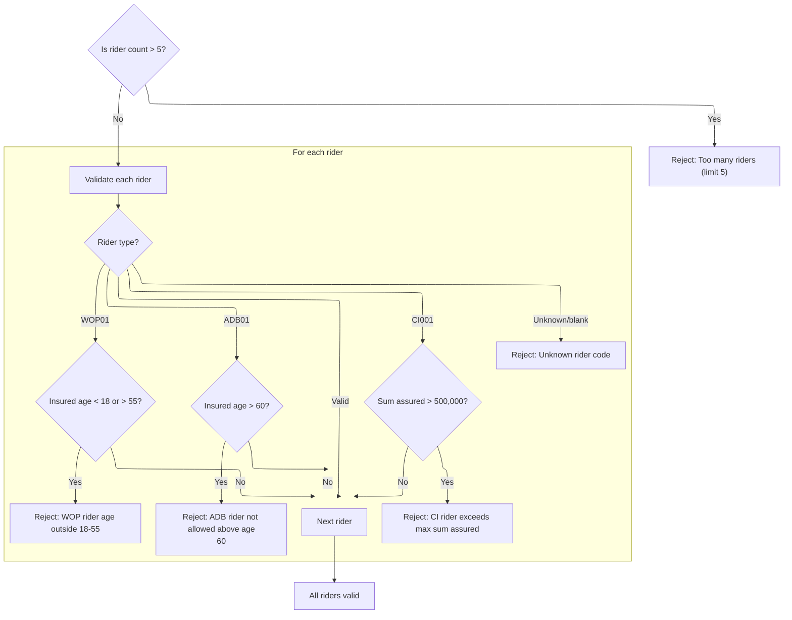

This section enforces product rules for rider eligibility and limits during new business policy validation. It ensures only eligible riders are accepted according to product constraints.

| Rule ID | Category        | Rule Name                | Description                                                                                                                                                                                                                                                                                                                | Implementation Details                                                                                                                                                                                                                                                                                                                         |
| ------- | --------------- | ------------------------ | -------------------------------------------------------------------------------------------------------------------------------------------------------------------------------------------------------------------------------------------------------------------------------------------------------------------------- | ---------------------------------------------------------------------------------------------------------------------------------------------------------------------------------------------------------------------------------------------------------------------------------------------------------------------------------------------- |
| BR-001  | Data validation | Rider count limit        | Reject the policy if the number of riders exceeds 5. The process stops and returns an error message indicating the rider count limit.                                                                                                                                                                                      | The maximum allowed rider count is 5. The rejection message is 'RIDER COUNT EXCEEDS PRODUCT LIMIT'. The result code is 22. The output format is a numeric result code and an alphanumeric message string.                                                                                                                                      |
| BR-002  | Data validation | ADB rider age cap        | Reject the policy if an <SwmToken path="NB-UW-001.cob" pos="322:4:4" line-data="                 WHEN &quot;ADB01&quot;">`ADB01`</SwmToken> rider is present and the insured's issue age is above 60. The process stops and returns an error message indicating the age cap for this rider.                                | The maximum allowed issue age for <SwmToken path="NB-UW-001.cob" pos="322:4:4" line-data="                 WHEN &quot;ADB01&quot;">`ADB01`</SwmToken> is 60. The rejection message is 'ADB RIDER NOT ALLOWED ABOVE AGE 60'. The result code is 23. The output format is a numeric result code and an alphanumeric message string.              |
| BR-003  | Data validation | WOP rider age band       | Reject the policy if a <SwmToken path="NB-UW-001.cob" pos="329:4:4" line-data="                 WHEN &quot;WOP01&quot;">`WOP01`</SwmToken> rider is present and the insured's issue age is less than 18 or greater than 55. The process stops and returns an error message indicating the allowed age band for this rider. | The allowed issue age band for <SwmToken path="NB-UW-001.cob" pos="329:4:4" line-data="                 WHEN &quot;WOP01&quot;">`WOP01`</SwmToken> is 18 to 55 inclusive. The rejection message is 'WOP RIDER AGE OUTSIDE ALLOWED BAND'. The result code is 24. The output format is a numeric result code and an alphanumeric message string. |
| BR-004  | Data validation | CI rider sum assured cap | Reject the policy if a <SwmToken path="NB-UW-001.cob" pos="337:4:4" line-data="                 WHEN &quot;CI001&quot;">`CI001`</SwmToken> rider is present and the sum assured for the rider exceeds 500,000. The process stops and returns an error message indicating the sum assured cap for this rider.               | The maximum allowed sum assured for <SwmToken path="NB-UW-001.cob" pos="337:4:4" line-data="                 WHEN &quot;CI001&quot;">`CI001`</SwmToken> is 500,000. The rejection message is 'CI RIDER EXCEEDS MAXIMUM RIDER SA'. The result code is 25. The output format is a numeric result code and an alphanumeric message string.        |
| BR-005  | Data validation | Unknown rider code       | Reject the policy if a rider code is unknown or blank. The process stops and returns an error message indicating the rider code is not recognized.                                                                                                                                                                         | The rejection message is 'UNKNOWN RIDER CODE'. The result code is 26. The output format is a numeric result code and an alphanumeric message string.                                                                                                                                                                                           |

<SwmSnippet path="/NB-UW-001.cob" line="309">

---

In <SwmToken path="NB-UW-001.cob" pos="309:1:5" line-data="       1500-VALIDATE-RIDERS.">`1500-VALIDATE-RIDERS`</SwmToken>, we start by checking if the rider count exceeds 5. If it does, we set an error code and message, then exit. This enforces a hard business rule on rider count.

```cobol
       1500-VALIDATE-RIDERS.
      * NB-501: Limit rider count.
           IF PM-RIDER-COUNT > 5
              MOVE 22 TO WS-RESULT-CODE
              MOVE "RIDER COUNT EXCEEDS PRODUCT LIMIT"
                TO WS-RESULT-MESSAGE
              EXIT PARAGRAPH
           END-IF
```

---

</SwmSnippet>

<SwmSnippet path="/NB-UW-001.cob" line="318">

---

After checking rider count, we loop through each rider and validate its code and rules. For <SwmToken path="NB-UW-001.cob" pos="322:4:4" line-data="                 WHEN &quot;ADB01&quot;">`ADB01`</SwmToken>, we check age; if invalid, we set an error and exit. This pattern repeats for other rider types.

```cobol
           PERFORM VARYING WS-RIDER-IDX FROM 1 BY 1
                   UNTIL WS-RIDER-IDX > PM-RIDER-COUNT OR
                         WS-RESULT-CODE NOT = 0
              EVALUATE PM-RIDER-CODE(WS-RIDER-IDX)
                 WHEN "ADB01"
      * NB-502: Accidental death rider issue age cap 60.
                    IF PM-INSURED-AGE-ISSUE > 60
                       MOVE 23 TO WS-RESULT-CODE
                       MOVE "ADB RIDER NOT ALLOWED ABOVE AGE 60"
                         TO WS-RESULT-MESSAGE
                    END-IF
```

---

</SwmSnippet>

<SwmSnippet path="/NB-UW-001.cob" line="329">

---

For <SwmToken path="NB-UW-001.cob" pos="329:4:4" line-data="                 WHEN &quot;WOP01&quot;">`WOP01`</SwmToken> riders, we check if the insured's age is between 18 and 55. If not, we set an error and exit. This enforces strict age bands for this rider.

```cobol
                 WHEN "WOP01"
      * NB-503: Waiver of premium rider age band 18 to 55.
                    IF PM-INSURED-AGE-ISSUE < 18 OR
                       PM-INSURED-AGE-ISSUE > 55
                       MOVE 24 TO WS-RESULT-CODE
                       MOVE "WOP RIDER AGE OUTSIDE ALLOWED BAND"
                         TO WS-RESULT-MESSAGE
                    END-IF
```

---

</SwmSnippet>

<SwmSnippet path="/NB-UW-001.cob" line="337">

---

For <SwmToken path="NB-UW-001.cob" pos="337:4:4" line-data="                 WHEN &quot;CI001&quot;">`CI001`</SwmToken> riders, we check if the sum assured exceeds 500,000. If it does, we set an error and exit. This enforces the cap for this rider type.

```cobol
                 WHEN "CI001"
      * NB-504: Critical illness rider cap 500,000.
                    IF PM-RIDER-SUM-ASSURED(WS-RIDER-IDX)
                       > 0000500000.00
                       MOVE 25 TO WS-RESULT-CODE
                       MOVE "CI RIDER EXCEEDS MAXIMUM RIDER SA"
                         TO WS-RESULT-MESSAGE
                    END-IF
```

---

</SwmSnippet>

<SwmSnippet path="/NB-UW-001.cob" line="345">

---

At the end of rider validation, if a rider code is unknown, we set an error and exit. The function returns a result code and message for any failure, or moves on if all riders are valid.

```cobol
                 WHEN SPACES
                    CONTINUE
                 WHEN OTHER
                    MOVE 26 TO WS-RESULT-CODE
                    MOVE "UNKNOWN RIDER CODE" TO WS-RESULT-MESSAGE
              END-EVALUATE
           END-PERFORM.
```

---

</SwmSnippet>

## Handling rider validation outcomes

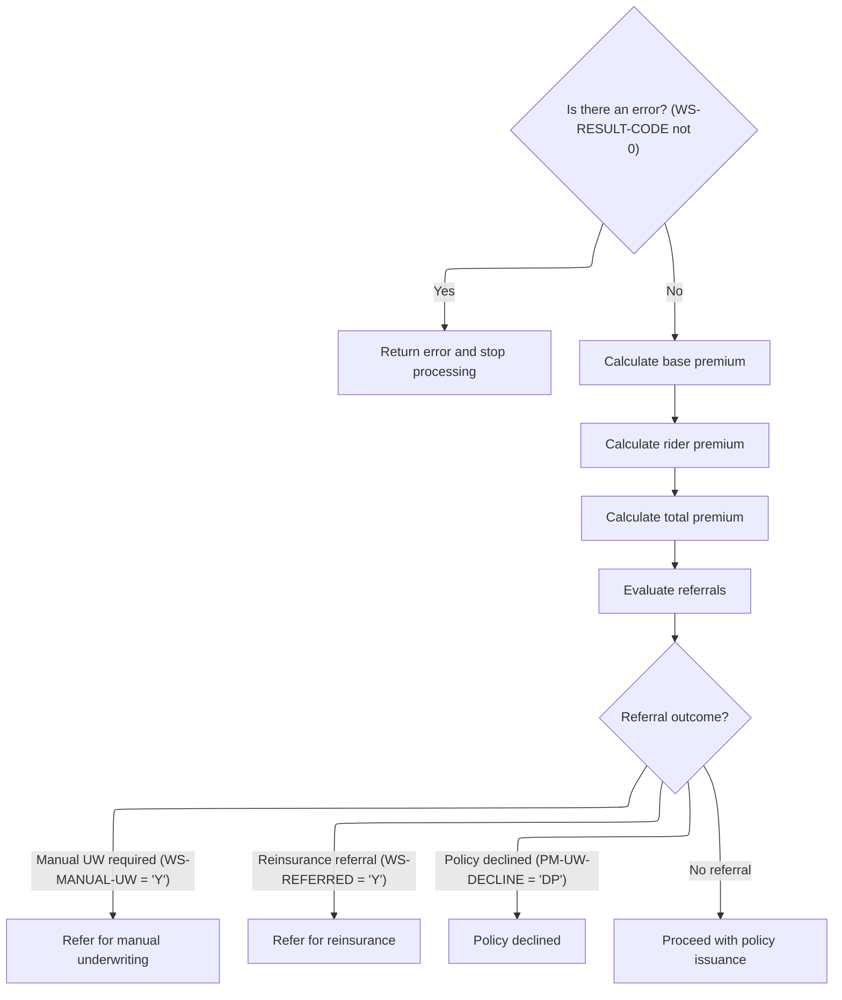

This section determines the next steps after rider validation, including error handling, premium calculation, and referral evaluation for policy issuance.

| Rule ID | Category        | Rule Name                       | Description                                                                                                                                                                                            | Implementation Details                                                                                                                                                                                                                                                                                        |
| ------- | --------------- | ------------------------------- | ------------------------------------------------------------------------------------------------------------------------------------------------------------------------------------------------------ | ------------------------------------------------------------------------------------------------------------------------------------------------------------------------------------------------------------------------------------------------------------------------------------------------------------- |
| BR-001  | Data validation | Rider validation error handling | If the rider validation result code is not zero, the process stops and an error is returned to the user.                                                                                               | The result code is a number. If it is not zero, an error message is returned and processing stops. The error format is not specified in this section.                                                                                                                                                         |
| BR-002  | Calculation     | Premium calculation sequence    | If there is no validation error, the system calculates the base premium, then the rider premium, then the total premium, in that order.                                                                | The calculation order is: base premium, rider premium, total premium. The specific calculation formulas are not detailed here.                                                                                                                                                                                |
| BR-003  | Decision Making | Referral outcome evaluation     | After premium calculations, the system evaluates if the policy requires manual underwriting, reinsurance referral, is declined, or can proceed to issuance, based on referral flags and decline codes. | Manual underwriting is triggered if the manual underwriting flag is 'Y'. Reinsurance referral is triggered if the reinsurance referral flag is 'Y'. Policy is declined if the decline code is 'DP'. If none of these, the policy proceeds to issuance. These are mutually exclusive outcomes in this context. |

<SwmSnippet path="/NB-UW-001.cob" line="63">

---

Back in <SwmToken path="NB-UW-001.cob" pos="42:1:3" line-data="       MAIN-PROCESS.">`MAIN-PROCESS`</SwmToken>, after returning from <SwmToken path="NB-UW-001.cob" pos="62:3:7" line-data="           PERFORM 1500-VALIDATE-RIDERS">`1500-VALIDATE-RIDERS`</SwmToken>, we check if <SwmToken path="NB-UW-001.cob" pos="63:3:7" line-data="           IF WS-RESULT-CODE NOT = 0">`WS-RESULT-CODE`</SwmToken> is non-zero. If so, we report the error and exit, stopping the flow right there.

```cobol
           IF WS-RESULT-CODE NOT = 0
              PERFORM 9000-RETURN-ERROR
              GOBACK
           END-IF
```

---

</SwmSnippet>

<SwmSnippet path="/NB-UW-001.cob" line="68">

---

After calculating the base premium, we call <SwmToken path="NB-UW-001.cob" pos="69:3:9" line-data="           PERFORM 1700-CALCULATE-RIDER-PREMIUM">`1700-CALCULATE-RIDER-PREMIUM`</SwmToken> to price each attached rider using its own formula. This step is needed because riders have different rules and rates, and their premiums need to be summed up before we can calculate the total policy premium.

```cobol
           PERFORM 1600-CALCULATE-BASE-PREMIUM
           PERFORM 1700-CALCULATE-RIDER-PREMIUM
           PERFORM 1800-CALCULATE-TOTAL-PREMIUM
           PERFORM 1900-EVALUATE-REFERRALS
```

---

</SwmSnippet>

## Calculating rider premiums

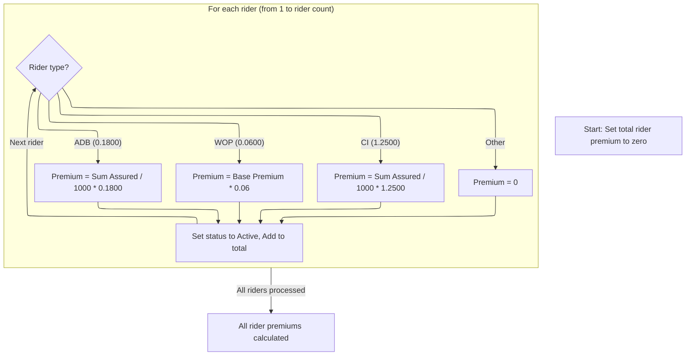

This section calculates the annual premium for each rider on a policy, using a formula specific to the rider type. It accumulates the total rider premium and marks each rider as active after calculation.

| Rule ID | Category        | Rule Name                                                                                                                               | Description                                                                                                                                                                                                                                                                                                                                              | Implementation Details                                                                                                                                                                                                                    |
| ------- | --------------- | --------------------------------------------------------------------------------------------------------------------------------------- | -------------------------------------------------------------------------------------------------------------------------------------------------------------------------------------------------------------------------------------------------------------------------------------------------------------------------------------------------------- | ----------------------------------------------------------------------------------------------------------------------------------------------------------------------------------------------------------------------------------------- |
| BR-001  | Calculation     | <SwmToken path="NB-UW-001.cob" pos="322:4:4" line-data="                 WHEN &quot;ADB01&quot;">`ADB01`</SwmToken> premium calculation | For each rider with type <SwmToken path="NB-UW-001.cob" pos="322:4:4" line-data="                 WHEN &quot;ADB01&quot;">`ADB01`</SwmToken>, the annual premium is calculated as (sum assured divided by 1000) multiplied by 0.1800.                                                                                                                    | The rate used is 0.1800 per 1000 of sum assured. The result is a number representing the annual premium for the rider.                                                                                                                    |
| BR-002  | Calculation     | <SwmToken path="NB-UW-001.cob" pos="329:4:4" line-data="                 WHEN &quot;WOP01&quot;">`WOP01`</SwmToken> premium calculation | For each rider with type <SwmToken path="NB-UW-001.cob" pos="329:4:4" line-data="                 WHEN &quot;WOP01&quot;">`WOP01`</SwmToken>, the annual premium is calculated as 6% of the base annual premium.                                                                                                                                         | The rate used is <SwmToken path="NB-UW-001.cob" pos="385:11:13" line-data="                           PM-BASE-ANNUAL-PREMIUM * 0.0600">`0.0600`</SwmToken> (6%). The result is a number representing the annual premium for the rider.    |
| BR-003  | Calculation     | <SwmToken path="NB-UW-001.cob" pos="337:4:4" line-data="                 WHEN &quot;CI001&quot;">`CI001`</SwmToken> premium calculation | For each rider with type <SwmToken path="NB-UW-001.cob" pos="337:4:4" line-data="                 WHEN &quot;CI001&quot;">`CI001`</SwmToken>, the annual premium is calculated as (sum assured divided by 1000) multiplied by <SwmToken path="NB-UW-001.cob" pos="304:3:5" line-data="                 MOVE 1.2500 TO PM-UW-FACTOR">`1.2500`</SwmToken>. | The rate used is <SwmToken path="NB-UW-001.cob" pos="304:3:5" line-data="                 MOVE 1.2500 TO PM-UW-FACTOR">`1.2500`</SwmToken> per 1000 of sum assured. The result is a number representing the annual premium for the rider. |
| BR-004  | Calculation     | Rider status update and total accumulation                                                                                              | After calculating the premium for each rider, the rider's status is set to active and the premium is added to the total rider premium accumulator.                                                                                                                                                                                                       | The status is set to 'A' (active). The total rider premium is the sum of all individual rider premiums.                                                                                                                                   |
| BR-005  | Decision Making | Unknown rider code premium                                                                                                              | For any rider with an unrecognized type code, the annual premium is set to zero.                                                                                                                                                                                                                                                                         | The premium is set to zero. This ensures unknown rider types do not affect the total premium.                                                                                                                                             |

<SwmSnippet path="/NB-UW-001.cob" line="370">

---

In <SwmToken path="NB-UW-001.cob" pos="370:1:7" line-data="       1700-CALCULATE-RIDER-PREMIUM.">`1700-CALCULATE-RIDER-PREMIUM`</SwmToken>, we loop through each rider, check its code, and apply a fixed calculation formula based on that code. The premium is either a rate per thousand sum assured or a percentage of the base premium, depending on the rider type. Each calculated premium is added to the total rider premium accumulator. The function assumes the rider count and arrays are correct, otherwise the loop or calculations could break.

```cobol
       1700-CALCULATE-RIDER-PREMIUM.
           MOVE ZERO TO PM-RIDER-ANNUAL-TOTAL
           PERFORM VARYING WS-RIDER-IDX FROM 1 BY 1
                   UNTIL WS-RIDER-IDX > PM-RIDER-COUNT
              EVALUATE PM-RIDER-CODE(WS-RIDER-IDX)
                 WHEN "ADB01"
      * NB-701: ADB premium priced per thousand on rider SA.
                    MOVE 00000.1800 TO PM-RIDER-RATE(WS-RIDER-IDX)
                    COMPUTE PM-RIDER-ANNUAL-PREM(WS-RIDER-IDX) ROUNDED =
                           (PM-RIDER-SUM-ASSURED(WS-RIDER-IDX) / 1000)
                         * PM-RIDER-RATE(WS-RIDER-IDX)
```

---

</SwmSnippet>

<SwmSnippet path="/NB-UW-001.cob" line="381">

---

After handling <SwmToken path="NB-UW-001.cob" pos="322:4:4" line-data="                 WHEN &quot;ADB01&quot;">`ADB01`</SwmToken>, we check for <SwmToken path="NB-UW-001.cob" pos="381:4:4" line-data="                 WHEN &quot;WOP01&quot;">`WOP01`</SwmToken> and set its premium as 6% of the base annual premium. This is different from <SwmToken path="NB-UW-001.cob" pos="322:4:4" line-data="                 WHEN &quot;ADB01&quot;">`ADB01`</SwmToken>, which uses a rate per thousand sum assured. The snippet fits between the <SwmToken path="NB-UW-001.cob" pos="322:4:4" line-data="                 WHEN &quot;ADB01&quot;">`ADB01`</SwmToken> and <SwmToken path="NB-UW-001.cob" pos="337:4:4" line-data="                 WHEN &quot;CI001&quot;">`CI001`</SwmToken> calculations, each using their own formula.

```cobol
                 WHEN "WOP01"
      * NB-702: WOP premium set at 6 percent of base annual premium.
                    MOVE 00000.0600 TO PM-RIDER-RATE(WS-RIDER-IDX)
                    COMPUTE PM-RIDER-ANNUAL-PREM(WS-RIDER-IDX) ROUNDED =
                           PM-BASE-ANNUAL-PREMIUM * 0.0600
```

---

</SwmSnippet>

<SwmSnippet path="/NB-UW-001.cob" line="386">

---

After <SwmToken path="NB-UW-001.cob" pos="329:4:4" line-data="                 WHEN &quot;WOP01&quot;">`WOP01`</SwmToken>, we handle <SwmToken path="NB-UW-001.cob" pos="386:4:4" line-data="                 WHEN &quot;CI001&quot;">`CI001`</SwmToken> by applying a fixed rate per thousand sum assured, which is much higher than the other riders. This reflects the higher risk and cost for critical illness coverage. The snippet fits between <SwmToken path="NB-UW-001.cob" pos="329:4:4" line-data="                 WHEN &quot;WOP01&quot;">`WOP01`</SwmToken> and the catch-all for unknown rider codes.

```cobol
                 WHEN "CI001"
      * NB-703: CI premium priced per thousand on rider SA.
                    MOVE 00001.2500 TO PM-RIDER-RATE(WS-RIDER-IDX)
                    COMPUTE PM-RIDER-ANNUAL-PREM(WS-RIDER-IDX) ROUNDED =
                           (PM-RIDER-SUM-ASSURED(WS-RIDER-IDX) / 1000)
                         * PM-RIDER-RATE(WS-RIDER-IDX)
```

---

</SwmSnippet>

<SwmSnippet path="/NB-UW-001.cob" line="392">

---

For any unknown rider code, we set the premium to zero so it doesn't affect the total.

```cobol
                 WHEN OTHER
                    MOVE ZERO TO PM-RIDER-ANNUAL-PREM(WS-RIDER-IDX)
              END-EVALUATE
```

---

</SwmSnippet>

<SwmSnippet path="/NB-UW-001.cob" line="395">

---

After calculating each rider's premium, we mark its status as active ('A') and add the premium to the total rider premium accumulator. This prepares the total for use in the next step of premium calculation.

```cobol
              MOVE "A" TO PM-RIDER-STATUS(WS-RIDER-IDX)
              ADD PM-RIDER-ANNUAL-PREM(WS-RIDER-IDX)
                TO PM-RIDER-ANNUAL-TOTAL
           END-PERFORM.
```

---

</SwmSnippet>

## Calculating total premium and billing adjustments

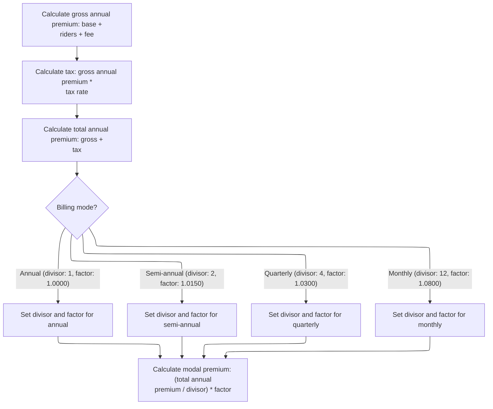

This section calculates the total premium for a term life insurance policy, including all adjustments for riders, fees, tax, and billing frequency. It ensures that the billed amount reflects the correct payment mode and regulatory tax requirements.

| Rule ID | Category        | Rule Name                        | Description                                                                                                                                                                                                                                                                                                                                                                                                                                                                                                                                                                                                                                                                                                                                                                                   | Implementation Details                                                                                                                                                                                                                                                                                                                                                                                                                                                                                                                                                                                                                                                                            |
| ------- | --------------- | -------------------------------- | --------------------------------------------------------------------------------------------------------------------------------------------------------------------------------------------------------------------------------------------------------------------------------------------------------------------------------------------------------------------------------------------------------------------------------------------------------------------------------------------------------------------------------------------------------------------------------------------------------------------------------------------------------------------------------------------------------------------------------------------------------------------------------------------- | ------------------------------------------------------------------------------------------------------------------------------------------------------------------------------------------------------------------------------------------------------------------------------------------------------------------------------------------------------------------------------------------------------------------------------------------------------------------------------------------------------------------------------------------------------------------------------------------------------------------------------------------------------------------------------------------------- |
| BR-001  | Calculation     | Gross annual premium calculation | The gross annual premium is calculated as the sum of the base annual premium, all rider premiums, and the annual policy fee.                                                                                                                                                                                                                                                                                                                                                                                                                                                                                                                                                                                                                                                                  | The gross annual premium includes the base premium, all rider premiums, and the policy fee. The policy fee is 45.00 for 10-year term, 55.00 for 20-year term, and 60.00 otherwise. The output is a number representing the gross annual premium, rounded to the nearest cent.                                                                                                                                                                                                                                                                                                                                                                                                                     |
| BR-002  | Calculation     | Tax calculation                  | The tax amount is calculated by multiplying the gross annual premium by the tax rate.                                                                                                                                                                                                                                                                                                                                                                                                                                                                                                                                                                                                                                                                                                         | The tax rate is <SwmToken path="NB-UW-001.cob" pos="126:3:5" line-data="                 MOVE 0.0200 TO PM-TAX-RATE">`0.0200`</SwmToken> for all plan terms. The output is a number representing the tax amount, rounded to the nearest cent.                                                                                                                                                                                                                                                                                                                                                                                                                                                     |
| BR-003  | Calculation     | Total annual premium calculation | The total annual premium is calculated as the sum of the gross annual premium and the tax amount.                                                                                                                                                                                                                                                                                                                                                                                                                                                                                                                                                                                                                                                                                             | The output is a number representing the total annual premium, rounded to the nearest cent.                                                                                                                                                                                                                                                                                                                                                                                                                                                                                                                                                                                                        |
| BR-004  | Calculation     | Modal premium calculation        | The modal premium is calculated by dividing the total annual premium by the divisor for the billing mode and multiplying by the corresponding load factor.                                                                                                                                                                                                                                                                                                                                                                                                                                                                                                                                                                                                                                    | The output is a number representing the modal premium, rounded to the nearest cent. The modal premium is the amount billed per payment period.                                                                                                                                                                                                                                                                                                                                                                                                                                                                                                                                                    |
| BR-005  | Decision Making | Billing mode adjustment          | The billing mode determines the divisor and load factor used to adjust the annual premium for payment frequency. Annual mode uses divisor 1 and factor <SwmToken path="NB-UW-001.cob" pos="275:3:5" line-data="              MOVE 1.0000 TO PM-GENDER-FACTOR">`1.0000`</SwmToken>, semi-annual uses divisor 2 and factor <SwmToken path="NB-UW-001.cob" pos="421:3:5" line-data="                 MOVE 1.0150 TO WS-MODAL-FACTOR">`1.0150`</SwmToken>, quarterly uses divisor 4 and factor <SwmToken path="NB-UW-001.cob" pos="424:3:5" line-data="                 MOVE 1.0300 TO WS-MODAL-FACTOR">`1.0300`</SwmToken>, and monthly uses divisor 12 and factor <SwmToken path="NB-UW-001.cob" pos="427:3:5" line-data="                 MOVE 1.0800 TO WS-MODAL-FACTOR">`1.0800`</SwmToken>. | Divisor and factor values: Annual (1, <SwmToken path="NB-UW-001.cob" pos="275:3:5" line-data="              MOVE 1.0000 TO PM-GENDER-FACTOR">`1.0000`</SwmToken>), Semi-annual (2, <SwmToken path="NB-UW-001.cob" pos="421:3:5" line-data="                 MOVE 1.0150 TO WS-MODAL-FACTOR">`1.0150`</SwmToken>), Quarterly (4, <SwmToken path="NB-UW-001.cob" pos="424:3:5" line-data="                 MOVE 1.0300 TO WS-MODAL-FACTOR">`1.0300`</SwmToken>), Monthly (12, <SwmToken path="NB-UW-001.cob" pos="427:3:5" line-data="                 MOVE 1.0800 TO WS-MODAL-FACTOR">`1.0800`</SwmToken>). These constants are used to adjust the total annual premium for the payment frequency. |

<SwmSnippet path="/NB-UW-001.cob" line="400">

---

In <SwmToken path="NB-UW-001.cob" pos="400:1:7" line-data="       1800-CALCULATE-TOTAL-PREMIUM.">`1800-CALCULATE-TOTAL-PREMIUM`</SwmToken>, we sum up the base premium, rider premiums, and policy fee to get the gross annual premium. Then we calculate tax on that amount and add it to get the total annual premium before billing adjustments.

```cobol
       1800-CALCULATE-TOTAL-PREMIUM.
      * NB-801: Gross annual premium includes base, riders, and fee.
           COMPUTE PM-GROSS-ANNUAL-PREMIUM ROUNDED =
                   PM-BASE-ANNUAL-PREMIUM
                 + PM-RIDER-ANNUAL-TOTAL
                 + PM-POLICY-FEE-ANNUAL

      * NB-802: Tax is calculated on the gross annual premium.
           COMPUTE PM-TAX-AMOUNT ROUNDED =
                   PM-GROSS-ANNUAL-PREMIUM * PM-TAX-RATE

           COMPUTE PM-TOTAL-ANNUAL-PREMIUM ROUNDED =
                   PM-GROSS-ANNUAL-PREMIUM + PM-TAX-AMOUNT
```

---

</SwmSnippet>

<SwmSnippet path="/NB-UW-001.cob" line="415">

---

After calculating the total annual premium, we set the modal divisor and load factor based on the billing mode. This adjusts the premium for payment frequency, using domain-specific constants for each mode.

```cobol
           EVALUATE TRUE
              WHEN PM-MODE-ANNUAL
                 MOVE 1 TO WS-MODAL-DIVISOR
                 MOVE 1.0000 TO WS-MODAL-FACTOR
              WHEN PM-MODE-SEMI
                 MOVE 2 TO WS-MODAL-DIVISOR
                 MOVE 1.0150 TO WS-MODAL-FACTOR
              WHEN PM-MODE-QUARTERLY
                 MOVE 4 TO WS-MODAL-DIVISOR
                 MOVE 1.0300 TO WS-MODAL-FACTOR
              WHEN PM-MODE-MONTHLY
                 MOVE 12 TO WS-MODAL-DIVISOR
                 MOVE 1.0800 TO WS-MODAL-FACTOR
           END-EVALUATE
```

---

</SwmSnippet>

<SwmSnippet path="/NB-UW-001.cob" line="430">

---

After setting the divisor and factor, we calculate the modal premium by dividing the total annual premium and multiplying by the load factor. This gives the actual amount billed per payment period.

```cobol
           COMPUTE PM-MODAL-PREMIUM ROUNDED =
                   (PM-TOTAL-ANNUAL-PREMIUM / WS-MODAL-DIVISOR)
                 * WS-MODAL-FACTOR.
```

---

</SwmSnippet>

## Referral and issuance decision

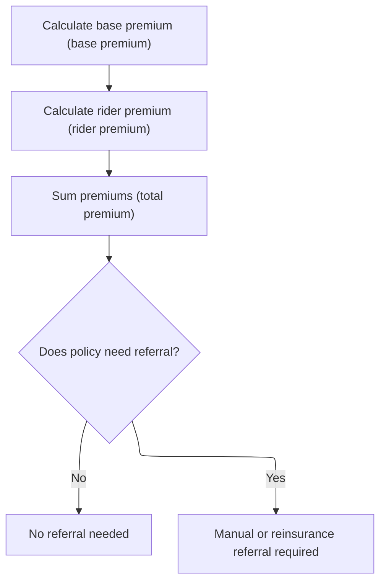

This section determines if a policy application should be referred for manual underwriting or reinsurance review based on calculated premiums and risk indicators. It ensures that policies meeting certain criteria are flagged for additional review before issuance.

| Rule ID | Category        | Rule Name                 | Description                                                                                                                                          | Implementation Details                                                                                                                               |
| ------- | --------------- | ------------------------- | ---------------------------------------------------------------------------------------------------------------------------------------------------- | ---------------------------------------------------------------------------------------------------------------------------------------------------- |
| BR-001  | Calculation     | Base premium calculation  | The base premium for the policy is calculated according to the plan parameters and insured attributes.                                               | The base premium is a numeric value calculated based on plan rules and insured data. The exact calculation formula is not specified in this section. |
| BR-002  | Calculation     | Rider premium calculation | The rider premium is calculated for any additional riders attached to the policy.                                                                    | The rider premium is a numeric value representing the cost of additional coverage. The calculation depends on the riders selected.                   |
| BR-003  | Calculation     | Total premium calculation | The total premium is calculated as the sum of the base premium and all rider premiums.                                                               | The total premium is a numeric value representing the sum of all premiums for the policy.                                                            |
| BR-004  | Decision Making | Referral decision         | A referral decision is made to determine if the policy requires manual underwriting or reinsurance review based on calculated values and risk flags. | The referral outcome is indicated by flags for manual underwriting or reinsurance referral. If neither is set, no referral is required.              |

<SwmSnippet path="/NB-UW-001.cob" line="68">

---

Back in <SwmToken path="NB-UW-001.cob" pos="42:1:3" line-data="       MAIN-PROCESS.">`MAIN-PROCESS`</SwmToken>, after calculating the total premium, we call <SwmToken path="NB-UW-001.cob" pos="71:3:7" line-data="           PERFORM 1900-EVALUATE-REFERRALS">`1900-EVALUATE-REFERRALS`</SwmToken> to check if the policy needs manual underwriting or reinsurance review. This step uses the calculated values and risk flags to decide if the case should be referred.

```cobol
           PERFORM 1600-CALCULATE-BASE-PREMIUM
           PERFORM 1700-CALCULATE-RIDER-PREMIUM
           PERFORM 1800-CALCULATE-TOTAL-PREMIUM
           PERFORM 1900-EVALUATE-REFERRALS
```

---

</SwmSnippet>

## Referral checks for high-risk cases

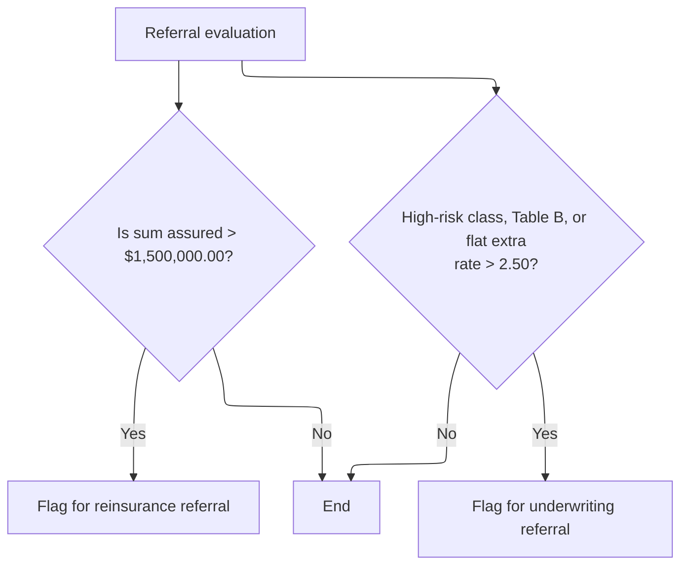

This section determines if a policy application should be referred for reinsurance or manual underwriting based on high-risk criteria. It enforces business thresholds for large sums assured and elevated risk factors.

| Rule ID | Category        | Rule Name                                         | Description                                                                                                                                                                        | Implementation Details                                                                                                                                                                                                                                        |
| ------- | --------------- | ------------------------------------------------- | ---------------------------------------------------------------------------------------------------------------------------------------------------------------------------------- | ------------------------------------------------------------------------------------------------------------------------------------------------------------------------------------------------------------------------------------------------------------- |
| BR-001  | Decision Making | Large sum assured reinsurance referral            | If the sum assured for a policy application exceeds $1,500,000.00, the case is flagged for reinsurance referral.                                                                   | The threshold for referral is $1,500,000.00. The output is a referral flag set to 'Y' (yes) when the condition is met. The flag is a single character string.                                                                                                 |
| BR-002  | Decision Making | High-risk or special rating underwriting referral | If the policy application is classified as high-risk, has a table rating of 'B', or has a flat extra rate greater than 2.50, the case is flagged for manual underwriting referral. | High-risk is indicated by a risk indicator set to 'Y'. Table B is indicated by a class value of 'TB'. The flat extra rate threshold is 2.50. The output is a referral flag set to 'Y' (yes) when any condition is met. The flag is a single character string. |

<SwmSnippet path="/NB-UW-001.cob" line="434">

---

In <SwmToken path="NB-UW-001.cob" pos="434:1:5" line-data="       1900-EVALUATE-REFERRALS.">`1900-EVALUATE-REFERRALS`</SwmToken>, we check if the sum assured or risk factors exceed business-defined thresholds. If so, we flag the case for reinsurance or manual underwriting referral. The constants used are set by business rules and aren't arbitrary.

```cobol
       1900-EVALUATE-REFERRALS.
      * NB-901: Large cases require facultative reinsurance review.
           IF PM-SUM-ASSURED > 0001500000000.00
              MOVE 'Y' TO WS-REINSURANCE-REFERRAL
           END-IF
```

---

</SwmSnippet>

<SwmSnippet path="/NB-UW-001.cob" line="441">

---

After checking the thresholds, we set referral flags that <SwmToken path="NB-UW-001.cob" pos="42:1:3" line-data="       MAIN-PROCESS.">`MAIN-PROCESS`</SwmToken> uses to decide if the policy needs manual review or reinsurance. These flags control the next step in the flow.

```cobol
           IF PM-UW-TABLE-B OR PM-HIGH-RISK-AVOC OR
              PM-FLAT-EXTRA-RATE > 00002.50
              MOVE 'Y' TO WS-UW-REFERRAL
           END-IF.
```

---

</SwmSnippet>

## Final outcome and policy issuance

This section determines the final outcome of the new business process by checking referral flags and either marking the policy as referred or issuing the policy. It sets all relevant output fields and communicates the result to downstream processes.

| Rule ID | Category        | Rule Name                        | Description                                                                                                                                                                                                                                                                                               | Implementation Details                                                                                                                                                                                       |
| ------- | --------------- | -------------------------------- | --------------------------------------------------------------------------------------------------------------------------------------------------------------------------------------------------------------------------------------------------------------------------------------------------------- | ------------------------------------------------------------------------------------------------------------------------------------------------------------------------------------------------------------ |
| BR-001  | Calculation     | Policy issuance and date setting | When issuing a policy, all key dates (issue, effective, paid-to, last maintenance) are set to the process date. The expiry date is calculated by adding the number of term years times 365 days to the effective date. The contract status is set to 'AC' (active).                                       | All key dates are set to the process date (8-digit number). The expiry date is calculated as effective date plus (term years \* 365 days), ignoring leap years. The contract status is set to 'AC' (active). |
| BR-002  | Decision Making | Referral outcome handling        | If the policy is flagged for manual underwriting or reinsurance referral, the policy is marked as referred, the result code is set to 2, the result message is set to 'REFERRED FOR MANUAL UW OR REINSURANCE REVIEW', and the contract status is set to 'PE'. The process then returns success and exits. | The result code is set to 2. The result message is set to 'REFERRED FOR MANUAL UW OR REINSURANCE REVIEW'. The contract status is set to 'PE' (pending).                                                      |
| BR-003  | Writing Output  | Successful issuance outcome      | After a successful policy issuance, the result code is set to 0 and the result message is set to 'POLICY ISSUED SUCCESSFULLY'. The process then calls the success return routine and exits.                                                                                                               | The result code is set to 0. The result message is set to 'POLICY ISSUED SUCCESSFULLY'.                                                                                                                      |

<SwmSnippet path="/NB-UW-001.cob" line="73">

---

After returning from <SwmToken path="NB-UW-001.cob" pos="71:3:7" line-data="           PERFORM 1900-EVALUATE-REFERRALS">`1900-EVALUATE-REFERRALS`</SwmToken>, <SwmToken path="NB-UW-001.cob" pos="42:1:3" line-data="       MAIN-PROCESS.">`MAIN-PROCESS`</SwmToken> checks the referral flags. If set, it marks the policy as referred, sets the result code and message, and exits. Otherwise, it moves on to issue the policy.

```cobol
           IF WS-REFERRED OR WS-MANUAL-UW
              MOVE 2 TO WS-RESULT-CODE
              MOVE "REFERRED FOR MANUAL UW OR REINSURANCE REVIEW"
                TO WS-RESULT-MESSAGE
              MOVE "PE" TO PM-CONTRACT-STATUS
              PERFORM 9100-RETURN-SUCCESS
              GOBACK
           END-IF
```

---

</SwmSnippet>

<SwmSnippet path="/NB-UW-001.cob" line="82">

---

We call the issuance routine to activate the policy and set key dates.

```cobol
           PERFORM 2000-ISSUE-POLICY
```

---

</SwmSnippet>

<SwmSnippet path="/NB-UW-001.cob" line="446">

---

<SwmToken path="NB-UW-001.cob" pos="446:1:5" line-data="       2000-ISSUE-POLICY.">`2000-ISSUE-POLICY`</SwmToken> sets all key dates to the process date, calculates the expiry date by adding term years times 365 days, and marks the contract as active ('AC'). This approach ignores leap years for simplicity.

```cobol
       2000-ISSUE-POLICY.
      * NB-1001: Successful issue sets policy active and populates dates.
           MOVE PM-PROCESS-DATE TO PM-ISSUE-DATE
                                 PM-EFFECTIVE-DATE
                                 PM-PAID-TO-DATE
                                 PM-LAST-MAINT-DATE
           COMPUTE WS-DATE-INT = FUNCTION INTEGER-OF-DATE(PM-EFFECTIVE-DATE)
                               + (PM-TERM-YEARS * 365)
           MOVE FUNCTION DATE-OF-INTEGER(WS-DATE-INT) TO PM-EXPIRY-DATE
           MOVE "AC" TO PM-CONTRACT-STATUS.
```

---

</SwmSnippet>

<SwmSnippet path="/NB-UW-001.cob" line="83">

---

After returning from <SwmToken path="NB-UW-001.cob" pos="82:3:7" line-data="           PERFORM 2000-ISSUE-POLICY">`2000-ISSUE-POLICY`</SwmToken>, <SwmToken path="NB-UW-001.cob" pos="42:1:3" line-data="       MAIN-PROCESS.">`MAIN-PROCESS`</SwmToken> sets the result code and message for a successful issuance, calls the success routine, and exits. The flow depends on global variables updated throughout the process, so each step relies on the state set by previous routines.

```cobol
           MOVE 0 TO WS-RESULT-CODE
           MOVE "POLICY ISSUED SUCCESSFULLY" TO WS-RESULT-MESSAGE
           PERFORM 9100-RETURN-SUCCESS
           GOBACK.
```

---

</SwmSnippet>

&nbsp;

*This is an auto-generated document by Swimm 🌊 and has not yet been verified by a human*

<SwmMeta version="3.0.0" repo-id="Z2l0aHViJTNBJTNBQ09CT0xfU2FtcGxlX01hcmNoXzIwMjYlM0ElM0FtdWRhc2luMQ==" repo-name="COBOL_Sample_March_2026"><sup>Powered by [Swimm](https://app.swimm.io/)</sup></SwmMeta>
