# Overview

This document explains the flow of processing policy amendments for term life insurance. Policy servicing requests are evaluated for eligibility, routed to the appropriate amendment process, repriced, and updated in the policy record. The flow returns messages and fees based on the outcome.

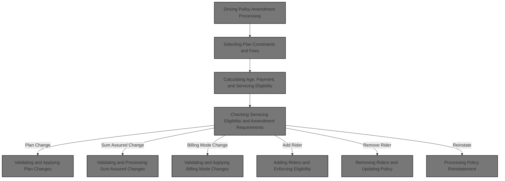

## Dependencies

### Program

- <SwmToken path="cobol/SVC-BILL-001.cob" pos="2:6:6" line-data="       PROGRAM-ID. SVCBILL001.">`SVCBILL001`</SwmToken> (<SwmPath>[cobol/SVC-BILL-001.cob](cobol/SVC-BILL-001.cob)</SwmPath>)

### Copybook

- POLDATA (<SwmPath>[cpy/POLDATA.cpy](cpy/POLDATA.cpy)</SwmPath>)

# Where is this program used?

This program is used once, as represented in the following diagram:

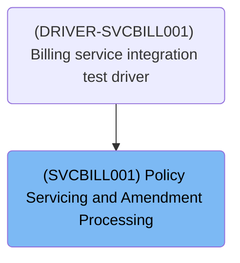

# Workflow

# Driving Policy Amendment Processing

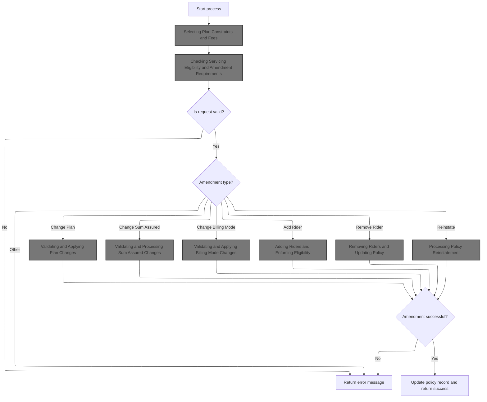

This section governs the business logic for processing policy amendments, including eligibility checks, amendment type routing, validation, and updating policy records or returning errors.

| Rule ID | Category        | Rule Name                         | Description                                                                                                                                                       | Implementation Details                                                                                                                                         |
| ------- | --------------- | --------------------------------- | ----------------------------------------------------------------------------------------------------------------------------------------------------------------- | -------------------------------------------------------------------------------------------------------------------------------------------------------------- |
| BR-001  | Data validation | Servicing eligibility restriction | If the policy status is claimed or terminated, servicing requests are rejected and an error message is returned.                                                  | Policy status values: 'CL' (claimed), 'TE' (terminated). Error message format: string up to 100 characters.                                                    |
| BR-002  | Data validation | Amendment type required           | If no amendment type is provided in a servicing request, the request is rejected with an error message.                                                           | Amendment type values: 'PL', 'SA', 'BM', 'AR', 'RR', 'RI'. Error message format: string up to 100 characters.                                                  |
| BR-003  | Decision Making | Amendment type routing            | The amendment type determines which processing logic is invoked: plan change, sum assured change, billing mode change, add rider, remove rider, or reinstatement. | Supported amendment types: 'PL' (plan change), 'SA' (sum assured change), 'BM' (billing mode change), 'AR' (add rider), 'RR' (remove rider), 'RI' (reinstate). |
| BR-004  | Writing Output  | Successful amendment update       | If an amendment is processed successfully, the policy record is updated and a success message is returned.                                                        | Success message format: string up to 100 characters. Policy record fields updated: last action date, last action user, last maintenance date.                  |
| BR-005  | Writing Output  | Failed amendment error handling   | If an amendment fails validation or processing, an error message is returned and no policy update occurs.                                                         | Error message format: string up to 100 characters. No update to policy record fields.                                                                          |

<SwmSnippet path="/cobol/SVC-BILL-001.cob" line="36">

---

In <SwmToken path="cobol/SVC-BILL-001.cob" pos="36:1:3" line-data="       MAIN-PROCESS.">`MAIN-PROCESS`</SwmToken>, we kick off the amendment flow by initializing, then immediately call <SwmToken path="cobol/SVC-BILL-001.cob" pos="38:3:9" line-data="           PERFORM 1100-LOAD-PLAN-PARAMETERS">`1100-LOAD-PLAN-PARAMETERS`</SwmToken> to pull in all the plan-specific limits and fees. This sets up the context for every downstream check and calculation, so nothing breaks if the plan code is invalid or unsupported.

```cobol
       MAIN-PROCESS.
           PERFORM 1000-INITIALIZE
           PERFORM 1100-LOAD-PLAN-PARAMETERS
           PERFORM 1200-CALCULATE-ATTAINED-AGE
           PERFORM 1300-EVALUATE-PAYMENT-STATUS
           PERFORM 1400-VALIDATE-SERVICING-REQUEST
```

---

</SwmSnippet>

## Selecting Plan Constraints and Fees

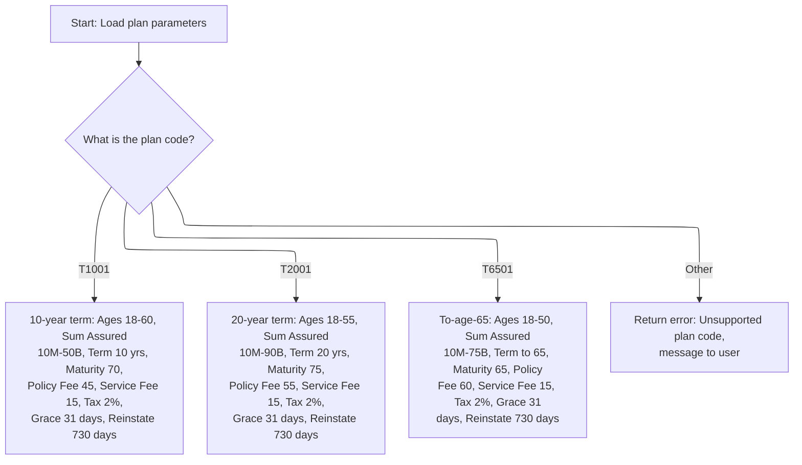

This section selects plan-specific constraints and fees for term life insurance policies based on the plan code. It ensures that downstream processes receive the correct parameters for eligibility, pricing, and servicing.

| Rule ID | Category        | Rule Name                                                                                                                                 | Description                                                                                                                                                                                                                                                                                                                                                                                                                                                                   | Implementation Details                                                                                                                                                                                                                                                                                                                                                                                                                                                                                                                                                                                                                                                                                                               |
| ------- | --------------- | ----------------------------------------------------------------------------------------------------------------------------------------- | ----------------------------------------------------------------------------------------------------------------------------------------------------------------------------------------------------------------------------------------------------------------------------------------------------------------------------------------------------------------------------------------------------------------------------------------------------------------------------- | ------------------------------------------------------------------------------------------------------------------------------------------------------------------------------------------------------------------------------------------------------------------------------------------------------------------------------------------------------------------------------------------------------------------------------------------------------------------------------------------------------------------------------------------------------------------------------------------------------------------------------------------------------------------------------------------------------------------------------------ |
| BR-001  | Data validation | Unsupported plan code error                                                                                                               | If the plan code is not <SwmToken path="cobol/SVC-BILL-001.cob" pos="89:4:4" line-data="              WHEN &quot;T1001&quot;">`T1001`</SwmToken>, <SwmToken path="cobol/SVC-BILL-001.cob" pos="101:4:4" line-data="              WHEN &quot;T2001&quot;">`T2001`</SwmToken>, or <SwmToken path="cobol/SVC-BILL-001.cob" pos="113:4:4" line-data="              WHEN &quot;T6501&quot;">`T6501`</SwmToken>, return error code 11 and message 'UNSUPPORTED EXISTING PLAN CODE'. | Error code: 11 (number, 2 digits). Error message: 'UNSUPPORTED EXISTING PLAN CODE' (string, up to 100 characters).                                                                                                                                                                                                                                                                                                                                                                                                                                                                                                                                                                                                                   |
| BR-002  | Decision Making | <SwmToken path="cobol/SVC-BILL-001.cob" pos="89:4:4" line-data="              WHEN &quot;T1001&quot;">`T1001`</SwmToken> plan parameters  | For plan code <SwmToken path="cobol/SVC-BILL-001.cob" pos="89:4:4" line-data="              WHEN &quot;T1001&quot;">`T1001`</SwmToken>, assign the following parameters: minimum issue age 18, maximum issue age 60, minimum sum assured 10,000,000.00, maximum sum assured 50,000,000,000.00, term 10 years, maturity age 70, grace period 31 days, reinstatement period 730 days, annual policy fee 45.00, standard service fee 15.00, tax rate 2%.                         | Minimum issue age: 18 (number, 3 digits). Maximum issue age: 60 (number, 3 digits). Minimum sum assured: 10,000,000.00 (number, 13 digits including 2 decimals). Maximum sum assured: 50,000,000,000.00 (number, 13 digits including 2 decimals). Term years: 10 (number, 3 digits). Maturity age: 70 (number, 3 digits). Grace days: 31 (number, 3 digits). Reinstatement days: 730 (number, 3 digits). Policy fee annual: 45.00 (number, 7 digits including 2 decimals). Service fee standard: 15.00 (number, 7 digits including 2 decimals). Tax rate: <SwmToken path="cobol/SVC-BILL-001.cob" pos="100:3:5" line-data="                 MOVE 0.0200 TO PM-TAX-RATE">`0.0200`</SwmToken> (number, 6 digits including 4 decimals). |
| BR-003  | Decision Making | <SwmToken path="cobol/SVC-BILL-001.cob" pos="101:4:4" line-data="              WHEN &quot;T2001&quot;">`T2001`</SwmToken> plan parameters | For plan code <SwmToken path="cobol/SVC-BILL-001.cob" pos="101:4:4" line-data="              WHEN &quot;T2001&quot;">`T2001`</SwmToken>, assign the following parameters: minimum issue age 18, maximum issue age 55, minimum sum assured 10,000,000.00, maximum sum assured 90,000,000,000.00, term 20 years, maturity age 75, grace period 31 days, reinstatement period 730 days, annual policy fee 55.00, standard service fee 15.00, tax rate 2%.                        | Minimum issue age: 18 (number, 3 digits). Maximum issue age: 55 (number, 3 digits). Minimum sum assured: 10,000,000.00 (number, 13 digits including 2 decimals). Maximum sum assured: 90,000,000,000.00 (number, 13 digits including 2 decimals). Term years: 20 (number, 3 digits). Maturity age: 75 (number, 3 digits). Grace days: 31 (number, 3 digits). Reinstatement days: 730 (number, 3 digits). Policy fee annual: 55.00 (number, 7 digits including 2 decimals). Service fee standard: 15.00 (number, 7 digits including 2 decimals). Tax rate: <SwmToken path="cobol/SVC-BILL-001.cob" pos="100:3:5" line-data="                 MOVE 0.0200 TO PM-TAX-RATE">`0.0200`</SwmToken> (number, 6 digits including 4 decimals). |
| BR-004  | Decision Making | <SwmToken path="cobol/SVC-BILL-001.cob" pos="113:4:4" line-data="              WHEN &quot;T6501&quot;">`T6501`</SwmToken> plan parameters | For plan code <SwmToken path="cobol/SVC-BILL-001.cob" pos="113:4:4" line-data="              WHEN &quot;T6501&quot;">`T6501`</SwmToken>, assign the following parameters: minimum issue age 18, maximum issue age 50, minimum sum assured 10,000,000.00, maximum sum assured 75,000,000,000.00, maturity age 65, grace period 31 days, reinstatement period 730 days, annual policy fee 60.00, standard service fee 15.00, tax rate 2%.                                       | Minimum issue age: 18 (number, 3 digits). Maximum issue age: 50 (number, 3 digits). Minimum sum assured: 10,000,000.00 (number, 13 digits including 2 decimals). Maximum sum assured: 75,000,000,000.00 (number, 13 digits including 2 decimals). Maturity age: 65 (number, 3 digits). Grace days: 31 (number, 3 digits). Reinstatement days: 730 (number, 3 digits). Policy fee annual: 60.00 (number, 7 digits including 2 decimals). Service fee standard: 15.00 (number, 7 digits including 2 decimals). Tax rate: <SwmToken path="cobol/SVC-BILL-001.cob" pos="100:3:5" line-data="                 MOVE 0.0200 TO PM-TAX-RATE">`0.0200`</SwmToken> (number, 6 digits including 4 decimals).                                    |

<SwmSnippet path="/cobol/SVC-BILL-001.cob" line="86">

---

In <SwmToken path="cobol/SVC-BILL-001.cob" pos="86:1:7" line-data="       1100-LOAD-PLAN-PARAMETERS.">`1100-LOAD-PLAN-PARAMETERS`</SwmToken>, we use EVALUATE to pick out all the plan-specific constraints and fees based on <SwmToken path="cobol/SVC-BILL-001.cob" pos="88:3:7" line-data="           EVALUATE PM-PLAN-CODE">`PM-PLAN-CODE`</SwmToken>. Each plan gets its own set of constants for age, coverage, fees, and terms. If the code doesn't match, we bail out with an error.

```cobol
       1100-LOAD-PLAN-PARAMETERS.
      * SV-101: Servicing uses the same plan parameters as issue.
           EVALUATE PM-PLAN-CODE
              WHEN "T1001"
                 MOVE 018 TO PM-MIN-ISSUE-AGE
                 MOVE 060 TO PM-MAX-ISSUE-AGE
                 MOVE 10000000.00 TO PM-MIN-SUM-ASSURED
                 MOVE 50000000000.00 TO PM-MAX-SUM-ASSURED
                 MOVE 010 TO PM-TERM-YEARS
                 MOVE 070 TO PM-MATURITY-AGE
                 MOVE 031 TO PM-GRACE-DAYS
                 MOVE 730 TO PM-REINSTATE-DAYS
                 MOVE 0000045.00 TO PM-POLICY-FEE-ANNUAL
                 MOVE 0000015.00 TO PM-SERVICE-FEE-STD
                 MOVE 0.0200 TO PM-TAX-RATE
```

---

</SwmSnippet>

<SwmSnippet path="/cobol/SVC-BILL-001.cob" line="101">

---

This section handles the <SwmToken path="cobol/SVC-BILL-001.cob" pos="101:4:4" line-data="              WHEN &quot;T2001&quot;">`T2001`</SwmToken> plan code, assigning its unique limits and fees. It follows the <SwmToken path="cobol/SVC-BILL-001.cob" pos="89:4:4" line-data="              WHEN &quot;T1001&quot;">`T1001`</SwmToken> block and sets up for the next plan code (<SwmToken path="cobol/SVC-BILL-001.cob" pos="113:4:4" line-data="              WHEN &quot;T6501&quot;">`T6501`</SwmToken>), keeping the selection logic tight and sequential.

```cobol
              WHEN "T2001"
                 MOVE 018 TO PM-MIN-ISSUE-AGE
                 MOVE 055 TO PM-MAX-ISSUE-AGE
                 MOVE 10000000.00 TO PM-MIN-SUM-ASSURED
                 MOVE 90000000000.00 TO PM-MAX-SUM-ASSURED
                 MOVE 020 TO PM-TERM-YEARS
                 MOVE 075 TO PM-MATURITY-AGE
                 MOVE 031 TO PM-GRACE-DAYS
                 MOVE 730 TO PM-REINSTATE-DAYS
                 MOVE 0000055.00 TO PM-POLICY-FEE-ANNUAL
                 MOVE 0000015.00 TO PM-SERVICE-FEE-STD
                 MOVE 0.0200 TO PM-TAX-RATE
```

---

</SwmSnippet>

<SwmSnippet path="/cobol/SVC-BILL-001.cob" line="113">

---

Here we set parameters for <SwmToken path="cobol/SVC-BILL-001.cob" pos="113:4:4" line-data="              WHEN &quot;T6501&quot;">`T6501`</SwmToken>, right after <SwmToken path="cobol/SVC-BILL-001.cob" pos="101:4:4" line-data="              WHEN &quot;T2001&quot;">`T2001`</SwmToken>. This is the last plan-specific block before handling unsupported codes, so it closes out the main selection logic.

```cobol
              WHEN "T6501"
                 MOVE 018 TO PM-MIN-ISSUE-AGE
                 MOVE 050 TO PM-MAX-ISSUE-AGE
                 MOVE 10000000.00 TO PM-MIN-SUM-ASSURED
                 MOVE 75000000000.00 TO PM-MAX-SUM-ASSURED
                 MOVE 065 TO PM-MATURITY-AGE
                 MOVE 031 TO PM-GRACE-DAYS
                 MOVE 730 TO PM-REINSTATE-DAYS
                 MOVE 0000060.00 TO PM-POLICY-FEE-ANNUAL
                 MOVE 0000015.00 TO PM-SERVICE-FEE-STD
                 MOVE 0.0200 TO PM-TAX-RATE
```

---

</SwmSnippet>

<SwmSnippet path="/cobol/SVC-BILL-001.cob" line="124">

---

If the plan code isn't matched, we return an error code and message. Otherwise, we output all the plan parameters needed for downstream checks and pricing.

```cobol
              WHEN OTHER
                 MOVE 11 TO PM-RETURN-CODE
                 MOVE "UNSUPPORTED EXISTING PLAN CODE"
                   TO PM-RETURN-MESSAGE
           END-EVALUATE.
```

---

</SwmSnippet>

## Calculating Age, Payment, and Servicing Eligibility

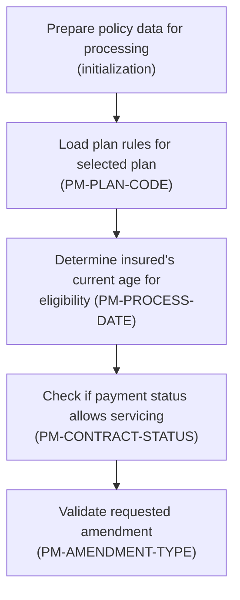

This section determines whether a policy is eligible for servicing by calculating the insured's age, checking payment status, and validating the requested amendment type against plan rules and contract status.

| Rule ID | Category        | Rule Name                  | Description                                                                                                                                                                                                                | Implementation Details                                                                                                                                       |
| ------- | --------------- | -------------------------- | -------------------------------------------------------------------------------------------------------------------------------------------------------------------------------------------------------------------------- | ------------------------------------------------------------------------------------------------------------------------------------------------------------ |
| BR-001  | Data validation | Amendment type validation  | Requested amendments are validated against allowed amendment types. Only amendment types 'AR', 'BM', 'PL', 'SA', 'RI', and 'RR' are accepted for servicing.                                                                | Allowed amendment types are 'AR', 'BM', 'PL', 'SA', 'RI', 'RR'. Amendment type is a string of 2 characters.                                                  |
| BR-002  | Calculation     | Age eligibility check      | Eligibility for servicing is determined by the insured's attained age, which is calculated using the process date and plan parameters. The age must fall within the minimum and maximum issue ages specified for the plan. | Minimum and maximum issue ages are defined in the plan parameters as numbers. The attained age is a number calculated from the process date and policy data. |
| BR-003  | Decision Making | Payment status eligibility | Servicing eligibility requires the policy's payment status to be in an allowed state. Only policies with contract status 'AC' (Active), 'GR' (Grace), or 'RS' (Reinstated) are eligible for servicing.                     | Allowed contract statuses are 'AC', 'GR', and 'RS'. Status is a string of 2 characters.                                                                      |

<SwmSnippet path="/cobol/SVC-BILL-001.cob" line="36">

---

Back in <SwmToken path="cobol/SVC-BILL-001.cob" pos="36:1:3" line-data="       MAIN-PROCESS.">`MAIN-PROCESS`</SwmToken>, after loading plan parameters, we calculate age and payment status, then call <SwmToken path="cobol/SVC-BILL-001.cob" pos="41:3:9" line-data="           PERFORM 1400-VALIDATE-SERVICING-REQUEST">`1400-VALIDATE-SERVICING-REQUEST`</SwmToken> to check if the policy can actually be serviced. If validation fails, we stop right there.

```cobol
       MAIN-PROCESS.
           PERFORM 1000-INITIALIZE
           PERFORM 1100-LOAD-PLAN-PARAMETERS
           PERFORM 1200-CALCULATE-ATTAINED-AGE
           PERFORM 1300-EVALUATE-PAYMENT-STATUS
           PERFORM 1400-VALIDATE-SERVICING-REQUEST
```

---

</SwmSnippet>

## Checking Servicing Eligibility and Amendment Requirements

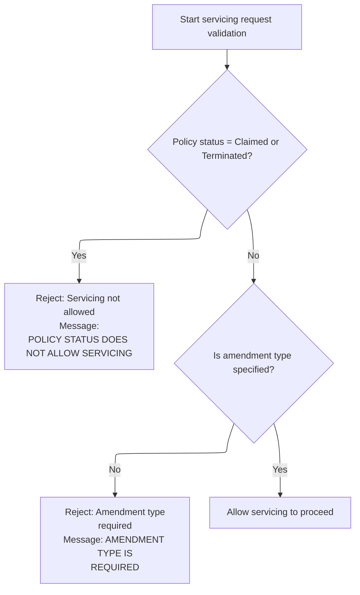

This section governs whether a servicing request is eligible to proceed based on policy status and amendment requirements.

| Rule ID | Category        | Rule Name                  | Description                                                                                                                                                                            | Implementation Details                                                                                                                                                                 |
| ------- | --------------- | -------------------------- | -------------------------------------------------------------------------------------------------------------------------------------------------------------------------------------- | -------------------------------------------------------------------------------------------------------------------------------------------------------------------------------------- |
| BR-001  | Data validation | Policy status eligibility  | Servicing requests are blocked if the policy status is 'Claimed' or 'Terminated'. An error code and message are returned to indicate that servicing is not allowed for these statuses. | Error code returned is 12. Error message is 'POLICY STATUS DOES NOT ALLOW SERVICING'. The error code is a number (4 digits), and the error message is a string (up to 100 characters). |
| BR-002  | Data validation | Amendment type requirement | Servicing requests require an amendment type to be specified. If the amendment type is missing, an error code and message are returned.                                                | Error code returned is 13. Error message is 'AMENDMENT TYPE IS REQUIRED'. The error code is a number (4 digits), and the error message is a string (up to 100 characters).             |
| BR-003  | Decision Making | Servicing allowed          | If the policy status is not 'Claimed' or 'Terminated' and amendment type is specified, servicing is allowed to proceed.                                                                | No error code or message is returned. Processing continues to the next step.                                                                                                           |

<SwmSnippet path="/cobol/SVC-BILL-001.cob" line="166">

---

In <SwmToken path="cobol/SVC-BILL-001.cob" pos="166:1:7" line-data="       1400-VALIDATE-SERVICING-REQUEST.">`1400-VALIDATE-SERVICING-REQUEST`</SwmToken>, we block servicing if the policy is claimed or terminated, and bail out with an error if no amendment type is provided. These checks use hardcoded return codes and messages to signal why servicing can't proceed.

```cobol
       1400-VALIDATE-SERVICING-REQUEST.
      * SV-301: Claimed or terminated policies cannot be amended.
           IF PM-STAT-CLAIMED OR PM-STAT-TERMINATED
              MOVE 12 TO PM-RETURN-CODE
              MOVE "POLICY STATUS DOES NOT ALLOW SERVICING"
                TO PM-RETURN-MESSAGE
              EXIT PARAGRAPH
           END-IF
```

---

</SwmSnippet>

<SwmSnippet path="/cobol/SVC-BILL-001.cob" line="176">

---

The function returns either an error code/message if the policy can't be serviced or if amendment type is missing, or nothing if validation passes.

```cobol
           IF PM-AMENDMENT-TYPE = SPACES
              MOVE 13 TO PM-RETURN-CODE
              MOVE "AMENDMENT TYPE IS REQUIRED" TO PM-RETURN-MESSAGE
              EXIT PARAGRAPH
           END-IF.
```

---

</SwmSnippet>

## Handling Amendment Outcomes and Next Steps

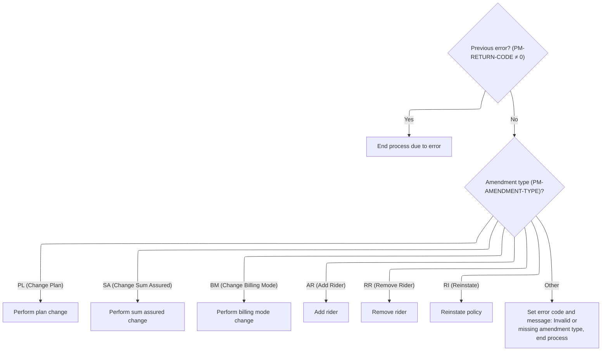

This section determines which policy amendment action to perform based on the amendment type, and ensures no actions are taken if prior validation failed.

| Rule ID | Category        | Rule Name                     | Description                                                                                                                                                             | Implementation Details                                                                                                                                              |
| ------- | --------------- | ----------------------------- | ----------------------------------------------------------------------------------------------------------------------------------------------------------------------- | ------------------------------------------------------------------------------------------------------------------------------------------------------------------- |
| BR-001  | Data validation | Invalid amendment type error  | If the amendment type is invalid or missing, an error code and message are set and the process ends.                                                                    | Error code set is 41. Error message set is 'INVALID OR MISSING AMENDMENT TYPE'. The error code is a number, the error message is a string up to 100 characters.     |
| BR-002  | Decision Making | Validation error halt         | If the previous servicing request validation resulted in an error, no amendment actions are performed and the process ends.                                             | The return code is a number. If it is not zero, the process ends without performing any amendment actions.                                                          |
| BR-003  | Decision Making | Amendment type action mapping | Each amendment type triggers a specific policy servicing action: plan change, sum assured change, billing mode change, rider addition, rider removal, or reinstatement. | Recognized amendment types are: 'PL' (plan change), 'SA' (sum assured change), 'BM' (billing mode change), 'AR' (add rider), 'RR' (remove rider), 'RI' (reinstate). |

<SwmSnippet path="/cobol/SVC-BILL-001.cob" line="42">

---

After returning from <SwmToken path="cobol/SVC-BILL-001.cob" pos="41:3:9" line-data="           PERFORM 1400-VALIDATE-SERVICING-REQUEST">`1400-VALIDATE-SERVICING-REQUEST`</SwmToken>, <SwmToken path="cobol/SVC-BILL-001.cob" pos="36:1:3" line-data="       MAIN-PROCESS.">`MAIN-PROCESS`</SwmToken> checks the return code. If it's non-zero, we bail out and skip all amendment actions.

```cobol
           IF PM-RETURN-CODE NOT = 0
              GOBACK
           END-IF
```

---

</SwmSnippet>

<SwmSnippet path="/cobol/SVC-BILL-001.cob" line="46">

---

Here we branch to the right amendment handler based on the amendment type. If it's a plan change, we call <SwmToken path="cobol/SVC-BILL-001.cob" pos="48:3:7" line-data="                 PERFORM 2100-CHANGE-PLAN">`2100-CHANGE-PLAN`</SwmToken> to validate and apply the new plan, making sure all business rules are checked before updating anything.

```cobol
           EVALUATE TRUE
              WHEN PM-AMEND-CHANGE-PLAN
                 PERFORM 2100-CHANGE-PLAN
              WHEN PM-AMEND-CHANGE-SA
                 PERFORM 2200-CHANGE-SUM-ASSURED
              WHEN PM-AMEND-BILLING-MODE
                 PERFORM 2300-CHANGE-BILLING-MODE
              WHEN PM-AMEND-ADD-RIDER
                 PERFORM 2400-ADD-RIDER
              WHEN PM-AMEND-REMOVE-RIDER
                 PERFORM 2500-REMOVE-RIDER
              WHEN PM-AMEND-REINSTATE
                 PERFORM 2600-PROCESS-REINSTATEMENT
              WHEN OTHER
                 MOVE 41 TO PM-RETURN-CODE
                 MOVE "INVALID OR MISSING AMENDMENT TYPE"
                   TO PM-RETURN-MESSAGE
           END-EVALUATE
```

---

</SwmSnippet>

## Validating and Applying Plan Changes

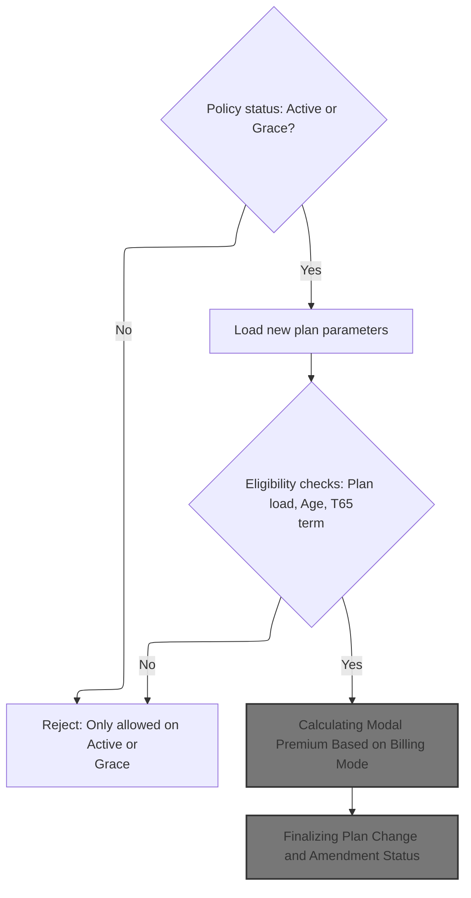

This section governs the business logic for validating and applying plan changes to term life insurance policies. It ensures only eligible policies are amended and that all relevant plan and age checks are enforced before repricing and finalizing the change.

| Rule ID | Category                        | Rule Name                                                                                                                                                              | Description                                                                                                                                                                                                                                                                                                                                   | Implementation Details                                                                                                                                                                                                                                                                                                                                                                                                                                                                 |
| ------- | ------------------------------- | ---------------------------------------------------------------------------------------------------------------------------------------------------------------------- | --------------------------------------------------------------------------------------------------------------------------------------------------------------------------------------------------------------------------------------------------------------------------------------------------------------------------------------------- | -------------------------------------------------------------------------------------------------------------------------------------------------------------------------------------------------------------------------------------------------------------------------------------------------------------------------------------------------------------------------------------------------------------------------------------------------------------------------------------- |
| BR-001  | Data validation                 | Policy status eligibility                                                                                                                                              | Plan changes are permitted only when the policy status is either 'Active' or 'Grace'. If the status is not one of these, the plan change is rejected with a specific error code and message.                                                                                                                                                  | Error code: 21. Error message: 'PLAN CHANGE ALLOWED ONLY ON ACTIVE OR GRACE'. Policy status values: 'AC' (Active), 'GR' (Grace). Output format: error code (number), error message (string, up to 100 characters).                                                                                                                                                                                                                                                                     |
| BR-002  | Data validation                 | Plan parameter loading validation                                                                                                                                      | If loading new plan parameters fails, the plan change is rejected and the plan code is reverted to the previous value.                                                                                                                                                                                                                        | Plan parameter loading failure is indicated by a non-zero return code. Output format: plan code reverted to previous value.                                                                                                                                                                                                                                                                                                                                                            |
| BR-003  | Data validation                 | Maximum issue age eligibility                                                                                                                                          | If the attained age exceeds the new plan's maximum issue age and the plan is not <SwmToken path="cobol/SVC-BILL-001.cob" pos="211:12:12" line-data="                 MOVE &quot;NO TERM REMAINS UNDER T65 PLAN&quot;">`T65`</SwmToken>, the plan change is rejected with a specific error code and message, and the plan code is reverted.    | Error code: 22. Error message: 'CURRENT ATTAINED AGE EXCEEDS NEW PLAN LIMIT'. Maximum issue age values: 60 for <SwmToken path="cobol/SVC-BILL-001.cob" pos="89:4:4" line-data="              WHEN &quot;T1001&quot;">`T1001`</SwmToken>, 55 for <SwmToken path="cobol/SVC-BILL-001.cob" pos="101:4:4" line-data="              WHEN &quot;T2001&quot;">`T2001`</SwmToken>, 50 otherwise. Output format: error code (number), error message (string, up to 100 characters).             |
| BR-004  | Data validation                 | <SwmToken path="cobol/SVC-BILL-001.cob" pos="211:12:12" line-data="                 MOVE &quot;NO TERM REMAINS UNDER T65 PLAN&quot;">`T65`</SwmToken> term eligibility | For <SwmToken path="cobol/SVC-BILL-001.cob" pos="211:12:12" line-data="                 MOVE &quot;NO TERM REMAINS UNDER T65 PLAN&quot;">`T65`</SwmToken> plans, if no term remains (maturity age minus attained age is zero or negative), the plan change is rejected with a specific error code and message, and the plan code is reverted. | Error code: 23. Error message: 'NO TERM REMAINS UNDER <SwmToken path="cobol/SVC-BILL-001.cob" pos="211:12:12" line-data="                 MOVE &quot;NO TERM REMAINS UNDER T65 PLAN&quot;">`T65`</SwmToken> PLAN'. Maturity age for <SwmToken path="cobol/SVC-BILL-001.cob" pos="211:12:12" line-data="                 MOVE &quot;NO TERM REMAINS UNDER T65 PLAN&quot;">`T65`</SwmToken> plans: 65. Output format: error code (number), error message (string, up to 100 characters). |
| BR-005  | Invoking a Service or a Process | Repricing after plan change                                                                                                                                            | If all eligibility checks pass, the policy is repriced for the new plan by recalculating premiums and updating amounts.                                                                                                                                                                                                                       | Repricing is triggered only after all validations succeed. Output format: updated premium and premium change values (numbers).                                                                                                                                                                                                                                                                                                                                                         |

<SwmSnippet path="/cobol/SVC-BILL-001.cob" line="182">

---

In <SwmToken path="cobol/SVC-BILL-001.cob" pos="182:1:5" line-data="       2100-CHANGE-PLAN.">`2100-CHANGE-PLAN`</SwmToken>, we check if the policy is active or in grace. If not, we set an error and exit. Only eligible policies get their plan changed.

```cobol
       2100-CHANGE-PLAN.
      * SV-401: Change plan only on active or grace policies.
           IF NOT PM-STAT-ACTIVE AND NOT PM-STAT-GRACE
              MOVE 21 TO PM-RETURN-CODE
              MOVE "PLAN CHANGE ALLOWED ONLY ON ACTIVE OR GRACE"
                TO PM-RETURN-MESSAGE
              EXIT PARAGRAPH
           END-IF
```

---

</SwmSnippet>

<SwmSnippet path="/cobol/SVC-BILL-001.cob" line="191">

---

After saving the old plan code and updating to the new one, we call <SwmToken path="cobol/SVC-BILL-001.cob" pos="193:3:9" line-data="           PERFORM 1100-LOAD-PLAN-PARAMETERS">`1100-LOAD-PLAN-PARAMETERS`</SwmToken> to pull in all the new plan's limits and fees. This is needed before any further validation or pricing.

```cobol
           MOVE PM-PLAN-CODE TO PM-OLD-PLAN-CODE
           MOVE PM-NEW-PLAN-CODE TO PM-PLAN-CODE
           PERFORM 1100-LOAD-PLAN-PARAMETERS
```

---

</SwmSnippet>

<SwmSnippet path="/cobol/SVC-BILL-001.cob" line="194">

---

Back in <SwmToken path="cobol/SVC-BILL-001.cob" pos="48:3:7" line-data="                 PERFORM 2100-CHANGE-PLAN">`2100-CHANGE-PLAN`</SwmToken>, if loading the new plan parameters fails, we revert to the old plan code and exit. No changes go through if the plan isn't supported.

```cobol
           IF PM-RETURN-CODE NOT = 0
              MOVE PM-OLD-PLAN-CODE TO PM-PLAN-CODE
              EXIT PARAGRAPH
           END-IF
```

---

</SwmSnippet>

<SwmSnippet path="/cobol/SVC-BILL-001.cob" line="200">

---

Now we check if the attained age is above the new plan's max issue age (unless it's a <SwmToken path="cobol/SVC-BILL-001.cob" pos="211:12:12" line-data="                 MOVE &quot;NO TERM REMAINS UNDER T65 PLAN&quot;">`T65`</SwmToken> plan). If so, we set an error, restore the old plan, and exit. This follows parameter loading and comes before term validation.

```cobol
           IF PM-ATTAINED-AGE > PM-MAX-ISSUE-AGE AND NOT PM-PLAN-TO-65
              MOVE 22 TO PM-RETURN-CODE
              MOVE "CURRENT ATTAINED AGE EXCEEDS NEW PLAN LIMIT"
                TO PM-RETURN-MESSAGE
              MOVE PM-OLD-PLAN-CODE TO PM-PLAN-CODE
              EXIT PARAGRAPH
           END-IF
```

---

</SwmSnippet>

<SwmSnippet path="/cobol/SVC-BILL-001.cob" line="207">

---

If the plan is <SwmToken path="cobol/SVC-BILL-001.cob" pos="211:12:12" line-data="                 MOVE &quot;NO TERM REMAINS UNDER T65 PLAN&quot;">`T65`</SwmToken>, we check if there's any term left by subtracting attained age from maturity age. If not, we set an error, restore the old plan, and exit. This is the last eligibility check before repricing.

```cobol
           IF PM-PLAN-TO-65
              COMPUTE PM-TERM-YEARS = PM-MATURITY-AGE - PM-ATTAINED-AGE
              IF PM-TERM-YEARS <= 0
                 MOVE 23 TO PM-RETURN-CODE
                 MOVE "NO TERM REMAINS UNDER T65 PLAN"
                   TO PM-RETURN-MESSAGE
                 MOVE PM-OLD-PLAN-CODE TO PM-PLAN-CODE
                 EXIT PARAGRAPH
              END-IF
           END-IF
```

---

</SwmSnippet>

<SwmSnippet path="/cobol/SVC-BILL-001.cob" line="218">

---

Once all validations pass, we call <SwmToken path="cobol/SVC-BILL-001.cob" pos="218:3:7" line-data="           PERFORM 3100-REPRICE-POLICY">`3100-REPRICE-POLICY`</SwmToken> to recalculate premiums for the new plan. This ensures pricing is up-to-date after the change.

```cobol
           PERFORM 3100-REPRICE-POLICY
```

---

</SwmSnippet>

### Repricing Policy After Amendment

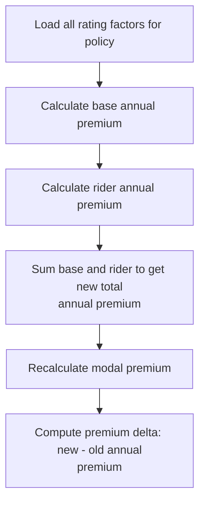

This section recalculates insurance premiums after a policy amendment, ensuring that all relevant rating factors and adjustments are applied to produce an updated premium and premium delta.

| Rule ID | Category      | Rule Name                   | Description                                                                                                                                                                                       | Implementation Details                                                                                                                                                                                                                                                                                              |
| ------- | ------------- | --------------------------- | ------------------------------------------------------------------------------------------------------------------------------------------------------------------------------------------------- | ------------------------------------------------------------------------------------------------------------------------------------------------------------------------------------------------------------------------------------------------------------------------------------------------------------------- |
| BR-001  | Reading Input | Load rating factors         | All rating factors relevant to the policy are loaded before any premium calculations are performed. This ensures that the repricing logic uses the most current and accurate data for the policy. | Rating factors may include plan code, contract status, issue channel, currency code, and plan parameters such as minimum/maximum issue age, sum assured, term years, maturity age, grace days, and contestable years. These are loaded as alphanumeric and numeric values as specified in the policy master record. |
| BR-002  | Calculation   | Base premium calculation    | The base annual premium is recalculated using the loaded rating factors. This represents the core insurance coverage cost for the policy.                                                         | The base annual premium is calculated as a numeric value, reflecting the cost of the main insurance coverage.                                                                                                                                                                                                       |
| BR-003  | Calculation   | Rider premium calculation   | The rider annual premium is recalculated, reflecting the cost of any additional coverage or riders attached to the policy.                                                                        | The rider annual premium is calculated as a numeric value, representing the cost of supplementary coverage.                                                                                                                                                                                                         |
| BR-004  | Calculation   | Total premium calculation   | The new total annual premium is calculated by summing the base annual premium and rider annual premium.                                                                                           | The total annual premium is a numeric value, equal to the sum of base and rider premiums.                                                                                                                                                                                                                           |
| BR-005  | Calculation   | Modal premium recalculation | The modal premium is recalculated based on the new total annual premium, adjusting for the payment frequency (e.g., monthly, quarterly, semi-annual).                                             | Modal premium is a numeric value, derived from the total annual premium and adjusted for payment frequency. The adjustment method is not specified in the code provided.                                                                                                                                            |
| BR-006  | Calculation   | Premium delta calculation   | The premium delta is computed as the difference between the new total annual premium and the old annual premium, rounded to the nearest whole value.                                              | Premium delta is a numeric value, calculated as new total annual premium minus old annual premium, rounded to the nearest whole value.                                                                                                                                                                              |

<SwmSnippet path="/cobol/SVC-BILL-001.cob" line="372">

---

<SwmToken path="cobol/SVC-BILL-001.cob" pos="372:1:5" line-data="       3100-REPRICE-POLICY.">`3100-REPRICE-POLICY`</SwmToken> starts by calling <SwmToken path="cobol/SVC-BILL-001.cob" pos="374:3:9" line-data="           PERFORM 3110-LOAD-RATING-FACTORS">`3110-LOAD-RATING-FACTORS`</SwmToken> to set up all the base rates and adjustments needed for premium calculations. Without this, the pricing logic can't run.

```cobol
       3100-REPRICE-POLICY.
      * SV-1001: Servicing repricing reuses the issue rating approach.
           PERFORM 3110-LOAD-RATING-FACTORS
           PERFORM 3120-CALCULATE-BASE-ANNUAL
           PERFORM 3130-CALCULATE-RIDER-ANNUAL
           PERFORM 3140-CALCULATE-TOTAL-ANNUAL
           PERFORM 3200-RECALCULATE-MODAL-PREMIUM
           COMPUTE PM-PREMIUM-DELTA ROUNDED =
                   PM-TOTAL-ANNUAL-PREMIUM - WS-OLD-ANNUAL-PREMIUM.
```

---

</SwmSnippet>

### Assigning Rating Factors for Pricing

```mermaid
%%{init: {"flowchart": {"defaultRenderer": "elk"}} }%%
flowchart TD
    node1{"What is the insured's attained age?"}
    click node1 openCode "cobol/SVC-BILL-001.cob:383:394"
    node1 -->|"#lt;= 30"| node2["Base rate: 0.8500"]
    click node2 openCode "cobol/SVC-BILL-001.cob:385:385"
    node1 -->|"#lt;= 40"| node3["Base rate: 1.2000"]
    click node3 openCode "cobol/SVC-BILL-001.cob:387:387"
    node1 -->|"#lt;= 50"| node4["Base rate: 2.1500"]
    click node4 openCode "cobol/SVC-BILL-001.cob:389:389"
    node1 -->|"#lt;= 60"| node5["Base rate: 4.1000"]
    click node5 openCode "cobol/SVC-BILL-001.cob:391:391"
    node1 -->|"#gt; 60"| node6["Base rate: 7.2500"]
    click node6 openCode "cobol/SVC-BILL-001.cob:393:393"
    node2 --> node7{"Female?"}
    node3 --> node7
    node4 --> node7
    node5 --> node7
    node6 --> node7
    click node7 openCode "cobol/SVC-BILL-001.cob:396:400"
    node7 -->|"Yes"| node8["Gender factor: 0.9200"]
    click node8 openCode "cobol/SVC-BILL-001.cob:397:397"
    node7 -->|"No"| node9["Gender factor: 1.0000"]
    click node9 openCode "cobol/SVC-BILL-001.cob:399:399"
    node8 --> node10{"Smoker?"}
    node9 --> node10
    click node10 openCode "cobol/SVC-BILL-001.cob:402:406"
    node10 -->|"Yes"| node11["Smoker factor: 1.7500"]
    click node11 openCode "cobol/SVC-BILL-001.cob:403:403"
    node10 -->|"No"| node12["Smoker factor: 1.0000"]
    click node12 openCode "cobol/SVC-BILL-001.cob:405:405"
    node11 --> node13{"Occupation class?"}
    node12 --> node13
    click node13 openCode "cobol/SVC-BILL-001.cob:408:413"
    node13 -->|"1"| node14["Occupation factor: 1.0000"]
    click node14 openCode "cobol/SVC-BILL-001.cob:409:409"
    node13 -->|"2"| node15["Occupation factor: 1.1500"]
    click node15 openCode "cobol/SVC-BILL-001.cob:410:410"
    node13 -->|"3"| node16["Occupation factor: 1.4000"]
    click node16 openCode "cobol/SVC-BILL-001.cob:411:411"
    node13 -->|"Other"| node17["Occupation factor: 1.0000"]
    click node17 openCode "cobol/SVC-BILL-001.cob:412:412"
    node14 --> node18{"Underwriting class?"}
    node15 --> node18
    node16 --> node18
    node17 --> node18
    click node18 openCode "cobol/SVC-BILL-001.cob:415:419"
    node18 -->|"PR"| node19["UW factor: 0.9000"]
    click node19 openCode "cobol/SVC-BILL-001.cob:416:416"
    node18 -->|"TB"| node20["UW factor: 1.2500"]
    click node20 openCode "cobol/SVC-BILL-001.cob:417:417"
    node18 -->|"Other"| node21["UW factor: 1.0000"]
    click node21 openCode "cobol/SVC-BILL-001.cob:418:418"

classDef HeadingStyle fill:#777777,stroke:#333,stroke-width:2px;

%% Swimm:
%% %%{init: {"flowchart": {"defaultRenderer": "elk"}} }%%
%% flowchart TD
%%     node1{"What is the insured's attained age?"}
%%     click node1 openCode "<SwmPath>[cobol/SVC-BILL-001.cob](cobol/SVC-BILL-001.cob)</SwmPath>:383:394"
%%     node1 -->|"#lt;= 30"| node2["Base rate: 0.8500"]
%%     click node2 openCode "<SwmPath>[cobol/SVC-BILL-001.cob](cobol/SVC-BILL-001.cob)</SwmPath>:385:385"
%%     node1 -->|"#lt;= 40"| node3["Base rate: 1.2000"]
%%     click node3 openCode "<SwmPath>[cobol/SVC-BILL-001.cob](cobol/SVC-BILL-001.cob)</SwmPath>:387:387"
%%     node1 -->|"#lt;= 50"| node4["Base rate: 2.1500"]
%%     click node4 openCode "<SwmPath>[cobol/SVC-BILL-001.cob](cobol/SVC-BILL-001.cob)</SwmPath>:389:389"
%%     node1 -->|"#lt;= 60"| node5["Base rate: 4.1000"]
%%     click node5 openCode "<SwmPath>[cobol/SVC-BILL-001.cob](cobol/SVC-BILL-001.cob)</SwmPath>:391:391"
%%     node1 -->|"#gt; 60"| node6["Base rate: 7.2500"]
%%     click node6 openCode "<SwmPath>[cobol/SVC-BILL-001.cob](cobol/SVC-BILL-001.cob)</SwmPath>:393:393"
%%     node2 --> node7{"Female?"}
%%     node3 --> node7
%%     node4 --> node7
%%     node5 --> node7
%%     node6 --> node7
%%     click node7 openCode "<SwmPath>[cobol/SVC-BILL-001.cob](cobol/SVC-BILL-001.cob)</SwmPath>:396:400"
%%     node7 -->|"Yes"| node8["Gender factor: <SwmToken path="cobol/SVC-BILL-001.cob" pos="397:3:5" line-data="              MOVE 0.9200 TO PM-GENDER-FACTOR">`0.9200`</SwmToken>"]
%%     click node8 openCode "<SwmPath>[cobol/SVC-BILL-001.cob](cobol/SVC-BILL-001.cob)</SwmPath>:397:397"
%%     node7 -->|"No"| node9["Gender factor: <SwmToken path="cobol/SVC-BILL-001.cob" pos="399:3:5" line-data="              MOVE 1.0000 TO PM-GENDER-FACTOR">`1.0000`</SwmToken>"]
%%     click node9 openCode "<SwmPath>[cobol/SVC-BILL-001.cob](cobol/SVC-BILL-001.cob)</SwmPath>:399:399"
%%     node8 --> node10{"Smoker?"}
%%     node9 --> node10
%%     click node10 openCode "<SwmPath>[cobol/SVC-BILL-001.cob](cobol/SVC-BILL-001.cob)</SwmPath>:402:406"
%%     node10 -->|"Yes"| node11["Smoker factor: <SwmToken path="cobol/SVC-BILL-001.cob" pos="403:3:5" line-data="              MOVE 1.7500 TO PM-SMOKER-FACTOR">`1.7500`</SwmToken>"]
%%     click node11 openCode "<SwmPath>[cobol/SVC-BILL-001.cob](cobol/SVC-BILL-001.cob)</SwmPath>:403:403"
%%     node10 -->|"No"| node12["Smoker factor: <SwmToken path="cobol/SVC-BILL-001.cob" pos="399:3:5" line-data="              MOVE 1.0000 TO PM-GENDER-FACTOR">`1.0000`</SwmToken>"]
%%     click node12 openCode "<SwmPath>[cobol/SVC-BILL-001.cob](cobol/SVC-BILL-001.cob)</SwmPath>:405:405"
%%     node11 --> node13{"Occupation class?"}
%%     node12 --> node13
%%     click node13 openCode "<SwmPath>[cobol/SVC-BILL-001.cob](cobol/SVC-BILL-001.cob)</SwmPath>:408:413"
%%     node13 -->|"1"| node14["Occupation factor: <SwmToken path="cobol/SVC-BILL-001.cob" pos="399:3:5" line-data="              MOVE 1.0000 TO PM-GENDER-FACTOR">`1.0000`</SwmToken>"]
%%     click node14 openCode "<SwmPath>[cobol/SVC-BILL-001.cob](cobol/SVC-BILL-001.cob)</SwmPath>:409:409"
%%     node13 -->|"2"| node15["Occupation factor: <SwmToken path="cobol/SVC-BILL-001.cob" pos="410:7:9" line-data="              WHEN 2 MOVE 1.1500 TO PM-OCC-FACTOR">`1.1500`</SwmToken>"]
%%     click node15 openCode "<SwmPath>[cobol/SVC-BILL-001.cob](cobol/SVC-BILL-001.cob)</SwmPath>:410:410"
%%     node13 -->|"3"| node16["Occupation factor: <SwmToken path="cobol/SVC-BILL-001.cob" pos="411:7:9" line-data="              WHEN 3 MOVE 1.4000 TO PM-OCC-FACTOR">`1.4000`</SwmToken>"]
%%     click node16 openCode "<SwmPath>[cobol/SVC-BILL-001.cob](cobol/SVC-BILL-001.cob)</SwmPath>:411:411"
%%     node13 -->|"Other"| node17["Occupation factor: <SwmToken path="cobol/SVC-BILL-001.cob" pos="399:3:5" line-data="              MOVE 1.0000 TO PM-GENDER-FACTOR">`1.0000`</SwmToken>"]
%%     click node17 openCode "<SwmPath>[cobol/SVC-BILL-001.cob](cobol/SVC-BILL-001.cob)</SwmPath>:412:412"
%%     node14 --> node18{"Underwriting class?"}
%%     node15 --> node18
%%     node16 --> node18
%%     node17 --> node18
%%     click node18 openCode "<SwmPath>[cobol/SVC-BILL-001.cob](cobol/SVC-BILL-001.cob)</SwmPath>:415:419"
%%     node18 -->|"PR"| node19["UW factor: <SwmToken path="cobol/SVC-BILL-001.cob" pos="416:9:11" line-data="              WHEN &quot;PR&quot; MOVE 0.9000 TO PM-UW-FACTOR">`0.9000`</SwmToken>"]
%%     click node19 openCode "<SwmPath>[cobol/SVC-BILL-001.cob](cobol/SVC-BILL-001.cob)</SwmPath>:416:416"
%%     node18 -->|"TB"| node20["UW factor: <SwmToken path="cobol/SVC-BILL-001.cob" pos="417:9:11" line-data="              WHEN &quot;TB&quot; MOVE 1.2500 TO PM-UW-FACTOR">`1.2500`</SwmToken>"]
%%     click node20 openCode "<SwmPath>[cobol/SVC-BILL-001.cob](cobol/SVC-BILL-001.cob)</SwmPath>:417:417"
%%     node18 -->|"Other"| node21["UW factor: <SwmToken path="cobol/SVC-BILL-001.cob" pos="399:3:5" line-data="              MOVE 1.0000 TO PM-GENDER-FACTOR">`1.0000`</SwmToken>"]
%%     click node21 openCode "<SwmPath>[cobol/SVC-BILL-001.cob](cobol/SVC-BILL-001.cob)</SwmPath>:418:418"
%% 
%% classDef HeadingStyle fill:#777777,stroke:#333,stroke-width:2px;
```

This section determines the rating factors for pricing a term life insurance policy based on key insured attributes.

| Rule ID | Category    | Rule Name                      | Description                                                                                                                                        | Implementation Details                                                                                                                                                                                                                                                                                                                                                                                                                                                                                                                                                                                                                                                                          |
| ------- | ----------- | ------------------------------ | -------------------------------------------------------------------------------------------------------------------------------------------------- | ----------------------------------------------------------------------------------------------------------------------------------------------------------------------------------------------------------------------------------------------------------------------------------------------------------------------------------------------------------------------------------------------------------------------------------------------------------------------------------------------------------------------------------------------------------------------------------------------------------------------------------------------------------------------------------------------- |
| BR-001  | Calculation | Base rate by age band          | Assign a base rate per thousand based on the insured's attained age. The base rate is set according to age bands: <=30, <=40, <=50, <=60, and >60. | Base rate values: 0.8500 for age <=30; 1.2000 for age <=40; 2.1500 for age <=50; 4.1000 for age <=60; 7.2500 for age >60. Output is a numeric value with four decimal places.                                                                                                                                                                                                                                                                                                                                                                                                                                                                                                                   |
| BR-002  | Calculation | Gender factor assignment       | Assign a gender factor based on whether the insured is female. Female insureds receive a lower factor.                                             | Gender factor values: <SwmToken path="cobol/SVC-BILL-001.cob" pos="397:3:5" line-data="              MOVE 0.9200 TO PM-GENDER-FACTOR">`0.9200`</SwmToken> for female; <SwmToken path="cobol/SVC-BILL-001.cob" pos="399:3:5" line-data="              MOVE 1.0000 TO PM-GENDER-FACTOR">`1.0000`</SwmToken> for non-female. Output is a numeric value with four decimal places.                                                                                                                                                                                                                                                                                                                   |
| BR-003  | Calculation | Smoker factor assignment       | Assign a smoker factor based on whether the insured is a smoker. Smokers receive a higher factor.                                                  | Smoker factor values: <SwmToken path="cobol/SVC-BILL-001.cob" pos="403:3:5" line-data="              MOVE 1.7500 TO PM-SMOKER-FACTOR">`1.7500`</SwmToken> for smoker; <SwmToken path="cobol/SVC-BILL-001.cob" pos="399:3:5" line-data="              MOVE 1.0000 TO PM-GENDER-FACTOR">`1.0000`</SwmToken> for non-smoker. Output is a numeric value with four decimal places.                                                                                                                                                                                                                                                                                                                   |
| BR-004  | Calculation | Occupation factor assignment   | Assign an occupation factor based on the insured's occupation class. Different classes receive different factors.                                  | Occupation factor values: <SwmToken path="cobol/SVC-BILL-001.cob" pos="399:3:5" line-data="              MOVE 1.0000 TO PM-GENDER-FACTOR">`1.0000`</SwmToken> for class 1; <SwmToken path="cobol/SVC-BILL-001.cob" pos="410:7:9" line-data="              WHEN 2 MOVE 1.1500 TO PM-OCC-FACTOR">`1.1500`</SwmToken> for class 2; <SwmToken path="cobol/SVC-BILL-001.cob" pos="411:7:9" line-data="              WHEN 3 MOVE 1.4000 TO PM-OCC-FACTOR">`1.4000`</SwmToken> for class 3; <SwmToken path="cobol/SVC-BILL-001.cob" pos="399:3:5" line-data="              MOVE 1.0000 TO PM-GENDER-FACTOR">`1.0000`</SwmToken> for other classes. Output is a numeric value with four decimal places. |
| BR-005  | Calculation | Underwriting factor assignment | Assign an underwriting factor based on the insured's underwriting class. Preferred and tobacco classes receive specific factors.                   | Underwriting factor values: <SwmToken path="cobol/SVC-BILL-001.cob" pos="416:9:11" line-data="              WHEN &quot;PR&quot; MOVE 0.9000 TO PM-UW-FACTOR">`0.9000`</SwmToken> for class 'PR'; <SwmToken path="cobol/SVC-BILL-001.cob" pos="417:9:11" line-data="              WHEN &quot;TB&quot; MOVE 1.2500 TO PM-UW-FACTOR">`1.2500`</SwmToken> for class 'TB'; <SwmToken path="cobol/SVC-BILL-001.cob" pos="399:3:5" line-data="              MOVE 1.0000 TO PM-GENDER-FACTOR">`1.0000`</SwmToken> for other classes. Output is a numeric value with four decimal places.                                                                                                                |

<SwmSnippet path="/cobol/SVC-BILL-001.cob" line="382">

---

In <SwmToken path="cobol/SVC-BILL-001.cob" pos="382:1:7" line-data="       3110-LOAD-RATING-FACTORS.">`3110-LOAD-RATING-FACTORS`</SwmToken>, we map attained age to a base rate per thousand using EVALUATE. This sets the foundation for all pricing calculations.

```cobol
       3110-LOAD-RATING-FACTORS.
           EVALUATE TRUE
              WHEN PM-ATTAINED-AGE <= 30
                 MOVE 00000.8500 TO PM-BASE-RATE-PER-THOU
              WHEN PM-ATTAINED-AGE <= 40
                 MOVE 00001.2000 TO PM-BASE-RATE-PER-THOU
              WHEN PM-ATTAINED-AGE <= 50
                 MOVE 00002.1500 TO PM-BASE-RATE-PER-THOU
              WHEN PM-ATTAINED-AGE <= 60
                 MOVE 00004.1000 TO PM-BASE-RATE-PER-THOU
              WHEN OTHER
                 MOVE 00007.2500 TO PM-BASE-RATE-PER-THOU
           END-EVALUATE
```

---

</SwmSnippet>

<SwmSnippet path="/cobol/SVC-BILL-001.cob" line="396">

---

After setting the base rate, we adjust for gender. Females get a lower factor, which tweaks the premium calculation before moving on to smoker status.

```cobol
           IF PM-FEMALE
              MOVE 0.9200 TO PM-GENDER-FACTOR
           ELSE
              MOVE 1.0000 TO PM-GENDER-FACTOR
           END-IF
```

---

</SwmSnippet>

<SwmSnippet path="/cobol/SVC-BILL-001.cob" line="402">

---

Next we set the smoker factor. Smokers get a higher multiplier, which bumps up their premium before we check occupation class.

```cobol
           IF PM-SMOKER
              MOVE 1.7500 TO PM-SMOKER-FACTOR
           ELSE
              MOVE 1.0000 TO PM-SMOKER-FACTOR
           END-IF
```

---

</SwmSnippet>

<SwmSnippet path="/cobol/SVC-BILL-001.cob" line="408">

---

Now we use EVALUATE to set the occupation factor based on risk class. This feeds into the final underwriting factor assignment.

```cobol
           EVALUATE PM-OCCUPATION-CLASS
              WHEN 1 MOVE 1.0000 TO PM-OCC-FACTOR
              WHEN 2 MOVE 1.1500 TO PM-OCC-FACTOR
              WHEN 3 MOVE 1.4000 TO PM-OCC-FACTOR
              WHEN OTHER MOVE 1.0000 TO PM-OCC-FACTOR
           END-EVALUATE
```

---

</SwmSnippet>

<SwmSnippet path="/cobol/SVC-BILL-001.cob" line="415">

---

Finally we set the underwriting factor based on class. All rating factors are now ready for premium calculations.

```cobol
           EVALUATE PM-UW-CLASS
              WHEN "PR" MOVE 0.9000 TO PM-UW-FACTOR
              WHEN "TB" MOVE 1.2500 TO PM-UW-FACTOR
              WHEN OTHER MOVE 1.0000 TO PM-UW-FACTOR
           END-EVALUATE.
```

---

</SwmSnippet>

### Calculating Rider Premiums

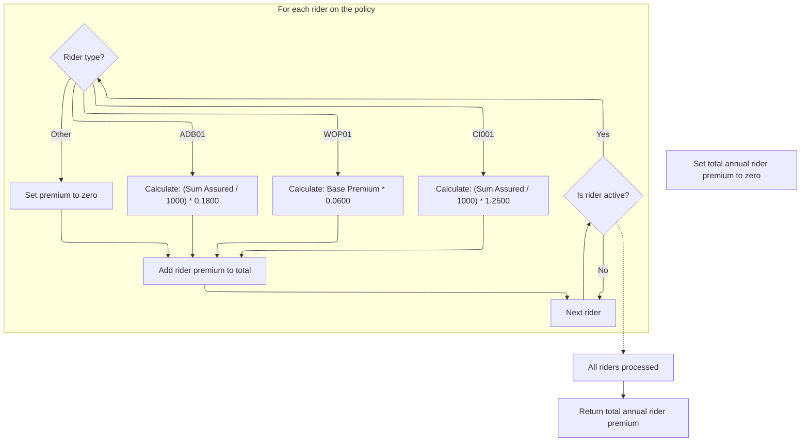

This section calculates the annual premium for each rider on a policy, applying specific rates and formulas based on rider type, and accumulates the total premium for all active riders.

| Rule ID | Category        | Rule Name                                                                                                                                                                   | Description                                                                                                                                                                                                                                                                                                                                                                                                                                                                                          | Implementation Details                                                                                                                                                                                                                                        |
| ------- | --------------- | --------------------------------------------------------------------------------------------------------------------------------------------------------------------------- | ---------------------------------------------------------------------------------------------------------------------------------------------------------------------------------------------------------------------------------------------------------------------------------------------------------------------------------------------------------------------------------------------------------------------------------------------------------------------------------------------------- | ------------------------------------------------------------------------------------------------------------------------------------------------------------------------------------------------------------------------------------------------------------- |
| BR-001  | Calculation     | <SwmToken path="cobol/SVC-BILL-001.cob" pos="298:4:4" line-data="           MOVE &quot;ADB01&quot; TO PM-RIDER-CODE(PM-RIDER-COUNT)">`ADB01`</SwmToken> premium calculation | For riders with code <SwmToken path="cobol/SVC-BILL-001.cob" pos="298:4:4" line-data="           MOVE &quot;ADB01&quot; TO PM-RIDER-CODE(PM-RIDER-COUNT)">`ADB01`</SwmToken>, the annual premium is calculated as (Sum Assured / 1000) multiplied by 0.1800.                                                                                                                                                                                                                                         | Rate used is 0.1800. Sum Assured is divided by 1000 before multiplying by the rate. Output is a rounded number.                                                                                                                                               |
| BR-002  | Calculation     | <SwmToken path="cobol/SVC-BILL-001.cob" pos="447:4:4" line-data="                    WHEN &quot;WOP01&quot;">`WOP01`</SwmToken> premium calculation                         | For riders with code <SwmToken path="cobol/SVC-BILL-001.cob" pos="447:4:4" line-data="                    WHEN &quot;WOP01&quot;">`WOP01`</SwmToken>, the annual premium is calculated as the base annual premium multiplied by <SwmToken path="cobol/SVC-BILL-001.cob" pos="451:11:13" line-data="                             PM-BASE-ANNUAL-PREMIUM * 0.0600">`0.0600`</SwmToken>.                                                                                                                | Rate used is <SwmToken path="cobol/SVC-BILL-001.cob" pos="451:11:13" line-data="                             PM-BASE-ANNUAL-PREMIUM * 0.0600">`0.0600`</SwmToken>. Output is a rounded number.                                                                |
| BR-003  | Calculation     | <SwmToken path="cobol/SVC-BILL-001.cob" pos="452:4:4" line-data="                    WHEN &quot;CI001&quot;">`CI001`</SwmToken> premium calculation                         | For riders with code <SwmToken path="cobol/SVC-BILL-001.cob" pos="452:4:4" line-data="                    WHEN &quot;CI001&quot;">`CI001`</SwmToken>, the annual premium is calculated as (Sum Assured / 1000) multiplied by <SwmToken path="cobol/SVC-BILL-001.cob" pos="417:9:11" line-data="              WHEN &quot;TB&quot; MOVE 1.2500 TO PM-UW-FACTOR">`1.2500`</SwmToken>.                                                                                                                   | Rate used is <SwmToken path="cobol/SVC-BILL-001.cob" pos="417:9:11" line-data="              WHEN &quot;TB&quot; MOVE 1.2500 TO PM-UW-FACTOR">`1.2500`</SwmToken>. Sum Assured is divided by 1000 before multiplying by the rate. Output is a rounded number. |
| BR-004  | Calculation     | Total rider premium aggregation                                                                                                                                             | The total annual rider premium is calculated as the sum of all individual rider premiums for active riders.                                                                                                                                                                                                                                                                                                                                                                                          | Total is a numeric value representing the sum of all calculated rider premiums.                                                                                                                                                                               |
| BR-005  | Decision Making | Active rider inclusion                                                                                                                                                      | Only riders with an active status are included in the annual premium calculation.                                                                                                                                                                                                                                                                                                                                                                                                                    | Rider status must be 'A'. Riders with any other status are excluded from premium calculation.                                                                                                                                                                 |
| BR-006  | Decision Making | Unknown rider code zero premium                                                                                                                                             | For riders with any code other than <SwmToken path="cobol/SVC-BILL-001.cob" pos="298:4:4" line-data="           MOVE &quot;ADB01&quot; TO PM-RIDER-CODE(PM-RIDER-COUNT)">`ADB01`</SwmToken>, <SwmToken path="cobol/SVC-BILL-001.cob" pos="447:4:4" line-data="                    WHEN &quot;WOP01&quot;">`WOP01`</SwmToken>, or <SwmToken path="cobol/SVC-BILL-001.cob" pos="452:4:4" line-data="                    WHEN &quot;CI001&quot;">`CI001`</SwmToken>, the annual premium is set to zero. | Premium is set to zero for unknown codes.                                                                                                                                                                                                                     |

<SwmSnippet path="/cobol/SVC-BILL-001.cob" line="435">

---

In <SwmToken path="cobol/SVC-BILL-001.cob" pos="435:1:7" line-data="       3130-CALCULATE-RIDER-ANNUAL.">`3130-CALCULATE-RIDER-ANNUAL`</SwmToken>, we loop through all riders, check if they're active, and calculate their annual premium based on hardcoded rates for each rider code. Unknown codes get zero premium.

```cobol
       3130-CALCULATE-RIDER-ANNUAL.
           MOVE ZERO TO PM-RIDER-ANNUAL-TOTAL
           PERFORM VARYING WS-RIDER-IDX FROM 1 BY 1
                   UNTIL WS-RIDER-IDX > PM-RIDER-COUNT
              IF PM-RIDER-STATUS(WS-RIDER-IDX) = "A"
                 EVALUATE PM-RIDER-CODE(WS-RIDER-IDX)
                    WHEN "ADB01"
                       MOVE 00000.1800 TO PM-RIDER-RATE(WS-RIDER-IDX)
                       COMPUTE PM-RIDER-ANNUAL-PREM(WS-RIDER-IDX)
                               ROUNDED =
                             (PM-RIDER-SUM-ASSURED(WS-RIDER-IDX) / 1000)
                           * PM-RIDER-RATE(WS-RIDER-IDX)
```

---

</SwmSnippet>

<SwmSnippet path="/cobol/SVC-BILL-001.cob" line="447">

---

This block handles <SwmToken path="cobol/SVC-BILL-001.cob" pos="447:4:4" line-data="                    WHEN &quot;WOP01&quot;">`WOP01`</SwmToken> riders, using a fixed rate and multiplying by the base annual premium. It follows the <SwmToken path="cobol/SVC-BILL-001.cob" pos="298:4:4" line-data="           MOVE &quot;ADB01&quot; TO PM-RIDER-CODE(PM-RIDER-COUNT)">`ADB01`</SwmToken> logic and sets up for <SwmToken path="cobol/SVC-BILL-001.cob" pos="452:4:4" line-data="                    WHEN &quot;CI001&quot;">`CI001`</SwmToken>.

```cobol
                    WHEN "WOP01"
                       MOVE 00000.0600 TO PM-RIDER-RATE(WS-RIDER-IDX)
                       COMPUTE PM-RIDER-ANNUAL-PREM(WS-RIDER-IDX)
                               ROUNDED =
                             PM-BASE-ANNUAL-PREMIUM * 0.0600
```

---

</SwmSnippet>

<SwmSnippet path="/cobol/SVC-BILL-001.cob" line="452">

---

Here we handle <SwmToken path="cobol/SVC-BILL-001.cob" pos="452:4:4" line-data="                    WHEN &quot;CI001&quot;">`CI001`</SwmToken> riders, applying a different rate and calculation. This is the last rider-specific block before the default case.

```cobol
                    WHEN "CI001"
                       MOVE 00001.2500 TO PM-RIDER-RATE(WS-RIDER-IDX)
                       COMPUTE PM-RIDER-ANNUAL-PREM(WS-RIDER-IDX)
                               ROUNDED =
                             (PM-RIDER-SUM-ASSURED(WS-RIDER-IDX) / 1000)
                           * PM-RIDER-RATE(WS-RIDER-IDX)
```

---

</SwmSnippet>

<SwmSnippet path="/cobol/SVC-BILL-001.cob" line="458">

---

For any other rider code, we just set the premium to zero. This wraps up the rider premium calculation before summing totals.

```cobol
                    WHEN OTHER
                       MOVE ZERO TO PM-RIDER-ANNUAL-PREM(WS-RIDER-IDX)
                 END-EVALUATE
```

---

</SwmSnippet>

<SwmSnippet path="/cobol/SVC-BILL-001.cob" line="461">

---

After looping through all riders, we sum up their annual premiums into <SwmToken path="cobol/SVC-BILL-001.cob" pos="462:3:9" line-data="                   TO PM-RIDER-ANNUAL-TOTAL">`PM-RIDER-ANNUAL-TOTAL`</SwmToken>. This feeds into the total premium calculation.

```cobol
                 ADD PM-RIDER-ANNUAL-PREM(WS-RIDER-IDX)
                   TO PM-RIDER-ANNUAL-TOTAL
              END-IF
           END-PERFORM.
```

---

</SwmSnippet>

### Calculating Modal Premium Based on Billing Mode

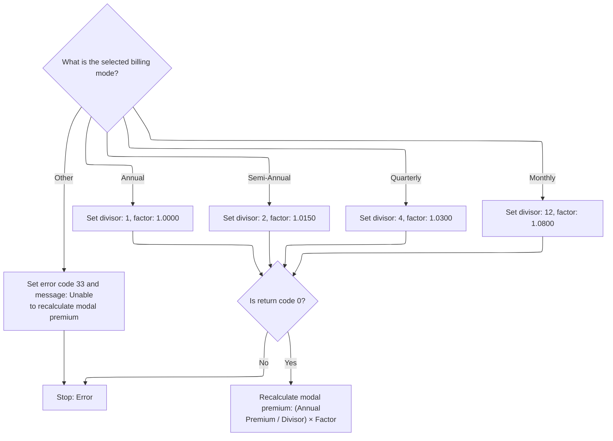

This section recalculates the modal premium for a term life insurance policy based on the selected billing mode. It determines the divisor and factor for the calculation, applies them to the annual premium, and handles errors for invalid billing modes.

| Rule ID | Category        | Rule Name                                   | Description                                                                                                                                                                                                                                                   | Implementation Details                                                                                                                                                                                                         |
| ------- | --------------- | ------------------------------------------- | ------------------------------------------------------------------------------------------------------------------------------------------------------------------------------------------------------------------------------------------------------------- | ------------------------------------------------------------------------------------------------------------------------------------------------------------------------------------------------------------------------------ |
| BR-001  | Data validation | Unknown billing mode error handling         | If the billing mode is not recognized, an error code 33 and message 'Unable to recalculate modal premium' are set, and modal premium calculation is stopped.                                                                                                  | Error code: 33; Error message: 'Unable to recalculate modal premium'. The error message is a string up to 100 characters.                                                                                                      |
| BR-002  | Calculation     | Modal premium calculation formula           | When the return code is 0, the modal premium is recalculated as (Annual Premium / Divisor) × Factor, rounded to the nearest value.                                                                                                                            | Formula: (Annual Premium / Divisor) × Factor. The result is rounded. Output is a numeric value representing the modal premium.                                                                                                 |
| BR-003  | Decision Making | Annual billing mode divisor and factor      | When the billing mode is 'Annual', the divisor is set to 1 and the factor is set to <SwmToken path="cobol/SVC-BILL-001.cob" pos="399:3:5" line-data="              MOVE 1.0000 TO PM-GENDER-FACTOR">`1.0000`</SwmToken> for modal premium calculation.        | Divisor: 1; Factor: <SwmToken path="cobol/SVC-BILL-001.cob" pos="399:3:5" line-data="              MOVE 1.0000 TO PM-GENDER-FACTOR">`1.0000`</SwmToken>. These constants are used in the modal premium calculation formula.    |
| BR-004  | Decision Making | Semi-Annual billing mode divisor and factor | When the billing mode is 'Semi-Annual', the divisor is set to 2 and the factor is set to <SwmToken path="cobol/SVC-BILL-001.cob" pos="484:3:5" line-data="                 MOVE 1.0150 TO WS-MODAL-FACTOR">`1.0150`</SwmToken> for modal premium calculation. | Divisor: 2; Factor: <SwmToken path="cobol/SVC-BILL-001.cob" pos="484:3:5" line-data="                 MOVE 1.0150 TO WS-MODAL-FACTOR">`1.0150`</SwmToken>. These constants are used in the modal premium calculation formula.  |
| BR-005  | Decision Making | Quarterly billing mode divisor and factor   | When the billing mode is 'Quarterly', the divisor is set to 4 and the factor is set to <SwmToken path="cobol/SVC-BILL-001.cob" pos="487:3:5" line-data="                 MOVE 1.0300 TO WS-MODAL-FACTOR">`1.0300`</SwmToken> for modal premium calculation.   | Divisor: 4; Factor: <SwmToken path="cobol/SVC-BILL-001.cob" pos="487:3:5" line-data="                 MOVE 1.0300 TO WS-MODAL-FACTOR">`1.0300`</SwmToken>. These constants are used in the modal premium calculation formula.  |
| BR-006  | Decision Making | Monthly billing mode divisor and factor     | When the billing mode is 'Monthly', the divisor is set to 12 and the factor is set to <SwmToken path="cobol/SVC-BILL-001.cob" pos="490:3:5" line-data="                 MOVE 1.0800 TO WS-MODAL-FACTOR">`1.0800`</SwmToken> for modal premium calculation.    | Divisor: 12; Factor: <SwmToken path="cobol/SVC-BILL-001.cob" pos="490:3:5" line-data="                 MOVE 1.0800 TO WS-MODAL-FACTOR">`1.0800`</SwmToken>. These constants are used in the modal premium calculation formula. |

<SwmSnippet path="/cobol/SVC-BILL-001.cob" line="477">

---

In <SwmToken path="cobol/SVC-BILL-001.cob" pos="477:1:7" line-data="       3200-RECALCULATE-MODAL-PREMIUM.">`3200-RECALCULATE-MODAL-PREMIUM`</SwmToken>, we use EVALUATE to pick the right divisor and factor for each billing mode. Unknown modes trigger an error and stop the calculation.

```cobol
       3200-RECALCULATE-MODAL-PREMIUM.
           EVALUATE PM-BILLING-MODE
              WHEN "A"
                 MOVE 1 TO WS-MODAL-DIVISOR
                 MOVE 1.0000 TO WS-MODAL-FACTOR
              WHEN "S"
                 MOVE 2 TO WS-MODAL-DIVISOR
                 MOVE 1.0150 TO WS-MODAL-FACTOR
              WHEN "Q"
                 MOVE 4 TO WS-MODAL-DIVISOR
                 MOVE 1.0300 TO WS-MODAL-FACTOR
              WHEN "M"
                 MOVE 12 TO WS-MODAL-DIVISOR
                 MOVE 1.0800 TO WS-MODAL-FACTOR
              WHEN OTHER
                 MOVE 33 TO PM-RETURN-CODE
                 MOVE "UNABLE TO RECALCULATE MODAL PREMIUM"
                   TO PM-RETURN-MESSAGE
           END-EVALUATE
```

---

</SwmSnippet>

<SwmSnippet path="/cobol/SVC-BILL-001.cob" line="496">

---

If the billing mode is valid, we calculate the modal premium by dividing the annual premium and multiplying by the factor. If not, we return an error code and message.

```cobol
           IF PM-RETURN-CODE = 0
              COMPUTE PM-MODAL-PREMIUM ROUNDED =
                      (PM-TOTAL-ANNUAL-PREMIUM / WS-MODAL-DIVISOR)
                    * WS-MODAL-FACTOR
           END-IF.
```

---

</SwmSnippet>

### Finalizing Plan Change and Amendment Status

This section finalizes the plan change process by updating key policy attributes after a successful reprice operation.

| Rule ID | Category        | Rule Name                         | Description                                                                                                        | Implementation Details                                                                                                                                                            |
| ------- | --------------- | --------------------------------- | ------------------------------------------------------------------------------------------------------------------ | --------------------------------------------------------------------------------------------------------------------------------------------------------------------------------- |
| BR-001  | Calculation     | Service fee update on plan change | When the reprice operation is successful, update the policy's service fee to the new standard value.               | The service fee is set to the value of the standard service fee field. The service fee is a numeric value, typically formatted as a number with two decimal places.               |
| BR-002  | Decision Making | Amendment status applied          | When the reprice operation is successful, mark the amendment status as applied.                                    | The amendment status is set to 'AP', which is a two-character alphanumeric code indicating 'applied'.                                                                             |
| BR-003  | Writing Output  | Plan change confirmation message  | When the reprice operation is successful, set the return message to confirm that the plan change has been applied. | The return message is set to 'PLAN CHANGE APPLIED', which is a string of up to 100 characters. The message is left-aligned and padded with spaces if shorter than 100 characters. |

<SwmSnippet path="/cobol/SVC-BILL-001.cob" line="219">

---

After calling <SwmToken path="cobol/SVC-BILL-001.cob" pos="218:3:7" line-data="           PERFORM 3100-REPRICE-POLICY">`3100-REPRICE-POLICY`</SwmToken> in <SwmToken path="cobol/SVC-BILL-001.cob" pos="48:3:7" line-data="                 PERFORM 2100-CHANGE-PLAN">`2100-CHANGE-PLAN`</SwmToken>, if everything checks out (<SwmToken path="cobol/SVC-BILL-001.cob" pos="219:3:7" line-data="           IF PM-RETURN-CODE = 0">`PM-RETURN-CODE`</SwmToken> = 0), we update the service fee, mark the amendment as applied ('AP'), and set the return message to confirm the plan change. This is the last step for plan amendments, locking in the new plan and fee.

```cobol
           IF PM-RETURN-CODE = 0
              MOVE PM-SERVICE-FEE-STD TO PM-SERVICE-FEE
              MOVE "AP" TO PM-AMENDMENT-STATUS
              MOVE "PLAN CHANGE APPLIED" TO PM-RETURN-MESSAGE
           END-IF.
```

---

</SwmSnippet>

## Validating and Processing Sum Assured Changes

```mermaid
%%{init: {"flowchart": {"defaultRenderer": "elk"}} }%%
flowchart TD
    node1["Start sum assured change"] --> node2{"Is new sum assured provided?"}
    click node1 openCode "cobol/SVC-BILL-001.cob:225:226"
    node2 -->|"No"| node3["Reject: New sum assured is required
(code 24)"]
    click node2 openCode "cobol/SVC-BILL-001.cob:229:233"
    click node3 openCode "cobol/SVC-BILL-001.cob:230:233"
    node2 -->|"Yes"| node4{"Is new sum assured within plan limits?
(min: 10,000,000; max: 50B/90B)"}
    click node4 openCode "cobol/SVC-BILL-001.cob:234:240"
    node4 -->|"No"| node5["Reject: New sum assured outside plan
limits (code 25)"]
    click node5 openCode "cobol/SVC-BILL-001.cob:236:240"
    node4 -->|"Yes"| node6{"Is new sum assured an increase?"}
    click node6 openCode "cobol/SVC-BILL-001.cob:243:243"
    node6 -->|"No"| node8["Apply new sum assured"]
    click node8 openCode "cobol/SVC-BILL-001.cob:257:257"
    node8 --> node13["Reprice policy"]
    click node13 openCode "cobol/SVC-BILL-001.cob:258:258"
    node6 -->|"Yes"| node7{"Increase > 25% or new sum assured >
25,000,000,000?"}
    click node7 openCode "cobol/SVC-BILL-001.cob:247:248"
    node7 -->|"Yes"| node9["Flag for underwriting approval, set
amendment status to 'PE', message:
'Requires UW approval'"]
    click node9 openCode "cobol/SVC-BILL-001.cob:249:253"
    node7 -->|"No"| node8
    node13 --> node10{"Was change applied successfully?
(return code = 0)"}
    click node10 openCode "cobol/SVC-BILL-001.cob:259:259"
    node10 -->|"Yes"| node11["Apply service fee (15.00), set
amendment status to 'AP', confirm
change"]
    click node11 openCode "cobol/SVC-BILL-001.cob:260:262"
    node10 -->|"No"| node12["Change not applied"]
    click node12 openCode "cobol/SVC-BILL-001.cob:263:263"
classDef HeadingStyle fill:#777777,stroke:#333,stroke-width:2px;

%% Swimm:
%% %%{init: {"flowchart": {"defaultRenderer": "elk"}} }%%
%% flowchart TD
%%     node1["Start sum assured change"] --> node2{"Is new sum assured provided?"}
%%     click node1 openCode "<SwmPath>[cobol/SVC-BILL-001.cob](cobol/SVC-BILL-001.cob)</SwmPath>:225:226"
%%     node2 -->|"No"| node3["Reject: New sum assured is required
%% (code 24)"]
%%     click node2 openCode "<SwmPath>[cobol/SVC-BILL-001.cob](cobol/SVC-BILL-001.cob)</SwmPath>:229:233"
%%     click node3 openCode "<SwmPath>[cobol/SVC-BILL-001.cob](cobol/SVC-BILL-001.cob)</SwmPath>:230:233"
%%     node2 -->|"Yes"| node4{"Is new sum assured within plan limits?
%% (min: 10,000,000; max: 50B/90B)"}
%%     click node4 openCode "<SwmPath>[cobol/SVC-BILL-001.cob](cobol/SVC-BILL-001.cob)</SwmPath>:234:240"
%%     node4 -->|"No"| node5["Reject: New sum assured outside plan
%% limits (code 25)"]
%%     click node5 openCode "<SwmPath>[cobol/SVC-BILL-001.cob](cobol/SVC-BILL-001.cob)</SwmPath>:236:240"
%%     node4 -->|"Yes"| node6{"Is new sum assured an increase?"}
%%     click node6 openCode "<SwmPath>[cobol/SVC-BILL-001.cob](cobol/SVC-BILL-001.cob)</SwmPath>:243:243"
%%     node6 -->|"No"| node8["Apply new sum assured"]
%%     click node8 openCode "<SwmPath>[cobol/SVC-BILL-001.cob](cobol/SVC-BILL-001.cob)</SwmPath>:257:257"
%%     node8 --> node13["Reprice policy"]
%%     click node13 openCode "<SwmPath>[cobol/SVC-BILL-001.cob](cobol/SVC-BILL-001.cob)</SwmPath>:258:258"
%%     node6 -->|"Yes"| node7{"Increase > 25% or new sum assured >
%% 25,000,000,000?"}
%%     click node7 openCode "<SwmPath>[cobol/SVC-BILL-001.cob](cobol/SVC-BILL-001.cob)</SwmPath>:247:248"
%%     node7 -->|"Yes"| node9["Flag for underwriting approval, set
%% amendment status to 'PE', message:
%% 'Requires UW approval'"]
%%     click node9 openCode "<SwmPath>[cobol/SVC-BILL-001.cob](cobol/SVC-BILL-001.cob)</SwmPath>:249:253"
%%     node7 -->|"No"| node8
%%     node13 --> node10{"Was change applied successfully?
%% (return code = 0)"}
%%     click node10 openCode "<SwmPath>[cobol/SVC-BILL-001.cob](cobol/SVC-BILL-001.cob)</SwmPath>:259:259"
%%     node10 -->|"Yes"| node11["Apply service fee (15.00), set
%% amendment status to 'AP', confirm
%% change"]
%%     click node11 openCode "<SwmPath>[cobol/SVC-BILL-001.cob](cobol/SVC-BILL-001.cob)</SwmPath>:260:262"
%%     node10 -->|"No"| node12["Change not applied"]
%%     click node12 openCode "<SwmPath>[cobol/SVC-BILL-001.cob](cobol/SVC-BILL-001.cob)</SwmPath>:263:263"
%% classDef HeadingStyle fill:#777777,stroke:#333,stroke-width:2px;
```

This section validates and processes sum assured changes for term life insurance policies, enforcing plan limits, underwriting requirements, and applying fees as appropriate.

| Rule ID | Category        | Rule Name                    | Description                                                                                                                                                                                                                                   | Implementation Details                                                                                                                                                                                                                                                                                                                                                                                                                                                                                                       |
| ------- | --------------- | ---------------------------- | --------------------------------------------------------------------------------------------------------------------------------------------------------------------------------------------------------------------------------------------- | ---------------------------------------------------------------------------------------------------------------------------------------------------------------------------------------------------------------------------------------------------------------------------------------------------------------------------------------------------------------------------------------------------------------------------------------------------------------------------------------------------------------------------- |
| BR-001  | Data validation | Required sum assured         | A new sum assured value is required for any change request. If the new sum assured is zero, the request is rejected with error code 24 and a message stating 'NEW SUM ASSURED IS REQUIRED'.                                                   | Error code: 24. Error message: 'NEW SUM ASSURED IS REQUIRED'. The output format is a numeric code and a string message.                                                                                                                                                                                                                                                                                                                                                                                                      |
| BR-002  | Data validation | Plan limit enforcement       | The new sum assured must be within the plan's minimum and maximum limits. If the value is outside these bounds, the request is rejected with error code 25 and a message stating 'NEW SUM ASSURED OUTSIDE PLAN LIMITS'.                       | Error code: 25. Error message: 'NEW SUM ASSURED OUTSIDE PLAN LIMITS'. Minimum and maximum values depend on plan code: min = 10,000,000; max = 50,000,000,000 for <SwmToken path="cobol/SVC-BILL-001.cob" pos="89:4:4" line-data="              WHEN &quot;T1001&quot;">`T1001`</SwmToken>, 90,000,000,000 for <SwmToken path="cobol/SVC-BILL-001.cob" pos="101:4:4" line-data="              WHEN &quot;T2001&quot;">`T2001`</SwmToken>, 75,000,000,000 otherwise. The output format is a numeric code and a string message. |
| BR-003  | Calculation     | Service fee and confirmation | If the sum assured change is successfully applied and repricing returns code 0, a service fee of 15.00 is applied, amendment status is set to 'AP', and a confirmation message is returned.                                                   | Service fee: 15.00. Amendment status: 'AP'. Confirmation message: 'SUM ASSURED CHANGE APPLIED'. The output format is a numeric fee, string status, and string message.                                                                                                                                                                                                                                                                                                                                                       |
| BR-004  | Decision Making | Underwriting trigger         | If the new sum assured is an increase of more than 25% or exceeds 25,000,000,000, the change is flagged for underwriting approval. The amendment status is set to 'PE' and a message 'SUM ASSURED INCREASE REQUIRES UW APPROVAL' is returned. | Threshold for increase: 25%. Threshold for sum assured: 25,000,000,000. Amendment status: 'PE'. Message: 'SUM ASSURED INCREASE REQUIRES UW APPROVAL'. The output format is a string status and a string message.                                                                                                                                                                                                                                                                                                             |

<SwmSnippet path="/cobol/SVC-BILL-001.cob" line="225">

---

In <SwmToken path="cobol/SVC-BILL-001.cob" pos="225:1:7" line-data="       2200-CHANGE-SUM-ASSURED.">`2200-CHANGE-SUM-ASSURED`</SwmToken>, we start by moving the old sum assured, then check if the new value is zero or outside plan limits. If either check fails, we bail out with an error and don't update anything.

```cobol
       2200-CHANGE-SUM-ASSURED.
           MOVE PM-SUM-ASSURED TO PM-OLD-SUM-ASSURED

      * SV-501: New sum assured must be present and within plan limits.
           IF PM-NEW-SUM-ASSURED = ZERO
              MOVE 24 TO PM-RETURN-CODE
              MOVE "NEW SUM ASSURED IS REQUIRED" TO PM-RETURN-MESSAGE
              EXIT PARAGRAPH
           END-IF
```

---

</SwmSnippet>

<SwmSnippet path="/cobol/SVC-BILL-001.cob" line="234">

---

Right after checking for zero, we validate the new sum assured against plan limits. If it's out of bounds, we set an error and exit, so only valid values get through.

```cobol
           IF PM-NEW-SUM-ASSURED < PM-MIN-SUM-ASSURED OR
              PM-NEW-SUM-ASSURED > PM-MAX-SUM-ASSURED
              MOVE 25 TO PM-RETURN-CODE
              MOVE "NEW SUM ASSURED OUTSIDE PLAN LIMITS"
                TO PM-RETURN-MESSAGE
              EXIT PARAGRAPH
           END-IF
```

---

</SwmSnippet>

<SwmSnippet path="/cobol/SVC-BILL-001.cob" line="243">

---

If the new sum assured is a big jump (over 25% or above 25B), we flag it for underwriting, mark the amendment as pending, and bail out. Nothing else happens until UW signs off.

```cobol
           IF PM-NEW-SUM-ASSURED > PM-OLD-SUM-ASSURED
              COMPUTE WS-SA-INCREASE-PCT ROUNDED =
                      ((PM-NEW-SUM-ASSURED - PM-OLD-SUM-ASSURED)
                       / PM-OLD-SUM-ASSURED) * 100
              IF WS-SA-INCREASE-PCT > 25.00 OR
                 PM-NEW-SUM-ASSURED > 25000000000.00
                 MOVE "Y" TO PM-UW-REQUIRED-IND
                 MOVE "PE" TO PM-AMENDMENT-STATUS
                 MOVE "SUM ASSURED INCREASE REQUIRES UW APPROVAL"
                   TO PM-RETURN-MESSAGE
                 EXIT PARAGRAPH
              END-IF
```

---

</SwmSnippet>

<SwmSnippet path="/cobol/SVC-BILL-001.cob" line="257">

---

Once the new sum assured is set, we call <SwmToken path="cobol/SVC-BILL-001.cob" pos="258:3:7" line-data="           PERFORM 3100-REPRICE-POLICY">`3100-REPRICE-POLICY`</SwmToken> to update all pricing. This keeps the premium and fees in sync with the new coverage.

```cobol
           MOVE PM-NEW-SUM-ASSURED TO PM-SUM-ASSURED
           PERFORM 3100-REPRICE-POLICY
```

---

</SwmSnippet>

<SwmSnippet path="/cobol/SVC-BILL-001.cob" line="259">

---

After calling <SwmToken path="cobol/SVC-BILL-001.cob" pos="218:3:7" line-data="           PERFORM 3100-REPRICE-POLICY">`3100-REPRICE-POLICY`</SwmToken> in <SwmToken path="cobol/SVC-BILL-001.cob" pos="50:3:9" line-data="                 PERFORM 2200-CHANGE-SUM-ASSURED">`2200-CHANGE-SUM-ASSURED`</SwmToken>, if repricing works (<SwmToken path="cobol/SVC-BILL-001.cob" pos="259:3:7" line-data="           IF PM-RETURN-CODE = 0">`PM-RETURN-CODE`</SwmToken> = 0), we set the service fee, mark the amendment as applied, and update the return message. If repricing fails, nothing is finalized.

```cobol
           IF PM-RETURN-CODE = 0
              MOVE 0000015.00 TO PM-SERVICE-FEE
              MOVE "AP" TO PM-AMENDMENT-STATUS
              MOVE "SUM ASSURED CHANGE APPLIED" TO PM-RETURN-MESSAGE
           END-IF.
```

---

</SwmSnippet>

## Validating and Applying Billing Mode Changes

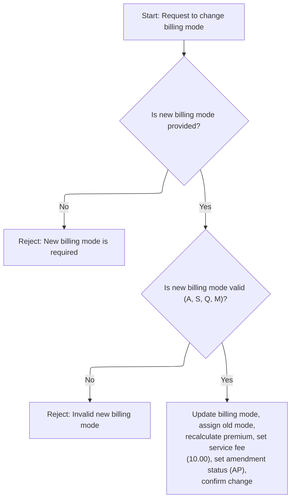

This section governs the validation and application of billing mode changes for term life insurance policies, ensuring only valid requests are processed and appropriate updates are made.

| Rule ID | Category        | Rule Name                  | Description                                                                                                                                                                                                                                                 | Implementation Details                                                                                                                                                                                          |
| ------- | --------------- | -------------------------- | ----------------------------------------------------------------------------------------------------------------------------------------------------------------------------------------------------------------------------------------------------------- | --------------------------------------------------------------------------------------------------------------------------------------------------------------------------------------------------------------- |
| BR-001  | Data validation | Required new billing mode  | A new billing mode is required for any billing mode change request. If not provided, the request is rejected with a specific error message.                                                                                                                 | If the new billing mode is missing, the return code is set to 26 and the return message is set to 'NEW BILLING MODE IS REQUIRED'. The error message is a string up to 100 characters.                           |
| BR-002  | Data validation | Allowed billing mode codes | The new billing mode must be one of the allowed codes: 'A', 'S', 'Q', or 'M'. If the provided mode is not valid, the request is rejected with a specific error message.                                                                                     | Allowed codes are 'A', 'S', 'Q', 'M'. If the code is invalid, the return code is set to 27 and the return message is set to 'INVALID NEW BILLING MODE'. The error message is a string up to 100 characters.     |
| BR-003  | Decision Making | Apply billing mode change  | When a valid new billing mode is provided, the billing mode is updated, the previous mode is recorded, the premium is recalculated, a fixed service fee of 10.00 is set, the amendment status is marked as applied, and a confirmation message is returned. | Service fee is set to 10.00 (numeric, 11 digits with 2 decimals). Amendment status is set to 'AP' (string, 2 characters). Confirmation message is 'BILLING MODE CHANGE APPLIED' (string, up to 100 characters). |

<SwmSnippet path="/cobol/SVC-BILL-001.cob" line="265">

---

In <SwmToken path="cobol/SVC-BILL-001.cob" pos="265:1:7" line-data="       2300-CHANGE-BILLING-MODE.">`2300-CHANGE-BILLING-MODE`</SwmToken>, we check if the new billing mode is provided and valid. If not, we bail out with an error and don't update anything.

```cobol
       2300-CHANGE-BILLING-MODE.
      * SV-601: Mode changes do not require UW, but must be valid.
           IF PM-NEW-BILLING-MODE = SPACES
              MOVE 26 TO PM-RETURN-CODE
              MOVE "NEW BILLING MODE IS REQUIRED" TO PM-RETURN-MESSAGE
              EXIT PARAGRAPH
           END-IF
```

---

</SwmSnippet>

<SwmSnippet path="/cobol/SVC-BILL-001.cob" line="272">

---

After checking for presence, we validate the new billing mode against allowed codes. If it's not one of 'A', 'S', 'Q', or 'M', we set an error and exit.

```cobol
           IF PM-NEW-BILLING-MODE NOT = "A" AND
              PM-NEW-BILLING-MODE NOT = "S" AND
              PM-NEW-BILLING-MODE NOT = "Q" AND
              PM-NEW-BILLING-MODE NOT = "M"
              MOVE 27 TO PM-RETURN-CODE
              MOVE "INVALID NEW BILLING MODE" TO PM-RETURN-MESSAGE
              EXIT PARAGRAPH
           END-IF
```

---

</SwmSnippet>

<SwmSnippet path="/cobol/SVC-BILL-001.cob" line="281">

---

Once the billing mode is updated, we call <SwmToken path="cobol/SVC-BILL-001.cob" pos="283:3:9" line-data="           PERFORM 3200-RECALCULATE-MODAL-PREMIUM">`3200-RECALCULATE-MODAL-PREMIUM`</SwmToken> to recalculate the premium for the new mode. This keeps payments accurate.

```cobol
           MOVE PM-BILLING-MODE TO PM-OLD-BILLING-MODE
           MOVE PM-NEW-BILLING-MODE TO PM-BILLING-MODE
           PERFORM 3200-RECALCULATE-MODAL-PREMIUM
```

---

</SwmSnippet>

<SwmSnippet path="/cobol/SVC-BILL-001.cob" line="284">

---

After calling <SwmToken path="cobol/SVC-BILL-001.cob" pos="283:3:9" line-data="           PERFORM 3200-RECALCULATE-MODAL-PREMIUM">`3200-RECALCULATE-MODAL-PREMIUM`</SwmToken> in <SwmToken path="cobol/SVC-BILL-001.cob" pos="52:3:9" line-data="                 PERFORM 2300-CHANGE-BILLING-MODE">`2300-CHANGE-BILLING-MODE`</SwmToken>, if recalculation works, we set the service fee, mark the amendment as applied, and update the return message. If it fails, nothing is finalized.

```cobol
           MOVE 0000010.00 TO PM-SERVICE-FEE
           MOVE "AP" TO PM-AMENDMENT-STATUS
           MOVE "BILLING MODE CHANGE APPLIED" TO PM-RETURN-MESSAGE.
```

---

</SwmSnippet>

## Adding Riders and Enforcing Eligibility

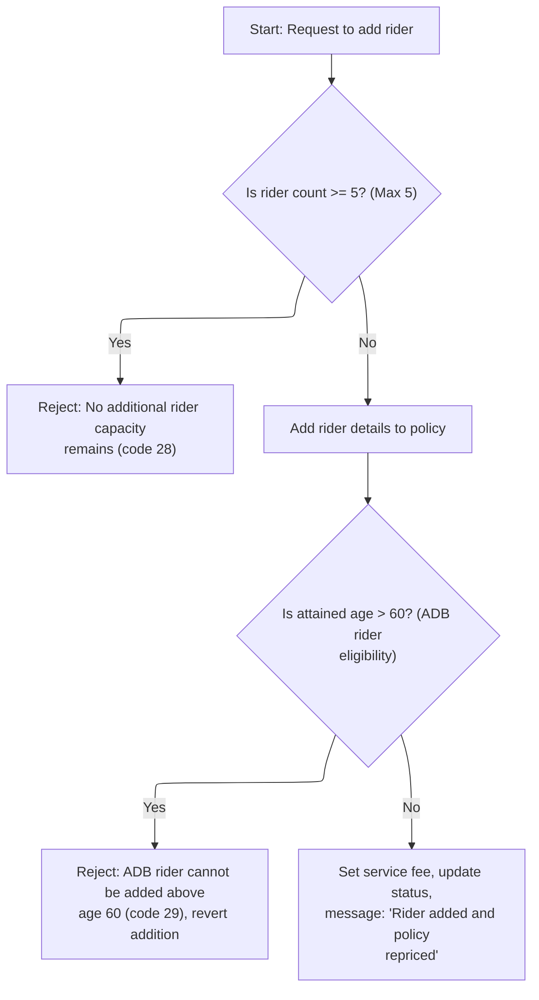

This section enforces business rules for adding a rider to a term life insurance policy, including capacity and age eligibility, and updates the policy state accordingly.

| Rule ID | Category        | Rule Name                               | Description                                                                                                                                                                                                 | Implementation Details                                                                                                                                                                                                                                                                  |
| ------- | --------------- | --------------------------------------- | ----------------------------------------------------------------------------------------------------------------------------------------------------------------------------------------------------------- | --------------------------------------------------------------------------------------------------------------------------------------------------------------------------------------------------------------------------------------------------------------------------------------- |
| BR-001  | Data validation | Rider capacity limit                    | A new rider cannot be added if the policy already has five riders. If a request is made to add a rider when the count is five or more, the request is rejected, and an error code and message are returned. | The maximum number of riders allowed per policy is 5. If the limit is reached, the return code is set to 28 and the message is 'NO ADDITIONAL RIDER CAPACITY REMAINS'. The message is a string up to 100 characters.                                                                    |
| BR-002  | Data validation | ADB rider age eligibility               | The ADB rider cannot be added if the insured's attained age is greater than 60. If a rider is added and the attained age is above 60, the addition is reverted, and an error code and message are returned. | The maximum eligible attained age for adding an ADB rider is 60. If the age is above 60, the return code is set to 29 and the message is 'ADB RIDER CANNOT BE ADDED ABOVE AGE 60'. The message is a string up to 100 characters. The rider count is decremented to revert the addition. |
| BR-003  | Writing Output  | Successful rider addition and repricing | When a rider is successfully added and repricing is successful, the service fee is set to 12.00, the amendment status is updated to 'AP', and a confirmation message is returned.                           | The service fee is set to 12.00 (number, two decimal places). The amendment status is set to 'AP' (string, 2 characters). The confirmation message is 'RIDER ADDED AND POLICY REPRICED' (string, up to 100 characters).                                                                 |

<SwmSnippet path="/cobol/SVC-BILL-001.cob" line="288">

---

In <SwmToken path="cobol/SVC-BILL-001.cob" pos="288:1:5" line-data="       2400-ADD-RIDER.">`2400-ADD-RIDER`</SwmToken>, we check if there's room for another rider. If not, we bail out with an error and don't add anything.

```cobol
       2400-ADD-RIDER.
      * SV-701: Add rider only if capacity remains and rider is eligible.
           IF PM-RIDER-COUNT >= 5
              MOVE 28 TO PM-RETURN-CODE
              MOVE "NO ADDITIONAL RIDER CAPACITY REMAINS"
                TO PM-RETURN-MESSAGE
              EXIT PARAGRAPH
           END-IF
```

---

</SwmSnippet>

<SwmSnippet path="/cobol/SVC-BILL-001.cob" line="297">

---

If there's room, we add the <SwmToken path="cobol/SVC-BILL-001.cob" pos="298:4:4" line-data="           MOVE &quot;ADB01&quot; TO PM-RIDER-CODE(PM-RIDER-COUNT)">`ADB01`</SwmToken> rider and set its sum assured and status. But if the insured is over 60, we undo the addition and bail out with an error.

```cobol
           ADD 1 TO PM-RIDER-COUNT
           MOVE "ADB01" TO PM-RIDER-CODE(PM-RIDER-COUNT)
           MOVE PM-SUM-ASSURED TO PM-RIDER-SUM-ASSURED(PM-RIDER-COUNT)
           MOVE "A" TO PM-RIDER-STATUS(PM-RIDER-COUNT)

      * SV-702: ADB rider cannot be added above age 60.
           IF PM-ATTAINED-AGE > 60
              MOVE 29 TO PM-RETURN-CODE
              MOVE "ADB RIDER CANNOT BE ADDED ABOVE AGE 60"
                TO PM-RETURN-MESSAGE
              SUBTRACT 1 FROM PM-RIDER-COUNT
              EXIT PARAGRAPH
           END-IF
```

---

</SwmSnippet>

<SwmSnippet path="/cobol/SVC-BILL-001.cob" line="311">

---

After adding the rider, we call <SwmToken path="cobol/SVC-BILL-001.cob" pos="311:3:7" line-data="           PERFORM 3100-REPRICE-POLICY">`3100-REPRICE-POLICY`</SwmToken> to update the premium. This keeps the pricing correct for the new coverage.

```cobol
           PERFORM 3100-REPRICE-POLICY
```

---

</SwmSnippet>

<SwmSnippet path="/cobol/SVC-BILL-001.cob" line="312">

---

After calling <SwmToken path="cobol/SVC-BILL-001.cob" pos="218:3:7" line-data="           PERFORM 3100-REPRICE-POLICY">`3100-REPRICE-POLICY`</SwmToken> in <SwmToken path="cobol/SVC-BILL-001.cob" pos="54:3:7" line-data="                 PERFORM 2400-ADD-RIDER">`2400-ADD-RIDER`</SwmToken>, if repricing works, we set the service fee, mark the amendment as applied, and update the return message. If it fails, nothing is finalized.

```cobol
           IF PM-RETURN-CODE = 0
              MOVE 0000012.00 TO PM-SERVICE-FEE
              MOVE "AP" TO PM-AMENDMENT-STATUS
              MOVE "RIDER ADDED AND POLICY REPRICED"
                TO PM-RETURN-MESSAGE
           END-IF.
```

---

</SwmSnippet>

## Removing Riders and Updating Policy

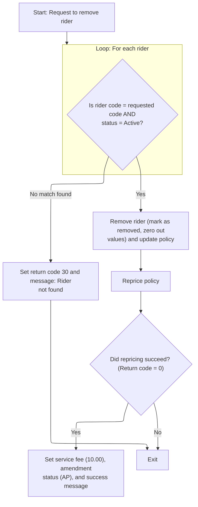

This section governs the removal of a rider from a policy, ensuring only active riders matching the requested code are removed, and that the policy is repriced and amended accordingly. It also handles error messaging when no eligible rider is found.

| Rule ID | Category        | Rule Name                                          | Description                                                                                                                                                                                                      | Implementation Details                                                                                                                   |
| ------- | --------------- | -------------------------------------------------- | ---------------------------------------------------------------------------------------------------------------------------------------------------------------------------------------------------------------- | ---------------------------------------------------------------------------------------------------------------------------------------- |
| BR-001  | Data validation | Rider not found error handling                     | If no eligible rider is found, the policy is not updated and an error code (30) and message ('REQUESTED RIDER NOT FOUND FOR REMOVAL') are set.                                                                   | Error code is 30. Error message is 'REQUESTED RIDER NOT FOUND FOR REMOVAL'. Message is up to 100 characters.                             |
| BR-002  | Calculation     | Rider removal and zeroing values                   | When an eligible rider is removed, its status is marked as 'R', and all associated values (sum assured, rate, annual premium) are set to zero.                                                                   | Status is set to 'R'. Sum assured, rate, and annual premium are set to zero. These are numeric fields.                                   |
| BR-003  | Calculation     | Policy repricing and amendment after rider removal | After removing a rider, the policy is repriced to reflect the change. If repricing succeeds (return code = 0), a service fee of 10.00 is applied, amendment status is set to 'AP', and a success message is set. | Service fee is 10.00. Amendment status is 'AP'. Success message is 'RIDER REMOVED AND POLICY REPRICED'. Message is up to 100 characters. |
| BR-004  | Decision Making | Active rider removal eligibility                   | Only the first active rider matching the requested code is eligible for removal. If no such rider exists, no changes are made to the policy.                                                                     | The rider status must be 'A'. The rider code must match the requested code. Only the first eligible rider is considered.                 |

<SwmSnippet path="/cobol/SVC-BILL-001.cob" line="319">

---

In <SwmToken path="cobol/SVC-BILL-001.cob" pos="319:1:5" line-data="       2500-REMOVE-RIDER.">`2500-REMOVE-RIDER`</SwmToken>, we loop through riders to find the first active <SwmToken path="cobol/SVC-BILL-001.cob" pos="323:18:18" line-data="                      (PM-RIDER-CODE(WS-RIDER-IDX) = &quot;ADB01&quot; AND">`ADB01`</SwmToken>. If none is found, we bail out with an error and don't update anything.

```cobol
       2500-REMOVE-RIDER.
      * SV-801: Remove the first active rider matching rider code.
           PERFORM VARYING WS-RIDER-IDX FROM 1 BY 1
                   UNTIL WS-RIDER-IDX > PM-RIDER-COUNT OR
                      (PM-RIDER-CODE(WS-RIDER-IDX) = "ADB01" AND
                       PM-RIDER-STATUS(WS-RIDER-IDX) = "A")
              CONTINUE
           END-PERFORM
```

---

</SwmSnippet>

<SwmSnippet path="/cobol/SVC-BILL-001.cob" line="328">

---

If the rider isn't found, we set an error code and message, then exit. Only active riders get removed.

```cobol
           IF WS-RIDER-IDX > PM-RIDER-COUNT
              MOVE 30 TO PM-RETURN-CODE
              MOVE "REQUESTED RIDER NOT FOUND FOR REMOVAL"
                TO PM-RETURN-MESSAGE
              EXIT PARAGRAPH
           END-IF
```

---

</SwmSnippet>

<SwmSnippet path="/cobol/SVC-BILL-001.cob" line="335">

---

After marking the rider as removed and zeroing out its amounts, we call <SwmToken path="cobol/SVC-BILL-001.cob" pos="339:3:7" line-data="           PERFORM 3100-REPRICE-POLICY">`3100-REPRICE-POLICY`</SwmToken> to update the premium. This keeps the pricing correct after the change.

```cobol
           MOVE "R" TO PM-RIDER-STATUS(WS-RIDER-IDX)
           MOVE ZERO TO PM-RIDER-SUM-ASSURED(WS-RIDER-IDX)
                        PM-RIDER-RATE(WS-RIDER-IDX)
                        PM-RIDER-ANNUAL-PREM(WS-RIDER-IDX)
           PERFORM 3100-REPRICE-POLICY
```

---

</SwmSnippet>

<SwmSnippet path="/cobol/SVC-BILL-001.cob" line="340">

---

After calling <SwmToken path="cobol/SVC-BILL-001.cob" pos="218:3:7" line-data="           PERFORM 3100-REPRICE-POLICY">`3100-REPRICE-POLICY`</SwmToken> in <SwmToken path="cobol/SVC-BILL-001.cob" pos="56:3:7" line-data="                 PERFORM 2500-REMOVE-RIDER">`2500-REMOVE-RIDER`</SwmToken>, if repricing works, we set the service fee, mark the amendment as applied, and update the return message. If it fails, nothing is finalized.

```cobol
           IF PM-RETURN-CODE = 0
              MOVE 0000010.00 TO PM-SERVICE-FEE
              MOVE "AP" TO PM-AMENDMENT-STATUS
              MOVE "RIDER REMOVED AND POLICY REPRICED"
                TO PM-RETURN-MESSAGE
           END-IF.
```

---

</SwmSnippet>

## Processing Policy Reinstatement

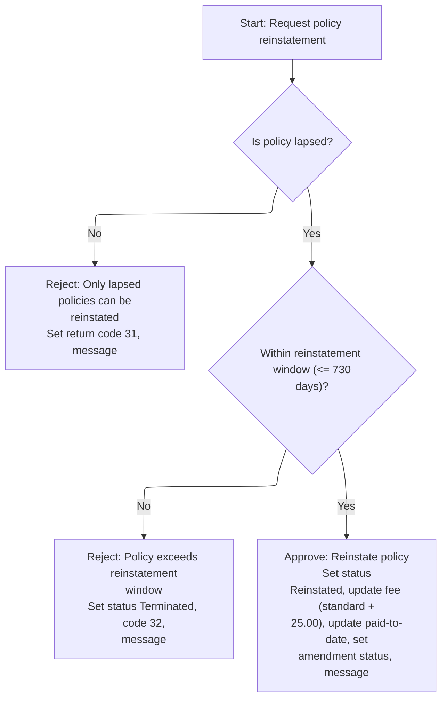

This section governs the business logic for reinstating lapsed policies, including eligibility checks, time window validation, and updates to policy attributes based on the outcome.

| Rule ID | Category        | Rule Name                         | Description                                                                                                                                                                                                                                                                                                                                                                                                                                                                                                                                                                                                           | Implementation Details                                                                                                                                                                                                                                                                                                                                                                                                                                                        |
| ------- | --------------- | --------------------------------- | --------------------------------------------------------------------------------------------------------------------------------------------------------------------------------------------------------------------------------------------------------------------------------------------------------------------------------------------------------------------------------------------------------------------------------------------------------------------------------------------------------------------------------------------------------------------------------------------------------------------- | ----------------------------------------------------------------------------------------------------------------------------------------------------------------------------------------------------------------------------------------------------------------------------------------------------------------------------------------------------------------------------------------------------------------------------------------------------------------------------- |
| BR-001  | Data validation | Lapsed status eligibility         | Reject reinstatement requests for policies that are not in lapsed status. Set return code to 31 and message to 'ONLY LAPSED POLICIES CAN BE REINSTATED'.                                                                                                                                                                                                                                                                                                                                                                                                                                                              | Return code is set to 31. Return message is set to 'ONLY LAPSED POLICIES CAN BE REINSTATED'. Message is a string up to 100 characters.                                                                                                                                                                                                                                                                                                                                        |
| BR-002  | Data validation | Reinstatement window limit        | Reject reinstatement requests for policies where the elapsed days since last payment exceed the reinstatement window (730 days). Set return code to 32, message to 'POLICY EXCEEDS REINSTATEMENT WINDOW', and contract status to 'Terminated'.                                                                                                                                                                                                                                                                                                                                                                        | Return code is set to 32. Return message is set to 'POLICY EXCEEDS REINSTATEMENT WINDOW'. Contract status is set to 'TE' (Terminated). Message is a string up to 100 characters. The window is 730 days for all plan codes.                                                                                                                                                                                                                                                   |
| BR-003  | Calculation     | Reinstatement approval and update | Approve reinstatement for eligible policies by updating the service fee to standard fee plus <SwmToken path="cobol/SVC-BILL-001.cob" pos="247:13:15" line-data="              IF WS-SA-INCREASE-PCT &gt; 25.00 OR">`25.00`</SwmToken>, setting outstanding premium to modal premium, updating contract status to 'Reinstated', <SwmToken path="cobol/SVC-BILL-001.cob" pos="143:24:28" line-data="      * SV-201: Status moves to grace then lapse based on paid-to-date.">`paid-to-date`</SwmToken> to process date, amendment status to 'Applied', and return message to 'POLICY REINSTATED SUBJECT TO COLLECTION'. | Service fee is updated to standard fee plus <SwmToken path="cobol/SVC-BILL-001.cob" pos="247:13:15" line-data="              IF WS-SA-INCREASE-PCT &gt; 25.00 OR">`25.00`</SwmToken>. Outstanding premium is set to modal premium. Contract status is set to 'RS' (Reinstated). Paid-to-date is set to process date. Amendment status is set to 'AP' (Applied). Return message is set to 'POLICY REINSTATED SUBJECT TO COLLECTION'. Message is a string up to 100 characters. |

<SwmSnippet path="/cobol/SVC-BILL-001.cob" line="347">

---

In <SwmToken path="cobol/SVC-BILL-001.cob" pos="347:1:5" line-data="       2600-PROCESS-REINSTATEMENT.">`2600-PROCESS-REINSTATEMENT`</SwmToken>, we check if the policy is lapsed and within the allowed window. If not, we bail out with an error and either don't reinstate or mark the contract as terminated.

```cobol
       2600-PROCESS-REINSTATEMENT.
      * SV-901: Reinstatement only for lapsed policies within window.
           IF NOT PM-STAT-LAPSED
              MOVE 31 TO PM-RETURN-CODE
              MOVE "ONLY LAPSED POLICIES CAN BE REINSTATED"
                TO PM-RETURN-MESSAGE
              EXIT PARAGRAPH
           END-IF
```

---

</SwmSnippet>

<SwmSnippet path="/cobol/SVC-BILL-001.cob" line="355">

---

If the reinstatement window is exceeded, we set an error, mark the contract as terminated, and exit. Only eligible policies get reinstated.

```cobol
           IF WS-DAYS-SINCE-PAID > PM-REINSTATE-DAYS
              MOVE 32 TO PM-RETURN-CODE
              MOVE "POLICY EXCEEDS REINSTATEMENT WINDOW"
                TO PM-RETURN-MESSAGE
              MOVE "TE" TO PM-CONTRACT-STATUS
              EXIT PARAGRAPH
           END-IF
```

---

</SwmSnippet>

<SwmSnippet path="/cobol/SVC-BILL-001.cob" line="364">

---

If reinstatement is allowed, we add <SwmToken path="cobol/SVC-BILL-001.cob" pos="364:21:23" line-data="           COMPUTE PM-SERVICE-FEE = PM-SERVICE-FEE-STD + 25.00">`25.00`</SwmToken> to the standard service fee, set the outstanding premium, update contract status and <SwmToken path="cobol/SVC-BILL-001.cob" pos="143:24:28" line-data="      * SV-201: Status moves to grace then lapse based on paid-to-date.">`paid-to-date`</SwmToken>, mark the amendment as applied, and set the return message.

```cobol
           COMPUTE PM-SERVICE-FEE = PM-SERVICE-FEE-STD + 25.00
           MOVE PM-MODAL-PREMIUM TO PM-OUTSTANDING-PREMIUM
           MOVE "RS" TO PM-CONTRACT-STATUS
           MOVE PM-PROCESS-DATE TO PM-PAID-TO-DATE
           MOVE "AP" TO PM-AMENDMENT-STATUS
           MOVE "POLICY REINSTATED SUBJECT TO COLLECTION"
             TO PM-RETURN-MESSAGE.
```

---

</SwmSnippet>

## Finalizing Policy Amendment and Audit

This section finalizes a policy amendment by updating audit fields in the policy record to reflect the completion of the amendment and the responsible user.

| Rule ID | Category    | Rule Name                          | Description                                                                                                                                                                                                                                           | Implementation Details                                                                                                                                                                                                                              |
| ------- | ----------- | ---------------------------------- | ----------------------------------------------------------------------------------------------------------------------------------------------------------------------------------------------------------------------------------------------------- | --------------------------------------------------------------------------------------------------------------------------------------------------------------------------------------------------------------------------------------------------- |
| BR-001  | Calculation | Update maintenance date on success | When an amendment is successfully processed, the last maintenance date is updated to the current process date.                                                                                                                                        | The maintenance date is set to the current process date, which is an 8-digit number representing the date in YYYYMMDD format.                                                                                                                       |
| BR-002  | Calculation | Update action date on success      | When an amendment is successfully processed, the last action date is updated to the current process date.                                                                                                                                             | The action date is set to the current process date, which is an 8-digit number representing the date in YYYYMMDD format.                                                                                                                            |
| BR-003  | Calculation | Record action user on success      | When an amendment is successfully processed, the last action user is set to the service identifier <SwmToken path="cobol/SVC-BILL-001.cob" pos="68:4:4" line-data="              MOVE &quot;SVC001&quot; TO PM-LAST-ACTION-USER">`SVC001`</SwmToken>. | The action user is set to the string <SwmToken path="cobol/SVC-BILL-001.cob" pos="68:4:4" line-data="              MOVE &quot;SVC001&quot; TO PM-LAST-ACTION-USER">`SVC001`</SwmToken>, which identifies the service responsible for the amendment. |

<SwmSnippet path="/cobol/SVC-BILL-001.cob" line="65">

---

Back in <SwmToken path="cobol/SVC-BILL-001.cob" pos="36:1:3" line-data="       MAIN-PROCESS.">`MAIN-PROCESS`</SwmToken>, if everything worked (<SwmToken path="cobol/SVC-BILL-001.cob" pos="65:3:7" line-data="           IF PM-RETURN-CODE = 0">`PM-RETURN-CODE`</SwmToken> = 0), we update the last maintenance and action dates, and set the action user. This closes out the amendment and logs who did it.

```cobol
           IF PM-RETURN-CODE = 0
              MOVE PM-PROCESS-DATE TO PM-LAST-MAINT-DATE
              MOVE PM-PROCESS-DATE TO PM-LAST-ACTION-DATE
              MOVE "SVC001" TO PM-LAST-ACTION-USER
           END-IF
           GOBACK.
```

---

</SwmSnippet>

&nbsp;

*This is an auto-generated document by Swimm 🌊 and has not yet been verified by a human*

<SwmMeta version="3.0.0" repo-id="Z2l0aHViJTNBJTNBQ09CT0xfU2FtcGxlX01hcmNoXzIwMjYlM0ElM0FtdWRhc2luMQ==" repo-name="COBOL_Sample_March_2026"><sup>Powered by [Swimm](https://app.swimm.io/)</sup></SwmMeta>
