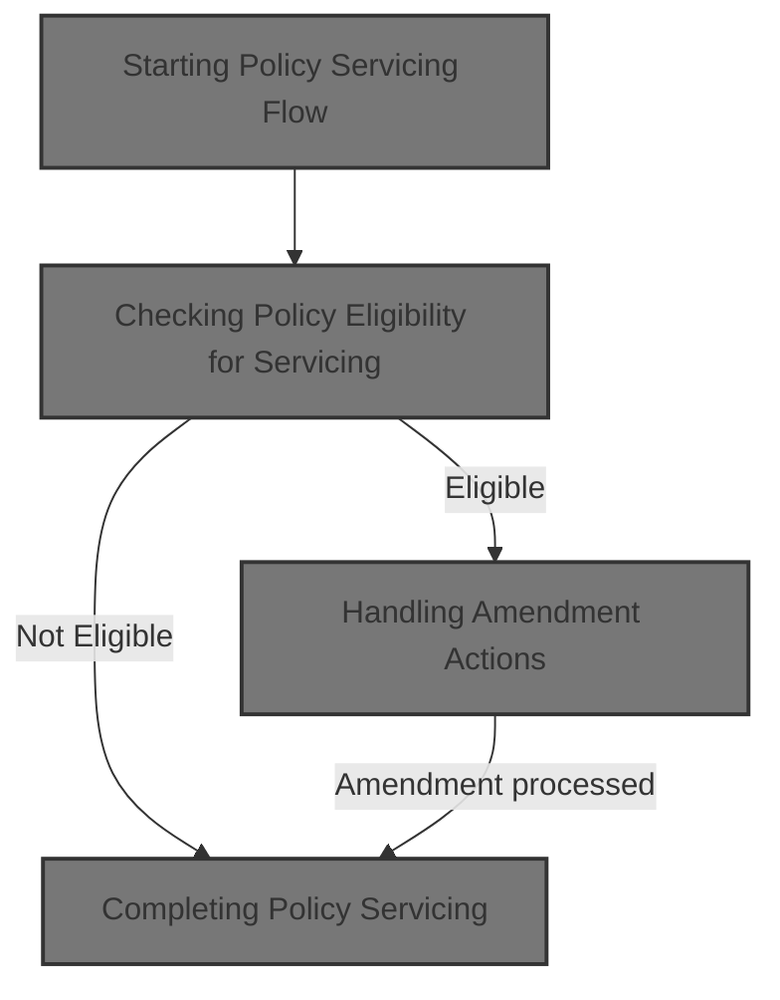

# Overview

This document explains the flow of policy servicing for term life insurance policies. The flow validates policy eligibility and amendment requests, applies changes such as plan updates, sum assured modifications, rider additions/removals, billing mode changes, and policy reinstatements. It recalculates premiums and fees as needed and updates policy records or returns error messages.

## Dependencies

### Program

- SVCBILL001 (<SwmPath>[SVC-BILL-001.cob](SVC-BILL-001.cob)</SwmPath>)

### Copybook

- POLDATA (<SwmPath>[POLDATA.cpy](POLDATA.cpy)</SwmPath>)

&nbsp;

*This is an auto-generated document by Swimm 🌊 and has not yet been verified by a human*

<SwmMeta version="3.0.0" repo-id="Z2l0aHViJTNBJTNBQ09CT0xfU2FtcGxlX01hcmNoXzIwMjYlM0ElM0FtdWRhc2luMQ==" repo-name="COBOL_Sample_March_2026">Powered by [Swimm](https://app.swimm.io/)</SwmMeta>
