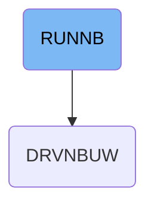

This document explains the RUNNB job, which manages the execution of an integrated test driver program for COBOL components. It configures the environment by specifying load libraries and output destinations, runs the test driver to validate the build, and captures execution logs and outputs for review. For example, the job takes the load library path as input and produces system logs and test results as output.

# Dependencies

## Data Validation and Extraction

Step in this section: <SwmToken path="/jcl/RUNNBUW.jcl" pos="7:1:1" line-data="//GO     EXEC PGM=DRVNBUW,REGION=8M">`GO`</SwmToken>.

This section ensures that only complete and correct business data proceeds in the workflow, enabling reliable downstream operations.

&nbsp;

*This is an auto-generated document by Swimm 🌊 and has not yet been verified by a human*

<SwmMeta version="3.0.0" repo-id="Z2l0aHViJTNBJTNBQ09CT0xfU2FtcGxlX01hcmNoXzIwMjYlM0ElM0FtdWRhc2luMQ==" repo-name="COBOL_Sample_March_2026">Powered by [Swimm](https://app.swimm.io/)</SwmMeta>
