# Overview

This document explains the flow of processing policy servicing requests. The flow validates eligibility, enforces plan-specific rules, and routes requests to the appropriate amendment handler based on the requested change. Amendments are processed according to business rules, with premiums recalculated and contract status updated as needed.

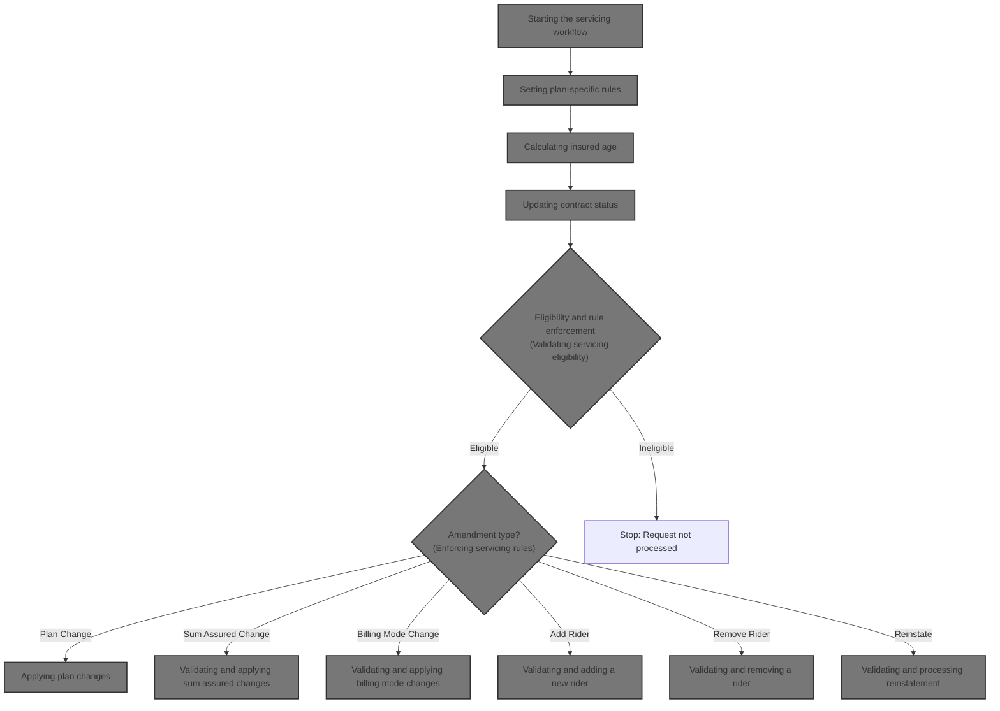

## Dependencies

### Program

- <SwmToken path="SVC-BILL-001.cob" pos="2:6:6" line-data="       PROGRAM-ID. SVCBILL001.">`SVCBILL001`</SwmToken> (<SwmPath>[SVC-BILL-001.cob](SVC-BILL-001.cob)</SwmPath>)

### Copybook

- POLDATA (<SwmPath>[POLDATA.cpy](POLDATA.cpy)</SwmPath>)

# Workflow

# Starting the servicing workflow

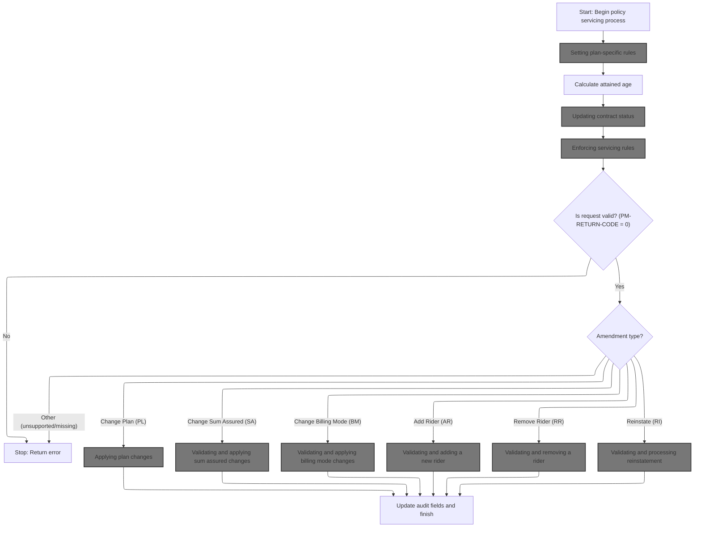

This section governs the initiation and processing of policy servicing requests, ensuring eligibility, validation, and correct application of amendments according to business rules.

| Rule ID | Category        | Rule Name                         | Description                                                                                                                                                  | Implementation Details                                                                                                                                                                                                                                                     |
| ------- | --------------- | --------------------------------- | ------------------------------------------------------------------------------------------------------------------------------------------------------------ | -------------------------------------------------------------------------------------------------------------------------------------------------------------------------------------------------------------------------------------------------------------------------- |
| BR-001  | Data validation | Unsupported plan code rejection   | If the plan code is not supported, the servicing process is stopped and an error code/message is set.                                                        | Error code is a 4-digit number; error message is a string up to 100 characters. Output format: error code and message fields in the policy master record.                                                                                                                  |
| BR-002  | Data validation | Servicing request validation      | If the servicing request is not valid, an error code/message is set and processing stops.                                                                    | Error code is a 4-digit number; error message is a string up to 100 characters. Output format: error code and message fields in the policy master record.                                                                                                                  |
| BR-003  | Calculation     | Attained age calculation          | The attained age is calculated for the policyholder as part of servicing.                                                                                    | Attained age is a numeric value calculated from policyholder's birth date and current date. Output format: numeric field in policy master record.                                                                                                                          |
| BR-004  | Decision Making | Contract status update by payment | Contract status is updated based on payment evaluation, including grace and lapsed status if overdue.                                                        | Contract status is a 2-character code (e.g., 'AC', 'GR', 'LA'). Output format: contract status field in policy master record.                                                                                                                                              |
| BR-005  | Decision Making | Amendment type routing            | Amendment type determines which servicing action is applied: plan change, sum assured change, billing mode change, rider addition/removal, or reinstatement. | Amendment type is a 2-character code (e.g., 'PL', 'SA', 'BM', 'AR', 'RR', 'RI'). Output format: amendment type field in policy master record.                                                                                                                              |
| BR-006  | Writing Output  | Audit field update                | Audit fields are updated to record the last action user and maintenance date after successful servicing.                                                     | Last action user is a string (<SwmToken path="SVC-BILL-001.cob" pos="67:4:4" line-data="              MOVE &quot;SVC001&quot; TO PM-LAST-ACTION-USER">`SVC001`</SwmToken>); last maintenance date is an 8-digit date. Output format: audit fields in policy master record. |

<SwmSnippet path="/SVC-BILL-001.cob" line="36">

---

<SwmToken path="SVC-BILL-001.cob" pos="36:1:3" line-data="       MAIN-PROCESS.">`MAIN-PROCESS`</SwmToken> starts by prepping the policy data, then calls <SwmToken path="SVC-BILL-001.cob" pos="38:3:9" line-data="           PERFORM 1100-LOAD-PLAN-PARAMETERS">`1100-LOAD-PLAN-PARAMETERS`</SwmToken> to get the plan-specific rules needed for all later steps. If the plan code isn't valid, we stop processing right away.

```cobol
       MAIN-PROCESS.
           PERFORM 1000-INITIALIZE
           PERFORM 1100-LOAD-PLAN-PARAMETERS
           PERFORM 1200-CALCULATE-ATTAINED-AGE
           PERFORM 1300-EVALUATE-PAYMENT-STATUS
           PERFORM 1400-VALIDATE-SERVICING-REQUEST
```

---

</SwmSnippet>

## Setting plan-specific rules

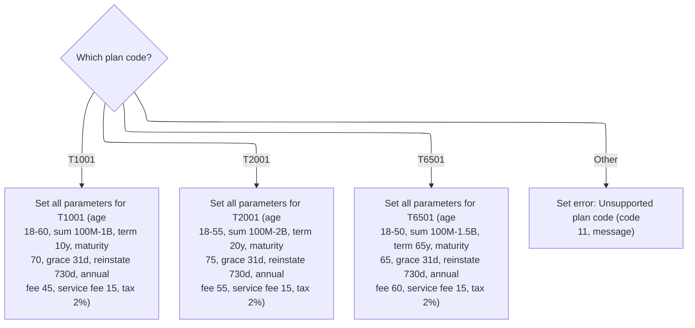

This section sets all plan-specific parameters for a policy based on the plan code. It ensures that each supported plan code receives the correct business values, and flags unsupported codes with an error.

| Rule ID | Category        | Rule Name                                                                                                                           | Description                                                                                                                                                                                                                                                                                                                                                                                                                                                                    | Implementation Details                                                                                                                                                                                                                                                                                                                                                                                                                                                                                                                                                                                                                                                                                                                                                                         |
| ------- | --------------- | ----------------------------------------------------------------------------------------------------------------------------------- | ------------------------------------------------------------------------------------------------------------------------------------------------------------------------------------------------------------------------------------------------------------------------------------------------------------------------------------------------------------------------------------------------------------------------------------------------------------------------------ | ---------------------------------------------------------------------------------------------------------------------------------------------------------------------------------------------------------------------------------------------------------------------------------------------------------------------------------------------------------------------------------------------------------------------------------------------------------------------------------------------------------------------------------------------------------------------------------------------------------------------------------------------------------------------------------------------------------------------------------------------------------------------------------------------- |
| BR-001  | Decision Making | <SwmToken path="SVC-BILL-001.cob" pos="88:4:4" line-data="              WHEN &quot;T1001&quot;">`T1001`</SwmToken> plan parameters  | When the plan code is <SwmToken path="SVC-BILL-001.cob" pos="88:4:4" line-data="              WHEN &quot;T1001&quot;">`T1001`</SwmToken>, set minimum issue age to 18, maximum issue age to 60, minimum sum assured to 100,000,000.00, maximum sum assured to 1,000,000,000.00, term to 10 years, maturity age to 70, grace period to 31 days, reinstatement period to 730 days, annual policy fee to 45.00, service fee to 15.00, and tax rate to 2%.                         | All values are assigned as follows: minimum issue age (number, 3 digits, value 18), maximum issue age (number, 3 digits, value 60), minimum sum assured (number, 13 digits with 2 decimals, value 100,000,000.00), maximum sum assured (number, 13 digits with 2 decimals, value 1,000,000,000.00), term (number, 3 digits, value 10), maturity age (number, 3 digits, value 70), grace period (number, 3 digits, value 31), reinstatement period (number, 3 digits, value 730), annual policy fee (number, 7 digits with 2 decimals, value 45.00), service fee (number, 7 digits with 2 decimals, value 15.00), tax rate (number, 1 digit with 4 decimals, value <SwmToken path="SVC-BILL-001.cob" pos="99:3:5" line-data="                 MOVE 0.0200 TO PM-TAX-RATE">`0.0200`</SwmToken>). |
| BR-002  | Decision Making | <SwmToken path="SVC-BILL-001.cob" pos="100:4:4" line-data="              WHEN &quot;T2001&quot;">`T2001`</SwmToken> plan parameters | When the plan code is <SwmToken path="SVC-BILL-001.cob" pos="100:4:4" line-data="              WHEN &quot;T2001&quot;">`T2001`</SwmToken>, set minimum issue age to 18, maximum issue age to 55, minimum sum assured to 100,000,000.00, maximum sum assured to 2,000,000,000.00, term to 20 years, maturity age to 75, grace period to 31 days, reinstatement period to 730 days, annual policy fee to 55.00, service fee to 15.00, and tax rate to 2%.                        | All values are assigned as follows: minimum issue age (number, 3 digits, value 18), maximum issue age (number, 3 digits, value 55), minimum sum assured (number, 13 digits with 2 decimals, value 100,000,000.00), maximum sum assured (number, 13 digits with 2 decimals, value 2,000,000,000.00), term (number, 3 digits, value 20), maturity age (number, 3 digits, value 75), grace period (number, 3 digits, value 31), reinstatement period (number, 3 digits, value 730), annual policy fee (number, 7 digits with 2 decimals, value 55.00), service fee (number, 7 digits with 2 decimals, value 15.00), tax rate (number, 1 digit with 4 decimals, value <SwmToken path="SVC-BILL-001.cob" pos="99:3:5" line-data="                 MOVE 0.0200 TO PM-TAX-RATE">`0.0200`</SwmToken>). |
| BR-003  | Decision Making | <SwmToken path="SVC-BILL-001.cob" pos="112:4:4" line-data="              WHEN &quot;T6501&quot;">`T6501`</SwmToken> plan parameters | When the plan code is <SwmToken path="SVC-BILL-001.cob" pos="112:4:4" line-data="              WHEN &quot;T6501&quot;">`T6501`</SwmToken>, set minimum issue age to 18, maximum issue age to 50, minimum sum assured to 100,000,000.00, maximum sum assured to 1,500,000,000.00, term to 65 years, maturity age to 65, grace period to 31 days, reinstatement period to 730 days, annual policy fee to 60.00, service fee to 15.00, and tax rate to 2%.                        | All values are assigned as follows: minimum issue age (number, 3 digits, value 18), maximum issue age (number, 3 digits, value 50), minimum sum assured (number, 13 digits with 2 decimals, value 100,000,000.00), maximum sum assured (number, 13 digits with 2 decimals, value 1,500,000,000.00), term (number, 3 digits, value 65), maturity age (number, 3 digits, value 65), grace period (number, 3 digits, value 31), reinstatement period (number, 3 digits, value 730), annual policy fee (number, 7 digits with 2 decimals, value 60.00), service fee (number, 7 digits with 2 decimals, value 15.00), tax rate (number, 1 digit with 4 decimals, value <SwmToken path="SVC-BILL-001.cob" pos="99:3:5" line-data="                 MOVE 0.0200 TO PM-TAX-RATE">`0.0200`</SwmToken>). |
| BR-004  | Decision Making | Unsupported plan code error                                                                                                         | If the plan code is not <SwmToken path="SVC-BILL-001.cob" pos="88:4:4" line-data="              WHEN &quot;T1001&quot;">`T1001`</SwmToken>, <SwmToken path="SVC-BILL-001.cob" pos="100:4:4" line-data="              WHEN &quot;T2001&quot;">`T2001`</SwmToken>, or <SwmToken path="SVC-BILL-001.cob" pos="112:4:4" line-data="              WHEN &quot;T6501&quot;">`T6501`</SwmToken>, set the return code to 11 and the return message to 'UNSUPPORTED EXISTING PLAN CODE'. | Return code is set to 11 (number, 4 digits). Return message is set to 'UNSUPPORTED EXISTING PLAN CODE' (string, 100 characters, left-aligned, space padded if needed).                                                                                                                                                                                                                                                                                                                                                                                                                                                                                                                                                                                                                         |

<SwmSnippet path="/SVC-BILL-001.cob" line="85">

---

In <SwmToken path="SVC-BILL-001.cob" pos="85:1:7" line-data="       1100-LOAD-PLAN-PARAMETERS.">`1100-LOAD-PLAN-PARAMETERS`</SwmToken>, we use an EVALUATE statement to set all the plan-specific parameters based on <SwmToken path="SVC-BILL-001.cob" pos="87:3:7" line-data="           EVALUATE PM-PLAN-CODE">`PM-PLAN-CODE`</SwmToken>. Each plan code gets its own set of hardcoded values for age limits, sum assured, term, fees, and tax. If the code isn't recognized, we flag an error and return.

```cobol
       1100-LOAD-PLAN-PARAMETERS.
      * SV-101: Servicing uses the same plan parameters as issue.
           EVALUATE PM-PLAN-CODE
              WHEN "T1001"
                 MOVE 018 TO PM-MIN-ISSUE-AGE
                 MOVE 060 TO PM-MAX-ISSUE-AGE
                 MOVE 0000100000000.00 TO PM-MIN-SUM-ASSURED
                 MOVE 0001000000000.00 TO PM-MAX-SUM-ASSURED
                 MOVE 010 TO PM-TERM-YEARS
                 MOVE 070 TO PM-MATURITY-AGE
                 MOVE 031 TO PM-GRACE-DAYS
                 MOVE 730 TO PM-REINSTATE-DAYS
                 MOVE 0000045.00 TO PM-POLICY-FEE-ANNUAL
                 MOVE 0000015.00 TO PM-SERVICE-FEE-STD
                 MOVE 0.0200 TO PM-TAX-RATE
```

---

</SwmSnippet>

<SwmSnippet path="/SVC-BILL-001.cob" line="100">

---

This section handles plan code <SwmToken path="SVC-BILL-001.cob" pos="100:4:4" line-data="              WHEN &quot;T2001&quot;">`T2001`</SwmToken>, assigning its specific business rules for age, sum assured, term, fees, and tax. It follows the <SwmToken path="SVC-BILL-001.cob" pos="88:4:4" line-data="              WHEN &quot;T1001&quot;">`T1001`</SwmToken> branch and sets up parameters for the next plan code check.

```cobol
              WHEN "T2001"
                 MOVE 018 TO PM-MIN-ISSUE-AGE
                 MOVE 055 TO PM-MAX-ISSUE-AGE
                 MOVE 0000100000000.00 TO PM-MIN-SUM-ASSURED
                 MOVE 0002000000000.00 TO PM-MAX-SUM-ASSURED
                 MOVE 020 TO PM-TERM-YEARS
                 MOVE 075 TO PM-MATURITY-AGE
                 MOVE 031 TO PM-GRACE-DAYS
                 MOVE 730 TO PM-REINSTATE-DAYS
                 MOVE 0000055.00 TO PM-POLICY-FEE-ANNUAL
                 MOVE 0000015.00 TO PM-SERVICE-FEE-STD
                 MOVE 0.0200 TO PM-TAX-RATE
```

---

</SwmSnippet>

<SwmSnippet path="/SVC-BILL-001.cob" line="112">

---

This block sets up all the hardcoded parameters for <SwmToken path="SVC-BILL-001.cob" pos="112:4:4" line-data="              WHEN &quot;T6501&quot;">`T6501`</SwmToken>, just like the previous branches did for <SwmToken path="SVC-BILL-001.cob" pos="88:4:4" line-data="              WHEN &quot;T1001&quot;">`T1001`</SwmToken> and <SwmToken path="SVC-BILL-001.cob" pos="100:4:4" line-data="              WHEN &quot;T2001&quot;">`T2001`</SwmToken>. These values are business rules for this plan and are needed for later calculations.

```cobol
              WHEN "T6501"
                 MOVE 018 TO PM-MIN-ISSUE-AGE
                 MOVE 050 TO PM-MAX-ISSUE-AGE
                 MOVE 0000100000000.00 TO PM-MIN-SUM-ASSURED
                 MOVE 0001500000000.00 TO PM-MAX-SUM-ASSURED
                 MOVE 065 TO PM-MATURITY-AGE
                 MOVE 031 TO PM-GRACE-DAYS
                 MOVE 730 TO PM-REINSTATE-DAYS
                 MOVE 0000060.00 TO PM-POLICY-FEE-ANNUAL
                 MOVE 0000015.00 TO PM-SERVICE-FEE-STD
                 MOVE 0.0200 TO PM-TAX-RATE
```

---

</SwmSnippet>

<SwmSnippet path="/SVC-BILL-001.cob" line="123">

---

This part returns either the plan parameters for a supported code or sets an error code and message if the plan code isn't recognized. This stops the flow if the plan is unsupported.

```cobol
              WHEN OTHER
                 MOVE 11 TO PM-RETURN-CODE
                 MOVE "UNSUPPORTED EXISTING PLAN CODE"
                   TO PM-RETURN-MESSAGE
           END-EVALUATE.
```

---

</SwmSnippet>

## Calculating insured age

This section determines the insured's current age for business rules that depend on attained age, such as eligibility, rates, or benefits. It ensures the correct age is used based on available policy data.

| Rule ID | Category    | Rule Name                            | Description                                                                                                                                                                                                                                                              | Implementation Details                                                                                                                                                               |
| ------- | ----------- | ------------------------------------ | ------------------------------------------------------------------------------------------------------------------------------------------------------------------------------------------------------------------------------------------------------------------------ | ------------------------------------------------------------------------------------------------------------------------------------------------------------------------------------ |
| BR-001  | Calculation | Attained age with valid issue date   | If the policy has a valid issue date, the attained age is calculated by adding the number of full years since issue to the age at issue. The number of years is determined by dividing the days between the process date and the issue date by 365, ignoring leap years. | The calculation uses integer division by 365 to approximate years. The attained age is an integer. No leap year adjustment is made. The output is a whole number representing years. |
| BR-002  | Calculation | Attained age with missing issue date | If the policy does not have a valid issue date, the attained age is set to the age at issue.                                                                                                                                                                             | The attained age is set to the age at issue. The output is a whole number representing years.                                                                                        |

<SwmSnippet path="/SVC-BILL-001.cob" line="129">

---

<SwmToken path="SVC-BILL-001.cob" pos="129:1:7" line-data="       1200-CALCULATE-ATTAINED-AGE.">`1200-CALCULATE-ATTAINED-AGE`</SwmToken> figures out the insured's current age by checking if there's a valid issue date. If so, it adds the years since issue to the original age, using a simple division by 365. If not, it just uses the age at issue. No leap year handling, so it's an approximation.

```cobol
       1200-CALCULATE-ATTAINED-AGE.
           IF PM-ISSUE-DATE NOT = ZERO
              COMPUTE WS-DATE-INT =
                      FUNCTION INTEGER-OF-DATE(PM-PROCESS-DATE)
                    - FUNCTION INTEGER-OF-DATE(PM-ISSUE-DATE)
              COMPUTE WS-ATTAINED-AGE = PM-INSURED-AGE-ISSUE
                                      + (WS-DATE-INT / 365)
              MOVE WS-ATTAINED-AGE TO PM-ATTAINED-AGE
           ELSE
              MOVE PM-INSURED-AGE-ISSUE TO PM-ATTAINED-AGE
           END-IF.
```

---

</SwmSnippet>

## Updating contract status

```mermaid
%%{init: {"flowchart": {"defaultRenderer": "elk"}} }%%
flowchart TD
  node1{"Has a payment been made? (paid-to-date
≠ 0)"}
  click node1 openCode "SVC-BILL-001.cob:143:143"
  node2["Calculate days since last payment
(days-since-paid = process-date -
paid-to-date)"]
  click node2 openCode "SVC-BILL-001.cob:144:146"
  node3{"Within grace period and status is
active? (0 < days-since-paid ≤ 31,
status = active)"}
  click node3 openCode "SVC-BILL-001.cob:147:149"
  node4["Move status to Grace"]
  click node4 openCode "SVC-BILL-001.cob:150:150"
  node5{"Beyond grace period and not
lapsed/terminated/claimed?
(days-since-paid > 31, status ≠
lapsed/terminated/claimed)"}
  click node5 openCode "SVC-BILL-001.cob:152:155"
  node6["Move status to Lapsed"]
  click node6 openCode "SVC-BILL-001.cob:156:156"
  node7{"Is payment overdue? (days-since-paid >
0)"}
  click node7 openCode "SVC-BILL-001.cob:161:161"
  node8["Update outstanding premium"]
  click node8 openCode "SVC-BILL-001.cob:162:162"
  node9["End (status unchanged)"]
  click node9 openCode "SVC-BILL-001.cob:141:141"

  node1 -->|"Yes"| node2
  node1 -->|"No"| node9
  node2 --> node3
  node3 -->|"Yes"| node4
  node3 -->|"No"| node5
  node4 --> node7
  node5 -->|"Yes"| node6
  node5 -->|"No"| node7
  node6 --> node7
  node7 -->|"Yes"| node8
  node7 -->|"No"| node9
  node8 --> node9
classDef HeadingStyle fill:#777777,stroke:#333,stroke-width:2px;

%% Swimm:
%% %%{init: {"flowchart": {"defaultRenderer": "elk"}} }%%
%% flowchart TD
%%   node1{"Has a payment been made? (<SwmToken path="SVC-BILL-001.cob" pos="142:24:28" line-data="      * SV-201: Status moves to grace then lapse based on paid-to-date.">`paid-to-date`</SwmToken>
%% ≠ 0)"}
%%   click node1 openCode "<SwmPath>[SVC-BILL-001.cob](SVC-BILL-001.cob)</SwmPath>:143:143"
%%   node2["Calculate days since last payment
%% (days-since-paid = process-date -
%% <SwmToken path="SVC-BILL-001.cob" pos="142:24:28" line-data="      * SV-201: Status moves to grace then lapse based on paid-to-date.">`paid-to-date`</SwmToken>)"]
%%   click node2 openCode "<SwmPath>[SVC-BILL-001.cob](SVC-BILL-001.cob)</SwmPath>:144:146"
%%   node3{"Within grace period and status is
%% active? (0 < days-since-paid ≤ 31,
%% status = active)"}
%%   click node3 openCode "<SwmPath>[SVC-BILL-001.cob](SVC-BILL-001.cob)</SwmPath>:147:149"
%%   node4["Move status to Grace"]
%%   click node4 openCode "<SwmPath>[SVC-BILL-001.cob](SVC-BILL-001.cob)</SwmPath>:150:150"
%%   node5{"Beyond grace period and not
%% lapsed/terminated/claimed?
%% (days-since-paid > 31, status ≠
%% lapsed/terminated/claimed)"}
%%   click node5 openCode "<SwmPath>[SVC-BILL-001.cob](SVC-BILL-001.cob)</SwmPath>:152:155"
%%   node6["Move status to Lapsed"]
%%   click node6 openCode "<SwmPath>[SVC-BILL-001.cob](SVC-BILL-001.cob)</SwmPath>:156:156"
%%   node7{"Is payment overdue? (days-since-paid >
%% 0)"}
%%   click node7 openCode "<SwmPath>[SVC-BILL-001.cob](SVC-BILL-001.cob)</SwmPath>:161:161"
%%   node8["Update outstanding premium"]
%%   click node8 openCode "<SwmPath>[SVC-BILL-001.cob](SVC-BILL-001.cob)</SwmPath>:162:162"
%%   node9["End (status unchanged)"]
%%   click node9 openCode "<SwmPath>[SVC-BILL-001.cob](SVC-BILL-001.cob)</SwmPath>:141:141"
%% 
%%   node1 -->|"Yes"| node2
%%   node1 -->|"No"| node9
%%   node2 --> node3
%%   node3 -->|"Yes"| node4
%%   node3 -->|"No"| node5
%%   node4 --> node7
%%   node5 -->|"Yes"| node6
%%   node5 -->|"No"| node7
%%   node6 --> node7
%%   node7 -->|"Yes"| node8
%%   node7 -->|"No"| node9
%%   node8 --> node9
%% classDef HeadingStyle fill:#777777,stroke:#333,stroke-width:2px;
```

This section evaluates payment status for a term life insurance contract and updates the contract status and outstanding premium according to business rules for grace and lapse periods.

| Rule ID | Category        | Rule Name                           | Description                                                                                                                                                                                                                                                                                                                 | Implementation Details                                                                                                                                |
| ------- | --------------- | ----------------------------------- | --------------------------------------------------------------------------------------------------------------------------------------------------------------------------------------------------------------------------------------------------------------------------------------------------------------------------- | ----------------------------------------------------------------------------------------------------------------------------------------------------- |
| BR-001  | Calculation     | Days since last payment calculation | If a payment has been made, calculate the number of days since the last payment by subtracting the <SwmToken path="SVC-BILL-001.cob" pos="142:24:28" line-data="      * SV-201: Status moves to grace then lapse based on paid-to-date.">`paid-to-date`</SwmToken> from the process date, using date-to-integer conversion. | Dates are converted to integer values representing days since a base date, enabling arithmetic. Both dates are in YYYYMMDD format as 8-digit numbers. |
| BR-002  | Calculation     | Outstanding premium update          | If payment is overdue, update the outstanding premium to the modal premium value.                                                                                                                                                                                                                                           | Outstanding premium is set to the modal premium amount. Modal premium is a numeric value representing the regular premium due.                        |
| BR-003  | Decision Making | Grace period status update          | If payment is overdue but within the grace period and contract is active, set contract status to Grace.                                                                                                                                                                                                                     | Grace period is 31 days for all plan codes. Status codes: 'AC' (active), 'GR' (grace).                                                                |
| BR-004  | Decision Making | Lapsed status update                | If payment is overdue beyond the grace period and contract is not already lapsed, terminated, or claimed, set contract status to Lapsed.                                                                                                                                                                                    | Grace period is 31 days for all plan codes. Status codes: 'LA' (lapsed), 'TE' (terminated), 'CL' (claimed).                                           |

<SwmSnippet path="/SVC-BILL-001.cob" line="141">

---

In <SwmToken path="SVC-BILL-001.cob" pos="141:1:7" line-data="       1300-EVALUATE-PAYMENT-STATUS.">`1300-EVALUATE-PAYMENT-STATUS`</SwmToken>, we check how many days since the last payment. If it's overdue but within the grace period and the contract is active, we set status to 'GR'. If it's overdue beyond the grace period and not already lapsed, terminated, or claimed, we set status to 'LA'.

```cobol
       1300-EVALUATE-PAYMENT-STATUS.
      * SV-201: Status moves to grace then lapse based on paid-to-date.
           IF PM-PAID-TO-DATE NOT = ZERO
              COMPUTE WS-DAYS-SINCE-PAID =
                      FUNCTION INTEGER-OF-DATE(PM-PROCESS-DATE)
                    - FUNCTION INTEGER-OF-DATE(PM-PAID-TO-DATE)
              IF WS-DAYS-SINCE-PAID > 0 AND
                 WS-DAYS-SINCE-PAID <= PM-GRACE-DAYS AND
                 PM-STAT-ACTIVE
                 MOVE "GR" TO PM-CONTRACT-STATUS
              END-IF
```

---

</SwmSnippet>

<SwmSnippet path="/SVC-BILL-001.cob" line="152">

---

This section checks if payment is overdue beyond the grace period and updates the contract status to lapsed if the policy isn't already lapsed, terminated, or claimed. It follows the grace period check and sets up for updating outstanding premium.

```cobol
              IF WS-DAYS-SINCE-PAID > PM-GRACE-DAYS AND
                 NOT PM-STAT-LAPSED AND
                 NOT PM-STAT-TERMINATED AND
                 NOT PM-STAT-CLAIMED
                 MOVE "LA" TO PM-CONTRACT-STATUS
              END-IF
```

---

</SwmSnippet>

<SwmSnippet path="/SVC-BILL-001.cob" line="161">

---

This section sets the outstanding premium if payment is overdue, after handling status changes.

```cobol
           IF WS-DAYS-SINCE-PAID > 0
              MOVE PM-MODAL-PREMIUM TO PM-OUTSTANDING-PREMIUM
           END-IF.
```

---

</SwmSnippet>

## Validating servicing eligibility

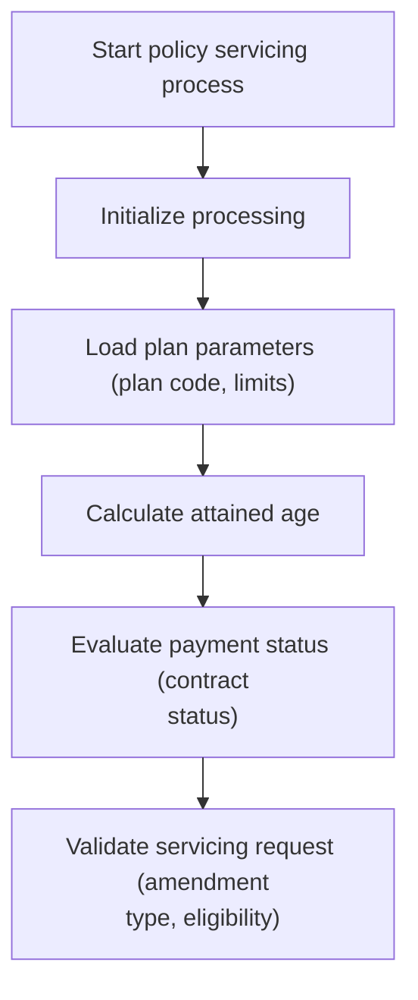

This section ensures that servicing requests for insurance policies are validated against business eligibility criteria before processing amendments.

| Rule ID | Category        | Rule Name                       | Description                                                                                                                        | Implementation Details                                                                                                                       |
| ------- | --------------- | ------------------------------- | ---------------------------------------------------------------------------------------------------------------------------------- | -------------------------------------------------------------------------------------------------------------------------------------------- |
| BR-001  | Decision Making | Add Rider Eligibility           | A servicing request to add a rider is only eligible if the contract status is 'active' or 'reinstated'.                            | Amendment type codes: AR. Contract status codes: AC, RS. If not eligible, an error code and message are set.                                 |
| BR-002  | Decision Making | Change Plan Age Eligibility     | A servicing request to change the plan is only eligible if the attained age is less than the plan's maturity age.                  | Amendment type code: PL. Maturity age is defined in plan parameters. If not eligible, an error code and message are set.                     |
| BR-003  | Decision Making | Reinstate Eligibility           | A servicing request to reinstate a policy is only eligible if the contract status is 'lapsed' or 'grace'.                          | Amendment type code: RI. Contract status codes: LA, GR. If not eligible, an error code and message are set.                                  |
| BR-004  | Decision Making | Sum Assured Change Eligibility  | A servicing request to change sum assured is only eligible if the new sum assured is within the plan's minimum and maximum limits. | Amendment type code: SA. Minimum and maximum sum assured are defined in plan parameters. If not eligible, an error code and message are set. |
| BR-005  | Decision Making | Billing Mode Change Eligibility | A servicing request to change billing mode is only eligible if the contract status is 'active'.                                    | Amendment type code: BM. Contract status code: AC. If not eligible, an error code and message are set.                                       |

<SwmSnippet path="/SVC-BILL-001.cob" line="36">

---

<SwmToken path="SVC-BILL-001.cob" pos="36:1:3" line-data="       MAIN-PROCESS.">`MAIN-PROCESS`</SwmToken> calls <SwmToken path="SVC-BILL-001.cob" pos="41:3:9" line-data="           PERFORM 1400-VALIDATE-SERVICING-REQUEST">`1400-VALIDATE-SERVICING-REQUEST`</SwmToken> right after payment status to make sure the servicing request is allowed and properly specified.

```cobol
       MAIN-PROCESS.
           PERFORM 1000-INITIALIZE
           PERFORM 1100-LOAD-PLAN-PARAMETERS
           PERFORM 1200-CALCULATE-ATTAINED-AGE
           PERFORM 1300-EVALUATE-PAYMENT-STATUS
           PERFORM 1400-VALIDATE-SERVICING-REQUEST
```

---

</SwmSnippet>

## Enforcing servicing rules

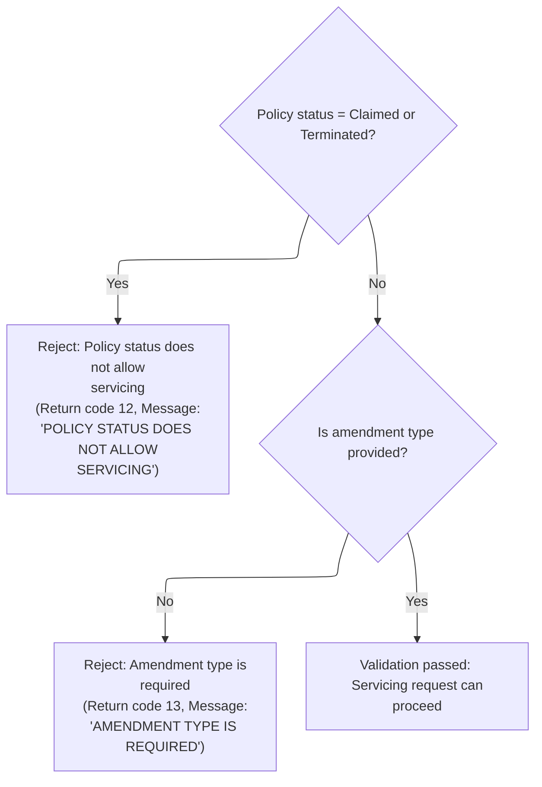

This section validates whether a servicing request for a policy can proceed based on policy status and amendment type.

| Rule ID | Category        | Rule Name                 | Description                                                                                                                                                    | Implementation Details                                                                                                                                                                     |
| ------- | --------------- | ------------------------- | -------------------------------------------------------------------------------------------------------------------------------------------------------------- | ------------------------------------------------------------------------------------------------------------------------------------------------------------------------------------------ |
| BR-001  | Data validation | Policy status restriction | If the policy status is 'Claimed' or 'Terminated', the servicing request is rejected with return code 12 and message 'POLICY STATUS DOES NOT ALLOW SERVICING'. | Return code is 12. Return message is 'POLICY STATUS DOES NOT ALLOW SERVICING'. Output format: return code is a number (up to 4 digits), return message is a string (up to 100 characters). |
| BR-002  | Data validation | Amendment type required   | If the amendment type is not provided, the servicing request is rejected with return code 13 and message 'AMENDMENT TYPE IS REQUIRED'.                         | Return code is 13. Return message is 'AMENDMENT TYPE IS REQUIRED'. Output format: return code is a number (up to 4 digits), return message is a string (up to 100 characters).             |
| BR-003  | Decision Making | Servicing eligibility     | If the policy status is not 'Claimed' or 'Terminated' and the amendment type is provided, the servicing request passes validation and can proceed.             | No error code or message is set. The servicing request proceeds to the next step. Output format: no rejection, request continues.                                                          |

<SwmSnippet path="/SVC-BILL-001.cob" line="165">

---

In <SwmToken path="SVC-BILL-001.cob" pos="165:1:7" line-data="       1400-VALIDATE-SERVICING-REQUEST.">`1400-VALIDATE-SERVICING-REQUEST`</SwmToken>, we check if the policy is claimed or terminated. If so, we set an error code and message and exit. If the amendment type is missing, we set a different error code and message and exit. This prevents invalid servicing requests.

```cobol
       1400-VALIDATE-SERVICING-REQUEST.
      * SV-301: Claimed or terminated policies cannot be amended.
           IF PM-STAT-CLAIMED OR PM-STAT-TERMINATED
              MOVE 12 TO PM-RETURN-CODE
              MOVE "POLICY STATUS DOES NOT ALLOW SERVICING"
                TO PM-RETURN-MESSAGE
              EXIT PARAGRAPH
           END-IF
```

---

</SwmSnippet>

<SwmSnippet path="/SVC-BILL-001.cob" line="175">

---

This part returns error codes and messages if the policy can't be serviced or if the amendment type is missing.

```cobol
           IF PM-AMENDMENT-TYPE = SPACES
              MOVE 13 TO PM-RETURN-CODE
              MOVE "AMENDMENT TYPE IS REQUIRED" TO PM-RETURN-MESSAGE
              EXIT PARAGRAPH
           END-IF.
```

---

</SwmSnippet>

## Handling validation outcome

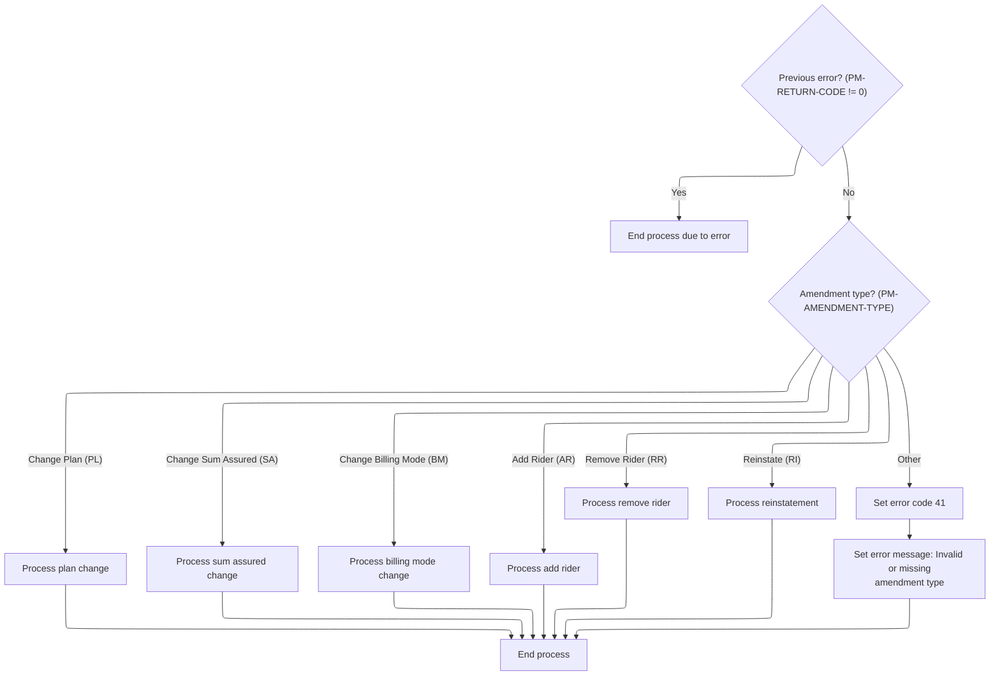

This section determines whether to proceed with policy amendment processing based on prior validation and routes the request to the correct amendment handler or sets an error if the amendment type is invalid.

| Rule ID | Category        | Rule Name                    | Description                                                                                                                                                                                       | Implementation Details                                                                                                                                                                                      |
| ------- | --------------- | ---------------------------- | ------------------------------------------------------------------------------------------------------------------------------------------------------------------------------------------------- | ----------------------------------------------------------------------------------------------------------------------------------------------------------------------------------------------------------- |
| BR-001  | Data validation | Invalid amendment type error | If the amendment type is invalid or missing, an error code of 41 is set and the error message 'INVALID OR MISSING AMENDMENT TYPE' is returned.                                                    | Error code set to 41. Error message set to 'INVALID OR MISSING AMENDMENT TYPE' (string, up to 100 characters).                                                                                              |
| BR-002  | Decision Making | Halt on prior error          | If a prior error is detected in the validation outcome, the amendment process is halted and no further processing occurs for the request.                                                         | No amendment processing is performed if an error is present. No output is generated except for halting the process.                                                                                         |
| BR-003  | Decision Making | Route by amendment type      | The amendment request is routed to the appropriate processing logic based on the amendment type: plan change, sum assured change, billing mode change, add rider, remove rider, or reinstatement. | Supported amendment types are: PL (plan change), SA (sum assured change), BM (billing mode change), AR (add rider), RR (remove rider), RI (reinstate). Each type triggers its respective amendment process. |

<SwmSnippet path="/SVC-BILL-001.cob" line="42">

---

<SwmToken path="SVC-BILL-001.cob" pos="36:1:3" line-data="       MAIN-PROCESS.">`MAIN-PROCESS`</SwmToken> exits if validation failed, so nothing else runs if the request isn't valid.

```cobol
           IF PM-RETURN-CODE NOT = 0
              GOBACK
           END-IF
```

---

</SwmSnippet>

<SwmSnippet path="/SVC-BILL-001.cob" line="46">

---

This part routes to the right amendment handler, calling <SwmToken path="SVC-BILL-001.cob" pos="48:3:7" line-data="                 PERFORM 2100-CHANGE-PLAN">`2100-CHANGE-PLAN`</SwmToken> if the request is for a plan change.

```cobol
           EVALUATE TRUE
              WHEN PM-AMEND-CHANGE-PLAN
                 PERFORM 2100-CHANGE-PLAN
              WHEN PM-AMEND-CHANGE-SA
                 PERFORM 2200-CHANGE-SUM-ASSURED
              WHEN PM-AMEND-BILLING-MODE
                 PERFORM 2300-CHANGE-BILLING-MODE
              WHEN PM-AMEND-ADD-RIDER
                 PERFORM 2400-ADD-RIDER
              WHEN PM-AMEND-REMOVE-RIDER
                 PERFORM 2500-REMOVE-RIDER
              WHEN PM-AMEND-REINSTATE
                 PERFORM 2600-PROCESS-REINSTATEMENT
              WHEN OTHER
                 MOVE 41 TO PM-RETURN-CODE
                 MOVE "INVALID OR MISSING AMENDMENT TYPE"
                   TO PM-RETURN-MESSAGE
           END-EVALUATE
```

---

</SwmSnippet>

## Applying plan changes

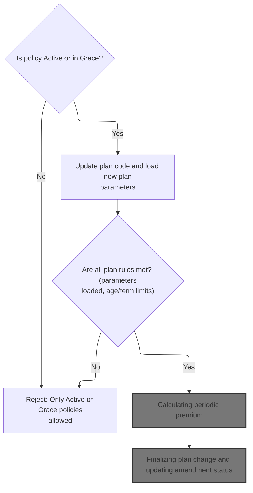

This section determines if a plan change request is eligible, applies the change if allowed, and enforces all business rules related to age and term limits. It ensures only valid plan changes proceed to repricing, and provides clear error handling for ineligible requests.

| Rule ID | Category        | Rule Name                        | Description                                                                                                                                                                                                          | Implementation Details                                                                                                                                                                                                                                                                                     |
| ------- | --------------- | -------------------------------- | -------------------------------------------------------------------------------------------------------------------------------------------------------------------------------------------------------------------- | ---------------------------------------------------------------------------------------------------------------------------------------------------------------------------------------------------------------------------------------------------------------------------------------------------------- |
| BR-001  | Data validation | Active or Grace status required  | A plan change is allowed to proceed only if the policy status is either Active or in Grace. If not, the change is rejected with a specific error code and message.                                                   | Error code set to 21. Error message: 'PLAN CHANGE ALLOWED ONLY ON ACTIVE OR GRACE'. Output format: error code is a 4-digit number, error message is a 100-character string.                                                                                                                                |
| BR-002  | Data validation | Plan parameter load required     | If loading the new plan parameters fails, the plan code is reverted to its previous value and the plan change process is stopped.                                                                                    | If the plan parameter load fails, the plan code is reverted to its previous value. No specific error code or message is set here; the error code/message from the parameter load is preserved.                                                                                                             |
| BR-003  | Data validation | Maximum issue age limit          | If the policyholder's attained age exceeds the new plan's maximum issue age (unless the plan is a 'to 65' plan), the plan change is rejected with a specific error code and message, and the plan code is reverted.  | Error code set to 22. Error message: 'CURRENT ATTAINED AGE EXCEEDS NEW PLAN LIMIT'. Output format: error code is a 4-digit number, error message is a 100-character string.                                                                                                                                |
| BR-004  | Data validation | Term remaining for 'to 65' plans | For 'to 65' plans, if there is no term remaining (i.e., the maturity age minus attained age is zero or negative), the plan change is rejected with a specific error code and message, and the plan code is reverted. | Error code set to 23. Error message: 'NO TERM REMAINS UNDER <SwmToken path="SVC-BILL-001.cob" pos="210:12:12" line-data="                 MOVE &quot;NO TERM REMAINS UNDER T65 PLAN&quot;">`T65`</SwmToken> PLAN'. Output format: error code is a 4-digit number, error message is a 100-character string. |

<SwmSnippet path="/SVC-BILL-001.cob" line="181">

---

In <SwmToken path="SVC-BILL-001.cob" pos="181:1:5" line-data="       2100-CHANGE-PLAN.">`2100-CHANGE-PLAN`</SwmToken>, we only allow plan changes if the policy is active or in grace. If not, we set an error code and message and exit. This keeps amendments from happening on ineligible policies.

```cobol
       2100-CHANGE-PLAN.
      * SV-401: Change plan only on active or grace policies.
           IF NOT PM-STAT-ACTIVE AND NOT PM-STAT-GRACE
              MOVE 21 TO PM-RETURN-CODE
              MOVE "PLAN CHANGE ALLOWED ONLY ON ACTIVE OR GRACE"
                TO PM-RETURN-MESSAGE
              EXIT PARAGRAPH
           END-IF
```

---

</SwmSnippet>

<SwmSnippet path="/SVC-BILL-001.cob" line="190">

---

This part updates the plan code and loads new plan parameters so everything is consistent for the new plan.

```cobol
           MOVE PM-PLAN-CODE TO PM-OLD-PLAN-CODE
           MOVE PM-NEW-PLAN-CODE TO PM-PLAN-CODE
           PERFORM 1100-LOAD-PLAN-PARAMETERS
```

---

</SwmSnippet>

<SwmSnippet path="/SVC-BILL-001.cob" line="193">

---

Back in <SwmToken path="SVC-BILL-001.cob" pos="48:3:7" line-data="                 PERFORM 2100-CHANGE-PLAN">`2100-CHANGE-PLAN`</SwmToken>, if loading the new plan parameters fails, we revert to the old plan code and exit. This prevents invalid plan changes from going any further.

```cobol
           IF PM-RETURN-CODE NOT = 0
              MOVE PM-OLD-PLAN-CODE TO PM-PLAN-CODE
              EXIT PARAGRAPH
           END-IF
```

---

</SwmSnippet>

<SwmSnippet path="/SVC-BILL-001.cob" line="199">

---

This section checks if the attained age exceeds the new plan's max issue age. If it does, we revert to the old plan and exit, right before checking for 'to 65' plan eligibility.

```cobol
           IF PM-ATTAINED-AGE > PM-MAX-ISSUE-AGE AND NOT PM-PLAN-TO-65
              MOVE 22 TO PM-RETURN-CODE
              MOVE "CURRENT ATTAINED AGE EXCEEDS NEW PLAN LIMIT"
                TO PM-RETURN-MESSAGE
              MOVE PM-OLD-PLAN-CODE TO PM-PLAN-CODE
              EXIT PARAGRAPH
           END-IF
```

---

</SwmSnippet>

<SwmSnippet path="/SVC-BILL-001.cob" line="206">

---

This block checks if there's any term left for 'to 65' plans. If not, we revert to the old plan and exit, using a specific error code. This comes right after the age check and before repricing.

```cobol
           IF PM-PLAN-TO-65
              COMPUTE PM-TERM-YEARS = PM-MATURITY-AGE - PM-ATTAINED-AGE
              IF PM-TERM-YEARS <= 0
                 MOVE 23 TO PM-RETURN-CODE
                 MOVE "NO TERM REMAINS UNDER T65 PLAN"
                   TO PM-RETURN-MESSAGE
                 MOVE PM-OLD-PLAN-CODE TO PM-PLAN-CODE
                 EXIT PARAGRAPH
              END-IF
           END-IF
```

---

</SwmSnippet>

<SwmSnippet path="/SVC-BILL-001.cob" line="217">

---

This part triggers repricing after a plan change so the premium matches the new plan.

```cobol
           PERFORM 3100-REPRICE-POLICY
```

---

</SwmSnippet>

### Calculating new premium

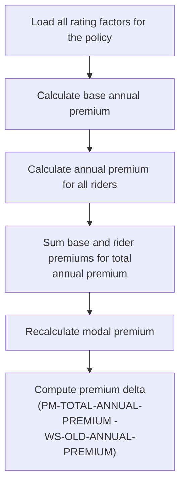

This section recalculates the premium for a policy during servicing by applying the current rating approach, summing base and rider premiums, and updating the premium delta.

| Rule ID | Category      | Rule Name                       | Description                                                                                                                                                                                            | Implementation Details                                                                                                                                |
| ------- | ------------- | ------------------------------- | ------------------------------------------------------------------------------------------------------------------------------------------------------------------------------------------------------ | ----------------------------------------------------------------------------------------------------------------------------------------------------- |
| BR-001  | Reading Input | Load rating factors             | All rating factors relevant to the policy are loaded before any premium calculation is performed. This ensures that the most up-to-date factors are used in subsequent calculations.                   | No constants or output formats are specified for this rule. The operation is a prerequisite for all subsequent calculations.                          |
| BR-002  | Calculation   | Calculate base annual premium   | The base annual premium for the policy is calculated using the loaded rating factors. This forms the foundation for the total premium calculation.                                                     | No constants or output formats are specified for this rule. The base annual premium is an intermediate calculation.                                   |
| BR-003  | Calculation   | Calculate rider annual premiums | The annual premiums for all riders attached to the policy are calculated and accumulated. This ensures that the total premium reflects all additional coverages.                                       | No constants or output formats are specified for this rule. Each rider's premium is included in the total annual premium.                             |
| BR-004  | Calculation   | Calculate total annual premium  | The total annual premium is calculated by summing the base annual premium and all rider premiums. This value represents the total cost of the policy for one year.                                     | No constants or output formats are specified for this rule. The total annual premium is a sum of previously calculated values.                        |
| BR-005  | Calculation   | Recalculate modal premium       | The modal premium is recalculated based on the new total annual premium. This ensures that the payment schedule (e.g., monthly, quarterly) is updated to reflect the new premium amount.               | No constants or output formats are specified for this rule. The modal premium is derived from the total annual premium and the payment frequency.     |
| BR-006  | Calculation   | Compute premium delta           | The premium delta is computed as the difference between the new total annual premium and the previous annual premium. This value indicates the change in premium resulting from the repricing process. | The premium delta is calculated as: new total annual premium minus old annual premium. The result is rounded. No specific output format is specified. |

<SwmSnippet path="/SVC-BILL-001.cob" line="369">

---

<SwmToken path="SVC-BILL-001.cob" pos="369:1:5" line-data="       3100-REPRICE-POLICY.">`3100-REPRICE-POLICY`</SwmToken> recalculates the premium by loading rating factors, calculating base and rider premiums, and then calls <SwmToken path="SVC-BILL-001.cob" pos="373:3:9" line-data="           PERFORM 3130-CALCULATE-RIDER-ANNUAL">`3130-CALCULATE-RIDER-ANNUAL`</SwmToken> to add up all rider premiums. This step is needed to get the total annual premium.

```cobol
       3100-REPRICE-POLICY.
      * SV-1001: Servicing repricing reuses the issue rating approach.
           PERFORM 3110-LOAD-RATING-FACTORS
           PERFORM 3120-CALCULATE-BASE-ANNUAL
           PERFORM 3130-CALCULATE-RIDER-ANNUAL
           PERFORM 3140-CALCULATE-TOTAL-ANNUAL
           PERFORM 3200-RECALCULATE-MODAL-PREMIUM
           COMPUTE PM-PREMIUM-DELTA ROUNDED =
                   PM-TOTAL-ANNUAL-PREMIUM - WS-OLD-ANNUAL-PREMIUM.
```

---

</SwmSnippet>

### Summing rider premiums

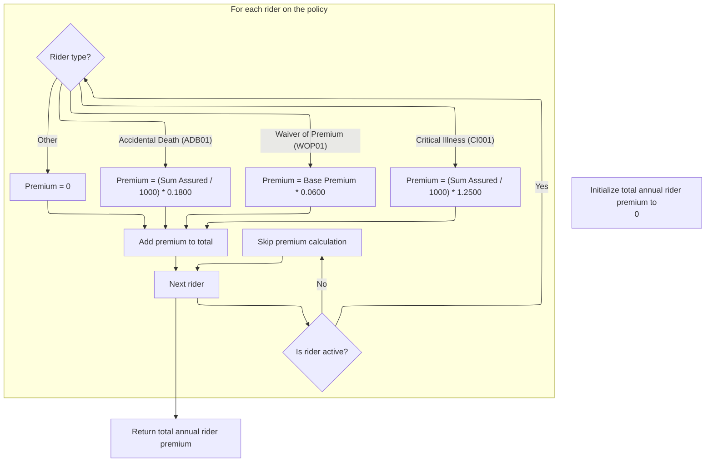

This section calculates the total annual premium for all riders on a policy, applying specific rates based on rider type and summing the results for active riders.

| Rule ID | Category        | Rule Name                     | Description                                                                                                                                                                                                                                                                                                                                                                                   | Implementation Details                                                                                                                                                                                                                                                                                                                                                                                      |
| ------- | --------------- | ----------------------------- | --------------------------------------------------------------------------------------------------------------------------------------------------------------------------------------------------------------------------------------------------------------------------------------------------------------------------------------------------------------------------------------------- | ----------------------------------------------------------------------------------------------------------------------------------------------------------------------------------------------------------------------------------------------------------------------------------------------------------------------------------------------------------------------------------------------------------- |
| BR-001  | Calculation     | Accidental Death premium rate | For riders with type <SwmToken path="SVC-BILL-001.cob" pos="297:4:4" line-data="           MOVE &quot;ADB01&quot; TO PM-RIDER-CODE(PM-RIDER-COUNT)">`ADB01`</SwmToken> (Accidental Death), the annual premium is calculated as (Sum Assured / 1000) multiplied by 0.1800.                                                                                                                     | The rate for <SwmToken path="SVC-BILL-001.cob" pos="297:4:4" line-data="           MOVE &quot;ADB01&quot; TO PM-RIDER-CODE(PM-RIDER-COUNT)">`ADB01`</SwmToken> is 0.1800. The sum assured is divided by 1000 before applying the rate. The result is rounded as per the code's calculation.                                                                                                                 |
| BR-002  | Calculation     | Waiver of Premium rate        | For riders with type <SwmToken path="SVC-BILL-001.cob" pos="443:4:4" line-data="                    WHEN &quot;WOP01&quot;">`WOP01`</SwmToken> (Waiver of Premium), the annual premium is calculated as the base annual premium multiplied by <SwmToken path="SVC-BILL-001.cob" pos="447:11:13" line-data="                             PM-BASE-ANNUAL-PREMIUM * 0.0600">`0.0600`</SwmToken>. | The rate for <SwmToken path="SVC-BILL-001.cob" pos="443:4:4" line-data="                    WHEN &quot;WOP01&quot;">`WOP01`</SwmToken> is <SwmToken path="SVC-BILL-001.cob" pos="447:11:13" line-data="                             PM-BASE-ANNUAL-PREMIUM * 0.0600">`0.0600`</SwmToken>. The base annual premium is used as the calculation base. The result is rounded as per the code's calculation.     |
| BR-003  | Calculation     | Critical Illness premium rate | For riders with type <SwmToken path="SVC-BILL-001.cob" pos="448:4:4" line-data="                    WHEN &quot;CI001&quot;">`CI001`</SwmToken> (Critical Illness), the annual premium is calculated as (Sum Assured / 1000) multiplied by <SwmToken path="SVC-BILL-001.cob" pos="414:9:11" line-data="              WHEN &quot;TB&quot; MOVE 1.2500 TO PM-UW-FACTOR">`1.2500`</SwmToken>.     | The rate for <SwmToken path="SVC-BILL-001.cob" pos="448:4:4" line-data="                    WHEN &quot;CI001&quot;">`CI001`</SwmToken> is <SwmToken path="SVC-BILL-001.cob" pos="414:9:11" line-data="              WHEN &quot;TB&quot; MOVE 1.2500 TO PM-UW-FACTOR">`1.2500`</SwmToken>. The sum assured is divided by 1000 before applying the rate. The result is rounded as per the code's calculation. |
| BR-004  | Calculation     | Total rider premium summation | The total annual rider premium is the sum of all individual rider premiums calculated for active riders.                                                                                                                                                                                                                                                                                      | The total is a numeric value representing the sum of all calculated rider premiums for the policy.                                                                                                                                                                                                                                                                                                          |
| BR-005  | Decision Making | Active rider inclusion        | Only riders with status 'A' (active) are included in the annual premium calculation. Inactive riders are skipped and do not contribute to the total.                                                                                                                                                                                                                                          | Status 'A' indicates an active rider. No other statuses are considered for premium calculation in this section.                                                                                                                                                                                                                                                                                             |
| BR-006  | Decision Making | Unknown rider type premium    | For any rider type not explicitly recognized, the annual premium is set to zero.                                                                                                                                                                                                                                                                                                              | Unknown or unsupported rider types receive a premium of zero. This ensures only defined rider types contribute to the total premium.                                                                                                                                                                                                                                                                        |

<SwmSnippet path="/SVC-BILL-001.cob" line="431">

---

In <SwmToken path="SVC-BILL-001.cob" pos="431:1:7" line-data="       3130-CALCULATE-RIDER-ANNUAL.">`3130-CALCULATE-RIDER-ANNUAL`</SwmToken>, we loop through all riders, check if they're active, and use an EVALUATE statement to apply hardcoded rates based on the rider code. If the code isn't recognized, the premium is set to zero.

```cobol
       3130-CALCULATE-RIDER-ANNUAL.
           MOVE ZERO TO PM-RIDER-ANNUAL-TOTAL
           PERFORM VARYING WS-RIDER-IDX FROM 1 BY 1
                   UNTIL WS-RIDER-IDX > PM-RIDER-COUNT
              IF PM-RIDER-STATUS(WS-RIDER-IDX) = "A"
                 EVALUATE PM-RIDER-CODE(WS-RIDER-IDX)
                    WHEN "ADB01"
                       MOVE 00000.1800 TO PM-RIDER-RATE(WS-RIDER-IDX)
                       COMPUTE PM-RIDER-ANNUAL-PREM(WS-RIDER-IDX)
                               ROUNDED =
                             (PM-RIDER-SUM-ASSURED(WS-RIDER-IDX) / 1000)
                           * PM-RIDER-RATE(WS-RIDER-IDX)
```

---

</SwmSnippet>

<SwmSnippet path="/SVC-BILL-001.cob" line="443">

---

This section handles the <SwmToken path="SVC-BILL-001.cob" pos="443:4:4" line-data="                    WHEN &quot;WOP01&quot;">`WOP01`</SwmToken> rider, applying its specific rate to the base annual premium. It follows the <SwmToken path="SVC-BILL-001.cob" pos="297:4:4" line-data="           MOVE &quot;ADB01&quot; TO PM-RIDER-CODE(PM-RIDER-COUNT)">`ADB01`</SwmToken> branch and sets up for <SwmToken path="SVC-BILL-001.cob" pos="448:4:4" line-data="                    WHEN &quot;CI001&quot;">`CI001`</SwmToken>.

```cobol
                    WHEN "WOP01"
                       MOVE 00000.0600 TO PM-RIDER-RATE(WS-RIDER-IDX)
                       COMPUTE PM-RIDER-ANNUAL-PREM(WS-RIDER-IDX)
                               ROUNDED =
                             PM-BASE-ANNUAL-PREMIUM * 0.0600
```

---

</SwmSnippet>

<SwmSnippet path="/SVC-BILL-001.cob" line="448">

---

This block handles <SwmToken path="SVC-BILL-001.cob" pos="448:4:4" line-data="                    WHEN &quot;CI001&quot;">`CI001`</SwmToken>, applying its hardcoded rate to the sum assured. These constants are business rules and follow the <SwmToken path="SVC-BILL-001.cob" pos="443:4:4" line-data="                    WHEN &quot;WOP01&quot;">`WOP01`</SwmToken> branch, before handling unknown codes.

```cobol
                    WHEN "CI001"
                       MOVE 00001.2500 TO PM-RIDER-RATE(WS-RIDER-IDX)
                       COMPUTE PM-RIDER-ANNUAL-PREM(WS-RIDER-IDX)
                               ROUNDED =
                             (PM-RIDER-SUM-ASSURED(WS-RIDER-IDX) / 1000)
                           * PM-RIDER-RATE(WS-RIDER-IDX)
```

---

</SwmSnippet>

<SwmSnippet path="/SVC-BILL-001.cob" line="454">

---

This part ignores unknown rider codes by setting their premium to zero, after handling all known types.

```cobol
                    WHEN OTHER
                       MOVE ZERO TO PM-RIDER-ANNUAL-PREM(WS-RIDER-IDX)
                 END-EVALUATE
```

---

</SwmSnippet>

<SwmSnippet path="/SVC-BILL-001.cob" line="457">

---

This section adds up all the individual rider premiums into <SwmToken path="SVC-BILL-001.cob" pos="458:3:9" line-data="                   TO PM-RIDER-ANNUAL-TOTAL">`PM-RIDER-ANNUAL-TOTAL`</SwmToken>, so the total rider premium is ready for the next calculation.

```cobol
                 ADD PM-RIDER-ANNUAL-PREM(WS-RIDER-IDX)
                   TO PM-RIDER-ANNUAL-TOTAL
              END-IF
           END-PERFORM.
```

---

</SwmSnippet>

### Calculating periodic premium

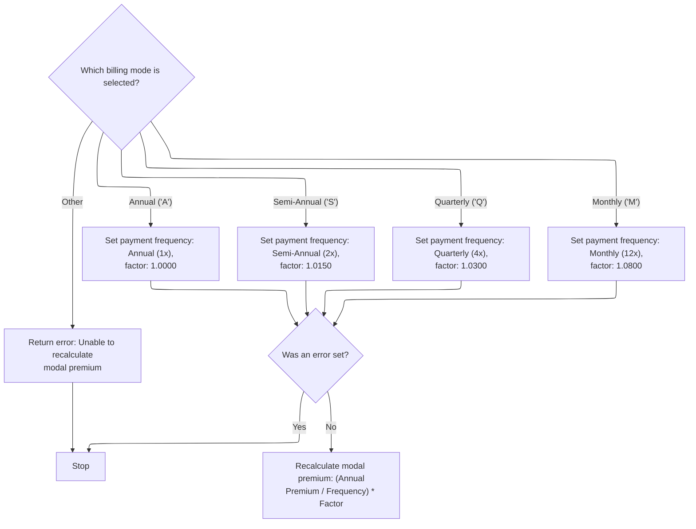

This section determines the periodic premium amount for a term life insurance policy based on the selected billing mode. It ensures that only valid billing modes are accepted and calculates the modal premium accordingly.

| Rule ID | Category        | Rule Name                  | Description                                                                                                                                                                                                                                       | Implementation Details                                                                                                                                                                                                              |
| ------- | --------------- | -------------------------- | ------------------------------------------------------------------------------------------------------------------------------------------------------------------------------------------------------------------------------------------------- | ----------------------------------------------------------------------------------------------------------------------------------------------------------------------------------------------------------------------------------- |
| BR-001  | Data validation | Invalid billing mode error | If the billing mode is not 'A', 'S', 'Q', or 'M', return an error code (33) and message ('UNABLE TO RECALCULATE MODAL PREMIUM').                                                                                                                  | Error code is 33. Error message is 'UNABLE TO RECALCULATE MODAL PREMIUM'.                                                                                                                                                           |
| BR-002  | Calculation     | Modal premium calculation  | If no error is set, calculate the modal premium as (annual premium / payment frequency) multiplied by the factor, rounding the result.                                                                                                            | Formula: (annual premium / payment frequency) \* factor. Result is rounded. Output is a number representing the modal premium.                                                                                                      |
| BR-003  | Decision Making | Annual billing mode        | If the billing mode is 'A', set the payment frequency to annual (1 payment per year) and apply a factor of <SwmToken path="SVC-BILL-001.cob" pos="477:3:5" line-data="                 MOVE 1.0000 TO WS-MODAL-FACTOR">`1.0000`</SwmToken>.       | Payment frequency is 1. Factor is <SwmToken path="SVC-BILL-001.cob" pos="477:3:5" line-data="                 MOVE 1.0000 TO WS-MODAL-FACTOR">`1.0000`</SwmToken>. These values are used in the modal premium calculation formula.  |
| BR-004  | Decision Making | Semi-annual billing mode   | If the billing mode is 'S', set the payment frequency to semi-annual (2 payments per year) and apply a factor of <SwmToken path="SVC-BILL-001.cob" pos="480:3:5" line-data="                 MOVE 1.0150 TO WS-MODAL-FACTOR">`1.0150`</SwmToken>. | Payment frequency is 2. Factor is <SwmToken path="SVC-BILL-001.cob" pos="480:3:5" line-data="                 MOVE 1.0150 TO WS-MODAL-FACTOR">`1.0150`</SwmToken>. These values are used in the modal premium calculation formula.  |
| BR-005  | Decision Making | Quarterly billing mode     | If the billing mode is 'Q', set the payment frequency to quarterly (4 payments per year) and apply a factor of <SwmToken path="SVC-BILL-001.cob" pos="483:3:5" line-data="                 MOVE 1.0300 TO WS-MODAL-FACTOR">`1.0300`</SwmToken>.   | Payment frequency is 4. Factor is <SwmToken path="SVC-BILL-001.cob" pos="483:3:5" line-data="                 MOVE 1.0300 TO WS-MODAL-FACTOR">`1.0300`</SwmToken>. These values are used in the modal premium calculation formula.  |
| BR-006  | Decision Making | Monthly billing mode       | If the billing mode is 'M', set the payment frequency to monthly (12 payments per year) and apply a factor of <SwmToken path="SVC-BILL-001.cob" pos="486:3:5" line-data="                 MOVE 1.0800 TO WS-MODAL-FACTOR">`1.0800`</SwmToken>.    | Payment frequency is 12. Factor is <SwmToken path="SVC-BILL-001.cob" pos="486:3:5" line-data="                 MOVE 1.0800 TO WS-MODAL-FACTOR">`1.0800`</SwmToken>. These values are used in the modal premium calculation formula. |

<SwmSnippet path="/SVC-BILL-001.cob" line="473">

---

In <SwmToken path="SVC-BILL-001.cob" pos="473:1:7" line-data="       3200-RECALCULATE-MODAL-PREMIUM.">`3200-RECALCULATE-MODAL-PREMIUM`</SwmToken>, we use an EVALUATE statement to pick the divisor and factor based on billing mode. If the mode isn't valid, we set an error and message. Otherwise, we calculate the modal premium by dividing the annual premium and multiplying by the factor.

```cobol
       3200-RECALCULATE-MODAL-PREMIUM.
           EVALUATE PM-BILLING-MODE
              WHEN "A"
                 MOVE 1 TO WS-MODAL-DIVISOR
                 MOVE 1.0000 TO WS-MODAL-FACTOR
              WHEN "S"
                 MOVE 2 TO WS-MODAL-DIVISOR
                 MOVE 1.0150 TO WS-MODAL-FACTOR
              WHEN "Q"
                 MOVE 4 TO WS-MODAL-DIVISOR
                 MOVE 1.0300 TO WS-MODAL-FACTOR
              WHEN "M"
                 MOVE 12 TO WS-MODAL-DIVISOR
                 MOVE 1.0800 TO WS-MODAL-FACTOR
              WHEN OTHER
                 MOVE 33 TO PM-RETURN-CODE
                 MOVE "UNABLE TO RECALCULATE MODAL PREMIUM"
                   TO PM-RETURN-MESSAGE
           END-EVALUATE
```

---

</SwmSnippet>

<SwmSnippet path="/SVC-BILL-001.cob" line="492">

---

This section returns either the calculated modal premium if the billing mode is valid, or an error code and message if it's not. This determines if the user can proceed with the selected billing mode.

```cobol
           IF PM-RETURN-CODE = 0
              COMPUTE PM-MODAL-PREMIUM ROUNDED =
                      (PM-TOTAL-ANNUAL-PREMIUM / WS-MODAL-DIVISOR)
                    * WS-MODAL-FACTOR
           END-IF.
```

---

</SwmSnippet>

### Finalizing plan change and updating amendment status

This section confirms and finalizes a plan change after repricing, updating key policy fields to reflect the successful application of the change.

| Rule ID | Category        | Rule Name                            | Description                                                                                                          | Implementation Details                                                                                                    |
| ------- | --------------- | ------------------------------------ | -------------------------------------------------------------------------------------------------------------------- | ------------------------------------------------------------------------------------------------------------------------- |
| BR-001  | Calculation     | Update service fee on success        | When repricing completes successfully, the service fee is updated to the standard value calculated during repricing. | The service fee is set to the standard value calculated during repricing. The format is a number with two decimal places. |
| BR-002  | Decision Making | Set amendment status to applied      | When repricing completes successfully, the amendment status is set to 'AP' to indicate the plan change was applied.  | The amendment status is set to 'AP'. The format is a two-character string.                                                |
| BR-003  | Writing Output  | Set plan change confirmation message | When repricing completes successfully, the return message is set to indicate the plan change was applied.            | The return message is set to 'PLAN CHANGE APPLIED'. The format is a string up to 100 characters.                          |

<SwmSnippet path="/SVC-BILL-001.cob" line="218">

---

After calling <SwmToken path="SVC-BILL-001.cob" pos="217:3:7" line-data="           PERFORM 3100-REPRICE-POLICY">`3100-REPRICE-POLICY`</SwmToken> in <SwmToken path="SVC-BILL-001.cob" pos="48:3:7" line-data="                 PERFORM 2100-CHANGE-PLAN">`2100-CHANGE-PLAN`</SwmToken>, we check if <SwmToken path="SVC-BILL-001.cob" pos="218:3:7" line-data="           IF PM-RETURN-CODE = 0">`PM-RETURN-CODE`</SwmToken> is zero. If so, we update the service fee, set the amendment status to 'AP', and set the return message to indicate the plan change was applied. This is the last step in the plan change flow, confirming everything went through after repricing.

```cobol
           IF PM-RETURN-CODE = 0
              MOVE PM-SERVICE-FEE-STD TO PM-SERVICE-FEE
              MOVE "AP" TO PM-AMENDMENT-STATUS
              MOVE "PLAN CHANGE APPLIED" TO PM-RETURN-MESSAGE
           END-IF.
```

---

</SwmSnippet>

## Validating and applying sum assured changes

```mermaid
%%{init: {"flowchart": {"defaultRenderer": "elk"}} }%%
flowchart TD
    node1["Start: Request to change sum assured"]
    click node1 openCode "SVC-BILL-001.cob:224:224"
    node1 --> node2{"Is new sum assured provided?"}
    click node2 openCode "SVC-BILL-001.cob:228:232"
    node2 -->|"No"| node3["Reject: New sum assured is required"]
    click node3 openCode "SVC-BILL-001.cob:229:231"
    node2 -->|"Yes"| node4{"Is new sum assured within plan limits
(min/max depend on plan code)?"}
    click node4 openCode "SVC-BILL-001.cob:233:239"
    node4 -->|"No"| node5["Reject: New sum assured outside plan
limits"]
    click node5 openCode "SVC-BILL-001.cob:235:237"
    node4 -->|"Yes"| node6{"Is new sum assured greater than old sum
assured?"}
    click node6 openCode "SVC-BILL-001.cob:242:242"
    node6 -->|"No"| node8["Apply new sum assured and reprice policy"]
    click node8 openCode "SVC-BILL-001.cob:256:257"
    node6 -->|"Yes"| node7{"Is increase > 25% or new sum assured >
$1,000,000,000.00?"}
    click node7 openCode "SVC-BILL-001.cob:246:247"
    node7 -->|"Yes"| node9["Flag for underwriting approval and set
pending status"]
    click node9 openCode "SVC-BILL-001.cob:248:251"
    node9 --> node8
    node7 -->|"No"| node8
    node8 --> node10{"Was change applied successfully?"}
    click node10 openCode "SVC-BILL-001.cob:258:258"
    node10 -->|"Yes"| node11["Apply service fee and confirm change"]
    click node11 openCode "SVC-BILL-001.cob:259:261"
    node10 -->|"No"| node12["No further action"]
    click node12 openCode "SVC-BILL-001.cob:262:262"

classDef HeadingStyle fill:#777777,stroke:#333,stroke-width:2px;

%% Swimm:
%% %%{init: {"flowchart": {"defaultRenderer": "elk"}} }%%
%% flowchart TD
%%     node1["Start: Request to change sum assured"]
%%     click node1 openCode "<SwmPath>[SVC-BILL-001.cob](SVC-BILL-001.cob)</SwmPath>:224:224"
%%     node1 --> node2{"Is new sum assured provided?"}
%%     click node2 openCode "<SwmPath>[SVC-BILL-001.cob](SVC-BILL-001.cob)</SwmPath>:228:232"
%%     node2 -->|"No"| node3["Reject: New sum assured is required"]
%%     click node3 openCode "<SwmPath>[SVC-BILL-001.cob](SVC-BILL-001.cob)</SwmPath>:229:231"
%%     node2 -->|"Yes"| node4{"Is new sum assured within plan limits
%% (min/max depend on plan code)?"}
%%     click node4 openCode "<SwmPath>[SVC-BILL-001.cob](SVC-BILL-001.cob)</SwmPath>:233:239"
%%     node4 -->|"No"| node5["Reject: New sum assured outside plan
%% limits"]
%%     click node5 openCode "<SwmPath>[SVC-BILL-001.cob](SVC-BILL-001.cob)</SwmPath>:235:237"
%%     node4 -->|"Yes"| node6{"Is new sum assured greater than old sum
%% assured?"}
%%     click node6 openCode "<SwmPath>[SVC-BILL-001.cob](SVC-BILL-001.cob)</SwmPath>:242:242"
%%     node6 -->|"No"| node8["Apply new sum assured and reprice policy"]
%%     click node8 openCode "<SwmPath>[SVC-BILL-001.cob](SVC-BILL-001.cob)</SwmPath>:256:257"
%%     node6 -->|"Yes"| node7{"Is increase > 25% or new sum assured >
%% $1,000,000,000.00?"}
%%     click node7 openCode "<SwmPath>[SVC-BILL-001.cob](SVC-BILL-001.cob)</SwmPath>:246:247"
%%     node7 -->|"Yes"| node9["Flag for underwriting approval and set
%% pending status"]
%%     click node9 openCode "<SwmPath>[SVC-BILL-001.cob](SVC-BILL-001.cob)</SwmPath>:248:251"
%%     node9 --> node8
%%     node7 -->|"No"| node8
%%     node8 --> node10{"Was change applied successfully?"}
%%     click node10 openCode "<SwmPath>[SVC-BILL-001.cob](SVC-BILL-001.cob)</SwmPath>:258:258"
%%     node10 -->|"Yes"| node11["Apply service fee and confirm change"]
%%     click node11 openCode "<SwmPath>[SVC-BILL-001.cob](SVC-BILL-001.cob)</SwmPath>:259:261"
%%     node10 -->|"No"| node12["No further action"]
%%     click node12 openCode "<SwmPath>[SVC-BILL-001.cob](SVC-BILL-001.cob)</SwmPath>:262:262"
%% 
%% classDef HeadingStyle fill:#777777,stroke:#333,stroke-width:2px;
```

This section governs the business logic for validating and applying changes to the sum assured on a term life insurance policy. It ensures that only valid and permitted changes are processed, and that exceptional cases are flagged for further review or rejected with clear feedback.

| Rule ID | Category        | Rule Name                                | Description                                                                                                                                                                                                                                | Implementation Details                                                                                                                                                                                                                                                                                                                                                                                                                                                                                                                                                                                                                     |
| ------- | --------------- | ---------------------------------------- | ------------------------------------------------------------------------------------------------------------------------------------------------------------------------------------------------------------------------------------------ | ------------------------------------------------------------------------------------------------------------------------------------------------------------------------------------------------------------------------------------------------------------------------------------------------------------------------------------------------------------------------------------------------------------------------------------------------------------------------------------------------------------------------------------------------------------------------------------------------------------------------------------------ |
| BR-001  | Data validation | New sum assured required                 | A new sum assured value is required for any change request. If the new sum assured is not provided (i.e., is zero), the request is rejected with an error message.                                                                         | The error message is 'NEW SUM ASSURED IS REQUIRED'. The return code is 24. The output includes a string message and a numeric code.                                                                                                                                                                                                                                                                                                                                                                                                                                                                                                        |
| BR-002  | Data validation | Sum assured within plan limits           | The new sum assured must be within the minimum and maximum limits defined by the plan. If the value is outside these limits, the request is rejected with an error message.                                                                | The error message is 'NEW SUM ASSURED OUTSIDE PLAN LIMITS'. The return code is 25. The minimum and maximum values depend on the plan code: for <SwmToken path="SVC-BILL-001.cob" pos="88:4:4" line-data="              WHEN &quot;T1001&quot;">`T1001`</SwmToken> min is 10,000,000,000.00 and max is 1,000,000,000,000.00; for <SwmToken path="SVC-BILL-001.cob" pos="100:4:4" line-data="              WHEN &quot;T2001&quot;">`T2001`</SwmToken> min is 10,000,000,000.00 and max is 2,000,000,000,000.00; otherwise min is 10,000,000,000.00 and max is 1,500,000,000,000.00. The output includes a string message and a numeric code. |
| BR-003  | Decision Making | Underwriting required for large increase | If the new sum assured is greater than the old sum assured and the increase is more than 25% or the new sum assured exceeds $1,000,000,000.00, the change is flagged for underwriting approval and the amendment status is set to pending. | The return message is 'SUM ASSURED INCREASE REQUIRES UW APPROVAL'. The amendment status is set to 'PE' (pending). The underwriting required indicator is set to 'Y'. The percentage increase is calculated as ((new - old) / old) \* 100. The $1,000,000,000.00 threshold is a fixed business constant.                                                                                                                                                                                                                                                                                                                                    |
| BR-004  | Writing Output  | Service fee and confirmation on success  | If the sum assured change is applied successfully (i.e., no errors after repricing), a service fee of $15.00 is charged, the amendment status is set to applied, and a confirmation message is returned.                                   | The service fee is 15.00. The amendment status is set to 'AP' (applied). The confirmation message is 'SUM ASSURED CHANGE APPLIED'. The output includes a numeric fee, a status code, and a string message.                                                                                                                                                                                                                                                                                                                                                                                                                                 |

<SwmSnippet path="/SVC-BILL-001.cob" line="224">

---

In <SwmToken path="SVC-BILL-001.cob" pos="224:1:7" line-data="       2200-CHANGE-SUM-ASSURED.">`2200-CHANGE-SUM-ASSURED`</SwmToken>, we start by checking if the new sum assured is zero or outside the plan's allowed limits. If either check fails, we set an error code and message and exit, so no changes are made unless the input is valid.

```cobol
       2200-CHANGE-SUM-ASSURED.
           MOVE PM-SUM-ASSURED TO PM-OLD-SUM-ASSURED

      * SV-501: New sum assured must be present and within plan limits.
           IF PM-NEW-SUM-ASSURED = ZERO
              MOVE 24 TO PM-RETURN-CODE
              MOVE "NEW SUM ASSURED IS REQUIRED" TO PM-RETURN-MESSAGE
              EXIT PARAGRAPH
           END-IF
```

---

</SwmSnippet>

<SwmSnippet path="/SVC-BILL-001.cob" line="233">

---

After checking for zero, we immediately check if the new sum assured is outside the plan's min or max limits. If so, we set an error code and message and exit, so only valid values get through.

```cobol
           IF PM-NEW-SUM-ASSURED < PM-MIN-SUM-ASSURED OR
              PM-NEW-SUM-ASSURED > PM-MAX-SUM-ASSURED
              MOVE 25 TO PM-RETURN-CODE
              MOVE "NEW SUM ASSURED OUTSIDE PLAN LIMITS"
                TO PM-RETURN-MESSAGE
              EXIT PARAGRAPH
           END-IF
```

---

</SwmSnippet>

<SwmSnippet path="/SVC-BILL-001.cob" line="242">

---

If the new sum assured is higher than the old, we check the percentage increase and the absolute value. If either is too high, we flag for underwriting, set the amendment status to pending, and tell the user approval is needed.

```cobol
           IF PM-NEW-SUM-ASSURED > PM-OLD-SUM-ASSURED
              COMPUTE WS-SA-INCREASE-PCT ROUNDED =
                      ((PM-NEW-SUM-ASSURED - PM-OLD-SUM-ASSURED)
                       / PM-OLD-SUM-ASSURED) * 100
              IF WS-SA-INCREASE-PCT > 25.00 OR
                 PM-NEW-SUM-ASSURED > 0001000000000.00
                 MOVE "Y" TO PM-UW-REQUIRED-IND
                 MOVE "PE" TO PM-AMENDMENT-STATUS
                 MOVE "SUM ASSURED INCREASE REQUIRES UW APPROVAL"
                   TO PM-RETURN-MESSAGE
                 EXIT PARAGRAPH
              END-IF
```

---

</SwmSnippet>

<SwmSnippet path="/SVC-BILL-001.cob" line="256">

---

Once the new sum assured passes all checks, we update it and call <SwmToken path="SVC-BILL-001.cob" pos="257:3:7" line-data="           PERFORM 3100-REPRICE-POLICY">`3100-REPRICE-POLICY`</SwmToken> to recalculate the premium. This keeps the policy pricing in sync with the new coverage.

```cobol
           MOVE PM-NEW-SUM-ASSURED TO PM-SUM-ASSURED
           PERFORM 3100-REPRICE-POLICY
```

---

</SwmSnippet>

<SwmSnippet path="/SVC-BILL-001.cob" line="258">

---

After calling <SwmToken path="SVC-BILL-001.cob" pos="217:3:7" line-data="           PERFORM 3100-REPRICE-POLICY">`3100-REPRICE-POLICY`</SwmToken> in <SwmToken path="SVC-BILL-001.cob" pos="50:3:9" line-data="                 PERFORM 2200-CHANGE-SUM-ASSURED">`2200-CHANGE-SUM-ASSURED`</SwmToken>, if repricing succeeds, we set the service fee, mark the amendment as applied, and update the return message. This confirms the sum assured change went through.

```cobol
           IF PM-RETURN-CODE = 0
              MOVE 0000015.00 TO PM-SERVICE-FEE
              MOVE "AP" TO PM-AMENDMENT-STATUS
              MOVE "SUM ASSURED CHANGE APPLIED" TO PM-RETURN-MESSAGE
           END-IF.
```

---

</SwmSnippet>

## Validating and applying billing mode changes

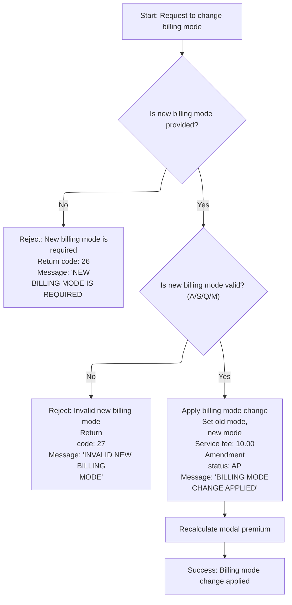

This section validates requests to change the billing mode on a policy. It ensures only valid billing modes are accepted and applies the change, updating related fields and providing clear feedback to the user.

| Rule ID | Category        | Rule Name                 | Description                                                                                                                                                                                  | Implementation Details                                                                                                                                                                                                              |
| ------- | --------------- | ------------------------- | -------------------------------------------------------------------------------------------------------------------------------------------------------------------------------------------- | ----------------------------------------------------------------------------------------------------------------------------------------------------------------------------------------------------------------------------------- |
| BR-001  | Data validation | New billing mode required | A new billing mode is required for a billing mode change request. If the new billing mode is missing, the request is rejected with a specific return code and message.                       | Return code is set to 26. Return message is set to 'NEW BILLING MODE IS REQUIRED'. The message is a string up to 100 characters. No billing mode change is applied if this rule triggers.                                           |
| BR-002  | Data validation | Allowed billing modes     | The new billing mode must be one of the allowed values: 'A', 'S', 'Q', or 'M'. If the new billing mode is not one of these, the request is rejected with a specific return code and message. | Allowed values are 'A', 'S', 'Q', 'M'. Return code is set to 27. Return message is set to 'INVALID NEW BILLING MODE'. The message is a string up to 100 characters. No billing mode change is applied if this rule triggers.        |
| BR-003  | Decision Making | Apply billing mode change | If the new billing mode is valid, the billing mode is updated, a service fee of 10.00 is applied, the amendment status is set to 'AP', and a confirmation message is returned.               | Service fee is set to 10.00. Amendment status is set to 'AP'. Return message is set to 'BILLING MODE CHANGE APPLIED'. The message is a string up to 100 characters. The old billing mode is stored before updating to the new mode. |

<SwmSnippet path="/SVC-BILL-001.cob" line="264">

---

In <SwmToken path="SVC-BILL-001.cob" pos="264:1:7" line-data="       2300-CHANGE-BILLING-MODE.">`2300-CHANGE-BILLING-MODE`</SwmToken>, we start by checking if the new billing mode is missing or invalid. If either check fails, we set an error code and message and exit, so only valid modes get through.

```cobol
       2300-CHANGE-BILLING-MODE.
      * SV-601: Mode changes do not require UW, but must be valid.
           IF PM-NEW-BILLING-MODE = SPACES
              MOVE 26 TO PM-RETURN-CODE
              MOVE "NEW BILLING MODE IS REQUIRED" TO PM-RETURN-MESSAGE
              EXIT PARAGRAPH
           END-IF
```

---

</SwmSnippet>

<SwmSnippet path="/SVC-BILL-001.cob" line="271">

---

After checking for missing mode, we immediately check if the new billing mode is allowed. If not, we set an error code and message and exit, so only valid modes get through.

```cobol
           IF PM-NEW-BILLING-MODE NOT = "A" AND
              PM-NEW-BILLING-MODE NOT = "S" AND
              PM-NEW-BILLING-MODE NOT = "Q" AND
              PM-NEW-BILLING-MODE NOT = "M"
              MOVE 27 TO PM-RETURN-CODE
              MOVE "INVALID NEW BILLING MODE" TO PM-RETURN-MESSAGE
              EXIT PARAGRAPH
           END-IF
```

---

</SwmSnippet>

<SwmSnippet path="/SVC-BILL-001.cob" line="280">

---

After validating the new billing mode, we update the mode and call <SwmToken path="SVC-BILL-001.cob" pos="282:3:9" line-data="           PERFORM 3200-RECALCULATE-MODAL-PREMIUM">`3200-RECALCULATE-MODAL-PREMIUM`</SwmToken> to recalculate the periodic premium. This keeps the premium in sync with the new payment schedule.

```cobol
           MOVE PM-BILLING-MODE TO PM-OLD-BILLING-MODE
           MOVE PM-NEW-BILLING-MODE TO PM-BILLING-MODE
           PERFORM 3200-RECALCULATE-MODAL-PREMIUM
```

---

</SwmSnippet>

<SwmSnippet path="/SVC-BILL-001.cob" line="283">

---

After calling <SwmToken path="SVC-BILL-001.cob" pos="282:3:9" line-data="           PERFORM 3200-RECALCULATE-MODAL-PREMIUM">`3200-RECALCULATE-MODAL-PREMIUM`</SwmToken> in <SwmToken path="SVC-BILL-001.cob" pos="52:3:9" line-data="                 PERFORM 2300-CHANGE-BILLING-MODE">`2300-CHANGE-BILLING-MODE`</SwmToken>, we set the service fee, mark the amendment as applied, and update the return message. This confirms the billing mode change went through.

```cobol
           MOVE 0000010.00 TO PM-SERVICE-FEE
           MOVE "AP" TO PM-AMENDMENT-STATUS
           MOVE "BILLING MODE CHANGE APPLIED" TO PM-RETURN-MESSAGE.
```

---

</SwmSnippet>

## Validating and adding a new rider

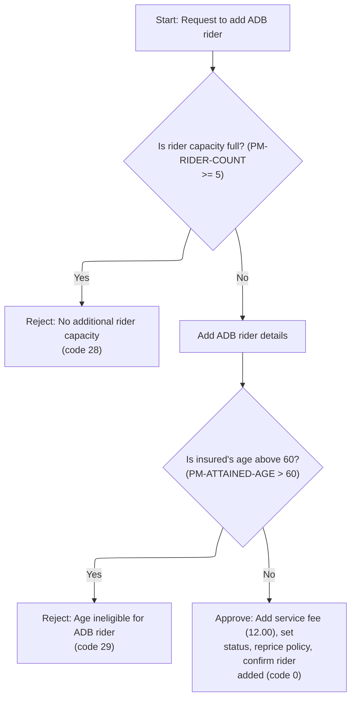

This section governs the process of validating and adding an ADB rider to a term life insurance policy, ensuring eligibility and capacity rules are enforced, and confirming successful additions with appropriate messaging and fee application.

| Rule ID | Category        | Rule Name                                       | Description                                                                                                                                                                           | Implementation Details                                                                                                                                                                                                                                                                                                                        |
| ------- | --------------- | ----------------------------------------------- | ------------------------------------------------------------------------------------------------------------------------------------------------------------------------------------- | --------------------------------------------------------------------------------------------------------------------------------------------------------------------------------------------------------------------------------------------------------------------------------------------------------------------------------------------- |
| BR-001  | Data validation | Rider capacity limit                            | Reject the addition of a new ADB rider if the current rider count is 5 or more.                                                                                                       | The maximum allowed rider count is 5. If this rule triggers, the return code is set to 28 and the return message is set to 'NO ADDITIONAL RIDER CAPACITY REMAINS'. The return code is a number (4 digits), the message is a string (up to 100 characters).                                                                                    |
| BR-002  | Data validation | Age eligibility for ADB rider                   | Reject the addition of an ADB rider if the insured's attained age is above 60.                                                                                                        | The maximum eligible attained age for adding an ADB rider is 60. If this rule triggers, the return code is set to 29 and the return message is set to 'ADB RIDER CANNOT BE ADDED ABOVE AGE 60'. The return code is a number (4 digits), the message is a string (up to 100 characters). Rider count is decremented by 1 to undo the addition. |
| BR-003  | Decision Making | Rider addition confirmation and fee application | Approve the addition of an ADB rider, apply a service fee of 12.00, mark the amendment as applied, and confirm with a success message if all validations pass and repricing succeeds. | The service fee applied is 12.00. Amendment status is set to 'AP'. The return message is set to 'RIDER ADDED AND POLICY REPRICED'. The return code is 0. The service fee is a number (8 digits, 2 decimals), amendment status is a string (2 characters), and the message is a string (up to 100 characters).                                 |

<SwmSnippet path="/SVC-BILL-001.cob" line="287">

---

In <SwmToken path="SVC-BILL-001.cob" pos="287:1:5" line-data="       2400-ADD-RIDER.">`2400-ADD-RIDER`</SwmToken>, we start by checking if the rider count is already at 5. If so, we set an error code and message and exit, so no more riders can be added.

```cobol
       2400-ADD-RIDER.
      * SV-701: Add rider only if capacity remains and rider is eligible.
           IF PM-RIDER-COUNT >= 5
              MOVE 28 TO PM-RETURN-CODE
              MOVE "NO ADDITIONAL RIDER CAPACITY REMAINS"
                TO PM-RETURN-MESSAGE
              EXIT PARAGRAPH
           END-IF
```

---

</SwmSnippet>

<SwmSnippet path="/SVC-BILL-001.cob" line="296">

---

After checking capacity, we add the rider and set its details. Then we check if the attained age is above 60. If so, we set an error, undo the addition, and exit.

```cobol
           ADD 1 TO PM-RIDER-COUNT
           MOVE "ADB01" TO PM-RIDER-CODE(PM-RIDER-COUNT)
           MOVE PM-SUM-ASSURED TO PM-RIDER-SUM-ASSURED(PM-RIDER-COUNT)
           MOVE "A" TO PM-RIDER-STATUS(PM-RIDER-COUNT)

      * SV-702: ADB rider cannot be added above age 60.
           IF PM-ATTAINED-AGE > 60
              MOVE 29 TO PM-RETURN-CODE
              MOVE "ADB RIDER CANNOT BE ADDED ABOVE AGE 60"
                TO PM-RETURN-MESSAGE
              SUBTRACT 1 FROM PM-RIDER-COUNT
              EXIT PARAGRAPH
           END-IF
```

---

</SwmSnippet>

<SwmSnippet path="/SVC-BILL-001.cob" line="310">

---

After adding the rider and passing all checks, we call <SwmToken path="SVC-BILL-001.cob" pos="310:3:7" line-data="           PERFORM 3100-REPRICE-POLICY">`3100-REPRICE-POLICY`</SwmToken> to update the premium. If repricing works, we set the fee, mark the amendment as applied, and update the message.

```cobol
           PERFORM 3100-REPRICE-POLICY
```

---

</SwmSnippet>

<SwmSnippet path="/SVC-BILL-001.cob" line="311">

---

After calling <SwmToken path="SVC-BILL-001.cob" pos="217:3:7" line-data="           PERFORM 3100-REPRICE-POLICY">`3100-REPRICE-POLICY`</SwmToken> in <SwmToken path="SVC-BILL-001.cob" pos="54:3:7" line-data="                 PERFORM 2400-ADD-RIDER">`2400-ADD-RIDER`</SwmToken>, if repricing succeeds, we set the service fee, mark the amendment as applied, and update the return message. This confirms the rider addition went through.

```cobol
           IF PM-RETURN-CODE = 0
              MOVE 0000012.00 TO PM-SERVICE-FEE
              MOVE "AP" TO PM-AMENDMENT-STATUS
              MOVE "RIDER ADDED AND POLICY REPRICED"
                TO PM-RETURN-MESSAGE
           END-IF.
```

---

</SwmSnippet>

## Validating and removing a rider

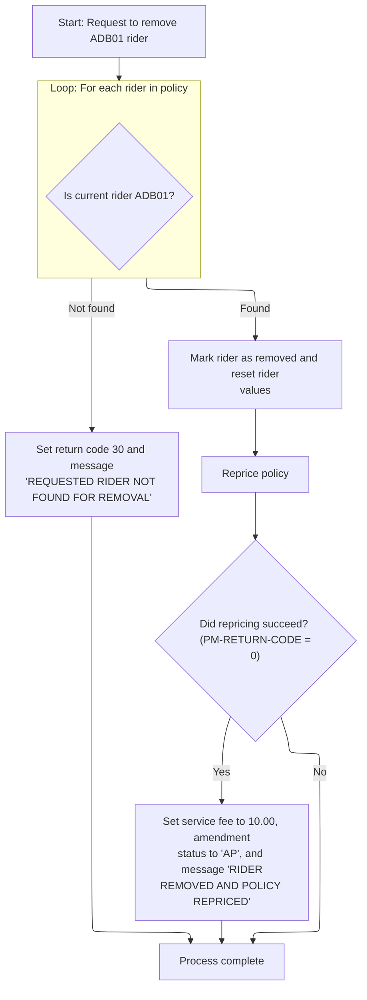

This section governs the business logic for removing the <SwmToken path="SVC-BILL-001.cob" pos="297:4:4" line-data="           MOVE &quot;ADB01&quot; TO PM-RIDER-CODE(PM-RIDER-COUNT)">`ADB01`</SwmToken> rider from a policy, handling errors if the rider is not found, updating policy attributes, and repricing the policy after removal.

| Rule ID | Category        | Rule Name                                  | Description                                                                                                                                                                                                                                                                                 | Implementation Details                                                                                                                                                                              |
| ------- | --------------- | ------------------------------------------ | ------------------------------------------------------------------------------------------------------------------------------------------------------------------------------------------------------------------------------------------------------------------------------------------- | --------------------------------------------------------------------------------------------------------------------------------------------------------------------------------------------------- |
| BR-001  | Data validation | Rider not found error                      | If the requested rider (<SwmToken path="SVC-BILL-001.cob" pos="297:4:4" line-data="           MOVE &quot;ADB01&quot; TO PM-RIDER-CODE(PM-RIDER-COUNT)">`ADB01`</SwmToken>) is not found in the policy, set return code to 30 and return message to 'REQUESTED RIDER NOT FOUND FOR REMOVAL'. | Return code is set to 30. Return message is set to 'REQUESTED RIDER NOT FOUND FOR REMOVAL'. Message is a string up to 100 characters.                                                               |
| BR-002  | Calculation     | Rider removal and reset                    | When the requested rider (<SwmToken path="SVC-BILL-001.cob" pos="297:4:4" line-data="           MOVE &quot;ADB01&quot; TO PM-RIDER-CODE(PM-RIDER-COUNT)">`ADB01`</SwmToken>) is found, mark it as removed, reset its sum assured, rate, and annual premium to zero, and reprice the policy. | Rider status is set to 'R' (removed). Sum assured, rate, and annual premium are set to zero. Policy repricing is triggered after these updates.                                                     |
| BR-003  | Calculation     | Successful repricing fee and status update | If policy repricing after rider removal succeeds, set the service fee to 10.00, amendment status to 'AP', and return message to 'RIDER REMOVED AND POLICY REPRICED'.                                                                                                                        | Service fee is set to 10.00 (numeric, two decimal places). Amendment status is set to 'AP'. Return message is set to 'RIDER REMOVED AND POLICY REPRICED'. Message is a string up to 100 characters. |

<SwmSnippet path="/SVC-BILL-001.cob" line="318">

---

In <SwmToken path="SVC-BILL-001.cob" pos="318:1:5" line-data="       2500-REMOVE-RIDER.">`2500-REMOVE-RIDER`</SwmToken>, we loop through the riders to find the first <SwmToken path="SVC-BILL-001.cob" pos="322:17:17" line-data="                         PM-RIDER-CODE(WS-RIDER-IDX) = &quot;ADB01&quot;">`ADB01`</SwmToken>. If not found, we set an error code and message and exit. If found, we mark it as removed, zero out its values, and reprice the policy.

```cobol
       2500-REMOVE-RIDER.
      * SV-801: Remove the first active rider matching rider code.
           PERFORM VARYING WS-RIDER-IDX FROM 1 BY 1
                   UNTIL WS-RIDER-IDX > PM-RIDER-COUNT OR
                         PM-RIDER-CODE(WS-RIDER-IDX) = "ADB01"
           END-PERFORM
```

---

</SwmSnippet>

<SwmSnippet path="/SVC-BILL-001.cob" line="325">

---

After searching for the rider, if it's not found, we set an error code and message and exit. If found, we move on to removal and repricing.

```cobol
           IF WS-RIDER-IDX > PM-RIDER-COUNT
              MOVE 30 TO PM-RETURN-CODE
              MOVE "REQUESTED RIDER NOT FOUND FOR REMOVAL"
                TO PM-RETURN-MESSAGE
              EXIT PARAGRAPH
           END-IF
```

---

</SwmSnippet>

<SwmSnippet path="/SVC-BILL-001.cob" line="332">

---

After marking the rider as removed and zeroing its values, we call <SwmToken path="SVC-BILL-001.cob" pos="336:3:7" line-data="           PERFORM 3100-REPRICE-POLICY">`3100-REPRICE-POLICY`</SwmToken> to update the premium. This keeps the policy pricing in sync with the new coverage.

```cobol
           MOVE "R" TO PM-RIDER-STATUS(WS-RIDER-IDX)
           MOVE ZERO TO PM-RIDER-SUM-ASSURED(WS-RIDER-IDX)
                        PM-RIDER-RATE(WS-RIDER-IDX)
                        PM-RIDER-ANNUAL-PREM(WS-RIDER-IDX)
           PERFORM 3100-REPRICE-POLICY
```

---

</SwmSnippet>

<SwmSnippet path="/SVC-BILL-001.cob" line="337">

---

After calling <SwmToken path="SVC-BILL-001.cob" pos="217:3:7" line-data="           PERFORM 3100-REPRICE-POLICY">`3100-REPRICE-POLICY`</SwmToken> in <SwmToken path="SVC-BILL-001.cob" pos="56:3:7" line-data="                 PERFORM 2500-REMOVE-RIDER">`2500-REMOVE-RIDER`</SwmToken>, if repricing succeeds, we set the service fee, mark the amendment as applied, and update the return message. This confirms the rider removal went through.

```cobol
           IF PM-RETURN-CODE = 0
              MOVE 0000010.00 TO PM-SERVICE-FEE
              MOVE "AP" TO PM-AMENDMENT-STATUS
              MOVE "RIDER REMOVED AND POLICY REPRICED"
                TO PM-RETURN-MESSAGE
           END-IF.
```

---

</SwmSnippet>

## Validating and processing reinstatement

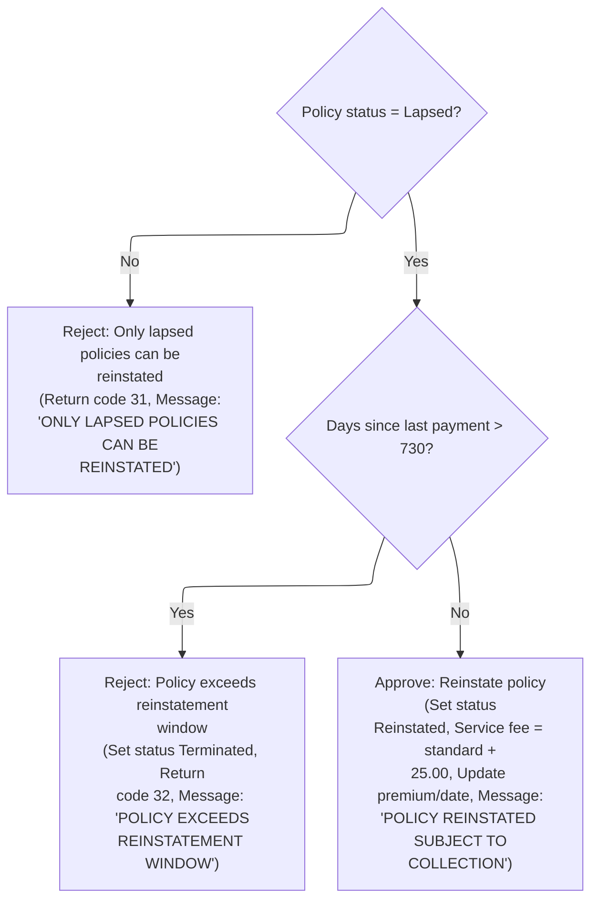

This section validates whether a policy is eligible for reinstatement and processes the reinstatement if all criteria are met. It sets rejection codes and messages for ineligible cases and updates policy fields for approved reinstatements.

| Rule ID | Category        | Rule Name                          | Description                                                                                                                                                                                                                                                                                                                                                                                                                                                                                                                                                                                                                                                        | Implementation Details                                                                                                                                                                                                                                                                                                                                                                                                                                |
| ------- | --------------- | ---------------------------------- | ------------------------------------------------------------------------------------------------------------------------------------------------------------------------------------------------------------------------------------------------------------------------------------------------------------------------------------------------------------------------------------------------------------------------------------------------------------------------------------------------------------------------------------------------------------------------------------------------------------------------------------------------------------------ | ----------------------------------------------------------------------------------------------------------------------------------------------------------------------------------------------------------------------------------------------------------------------------------------------------------------------------------------------------------------------------------------------------------------------------------------------------- |
| BR-001  | Data validation | Lapsed status eligibility          | A policy can be considered for reinstatement only if its status is 'Lapsed'. If the status is not 'Lapsed', the reinstatement request is rejected with return code 31 and the message 'ONLY LAPSED POLICIES CAN BE REINSTATED'.                                                                                                                                                                                                                                                                                                                                                                                                                                    | Return code is 31 (number, 4 digits). Return message is 'ONLY LAPSED POLICIES CAN BE REINSTATED' (string, up to 100 characters).                                                                                                                                                                                                                                                                                                                      |
| BR-002  | Data validation | Reinstatement window limit         | A lapsed policy is eligible for reinstatement only if the days since last payment do not exceed the reinstatement window of 730 days. If the days exceed 730, the request is rejected with return code 32, the message 'POLICY EXCEEDS REINSTATEMENT WINDOW', and the contract status is set to 'Terminated'.                                                                                                                                                                                                                                                                                                                                                      | Reinstatement window is 730 days (number). Return code is 32 (number, 4 digits). Return message is 'POLICY EXCEEDS REINSTATEMENT WINDOW' (string, up to 100 characters). Contract status is set to 'TE' (string, 2 characters).                                                                                                                                                                                                                       |
| BR-003  | Calculation     | Reinstatement approval and updates | If a lapsed policy is within the reinstatement window, the policy is reinstated. The service fee is increased by <SwmToken path="SVC-BILL-001.cob" pos="246:13:15" line-data="              IF WS-SA-INCREASE-PCT &gt; 25.00 OR">`25.00`</SwmToken>, the outstanding premium is updated to the modal premium, contract status is set to 'Reinstated', <SwmToken path="SVC-BILL-001.cob" pos="142:24:28" line-data="      * SV-201: Status moves to grace then lapse based on paid-to-date.">`paid-to-date`</SwmToken> is updated to the process date, amendment status is set to 'AP', and the return message is set to 'POLICY REINSTATED SUBJECT TO COLLECTION'. | Service fee is increased by <SwmToken path="SVC-BILL-001.cob" pos="246:13:15" line-data="              IF WS-SA-INCREASE-PCT &gt; 25.00 OR">`25.00`</SwmToken> (number, 2 decimals). Contract status is set to 'RS' (string, 2 characters). Paid-to-date is set to process date (date, 8 digits). Amendment status is set to 'AP' (string, 2 characters). Return message is 'POLICY REINSTATED SUBJECT TO COLLECTION' (string, up to 100 characters). |

<SwmSnippet path="/SVC-BILL-001.cob" line="344">

---

In <SwmToken path="SVC-BILL-001.cob" pos="344:1:5" line-data="       2600-PROCESS-REINSTATEMENT.">`2600-PROCESS-REINSTATEMENT`</SwmToken>, we check if the policy is lapsed and within the allowed window. If not, we set an error code and message and exit. If eligible, we update the fee, outstanding premium, contract status, dates, and return message.

```cobol
       2600-PROCESS-REINSTATEMENT.
      * SV-901: Reinstatement only for lapsed policies within window.
           IF NOT PM-STAT-LAPSED
              MOVE 31 TO PM-RETURN-CODE
              MOVE "ONLY LAPSED POLICIES CAN BE REINSTATED"
                TO PM-RETURN-MESSAGE
              EXIT PARAGRAPH
           END-IF
```

---

</SwmSnippet>

<SwmSnippet path="/SVC-BILL-001.cob" line="352">

---

After checking if the policy is lapsed, we check if the days since last paid exceed the reinstatement window. If so, we set an error code, terminate the contract, and exit.

```cobol
           IF WS-DAYS-SINCE-PAID > PM-REINSTATE-DAYS
              MOVE 32 TO PM-RETURN-CODE
              MOVE "POLICY EXCEEDS REINSTATEMENT WINDOW"
                TO PM-RETURN-MESSAGE
              MOVE "TE" TO PM-CONTRACT-STATUS
              EXIT PARAGRAPH
           END-IF
```

---

</SwmSnippet>

<SwmSnippet path="/SVC-BILL-001.cob" line="361">

---

After passing all checks in <SwmToken path="SVC-BILL-001.cob" pos="58:3:7" line-data="                 PERFORM 2600-PROCESS-REINSTATEMENT">`2600-PROCESS-REINSTATEMENT`</SwmToken>, we update the service fee, outstanding premium, contract status, <SwmToken path="SVC-BILL-001.cob" pos="142:24:28" line-data="      * SV-201: Status moves to grace then lapse based on paid-to-date.">`paid-to-date`</SwmToken>, amendment status, and return message to confirm reinstatement.

```cobol
           COMPUTE PM-SERVICE-FEE = PM-SERVICE-FEE-STD + 25.00
           MOVE PM-MODAL-PREMIUM TO PM-OUTSTANDING-PREMIUM
           MOVE "RS" TO PM-CONTRACT-STATUS
           MOVE PM-PROCESS-DATE TO PM-PAID-TO-DATE
           MOVE "AP" TO PM-AMENDMENT-STATUS
           MOVE "POLICY REINSTATED SUBJECT TO COLLECTION"
             TO PM-RETURN-MESSAGE.
```

---

</SwmSnippet>

## Finalizing servicing and updating audit fields

This section ensures audit fields are updated to reflect the latest successful servicing action. It provides traceability for when and by whom the last servicing was performed.

| Rule ID | Category        | Rule Name                     | Description                                                                                                              | Implementation Details                                                                                                                                                                                                                                                                |
| ------- | --------------- | ----------------------------- | ------------------------------------------------------------------------------------------------------------------------ | ------------------------------------------------------------------------------------------------------------------------------------------------------------------------------------------------------------------------------------------------------------------------------------- |
| BR-001  | Decision Making | Audit field update on success | When processing is successful, update the last maintenance date and last action user fields in the policy master record. | The last maintenance date is set to the current process date (8-digit number, e.g., YYYYMMDD). The last action user is set to the string <SwmToken path="SVC-BILL-001.cob" pos="67:4:4" line-data="              MOVE &quot;SVC001&quot; TO PM-LAST-ACTION-USER">`SVC001`</SwmToken>. |

<SwmSnippet path="/SVC-BILL-001.cob" line="65">

---

If processing succeeded, we update audit fields and finish up.

```cobol
           IF PM-RETURN-CODE = 0
              MOVE PM-PROCESS-DATE TO PM-LAST-MAINT-DATE PM-LAST-ACTION-DATE
              MOVE "SVC001" TO PM-LAST-ACTION-USER
           END-IF
           GOBACK.
```

---

</SwmSnippet>

&nbsp;

*This is an auto-generated document by Swimm 🌊 and has not yet been verified by a human*

<SwmMeta version="3.0.0" repo-id="Z2l0aHViJTNBJTNBQ09CT0xfU2FtcGxlX01hcmNoXzIwMjYlM0ElM0FtdWRhc2luMQ==" repo-name="COBOL_Sample_March_2026"><sup>Powered by [Swimm](https://app.swimm.io/)</sup></SwmMeta>
