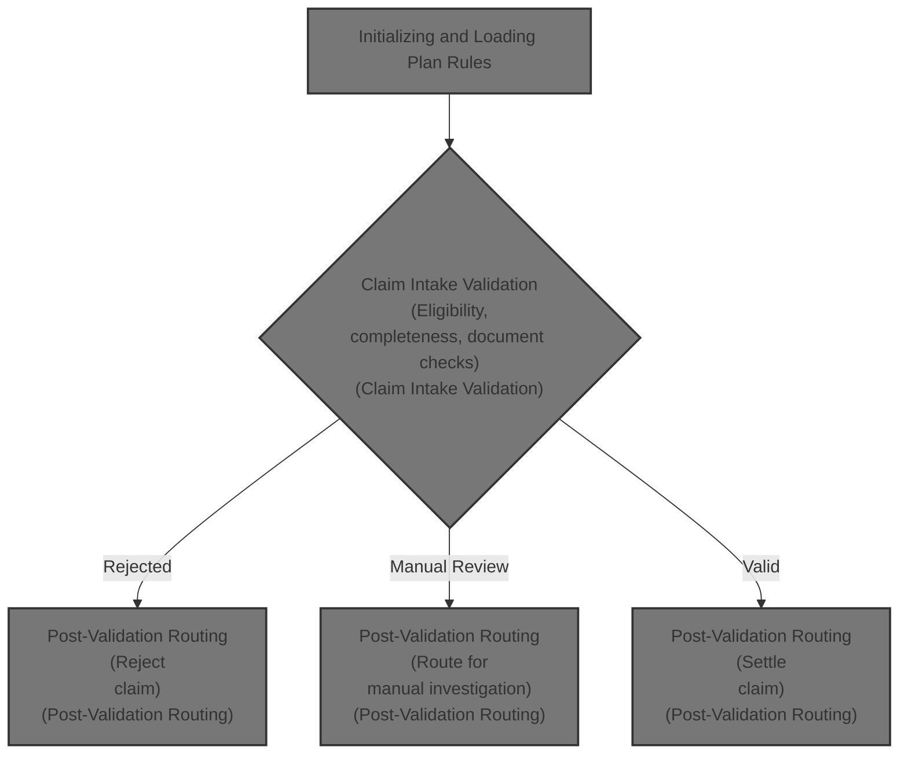

# Overview

This document explains the flow for processing term policy claims. The system validates claim eligibility, checks for investigation triggers, adjudicates coverage, and calculates settlement. Claims are either rejected, routed for manual review, or settled based on plan rules and completeness of information.

## Dependencies

### Program

- CLMADJ001 (<SwmPath>[CLM-ADJ-001.cob](CLM-ADJ-001.cob)</SwmPath>)

### Copybook

- POLDATA (<SwmPath>[POLDATA.cpy](POLDATA.cpy)</SwmPath>)

&nbsp;

*This is an auto-generated document by Swimm 🌊 and has not yet been verified by a human*

<SwmMeta version="3.0.0" repo-id="Z2l0aHViJTNBJTNBQ09CT0xfU2FtcGxlX01hcmNoXzIwMjYlM0ElM0FtdWRhc2luMQ==" repo-name="COBOL_Sample_March_2026">Powered by [Swimm](https://app.swimm.io/)</SwmMeta>
