# Overview

This document describes the flow for underwriting and issuing new term life insurance policies. The process validates eligibility, applies business rules, calculates premiums, and determines the final policy status (issued, referred, or declined).

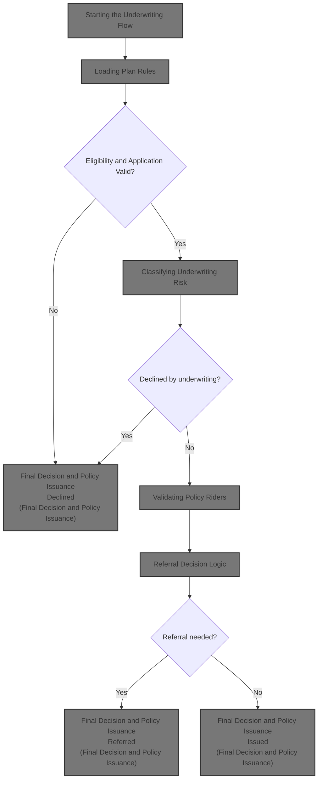

## Dependencies

### Program

- <SwmToken path="cobol/NB-UW-001.cob" pos="2:6:6" line-data="       PROGRAM-ID. NBUW001.">`NBUW001`</SwmToken> (<SwmPath>[cobol/NB-UW-001.cob](cobol/NB-UW-001.cob)</SwmPath>)

### Copybook

- POLDATA (<SwmPath>[cpy/POLDATA.cpy](cpy/POLDATA.cpy)</SwmPath>)

# Where is this program used?

This program is used once, as represented in the following diagram:

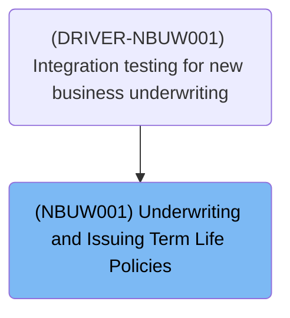

# Workflow

# Starting the Underwriting Flow

```mermaid
%%{init: {"flowchart": {"defaultRenderer": "elk"}} }%%
flowchart TD
    node1["Start new policy process"]
    click node1 openCode "cobol/NB-UW-001.cob:42:45"
    node1 --> node2["Resetting Policy State"]
    
    node2 --> node3["Loading Plan Rules"]
    
    node3 --> node4["Validating Application Fields"]
    
    node4 --> node5{"Application valid? (WS-RESULT-CODE =
0)"}
    click node5 openCode "cobol/NB-UW-001.cob:46:49"
    node5 -->|"No"| node6["Declined: Application error (RJ)"]
    click node6 openCode "cobol/NB-UW-001.cob:47:49"
    node5 -->|"Yes"| node7["Classifying Underwriting Risk"]
    
    node7 --> node8{"Declined by UW rules? (PM-UW-DECLINE)"}
    click node8 openCode "cobol/NB-UW-001.cob:52:59"
    node8 -->|"Yes"| node9["Declined: Underwriting rules (RJ)"]
    click node9 openCode "cobol/NB-UW-001.cob:53:59"
    node8 -->|"No"| node10["Validating Policy Riders"]
    
    node10 --> node11{"Riders valid? (WS-RESULT-CODE = 0)"}
    click node11 openCode "cobol/NB-UW-001.cob:63:66"
    node11 -->|"No"| node12["Declined: Rider error (RJ)"]
    click node12 openCode "cobol/NB-UW-001.cob:64:66"
    node11 -->|"Yes"| node13["Calculating Total Premiums"]
    
    node13 --> node14["Referral Decision Logic"]
    
    node14 --> node15{"Referred for manual UW or reinsurance?
(WS-REFERRED or WS-MANUAL-UW)"}
    click node15 openCode "cobol/NB-UW-001.cob:73:80"
    node15 -->|"Yes"| node16["Referred: Manual UW or Reinsurance (PE)"]
    click node16 openCode "cobol/NB-UW-001.cob:74:79"
    node15 -->|"No"| node17["Issued: Policy active (AC)"]
    click node17 openCode "cobol/NB-UW-001.cob:450:461"
    node6 --> node18["End"]
    node9 --> node18
    node12 --> node18
    node16 --> node18
    node17 --> node18
    click node18 openCode "cobol/NB-UW-001.cob:83:86"
classDef HeadingStyle fill:#777777,stroke:#333,stroke-width:2px;
click node2 goToHeading "Resetting Policy State"
node2:::HeadingStyle
click node3 goToHeading "Loading Plan Rules"
node3:::HeadingStyle
click node4 goToHeading "Validating Application Fields"
node4:::HeadingStyle
click node7 goToHeading "Classifying Underwriting Risk"
node7:::HeadingStyle
click node10 goToHeading "Validating Policy Riders"
node10:::HeadingStyle
click node13 goToHeading "Calculating Rider Premiums"
node13:::HeadingStyle
click node13 goToHeading "Calculating Total Premiums"
node13:::HeadingStyle
click node14 goToHeading "Referral Decision Logic"
node14:::HeadingStyle

%% Swimm:
%% %%{init: {"flowchart": {"defaultRenderer": "elk"}} }%%
%% flowchart TD
%%     node1["Start new policy process"]
%%     click node1 openCode "<SwmPath>[cobol/NB-UW-001.cob](cobol/NB-UW-001.cob)</SwmPath>:42:45"
%%     node1 --> node2["Resetting Policy State"]
%%     
%%     node2 --> node3["Loading Plan Rules"]
%%     
%%     node3 --> node4["Validating Application Fields"]
%%     
%%     node4 --> node5{"Application valid? (<SwmToken path="cobol/NB-UW-001.cob" pos="46:3:7" line-data="           IF WS-RESULT-CODE NOT = 0">`WS-RESULT-CODE`</SwmToken> =
%% 0)"}
%%     click node5 openCode "<SwmPath>[cobol/NB-UW-001.cob](cobol/NB-UW-001.cob)</SwmPath>:46:49"
%%     node5 -->|"No"| node6["Declined: Application error (RJ)"]
%%     click node6 openCode "<SwmPath>[cobol/NB-UW-001.cob](cobol/NB-UW-001.cob)</SwmPath>:47:49"
%%     node5 -->|"Yes"| node7["Classifying Underwriting Risk"]
%%     
%%     node7 --> node8{"Declined by UW rules? (<SwmToken path="cobol/NB-UW-001.cob" pos="52:3:7" line-data="           IF PM-UW-DECLINE">`PM-UW-DECLINE`</SwmToken>)"}
%%     click node8 openCode "<SwmPath>[cobol/NB-UW-001.cob](cobol/NB-UW-001.cob)</SwmPath>:52:59"
%%     node8 -->|"Yes"| node9["Declined: Underwriting rules (RJ)"]
%%     click node9 openCode "<SwmPath>[cobol/NB-UW-001.cob](cobol/NB-UW-001.cob)</SwmPath>:53:59"
%%     node8 -->|"No"| node10["Validating Policy Riders"]
%%     
%%     node10 --> node11{"Riders valid? (<SwmToken path="cobol/NB-UW-001.cob" pos="46:3:7" line-data="           IF WS-RESULT-CODE NOT = 0">`WS-RESULT-CODE`</SwmToken> = 0)"}
%%     click node11 openCode "<SwmPath>[cobol/NB-UW-001.cob](cobol/NB-UW-001.cob)</SwmPath>:63:66"
%%     node11 -->|"No"| node12["Declined: Rider error (RJ)"]
%%     click node12 openCode "<SwmPath>[cobol/NB-UW-001.cob](cobol/NB-UW-001.cob)</SwmPath>:64:66"
%%     node11 -->|"Yes"| node13["Calculating Total Premiums"]
%%     
%%     node13 --> node14["Referral Decision Logic"]
%%     
%%     node14 --> node15{"Referred for manual UW or reinsurance?
%% (<SwmToken path="cobol/NB-UW-001.cob" pos="73:3:5" line-data="           IF WS-REFERRED OR WS-MANUAL-UW">`WS-REFERRED`</SwmToken> or <SwmToken path="cobol/NB-UW-001.cob" pos="73:9:13" line-data="           IF WS-REFERRED OR WS-MANUAL-UW">`WS-MANUAL-UW`</SwmToken>)"}
%%     click node15 openCode "<SwmPath>[cobol/NB-UW-001.cob](cobol/NB-UW-001.cob)</SwmPath>:73:80"
%%     node15 -->|"Yes"| node16["Referred: Manual UW or Reinsurance (PE)"]
%%     click node16 openCode "<SwmPath>[cobol/NB-UW-001.cob](cobol/NB-UW-001.cob)</SwmPath>:74:79"
%%     node15 -->|"No"| node17["Issued: Policy active (AC)"]
%%     click node17 openCode "<SwmPath>[cobol/NB-UW-001.cob](cobol/NB-UW-001.cob)</SwmPath>:450:461"
%%     node6 --> node18["End"]
%%     node9 --> node18
%%     node12 --> node18
%%     node16 --> node18
%%     node17 --> node18
%%     click node18 openCode "<SwmPath>[cobol/NB-UW-001.cob](cobol/NB-UW-001.cob)</SwmPath>:83:86"
%% classDef HeadingStyle fill:#777777,stroke:#333,stroke-width:2px;
%% click node2 goToHeading "Resetting Policy State"
%% node2:::HeadingStyle
%% click node3 goToHeading "Loading Plan Rules"
%% node3:::HeadingStyle
%% click node4 goToHeading "Validating Application Fields"
%% node4:::HeadingStyle
%% click node7 goToHeading "Classifying Underwriting Risk"
%% node7:::HeadingStyle
%% click node10 goToHeading "Validating Policy Riders"
%% node10:::HeadingStyle
%% click node13 goToHeading "Calculating Rider Premiums"
%% node13:::HeadingStyle
%% click node13 goToHeading "Calculating Total Premiums"
%% node13:::HeadingStyle
%% click node14 goToHeading "Referral Decision Logic"
%% node14:::HeadingStyle
```

This section manages the end-to-end flow for underwriting a new term life insurance policy, including validation, risk classification, premium calculation, and final decision (decline, refer, or issue). It ensures all business rules for eligibility, risk, and product configuration are applied before a policy is approved or declined.

| Rule ID | Category        | Rule Name                             | Description                                                                                                                                                              | Implementation Details                                                                                                                                                                       |
| ------- | --------------- | ------------------------------------- | ------------------------------------------------------------------------------------------------------------------------------------------------------------------------ | -------------------------------------------------------------------------------------------------------------------------------------------------------------------------------------------- |
| BR-001  | Decision Making | Application validation decline        | If the application validation fails, the policy is declined with status 'RJ' and an application error message is set.                                                    | The decline status is represented by 'RJ'. The result message provides the application error details. Output format: status as a 2-character string, message as up to 100 characters.        |
| BR-002  | Decision Making | Underwriting rules decline            | If the underwriting classification results in a decline, the policy is declined with status 'RJ' and an underwriting rules error message is set.                         | The decline status is represented by 'RJ'. The result message provides the underwriting rules error details. Output format: status as a 2-character string, message as up to 100 characters. |
| BR-003  | Decision Making | Rider validation decline              | If rider validation fails, the policy is declined with status 'RJ' and a rider error message is set.                                                                     | The decline status is represented by 'RJ'. The result message provides the rider error details. Output format: status as a 2-character string, message as up to 100 characters.              |
| BR-004  | Decision Making | Referral for manual UW or reinsurance | If the referral logic determines the policy should be referred for manual underwriting or reinsurance, the policy is set to status 'PE' and the referral message is set. | The referred status is represented by 'PE'. The result message provides referral details. Output format: status as a 2-character string, message as up to 100 characters.                    |
| BR-005  | Decision Making | Policy issuance                       | If all validations pass and no referral is required, the policy is issued as active with status 'AC'.                                                                    | The active status is represented by 'AC'. Output format: status as a 2-character string.                                                                                                     |

<SwmSnippet path="/cobol/NB-UW-001.cob" line="42">

---

In <SwmToken path="cobol/NB-UW-001.cob" pos="42:1:3" line-data="       MAIN-PROCESS.">`MAIN-PROCESS`</SwmToken>, we kick things off by calling <SwmToken path="cobol/NB-UW-001.cob" pos="43:3:5" line-data="           PERFORM 1000-INITIALIZE">`1000-INITIALIZE`</SwmToken> to wipe out any leftover values and set up the policy record for a fresh run. This makes sure all fields are clean before we load plan parameters or check eligibility.

```cobol
       MAIN-PROCESS.
           PERFORM 1000-INITIALIZE
           PERFORM 1100-LOAD-PLAN-PARAMETERS
           PERFORM 1200-VALIDATE-APPLICATION
```

---

</SwmSnippet>

## Resetting Policy State

This section prepares the policy record for new business calculations by resetting key fields and ensuring tracking information is up to date.

| Rule ID | Category        | Rule Name                | Description                                                                                                                                                                                                                                                                  | Implementation Details                                                                                                                                                                                                                                              |
| ------- | --------------- | ------------------------ | ---------------------------------------------------------------------------------------------------------------------------------------------------------------------------------------------------------------------------------------------------------------------------- | ------------------------------------------------------------------------------------------------------------------------------------------------------------------------------------------------------------------------------------------------------------------- |
| BR-001  | Calculation     | Premium reset            | All premium-related fields are reset to zero at the start of processing, ensuring no carry-over from previous calculations.                                                                                                                                                  | Premium fields include base annual premium, rider annual total, gross annual premium, tax amount, total annual premium, modal premium, and premium delta. All are set to numeric zero.                                                                              |
| BR-002  | Calculation     | Message clearing         | All message fields are cleared to prevent display of outdated or irrelevant information.                                                                                                                                                                                     | Message fields include return message and result message, both set to blank spaces. Format: alphanumeric, 100 characters for return message.                                                                                                                        |
| BR-003  | Calculation     | Referral flag reset      | Referral flags for reinsurance and underwriting are reset to 'N', indicating no referral is pending at initialization.                                                                                                                                                       | Referral flags are set to 'N'. Format: single alphanumeric character.                                                                                                                                                                                               |
| BR-004  | Calculation     | Action tracking stamping | The last action date is stamped with the process date, and the last action user is set to <SwmToken path="cobol/NB-UW-001.cob" pos="107:4:6" line-data="           MOVE &quot;NB-UW001&quot; TO PM-LAST-ACTION-USER.">`NB-UW001`</SwmToken> for audit and tracking purposes. | Last action date is set to the process date (YYYYMMDD format). Last action user is set to <SwmToken path="cobol/NB-UW-001.cob" pos="107:4:6" line-data="           MOVE &quot;NB-UW001&quot; TO PM-LAST-ACTION-USER.">`NB-UW001`</SwmToken> (string, 8 characters). |
| BR-005  | Decision Making | Process date defaulting  | If the process date is missing (zero), it is set to the current date to ensure accurate tracking.                                                                                                                                                                            | Process date is set to the current date in YYYYMMDD format if missing.                                                                                                                                                                                              |

<SwmSnippet path="/cobol/NB-UW-001.cob" line="88">

---

In <SwmToken path="cobol/NB-UW-001.cob" pos="88:1:3" line-data="       1000-INITIALIZE.">`1000-INITIALIZE`</SwmToken>, we zero out all premium fields, clear messages, and reset referral flags. This sets up the policy for new calculations and decisions.

```cobol
       1000-INITIALIZE.
           MOVE ZERO TO PM-RETURN-CODE
                        PM-BASE-ANNUAL-PREMIUM
                        PM-RIDER-ANNUAL-TOTAL
                        PM-GROSS-ANNUAL-PREMIUM
                        PM-TAX-AMOUNT
                        PM-TOTAL-ANNUAL-PREMIUM
                        PM-MODAL-PREMIUM
                        PM-PREMIUM-DELTA
           MOVE SPACES TO PM-RETURN-MESSAGE
                          WS-RESULT-MESSAGE
           MOVE 0 TO WS-RESULT-CODE
           MOVE 'N' TO WS-REINSURANCE-REFERRAL
                        WS-UW-REFERRAL
           ACCEPT WS-CURR-DATE FROM DATE YYYYMMDD
```

---

</SwmSnippet>

<SwmSnippet path="/cobol/NB-UW-001.cob" line="103">

---

If <SwmToken path="cobol/NB-UW-001.cob" pos="103:3:7" line-data="           IF PM-PROCESS-DATE = ZERO">`PM-PROCESS-DATE`</SwmToken> is zero, we set it to the current date, then copy it to <SwmToken path="cobol/NB-UW-001.cob" pos="106:11:17" line-data="           MOVE PM-PROCESS-DATE TO PM-LAST-ACTION-DATE">`PM-LAST-ACTION-DATE`</SwmToken> and stamp <SwmToken path="cobol/NB-UW-001.cob" pos="107:4:6" line-data="           MOVE &quot;NB-UW001&quot; TO PM-LAST-ACTION-USER.">`NB-UW001`</SwmToken> as the last action user. This marks the record for tracking and ensures dates are valid.

```cobol
           IF PM-PROCESS-DATE = ZERO
              MOVE WS-CURR-DATE TO PM-PROCESS-DATE
           END-IF
           MOVE PM-PROCESS-DATE TO PM-LAST-ACTION-DATE
           MOVE "NB-UW001" TO PM-LAST-ACTION-USER.
```

---

</SwmSnippet>

## Loading Plan Rules

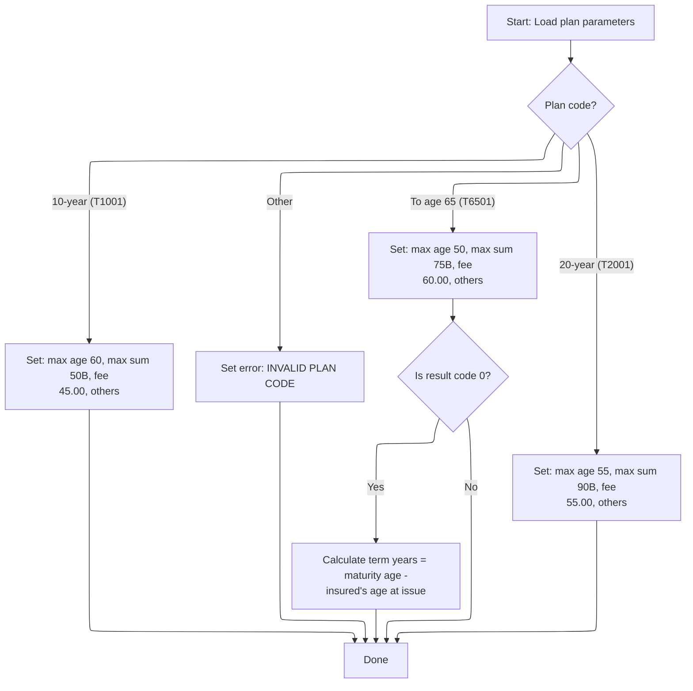

This section loads all business parameters for a term life insurance plan based on the plan code. It ensures that only supported plan codes are processed and sets the correct business limits and fees for each plan type.

| Rule ID | Category        | Rule Name                  | Description                                                                                                                                                                                                                                                                                                                                                                                                                                                                                                                             | Implementation Details                                                                                                                                                                                                                                                                                                                                                                                                                                                                              |
| ------- | --------------- | -------------------------- | --------------------------------------------------------------------------------------------------------------------------------------------------------------------------------------------------------------------------------------------------------------------------------------------------------------------------------------------------------------------------------------------------------------------------------------------------------------------------------------------------------------------------------------- | --------------------------------------------------------------------------------------------------------------------------------------------------------------------------------------------------------------------------------------------------------------------------------------------------------------------------------------------------------------------------------------------------------------------------------------------------------------------------------------------------- |
| BR-001  | Calculation     | To age 65 term calculation | If the plan is 'To age 65' and no error is present, calculate term years as maturity age minus insured's age at issue.                                                                                                                                                                                                                                                                                                                                                                                                                  | Term years is calculated as a number: maturity age minus insured's age at issue. The result is stored as a number with no decimals.                                                                                                                                                                                                                                                                                                                                                                 |
| BR-002  | Decision Making | 10-year plan parameters    | When the plan code is 'T1001', set minimum issue age to 18, maximum issue age to 60, minimum sum assured to 10,000,000.00, maximum sum assured to 50,000,000,000.00, term years to 10, maturity age to 70, grace days to 31, contestable years to 2, suicide exclusion years to 2, reinstate days to 730, annual policy fee to 45.00, standard service fee to 15.00, and tax rate to <SwmToken path="cobol/NB-UW-001.cob" pos="126:3:5" line-data="                 MOVE 0.0200 TO PM-TAX-RATE">`0.0200`</SwmToken>.                    | All values are set as numbers. Minimum issue age: 18. Maximum issue age: 60. Minimum sum assured: 10,000,000.00. Maximum sum assured: 50,000,000,000.00. Term years: 10. Maturity age: 70. Grace days: 31. Contestable years: 2. Suicide exclusion years: 2. Reinstate days: 730. Annual policy fee: 45.00. Standard service fee: 15.00. Tax rate: <SwmToken path="cobol/NB-UW-001.cob" pos="126:3:5" line-data="                 MOVE 0.0200 TO PM-TAX-RATE">`0.0200`</SwmToken>.                  |
| BR-003  | Decision Making | 20-year plan parameters    | When the plan code is 'T2001', set minimum issue age to 18, maximum issue age to 55, minimum sum assured to 10,000,000.00, maximum sum assured to 90,000,000,000.00, term years to 20, maturity age to 75, grace days to 31, contestable years to 2, suicide exclusion years to 2, reinstate days to 730, annual policy fee to 55.00, standard service fee to 15.00, and tax rate to <SwmToken path="cobol/NB-UW-001.cob" pos="126:3:5" line-data="                 MOVE 0.0200 TO PM-TAX-RATE">`0.0200`</SwmToken>.                    | All values are set as numbers. Minimum issue age: 18. Maximum issue age: 55. Minimum sum assured: 10,000,000.00. Maximum sum assured: 90,000,000,000.00. Term years: 20. Maturity age: 75. Grace days: 31. Contestable years: 2. Suicide exclusion years: 2. Reinstate days: 730. Annual policy fee: 55.00. Standard service fee: 15.00. Tax rate: <SwmToken path="cobol/NB-UW-001.cob" pos="126:3:5" line-data="                 MOVE 0.0200 TO PM-TAX-RATE">`0.0200`</SwmToken>.                  |
| BR-004  | Decision Making | To age 65 plan parameters  | When the plan code is 'T6501', set minimum issue age to 18, maximum issue age to 50, minimum sum assured to 10,000,000.00, maximum sum assured to 75,000,000,000.00, maturity age to 65, grace days to 31, contestable years to 2, suicide exclusion years to 2, reinstate days to 730, annual policy fee to 60.00, standard service fee to 15.00, and tax rate to <SwmToken path="cobol/NB-UW-001.cob" pos="126:3:5" line-data="                 MOVE 0.0200 TO PM-TAX-RATE">`0.0200`</SwmToken>. Term years are not set at this step. | All values are set as numbers. Minimum issue age: 18. Maximum issue age: 50. Minimum sum assured: 10,000,000.00. Maximum sum assured: 75,000,000,000.00. Maturity age: 65. Grace days: 31. Contestable years: 2. Suicide exclusion years: 2. Reinstate days: 730. Annual policy fee: 60.00. Standard service fee: 15.00. Tax rate: <SwmToken path="cobol/NB-UW-001.cob" pos="126:3:5" line-data="                 MOVE 0.0200 TO PM-TAX-RATE">`0.0200`</SwmToken>. Term years are calculated later. |
| BR-005  | Decision Making | Invalid plan code error    | If the plan code does not match any supported plan, set result code to 11 and result message to 'INVALID PLAN CODE'. No plan parameters are loaded in this case.                                                                                                                                                                                                                                                                                                                                                                        | Result code is set to 11. Result message is set to 'INVALID PLAN CODE' (string, left aligned, padded with spaces if needed). No plan parameters are loaded.                                                                                                                                                                                                                                                                                                                                         |

<SwmSnippet path="/cobol/NB-UW-001.cob" line="109">

---

In <SwmToken path="cobol/NB-UW-001.cob" pos="109:1:7" line-data="       1100-LOAD-PLAN-PARAMETERS.">`1100-LOAD-PLAN-PARAMETERS`</SwmToken>, we use EVALUATE TRUE to pick the plan term and set all the business parameters for that plan. Only one plan term flag is expected to be true, so we load the right limits and fees.

```cobol
       1100-LOAD-PLAN-PARAMETERS.
      * NB-101: Each plan carries its own issue age, sum assured,
      *         maturity, fee, and tax rules.
           EVALUATE TRUE
              WHEN PM-PLAN-TERM-10
                 MOVE 018 TO PM-MIN-ISSUE-AGE
                 MOVE 060 TO PM-MAX-ISSUE-AGE
                 MOVE 10000000.00 TO PM-MIN-SUM-ASSURED
                 MOVE 50000000000.00 TO PM-MAX-SUM-ASSURED
                 MOVE 010 TO PM-TERM-YEARS
                 MOVE 070 TO PM-MATURITY-AGE
                 MOVE 031 TO PM-GRACE-DAYS
                 MOVE 02  TO PM-CONTESTABLE-YEARS
                 MOVE 02  TO PM-SUICIDE-EXCL-YEARS
                 MOVE 730 TO PM-REINSTATE-DAYS
                 MOVE 0000045.00 TO PM-POLICY-FEE-ANNUAL
                 MOVE 0000015.00 TO PM-SERVICE-FEE-STD
                 MOVE 0.0200 TO PM-TAX-RATE
```

---

</SwmSnippet>

<SwmSnippet path="/cobol/NB-UW-001.cob" line="127">

---

Here we handle <SwmToken path="cobol/NB-UW-001.cob" pos="127:3:9" line-data="              WHEN PM-PLAN-TERM-20">`PM-PLAN-TERM-20`</SwmToken>, loading a different set of age limits, sum assured, term years, and fees. This follows the same structure as the previous block, just with values specific to the 20-year plan.

```cobol
              WHEN PM-PLAN-TERM-20
                 MOVE 018 TO PM-MIN-ISSUE-AGE
                 MOVE 055 TO PM-MAX-ISSUE-AGE
                 MOVE 10000000.00 TO PM-MIN-SUM-ASSURED
                 MOVE 90000000000.00 TO PM-MAX-SUM-ASSURED
                 MOVE 020 TO PM-TERM-YEARS
                 MOVE 075 TO PM-MATURITY-AGE
                 MOVE 031 TO PM-GRACE-DAYS
                 MOVE 02  TO PM-CONTESTABLE-YEARS
                 MOVE 02  TO PM-SUICIDE-EXCL-YEARS
                 MOVE 730 TO PM-REINSTATE-DAYS
                 MOVE 0000055.00 TO PM-POLICY-FEE-ANNUAL
                 MOVE 0000015.00 TO PM-SERVICE-FEE-STD
                 MOVE 0.0200 TO PM-TAX-RATE
```

---

</SwmSnippet>

<SwmSnippet path="/cobol/NB-UW-001.cob" line="141">

---

For <SwmToken path="cobol/NB-UW-001.cob" pos="141:3:9" line-data="              WHEN PM-PLAN-TO-65">`PM-PLAN-TO-65`</SwmToken>, we set maturity age and other parameters, but leave term years to be calculated later. The caps and fees are adjusted for this plan type.

```cobol
              WHEN PM-PLAN-TO-65
                 MOVE 018 TO PM-MIN-ISSUE-AGE
                 MOVE 050 TO PM-MAX-ISSUE-AGE
                 MOVE 10000000.00 TO PM-MIN-SUM-ASSURED
                 MOVE 75000000000.00 TO PM-MAX-SUM-ASSURED
                 MOVE 065 TO PM-MATURITY-AGE
                 MOVE 031 TO PM-GRACE-DAYS
                 MOVE 02  TO PM-CONTESTABLE-YEARS
                 MOVE 02  TO PM-SUICIDE-EXCL-YEARS
                 MOVE 730 TO PM-REINSTATE-DAYS
                 MOVE 0000060.00 TO PM-POLICY-FEE-ANNUAL
                 MOVE 0000015.00 TO PM-SERVICE-FEE-STD
                 MOVE 0.0200 TO PM-TAX-RATE
```

---

</SwmSnippet>

<SwmSnippet path="/cobol/NB-UW-001.cob" line="154">

---

If none of the plan term flags match, we set an error code and message for 'INVALID PLAN CODE'. This stops the flow from loading any plan parameters.

```cobol
              WHEN OTHER
                 MOVE 11 TO WS-RESULT-CODE
                 MOVE "INVALID PLAN CODE" TO WS-RESULT-MESSAGE
           END-EVALUATE
```

---

</SwmSnippet>

<SwmSnippet path="/cobol/NB-UW-001.cob" line="159">

---

After loading parameters, if we're on the <SwmToken path="cobol/NB-UW-001.cob" pos="159:7:9" line-data="           IF PM-PLAN-TO-65 AND WS-RESULT-CODE = 0">`TO-65`</SwmToken> plan and no error, we calculate <SwmToken path="cobol/NB-UW-001.cob" pos="160:3:7" line-data="              COMPUTE PM-TERM-YEARS = PM-MATURITY-AGE">`PM-TERM-YEARS`</SwmToken> as maturity age minus insured's age at issue. This sets the term length for the policy.

```cobol
           IF PM-PLAN-TO-65 AND WS-RESULT-CODE = 0
              COMPUTE PM-TERM-YEARS = PM-MATURITY-AGE
                                     - PM-INSURED-AGE-ISSUE
           END-IF.
```

---

</SwmSnippet>

## Checking Application Eligibility

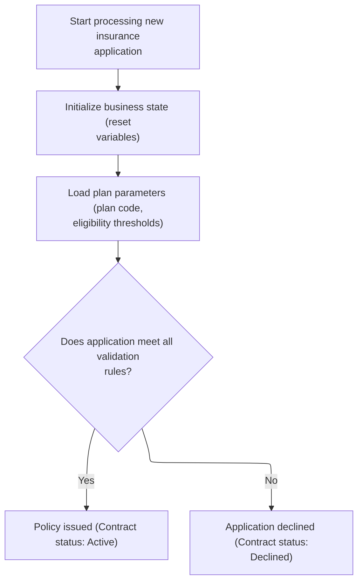

This section determines if a new insurance application meets all plan-specific eligibility rules and sets the contract status accordingly. It is a key decision point in the new business process.

| Rule ID | Category        | Rule Name                            | Description                                                                                                                           | Implementation Details                                                                                                                                                                                              |
| ------- | --------------- | ------------------------------------ | ------------------------------------------------------------------------------------------------------------------------------------- | ------------------------------------------------------------------------------------------------------------------------------------------------------------------------------------------------------------------- |
| BR-001  | Decision Making | Policy Issuance on Eligibility       | If the application meets all plan-specific validation rules, the policy is issued and the contract status is set to 'Active'.         | The contract status is set to 'Active', represented by the value 'AC'. This is a 2-character alphanumeric code. The output format for contract status is a string of length 2, left-aligned, no padding required.   |
| BR-002  | Decision Making | Application Decline on Ineligibility | If the application fails any plan-specific validation rule, the application is declined and the contract status is set to 'Declined'. | The contract status is set to 'Declined', represented by the value 'RJ'. This is a 2-character alphanumeric code. The output format for contract status is a string of length 2, left-aligned, no padding required. |

<SwmSnippet path="/cobol/NB-UW-001.cob" line="42">

---

Back in <SwmToken path="cobol/NB-UW-001.cob" pos="42:1:3" line-data="       MAIN-PROCESS.">`MAIN-PROCESS`</SwmToken>, after loading plan parameters, we call <SwmToken path="cobol/NB-UW-001.cob" pos="45:3:7" line-data="           PERFORM 1200-VALIDATE-APPLICATION">`1200-VALIDATE-APPLICATION`</SwmToken> to check if the application meets all the business rules for the selected plan.

```cobol
       MAIN-PROCESS.
           PERFORM 1000-INITIALIZE
           PERFORM 1100-LOAD-PLAN-PARAMETERS
           PERFORM 1200-VALIDATE-APPLICATION
```

---

</SwmSnippet>

## Validating Application Fields

```mermaid
%%{init: {"flowchart": {"defaultRenderer": "elk"}} }%%
flowchart TD
    node1["Start application validation"]
    click node1 openCode "cobol/NB-UW-001.cob:164:165"
    node1 --> node2{"Is policy ID provided?"}
    click node2 openCode "cobol/NB-UW-001.cob:166:170"
    node2 -->|"No"| nodeReject1["Reject: Policy ID is required"]
    click nodeReject1 openCode "cobol/NB-UW-001.cob:167:169"
    node2 -->|"Yes"| node3{"Is insured name provided?"}
    click node3 openCode "cobol/NB-UW-001.cob:171:175"
    node3 -->|"No"| nodeReject2["Reject: Insured name is required"]
    click nodeReject2 openCode "cobol/NB-UW-001.cob:172:174"
    node3 -->|"Yes"| node4{"Is gender code valid (male/female)?"}
    click node4 openCode "cobol/NB-UW-001.cob:176:180"
    node4 -->|"No"| nodeReject3["Reject: Invalid gender code"]
    click nodeReject3 openCode "cobol/NB-UW-001.cob:177:179"
    node4 -->|"Yes"| node5{"Is smoker indicator valid
(smoker/non-smoker)?"}
    click node5 openCode "cobol/NB-UW-001.cob:181:185"
    node5 -->|"No"| nodeReject4["Reject: Invalid smoker indicator"]
    click nodeReject4 openCode "cobol/NB-UW-001.cob:182:184"
    node5 -->|"Yes"| node6{"Is billing mode valid
(annual/semi/quarterly/monthly)?"}
    click node6 openCode "cobol/NB-UW-001.cob:186:191"
    node6 -->|"No"| nodeReject5["Reject: Invalid billing mode"]
    click nodeReject5 openCode "cobol/NB-UW-001.cob:188:190"
    node6 -->|"Yes"| node7{"Is insured age within plan limits?"}
    click node7 openCode "cobol/NB-UW-001.cob:194:199"
    node7 -->|"No"| nodeReject6["Reject: Issue age outside plan limits"]
    click nodeReject6 openCode "cobol/NB-UW-001.cob:196:198"
    node7 -->|"Yes"| node8{"Is sum assured within plan limits?"}
    click node8 openCode "cobol/NB-UW-001.cob:202:208"
    node8 -->|"No"| nodeReject7["Reject: Sum assured outside plan
limits"]
    click nodeReject7 openCode "cobol/NB-UW-001.cob:204:207"
    node8 -->|"Yes"| node9{"Does term exceed allowed maturity age?"}
    click node9 openCode "cobol/NB-UW-001.cob:211:216"
    node9 -->|"Yes"| nodeReject8["Reject: Term exceeds allowed maturity
age"]
    click nodeReject8 openCode "cobol/NB-UW-001.cob:212:215"
    node9 -->|"No"| node10{"Is hazardous occupation restricted for
T65 plan?"}
    click node10 openCode "cobol/NB-UW-001.cob:219:224"
    node10 -->|"Yes"| nodeReject9["Reject: T65 not available for hazardous
occupation"]
    click nodeReject9 openCode "cobol/NB-UW-001.cob:220:223"
    node10 -->|"No"| node11{"Is occupation severe?"}
    click node11 openCode "cobol/NB-UW-001.cob:227:229"
    node11 -->|"Yes"| node12["Classify as DP (Declined/Provisional),
then accept"]
    click node12 openCode "cobol/NB-UW-001.cob:228:229"
    node12 --> node13["Accept application"]
    click node13 openCode "cobol/NB-UW-001.cob:229:229"
    node11 -->|"No"| node13
classDef HeadingStyle fill:#777777,stroke:#333,stroke-width:2px;

%% Swimm:
%% %%{init: {"flowchart": {"defaultRenderer": "elk"}} }%%
%% flowchart TD
%%     node1["Start application validation"]
%%     click node1 openCode "<SwmPath>[cobol/NB-UW-001.cob](cobol/NB-UW-001.cob)</SwmPath>:164:165"
%%     node1 --> node2{"Is policy ID provided?"}
%%     click node2 openCode "<SwmPath>[cobol/NB-UW-001.cob](cobol/NB-UW-001.cob)</SwmPath>:166:170"
%%     node2 -->|"No"| nodeReject1["Reject: Policy ID is required"]
%%     click nodeReject1 openCode "<SwmPath>[cobol/NB-UW-001.cob](cobol/NB-UW-001.cob)</SwmPath>:167:169"
%%     node2 -->|"Yes"| node3{"Is insured name provided?"}
%%     click node3 openCode "<SwmPath>[cobol/NB-UW-001.cob](cobol/NB-UW-001.cob)</SwmPath>:171:175"
%%     node3 -->|"No"| nodeReject2["Reject: Insured name is required"]
%%     click nodeReject2 openCode "<SwmPath>[cobol/NB-UW-001.cob](cobol/NB-UW-001.cob)</SwmPath>:172:174"
%%     node3 -->|"Yes"| node4{"Is gender code valid (male/female)?"}
%%     click node4 openCode "<SwmPath>[cobol/NB-UW-001.cob](cobol/NB-UW-001.cob)</SwmPath>:176:180"
%%     node4 -->|"No"| nodeReject3["Reject: Invalid gender code"]
%%     click nodeReject3 openCode "<SwmPath>[cobol/NB-UW-001.cob](cobol/NB-UW-001.cob)</SwmPath>:177:179"
%%     node4 -->|"Yes"| node5{"Is smoker indicator valid
%% (smoker/non-smoker)?"}
%%     click node5 openCode "<SwmPath>[cobol/NB-UW-001.cob](cobol/NB-UW-001.cob)</SwmPath>:181:185"
%%     node5 -->|"No"| nodeReject4["Reject: Invalid smoker indicator"]
%%     click nodeReject4 openCode "<SwmPath>[cobol/NB-UW-001.cob](cobol/NB-UW-001.cob)</SwmPath>:182:184"
%%     node5 -->|"Yes"| node6{"Is billing mode valid
%% (annual/semi/quarterly/monthly)?"}
%%     click node6 openCode "<SwmPath>[cobol/NB-UW-001.cob](cobol/NB-UW-001.cob)</SwmPath>:186:191"
%%     node6 -->|"No"| nodeReject5["Reject: Invalid billing mode"]
%%     click nodeReject5 openCode "<SwmPath>[cobol/NB-UW-001.cob](cobol/NB-UW-001.cob)</SwmPath>:188:190"
%%     node6 -->|"Yes"| node7{"Is insured age within plan limits?"}
%%     click node7 openCode "<SwmPath>[cobol/NB-UW-001.cob](cobol/NB-UW-001.cob)</SwmPath>:194:199"
%%     node7 -->|"No"| nodeReject6["Reject: Issue age outside plan limits"]
%%     click nodeReject6 openCode "<SwmPath>[cobol/NB-UW-001.cob](cobol/NB-UW-001.cob)</SwmPath>:196:198"
%%     node7 -->|"Yes"| node8{"Is sum assured within plan limits?"}
%%     click node8 openCode "<SwmPath>[cobol/NB-UW-001.cob](cobol/NB-UW-001.cob)</SwmPath>:202:208"
%%     node8 -->|"No"| nodeReject7["Reject: Sum assured outside plan
%% limits"]
%%     click nodeReject7 openCode "<SwmPath>[cobol/NB-UW-001.cob](cobol/NB-UW-001.cob)</SwmPath>:204:207"
%%     node8 -->|"Yes"| node9{"Does term exceed allowed maturity age?"}
%%     click node9 openCode "<SwmPath>[cobol/NB-UW-001.cob](cobol/NB-UW-001.cob)</SwmPath>:211:216"
%%     node9 -->|"Yes"| nodeReject8["Reject: Term exceeds allowed maturity
%% age"]
%%     click nodeReject8 openCode "<SwmPath>[cobol/NB-UW-001.cob](cobol/NB-UW-001.cob)</SwmPath>:212:215"
%%     node9 -->|"No"| node10{"Is hazardous occupation restricted for
%% <SwmToken path="cobol/NB-UW-001.cob" pos="221:4:4" line-data="              MOVE &quot;T65 NOT AVAILABLE FOR HAZARDOUS OCCUPATION&quot;">`T65`</SwmToken> plan?"}
%%     click node10 openCode "<SwmPath>[cobol/NB-UW-001.cob](cobol/NB-UW-001.cob)</SwmPath>:219:224"
%%     node10 -->|"Yes"| nodeReject9["Reject: <SwmToken path="cobol/NB-UW-001.cob" pos="221:4:4" line-data="              MOVE &quot;T65 NOT AVAILABLE FOR HAZARDOUS OCCUPATION&quot;">`T65`</SwmToken> not available for hazardous
%% occupation"]
%%     click nodeReject9 openCode "<SwmPath>[cobol/NB-UW-001.cob](cobol/NB-UW-001.cob)</SwmPath>:220:223"
%%     node10 -->|"No"| node11{"Is occupation severe?"}
%%     click node11 openCode "<SwmPath>[cobol/NB-UW-001.cob](cobol/NB-UW-001.cob)</SwmPath>:227:229"
%%     node11 -->|"Yes"| node12["Classify as DP (Declined/Provisional),
%% then accept"]
%%     click node12 openCode "<SwmPath>[cobol/NB-UW-001.cob](cobol/NB-UW-001.cob)</SwmPath>:228:229"
%%     node12 --> node13["Accept application"]
%%     click node13 openCode "<SwmPath>[cobol/NB-UW-001.cob](cobol/NB-UW-001.cob)</SwmPath>:229:229"
%%     node11 -->|"No"| node13
%% classDef HeadingStyle fill:#777777,stroke:#333,stroke-width:2px;
```

This section ensures that all business-critical fields of an insurance application are valid and within plan limits before the application is accepted.

| Rule ID | Category        | Rule Name                                                                                                                                                                                  | Description                                                                                                                                                                                                                      | Implementation Details                                                                                                                                                                                                                                                                                       |
| ------- | --------------- | ------------------------------------------------------------------------------------------------------------------------------------------------------------------------------------------ | -------------------------------------------------------------------------------------------------------------------------------------------------------------------------------------------------------------------------------- | ------------------------------------------------------------------------------------------------------------------------------------------------------------------------------------------------------------------------------------------------------------------------------------------------------------ |
| BR-001  | Data validation | Policy ID required                                                                                                                                                                         | Reject the application if the policy ID is not provided.                                                                                                                                                                         | Policy ID is a string of up to 12 characters. The rejection message is 'POLICY ID IS REQUIRED' and the result code is 12.                                                                                                                                                                                    |
| BR-002  | Data validation | Insured name required                                                                                                                                                                      | Reject the application if the insured name is not provided.                                                                                                                                                                      | Insured name is a string of up to 50 characters (based on typical insurance layouts). The rejection message is 'INSURED NAME IS REQUIRED' and the result code is 13.                                                                                                                                         |
| BR-003  | Data validation | Valid gender code                                                                                                                                                                          | Reject the application if the gender code is not valid (must be male or female).                                                                                                                                                 | Gender code must be 'M' for male or 'F' for female. The rejection message is 'INVALID GENDER CODE' and the result code is 14.                                                                                                                                                                                |
| BR-004  | Data validation | Valid smoker indicator                                                                                                                                                                     | Reject the application if the smoker indicator is not valid (must be smoker or non-smoker).                                                                                                                                      | Smoker indicator must be 'S' for smoker or 'N' for non-smoker. The rejection message is 'INVALID SMOKER INDICATOR' and the result code is 15.                                                                                                                                                                |
| BR-005  | Data validation | Valid billing mode                                                                                                                                                                         | Reject the application if the billing mode is not valid (must be annual, semi-annual, quarterly, or monthly).                                                                                                                    | Billing mode must be 'A', 'S', 'Q', or 'M'. The rejection message is 'INVALID BILLING MODE' and the result code is 16.                                                                                                                                                                                       |
| BR-006  | Data validation | Issue age within plan limits                                                                                                                                                               | Reject the application if the insured's age at issue is outside the plan's allowed limits.                                                                                                                                       | Minimum issue age is 18 for all plans. Maximum issue age is 60 for T1001, 55 for T2001, 50 for T6501. The rejection message is 'ISSUE AGE OUTSIDE PLAN LIMITS' and the result code is 17.                                                                                                                    |
| BR-007  | Data validation | Sum assured within plan limits                                                                                                                                                             | Reject the application if the sum assured is outside the plan's allowed limits.                                                                                                                                                  | Minimum sum assured is 10,000,000.00 for all plans. Maximum sum assured is 50,000,000,000.00 for T1001, 90,000,000,000.00 for T2001, 75,000,000,000.00 for T6501. The rejection message is 'SUM ASSURED OUTSIDE PLAN LIMITS' and the result code is 18.                                                      |
| BR-008  | Data validation | Term within maturity age                                                                                                                                                                   | Reject the application if the policy term plus issue age exceeds the allowed maturity age for the plan.                                                                                                                          | Maturity age is 70 for T1001, 75 for T2001, 65 for T6501. The rejection message is 'TERM EXCEEDS ALLOWED MATURITY AGE' and the result code is 19.                                                                                                                                                            |
| BR-009  | Data validation | <SwmToken path="cobol/NB-UW-001.cob" pos="221:4:4" line-data="              MOVE &quot;T65 NOT AVAILABLE FOR HAZARDOUS OCCUPATION&quot;">`T65`</SwmToken> hazardous occupation restriction | Reject the application if the plan is <SwmToken path="cobol/NB-UW-001.cob" pos="221:4:4" line-data="              MOVE &quot;T65 NOT AVAILABLE FOR HAZARDOUS OCCUPATION&quot;">`T65`</SwmToken> and the occupation is hazardous. | Plan code must not be T6501 if occupation class is 3. The rejection message is '<SwmToken path="cobol/NB-UW-001.cob" pos="221:4:4" line-data="              MOVE &quot;T65 NOT AVAILABLE FOR HAZARDOUS OCCUPATION&quot;">`T65`</SwmToken> NOT AVAILABLE FOR HAZARDOUS OCCUPATION' and the result code is 20. |
| BR-010  | Decision Making | Severe occupation classification                                                                                                                                                           | Classify the application as DP (Declined/Provisional) if the occupation is severe.                                                                                                                                               | If occupation class is 4, set underwriting class to 'DP'.                                                                                                                                                                                                                                                    |

<SwmSnippet path="/cobol/NB-UW-001.cob" line="164">

---

In <SwmToken path="cobol/NB-UW-001.cob" pos="164:1:5" line-data="       1200-VALIDATE-APPLICATION.">`1200-VALIDATE-APPLICATION`</SwmToken>, we start by checking if the policy ID is missing. If it is, we set a result code and message, then exit validation immediately.

```cobol
       1200-VALIDATE-APPLICATION.
      * NB-201: Basic mandatory field checks.
           IF PM-POLICY-ID = SPACES
              MOVE 12 TO WS-RESULT-CODE
              MOVE "POLICY ID IS REQUIRED" TO WS-RESULT-MESSAGE
              EXIT PARAGRAPH
           END-IF
```

---

</SwmSnippet>

<SwmSnippet path="/cobol/NB-UW-001.cob" line="171">

---

Next we check if the insured name is missing. If so, we set the error code and message, then exit validation.

```cobol
           IF PM-INSURED-NAME = SPACES
              MOVE 13 TO WS-RESULT-CODE
              MOVE "INSURED NAME IS REQUIRED" TO WS-RESULT-MESSAGE
              EXIT PARAGRAPH
           END-IF
```

---

</SwmSnippet>

<SwmSnippet path="/cobol/NB-UW-001.cob" line="176">

---

Now we check gender flags. If neither <SwmToken path="cobol/NB-UW-001.cob" pos="176:5:7" line-data="           IF NOT PM-MALE AND NOT PM-FEMALE">`PM-MALE`</SwmToken> nor <SwmToken path="cobol/NB-UW-001.cob" pos="176:13:15" line-data="           IF NOT PM-MALE AND NOT PM-FEMALE">`PM-FEMALE`</SwmToken> is set, we mark it as an invalid gender and exit.

```cobol
           IF NOT PM-MALE AND NOT PM-FEMALE
              MOVE 14 TO WS-RESULT-CODE
              MOVE "INVALID GENDER CODE" TO WS-RESULT-MESSAGE
              EXIT PARAGRAPH
           END-IF
```

---

</SwmSnippet>

<SwmSnippet path="/cobol/NB-UW-001.cob" line="181">

---

After gender, we check smoker status. If neither <SwmToken path="cobol/NB-UW-001.cob" pos="181:5:7" line-data="           IF NOT PM-SMOKER AND NOT PM-NON-SMOKER">`PM-SMOKER`</SwmToken> nor <SwmToken path="cobol/NB-UW-001.cob" pos="181:13:17" line-data="           IF NOT PM-SMOKER AND NOT PM-NON-SMOKER">`PM-NON-SMOKER`</SwmToken> is set, we mark it as invalid and exit.

```cobol
           IF NOT PM-SMOKER AND NOT PM-NON-SMOKER
              MOVE 15 TO WS-RESULT-CODE
              MOVE "INVALID SMOKER INDICATOR" TO WS-RESULT-MESSAGE
              EXIT PARAGRAPH
           END-IF
```

---

</SwmSnippet>

<SwmSnippet path="/cobol/NB-UW-001.cob" line="186">

---

Next up is billing mode. If none of the billing mode flags are set, we mark it as invalid and exit.

```cobol
           IF NOT PM-MODE-ANNUAL AND NOT PM-MODE-SEMI
              AND NOT PM-MODE-QUARTERLY AND NOT PM-MODE-MONTHLY
              MOVE 16 TO WS-RESULT-CODE
              MOVE "INVALID BILLING MODE" TO WS-RESULT-MESSAGE
              EXIT PARAGRAPH
           END-IF
```

---

</SwmSnippet>

<SwmSnippet path="/cobol/NB-UW-001.cob" line="194">

---

Now we check if the insured's age at issue is within the plan's allowed range. If not, we set the error and exit.

```cobol
           IF PM-INSURED-AGE-ISSUE < PM-MIN-ISSUE-AGE OR
              PM-INSURED-AGE-ISSUE > PM-MAX-ISSUE-AGE
              MOVE 17 TO WS-RESULT-CODE
              MOVE "ISSUE AGE OUTSIDE PLAN LIMITS" TO WS-RESULT-MESSAGE
              EXIT PARAGRAPH
           END-IF
```

---

</SwmSnippet>

<SwmSnippet path="/cobol/NB-UW-001.cob" line="202">

---

Here we check if sum assured is within the plan's allowed range. If not, we set the error and exit.

```cobol
           IF PM-SUM-ASSURED < PM-MIN-SUM-ASSURED OR
              PM-SUM-ASSURED > PM-MAX-SUM-ASSURED
              MOVE 18 TO WS-RESULT-CODE
              MOVE "SUM ASSURED OUTSIDE PLAN LIMITS"
                TO WS-RESULT-MESSAGE
              EXIT PARAGRAPH
           END-IF
```

---

</SwmSnippet>

<SwmSnippet path="/cobol/NB-UW-001.cob" line="211">

---

Now we check if the policy term plus issue age exceeds maturity age. If it does, we set the error and exit.

```cobol
           IF PM-INSURED-AGE-ISSUE + PM-TERM-YEARS > PM-MATURITY-AGE
              MOVE 19 TO WS-RESULT-CODE
              MOVE "TERM EXCEEDS ALLOWED MATURITY AGE"
                TO WS-RESULT-MESSAGE
              EXIT PARAGRAPH
           END-IF
```

---

</SwmSnippet>

<SwmSnippet path="/cobol/NB-UW-001.cob" line="219">

---

For <SwmToken path="cobol/NB-UW-001.cob" pos="221:4:4" line-data="              MOVE &quot;T65 NOT AVAILABLE FOR HAZARDOUS OCCUPATION&quot;">`T65`</SwmToken> plans, if the occupation is hazardous, we set an error code and message, then exit validation.

```cobol
           IF PM-PLAN-TO-65 AND PM-OCC-HAZARD
              MOVE 20 TO WS-RESULT-CODE
              MOVE "T65 NOT AVAILABLE FOR HAZARDOUS OCCUPATION"
                TO WS-RESULT-MESSAGE
              EXIT PARAGRAPH
           END-IF
```

---

</SwmSnippet>

<SwmSnippet path="/cobol/NB-UW-001.cob" line="227">

---

If the occupation is severe, we set <SwmToken path="cobol/NB-UW-001.cob" pos="228:9:13" line-data="              MOVE &quot;DP&quot; TO PM-UW-CLASS">`PM-UW-CLASS`</SwmToken> to 'DP', marking the application as declined for underwriting.

```cobol
           IF PM-OCC-SEVERE
              MOVE "DP" TO PM-UW-CLASS
           END-IF.
```

---

</SwmSnippet>

## Handling Application Errors

This section governs how application errors are handled after validation, ensuring that invalid applications are flagged and processing is halted.

| Rule ID | Category        | Rule Name                         | Description                                                                                                                      | Implementation Details                                                                                                                                                          |
| ------- | --------------- | --------------------------------- | -------------------------------------------------------------------------------------------------------------------------------- | ------------------------------------------------------------------------------------------------------------------------------------------------------------------------------- |
| BR-001  | Decision Making | Validation failure error handling | When validation fails, an error code and message are set for the application, and processing is terminated for that application. | Error code is a number (up to 4 digits). Error message is a string (up to 100 characters). Both are stored in the policy master record for reporting and downstream processing. |

<SwmSnippet path="/cobol/NB-UW-001.cob" line="46">

---

Back in <SwmToken path="cobol/NB-UW-001.cob" pos="42:1:3" line-data="       MAIN-PROCESS.">`MAIN-PROCESS`</SwmToken>, if validation failed (<SwmToken path="cobol/NB-UW-001.cob" pos="46:3:7" line-data="           IF WS-RESULT-CODE NOT = 0">`WS-RESULT-CODE`</SwmToken> not zero), we call <SwmToken path="cobol/NB-UW-001.cob" pos="47:3:7" line-data="              PERFORM 9000-RETURN-ERROR">`9000-RETURN-ERROR`</SwmToken> to set the error and message, then exit.

```cobol
           IF WS-RESULT-CODE NOT = 0
              PERFORM 9000-RETURN-ERROR
              GOBACK
           END-IF
```

---

</SwmSnippet>

<SwmSnippet path="/cobol/NB-UW-001.cob" line="51">

---

After validation passes, we call <SwmToken path="cobol/NB-UW-001.cob" pos="51:3:9" line-data="           PERFORM 1300-DETERMINE-UW-CLASS">`1300-DETERMINE-UW-CLASS`</SwmToken> to classify the applicant's risk and eligibility for the policy.

```cobol
           PERFORM 1300-DETERMINE-UW-CLASS
```

---

</SwmSnippet>

## Classifying Underwriting Risk

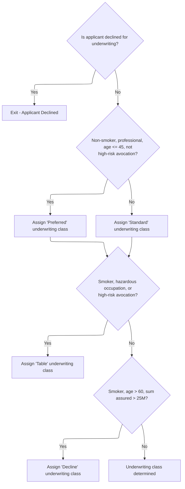

This section determines the underwriting risk class for insurance applicants based on business criteria such as age, occupation, smoking status, high-risk avocation, and sum assured.

| Rule ID | Category        | Rule Name                  | Description                                                                                                                            | Implementation Details                                                                                                                                     |
| ------- | --------------- | -------------------------- | -------------------------------------------------------------------------------------------------------------------------------------- | ---------------------------------------------------------------------------------------------------------------------------------------------------------- |
| BR-001  | Decision Making | Early Decline Exit         | If the applicant is already declined for underwriting, no further classification is performed and the process exits.                   | The output is not changed; the process exits without further classification. Underwriting class code 'DP' is a string of 2 characters.                     |
| BR-002  | Decision Making | Preferred Class Assignment | Applicants who are non-smokers, professionals, age 45 or younger, and do not have a high-risk avocation are classified as 'Preferred'. | Underwriting class code 'PR' is a string of 2 characters. Age threshold is 45 years. High-risk avocation indicator is not 'Y'.                             |
| BR-003  | Decision Making | Standard Class Assignment  | Applicants who do not meet all criteria for 'Preferred' are classified as 'Standard'.                                                  | Underwriting class code 'ST' is a string of 2 characters.                                                                                                  |
| BR-004  | Decision Making | Table Class Assignment     | Applicants who are smokers, have hazardous occupations, or high-risk avocations are classified as 'Table'.                             | Underwriting class code 'TB' is a string of 2 characters. Hazardous occupation is indicated by occupation class = 3. High-risk avocation indicator is 'Y'. |
| BR-005  | Decision Making | Decline Class Assignment   | Applicants who are smokers, age over 60, and have a sum assured greater than 25 million are classified as 'Declined'.                  | Underwriting class code 'DP' is a string of 2 characters. Age threshold is >60 years. Sum assured threshold is >25,000,000.                                |

<SwmSnippet path="/cobol/NB-UW-001.cob" line="231">

---

In <SwmToken path="cobol/NB-UW-001.cob" pos="231:1:7" line-data="       1300-DETERMINE-UW-CLASS.">`1300-DETERMINE-UW-CLASS`</SwmToken>, we check if the applicant is already declined. If so, we exit early and don't bother with further classification.

```cobol
       1300-DETERMINE-UW-CLASS.
      * NB-301: Preferred, standard, table, or decline.
           IF PM-UW-DECLINE
              EXIT PARAGRAPH
           END-IF
```

---

</SwmSnippet>

<SwmSnippet path="/cobol/NB-UW-001.cob" line="237">

---

Here we classify applicants as 'Preferred' if they're non-smokers, professionals, age <= 45, and not high-risk. Otherwise, we set them as 'Standard'.

```cobol
           IF PM-NON-SMOKER AND PM-OCC-PROF AND
              PM-INSURED-AGE-ISSUE <= 45 AND
              PM-HIGH-RISK-AVOC-IND NOT = 'Y'
              MOVE "PR" TO PM-UW-CLASS
           ELSE
              MOVE "ST" TO PM-UW-CLASS
           END-IF
```

---

</SwmSnippet>

<SwmSnippet path="/cobol/NB-UW-001.cob" line="246">

---

If the applicant is a smoker, has a hazardous occupation, or high-risk avocation, we bump their class to 'Table'.

```cobol
           IF PM-SMOKER OR PM-OCC-HAZARD OR PM-HIGH-RISK-AVOC
              MOVE "TB" TO PM-UW-CLASS
           END-IF
```

---

</SwmSnippet>

<SwmSnippet path="/cobol/NB-UW-001.cob" line="251">

---

If the applicant is a smoker, age > 60, and sum assured is high, we set their class to 'DP' (declined).

```cobol
           IF PM-SMOKER AND PM-INSURED-AGE-ISSUE > 60 AND
              PM-SUM-ASSURED > 25000000000.00
              MOVE "DP" TO PM-UW-CLASS
           END-IF.
```

---

</SwmSnippet>

## Handling Underwriting Decisions

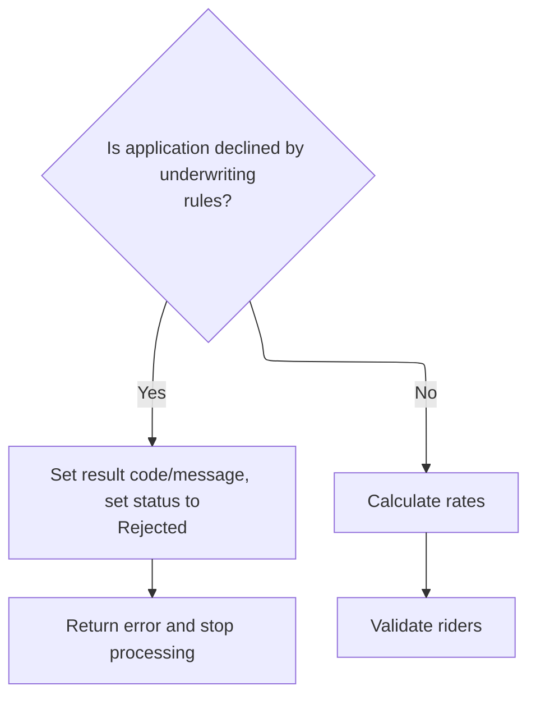

This section governs the business logic for handling underwriting decisions, specifically determining whether an application is declined and managing the resulting outputs.

| Rule ID | Category        | Rule Name                     | Description                                                                                                                                                                                                           | Implementation Details                                                                                                                                                                                                                                       |
| ------- | --------------- | ----------------------------- | --------------------------------------------------------------------------------------------------------------------------------------------------------------------------------------------------------------------- | ------------------------------------------------------------------------------------------------------------------------------------------------------------------------------------------------------------------------------------------------------------ |
| BR-001  | Decision Making | Underwriting Decline Handling | If the application is declined by underwriting rules, set the result code to 21, set the result message to 'APPLICATION DECLINED BY UNDERWRITING RULES', mark the contract status as 'Rejected', and return an error. | Result code is set to 21 (number). Result message is set to 'APPLICATION DECLINED BY UNDERWRITING RULES' (string, up to 100 characters). Contract status is set to 'RJ' (string, 2 characters, representing 'Rejected'). Error is returned via process exit. |

<SwmSnippet path="/cobol/NB-UW-001.cob" line="52">

---

Back in <SwmToken path="cobol/NB-UW-001.cob" pos="42:1:3" line-data="       MAIN-PROCESS.">`MAIN-PROCESS`</SwmToken>, if the applicant is declined, we set the error code and message, mark the contract as rejected, call <SwmToken path="cobol/NB-UW-001.cob" pos="57:3:7" line-data="              PERFORM 9000-RETURN-ERROR">`9000-RETURN-ERROR`</SwmToken>, and exit.

```cobol
           IF PM-UW-DECLINE
              MOVE 21 TO WS-RESULT-CODE
              MOVE "APPLICATION DECLINED BY UNDERWRITING RULES"
                TO WS-RESULT-MESSAGE
              MOVE "RJ" TO PM-CONTRACT-STATUS
              PERFORM 9000-RETURN-ERROR
              GOBACK
           END-IF
```

---

</SwmSnippet>

<SwmSnippet path="/cobol/NB-UW-001.cob" line="61">

---

After loading rate factors, we call <SwmToken path="cobol/NB-UW-001.cob" pos="62:3:7" line-data="           PERFORM 1500-VALIDATE-RIDERS">`1500-VALIDATE-RIDERS`</SwmToken> to check if the selected riders meet all business rules for eligibility.

```cobol
           PERFORM 1400-LOAD-RATE-FACTORS
           PERFORM 1500-VALIDATE-RIDERS
```

---

</SwmSnippet>

## Validating Policy Riders

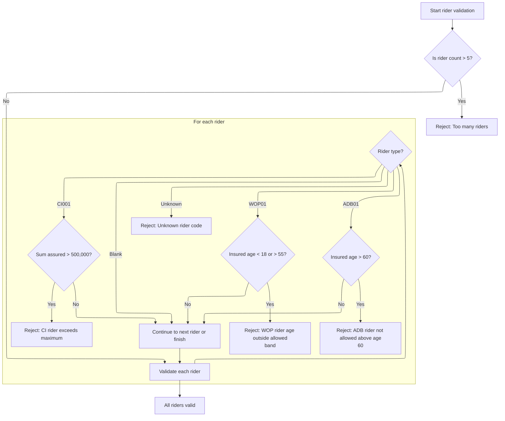

This section validates policy riders against product eligibility rules, ensuring only supported riders with valid parameters are accepted.

| Rule ID | Category        | Rule Name                | Description                                                                      | Implementation Details                                                                                                                                            |
| ------- | --------------- | ------------------------ | -------------------------------------------------------------------------------- | ----------------------------------------------------------------------------------------------------------------------------------------------------------------- |
| BR-001  | Data validation | Maximum rider count      | Reject policies with more than 5 riders.                                         | The maximum allowed rider count is 5. If exceeded, the result code is set to 22 and the message is 'RIDER COUNT EXCEEDS PRODUCT LIMIT'.                           |
| BR-002  | Data validation | ADB rider age cap        | Reject accidental death benefit riders if insured age at issue is above 60.      | The maximum allowed age for ADB rider is 60. If exceeded, the result code is set to 23 and the message is 'ADB RIDER NOT ALLOWED ABOVE AGE 60'.                   |
| BR-003  | Data validation | WOP rider age band       | Reject waiver of premium riders if insured age at issue is below 18 or above 55. | Allowed age band for WOP rider is 18 to 55 inclusive. If outside this band, the result code is set to 24 and the message is 'WOP RIDER AGE OUTSIDE ALLOWED BAND'. |
| BR-004  | Data validation | CI rider sum assured cap | Reject critical illness riders if sum assured exceeds 500,000.                   | Maximum allowed sum assured for CI rider is 500,000. If exceeded, the result code is set to 25 and the message is 'CI RIDER EXCEEDS MAXIMUM RIDER SA'.            |
| BR-005  | Data validation | Unknown rider code       | Reject riders with unknown codes.                                                | If rider code is unknown, the result code is set to 26 and the message is 'UNKNOWN RIDER CODE'.                                                                   |
| BR-006  | Decision Making | All riders valid         | Accept riders if all validations pass and no error code is set.                  | If no validation fails, the result code remains zero and no error message is set.                                                                                 |

<SwmSnippet path="/cobol/NB-UW-001.cob" line="309">

---

In <SwmToken path="cobol/NB-UW-001.cob" pos="309:1:5" line-data="       1500-VALIDATE-RIDERS.">`1500-VALIDATE-RIDERS`</SwmToken>, we first check if rider count exceeds 5. If it does, we set an error and exit validation.

```cobol
       1500-VALIDATE-RIDERS.
      * NB-501: Limit rider count.
           IF PM-RIDER-COUNT > 5
              MOVE 22 TO WS-RESULT-CODE
              MOVE "RIDER COUNT EXCEEDS PRODUCT LIMIT"
                TO WS-RESULT-MESSAGE
              EXIT PARAGRAPH
           END-IF
```

---

</SwmSnippet>

<SwmSnippet path="/cobol/NB-UW-001.cob" line="318">

---

Next we loop through each rider and check their code. For <SwmToken path="cobol/NB-UW-001.cob" pos="322:4:4" line-data="                 WHEN &quot;ADB01&quot;">`ADB01`</SwmToken>, if age at issue is over 60, we set an error and exit.

```cobol
           PERFORM VARYING WS-RIDER-IDX FROM 1 BY 1
                   UNTIL WS-RIDER-IDX > PM-RIDER-COUNT OR
                         WS-RESULT-CODE NOT = 0
              EVALUATE PM-RIDER-CODE(WS-RIDER-IDX)
                 WHEN "ADB01"
      * NB-502: Accidental death rider issue age cap 60.
                    IF PM-INSURED-AGE-ISSUE > 60
                       MOVE 23 TO WS-RESULT-CODE
                       MOVE "ADB RIDER NOT ALLOWED ABOVE AGE 60"
                         TO WS-RESULT-MESSAGE
                    END-IF
```

---

</SwmSnippet>

<SwmSnippet path="/cobol/NB-UW-001.cob" line="329">

---

For <SwmToken path="cobol/NB-UW-001.cob" pos="329:4:4" line-data="                 WHEN &quot;WOP01&quot;">`WOP01`</SwmToken>, we check if age at issue is between 18 and 55. If not, we set an error and exit.

```cobol
                 WHEN "WOP01"
      * NB-503: Waiver of premium rider age band 18 to 55.
                    IF PM-INSURED-AGE-ISSUE < 18 OR
                       PM-INSURED-AGE-ISSUE > 55
                       MOVE 24 TO WS-RESULT-CODE
                       MOVE "WOP RIDER AGE OUTSIDE ALLOWED BAND"
                         TO WS-RESULT-MESSAGE
                    END-IF
```

---

</SwmSnippet>

<SwmSnippet path="/cobol/NB-UW-001.cob" line="337">

---

For <SwmToken path="cobol/NB-UW-001.cob" pos="337:4:4" line-data="                 WHEN &quot;CI001&quot;">`CI001`</SwmToken>, we check if the rider sum assured exceeds 500,000. If it does, we set an error and exit.

```cobol
                 WHEN "CI001"
      * NB-504: Critical illness rider cap 500,000.
                    IF PM-RIDER-SUM-ASSURED(WS-RIDER-IDX)
                       > 0000500000.00
                       MOVE 25 TO WS-RESULT-CODE
                       MOVE "CI RIDER EXCEEDS MAXIMUM RIDER SA"
                         TO WS-RESULT-MESSAGE
                    END-IF
```

---

</SwmSnippet>

<SwmSnippet path="/cobol/NB-UW-001.cob" line="345">

---

After looping through all riders and checking their codes and business rules, the function either sets an error code/message if any validation fails or leaves <SwmToken path="cobol/NB-UW-001.cob" pos="348:7:11" line-data="                    MOVE 26 TO WS-RESULT-CODE">`WS-RESULT-CODE`</SwmToken> as zero if all riders are valid. If a rider code isn't recognized, it flags an error and stops processing. This ensures only supported riders with valid parameters move forward.

```cobol
                 WHEN SPACES
                    CONTINUE
                 WHEN OTHER
                    MOVE 26 TO WS-RESULT-CODE
                    MOVE "UNKNOWN RIDER CODE" TO WS-RESULT-MESSAGE
              END-EVALUATE
           END-PERFORM.
```

---

</SwmSnippet>

## Handling Rider Validation Results

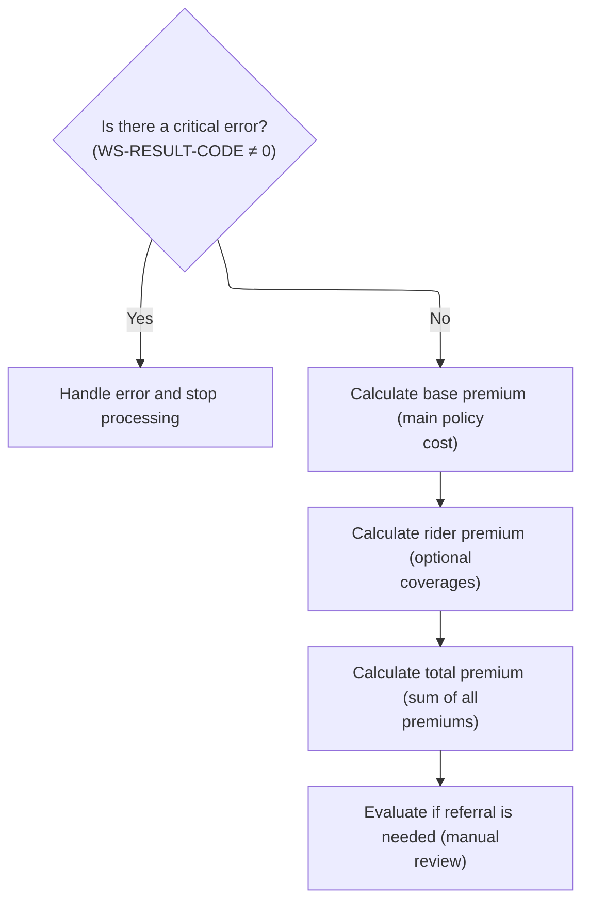

This section governs the flow after rider validation, determining whether to halt processing due to errors or proceed with premium calculations and referral checks.

| Rule ID | Category        | Rule Name                  | Description                                                                                                                    | Implementation Details                                                                                                                                                                                                                                                |
| ------- | --------------- | -------------------------- | ------------------------------------------------------------------------------------------------------------------------------ | --------------------------------------------------------------------------------------------------------------------------------------------------------------------------------------------------------------------------------------------------------------------- |
| BR-001  | Calculation     | Base premium calculation   | If no critical error is detected, the base premium for the main policy is calculated.                                          | The base premium is a numeric value calculated for the main policy. The calculation uses policy data from <SwmToken path="cobol/NB-UW-001.cob" pos="38:7:13" line-data="       PROCEDURE DIVISION USING WS-POLICY-MASTER-REC">`WS-POLICY-MASTER-REC`</SwmToken>.      |
| BR-002  | Calculation     | Rider premium calculation  | If no critical error is detected, the premium for each rider (optional coverage) is calculated according to its rules.         | Rider premiums are numeric values calculated for each optional coverage. The calculation uses policy data from <SwmToken path="cobol/NB-UW-001.cob" pos="38:7:13" line-data="       PROCEDURE DIVISION USING WS-POLICY-MASTER-REC">`WS-POLICY-MASTER-REC`</SwmToken>. |
| BR-003  | Calculation     | Total premium calculation  | If no critical error is detected, the total premium is calculated as the sum of the base premium and all rider premiums.       | The total premium is a numeric value representing the sum of the base premium and all rider premiums.                                                                                                                                                                 |
| BR-004  | Decision Making | Critical error halt        | If a critical error is detected in rider validation, processing is halted and an error message is returned to the client.      | <SwmToken path="cobol/NB-UW-001.cob" pos="46:3:7" line-data="           IF WS-RESULT-CODE NOT = 0">`WS-RESULT-CODE`</SwmToken> is a number; non-zero indicates a critical error. The output is an error message string returned to the client.                        |
| BR-005  | Decision Making | Manual referral evaluation | If no critical error is detected, the policy is evaluated to determine if a manual referral is needed for underwriting review. | The referral evaluation determines if the policy requires manual review. The output is a referral flag (e.g., 'Y' for referral needed).                                                                                                                               |

<SwmSnippet path="/cobol/NB-UW-001.cob" line="63">

---

Right after coming back from <SwmToken path="cobol/NB-UW-001.cob" pos="62:3:7" line-data="           PERFORM 1500-VALIDATE-RIDERS">`1500-VALIDATE-RIDERS`</SwmToken>, <SwmToken path="cobol/NB-UW-001.cob" pos="42:1:3" line-data="       MAIN-PROCESS.">`MAIN-PROCESS`</SwmToken> checks if <SwmToken path="cobol/NB-UW-001.cob" pos="63:3:7" line-data="           IF WS-RESULT-CODE NOT = 0">`WS-RESULT-CODE`</SwmToken> is non-zero. If there's a validation error, it calls <SwmToken path="cobol/NB-UW-001.cob" pos="64:3:7" line-data="              PERFORM 9000-RETURN-ERROR">`9000-RETURN-ERROR`</SwmToken> and exits, so nothing else runs and the client gets the error message.

```cobol
           IF WS-RESULT-CODE NOT = 0
              PERFORM 9000-RETURN-ERROR
              GOBACK
           END-IF
```

---

</SwmSnippet>

<SwmSnippet path="/cobol/NB-UW-001.cob" line="68">

---

After validating riders, <SwmToken path="cobol/NB-UW-001.cob" pos="42:1:3" line-data="       MAIN-PROCESS.">`MAIN-PROCESS`</SwmToken> runs <SwmToken path="cobol/NB-UW-001.cob" pos="68:3:9" line-data="           PERFORM 1600-CALCULATE-BASE-PREMIUM">`1600-CALCULATE-BASE-PREMIUM`</SwmToken>, then calls <SwmToken path="cobol/NB-UW-001.cob" pos="69:3:9" line-data="           PERFORM 1700-CALCULATE-RIDER-PREMIUM">`1700-CALCULATE-RIDER-PREMIUM`</SwmToken> to price each rider according to its rules. This step is needed so the total premium includes all selected riders before moving on to the final premium calculation and referral checks.

```cobol
           PERFORM 1600-CALCULATE-BASE-PREMIUM
           PERFORM 1700-CALCULATE-RIDER-PREMIUM
           PERFORM 1800-CALCULATE-TOTAL-PREMIUM
           PERFORM 1900-EVALUATE-REFERRALS
```

---

</SwmSnippet>

## Calculating Rider Premiums

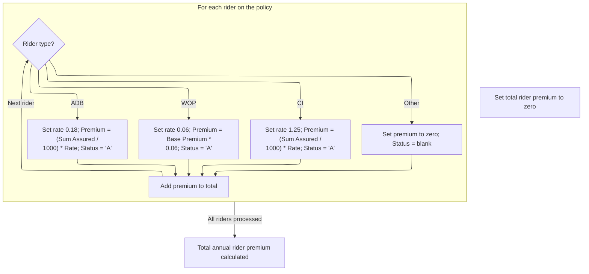

This section calculates the annual premium for each rider on a policy and accumulates the total. It applies specific pricing logic for each supported rider type and ensures the total premium reflects all valid riders.

| Rule ID | Category        | Rule Name                                                                                                                                           | Description                                                                                                                                                                                                                                                                               | Implementation Details                                                                                                                                   |
| ------- | --------------- | --------------------------------------------------------------------------------------------------------------------------------------------------- | ----------------------------------------------------------------------------------------------------------------------------------------------------------------------------------------------------------------------------------------------------------------------------------------- | -------------------------------------------------------------------------------------------------------------------------------------------------------- |
| BR-001  | Calculation     | <SwmToken path="cobol/NB-UW-001.cob" pos="322:4:4" line-data="                 WHEN &quot;ADB01&quot;">`ADB01`</SwmToken> rider premium calculation | For each rider with type <SwmToken path="cobol/NB-UW-001.cob" pos="322:4:4" line-data="                 WHEN &quot;ADB01&quot;">`ADB01`</SwmToken>, the annual premium is calculated as (Sum Assured / 1000) multiplied by a fixed rate of 0.18. The rider status is set to 'A' (active). | The rate applied is 0.18. The premium is rounded. Status is set to 'A'. The premium is a numeric value representing the annual cost for this rider.      |
| BR-002  | Calculation     | <SwmToken path="cobol/NB-UW-001.cob" pos="329:4:4" line-data="                 WHEN &quot;WOP01&quot;">`WOP01`</SwmToken> rider premium calculation | For each rider with type <SwmToken path="cobol/NB-UW-001.cob" pos="329:4:4" line-data="                 WHEN &quot;WOP01&quot;">`WOP01`</SwmToken>, the annual premium is calculated as 6% of the base annual premium. The rider status is set to 'A' (active).                           | The rate applied is 0.06 (6%). The premium is rounded. Status is set to 'A'. The premium is a numeric value representing the annual cost for this rider. |
| BR-003  | Calculation     | <SwmToken path="cobol/NB-UW-001.cob" pos="337:4:4" line-data="                 WHEN &quot;CI001&quot;">`CI001`</SwmToken> rider premium calculation | For each rider with type <SwmToken path="cobol/NB-UW-001.cob" pos="337:4:4" line-data="                 WHEN &quot;CI001&quot;">`CI001`</SwmToken>, the annual premium is calculated as (Sum Assured / 1000) multiplied by a fixed rate of 1.25. The rider status is set to 'A' (active). | The rate applied is 1.25. The premium is rounded. Status is set to 'A'. The premium is a numeric value representing the annual cost for this rider.      |
| BR-004  | Calculation     | Total rider premium accumulation                                                                                                                    | The total annual rider premium is calculated as the sum of all individual rider premiums after processing each rider.                                                                                                                                                                     | The total is a numeric value representing the sum of all rider premiums for the policy.                                                                  |
| BR-005  | Decision Making | Unrecognized rider handling                                                                                                                         | For any rider type not recognized, the annual premium is set to zero and the status is set to blank.                                                                                                                                                                                      | Premium is set to zero. Status is set to blank (empty string).                                                                                           |

<SwmSnippet path="/cobol/NB-UW-001.cob" line="371">

---

In <SwmToken path="cobol/NB-UW-001.cob" pos="371:1:7" line-data="       1700-CALCULATE-RIDER-PREMIUM.">`1700-CALCULATE-RIDER-PREMIUM`</SwmToken>, we loop through each rider and use EVALUATE to check the code. For <SwmToken path="cobol/NB-UW-001.cob" pos="376:4:4" line-data="                 WHEN &quot;ADB01&quot;">`ADB01`</SwmToken>, we price per thousand sum assured at a fixed rate, set the premium, and mark the rider as active. This is the start of the rider premium calculation logic.

```cobol
       1700-CALCULATE-RIDER-PREMIUM.
           MOVE ZERO TO PM-RIDER-ANNUAL-TOTAL
           PERFORM VARYING WS-RIDER-IDX FROM 1 BY 1
                   UNTIL WS-RIDER-IDX > PM-RIDER-COUNT
              EVALUATE PM-RIDER-CODE(WS-RIDER-IDX)
                 WHEN "ADB01"
      * NB-701: ADB premium priced per thousand on rider SA.
                    MOVE 00000.1800 TO PM-RIDER-RATE(WS-RIDER-IDX)
                    COMPUTE PM-RIDER-ANNUAL-PREM(WS-RIDER-IDX) ROUNDED =
                           (PM-RIDER-SUM-ASSURED(WS-RIDER-IDX) / 1000)
                         * PM-RIDER-RATE(WS-RIDER-IDX)
                    MOVE "A" TO PM-RIDER-STATUS(WS-RIDER-IDX)
```

---

</SwmSnippet>

<SwmSnippet path="/cobol/NB-UW-001.cob" line="383">

---

After handling <SwmToken path="cobol/NB-UW-001.cob" pos="322:4:4" line-data="                 WHEN &quot;ADB01&quot;">`ADB01`</SwmToken>, we check for <SwmToken path="cobol/NB-UW-001.cob" pos="383:4:4" line-data="                 WHEN &quot;WOP01&quot;">`WOP01`</SwmToken>. This rider's premium is set as 6% of the base annual premium, not the sum assured, and we mark it as active. The logic here is different from <SwmToken path="cobol/NB-UW-001.cob" pos="322:4:4" line-data="                 WHEN &quot;ADB01&quot;">`ADB01`</SwmToken> and ties the rider cost to the main policy premium.

```cobol
                 WHEN "WOP01"
      * NB-702: WOP premium set at 6 percent of base annual premium.
                    MOVE 00000.0600 TO PM-RIDER-RATE(WS-RIDER-IDX)
                    COMPUTE PM-RIDER-ANNUAL-PREM(WS-RIDER-IDX) ROUNDED =
                           PM-BASE-ANNUAL-PREMIUM * 0.0600
                    MOVE "A" TO PM-RIDER-STATUS(WS-RIDER-IDX)
```

---

</SwmSnippet>

<SwmSnippet path="/cobol/NB-UW-001.cob" line="389">

---

For <SwmToken path="cobol/NB-UW-001.cob" pos="389:4:4" line-data="                 WHEN &quot;CI001&quot;">`CI001`</SwmToken>, we use a much higher rate per thousand sum assured compared to <SwmToken path="cobol/NB-UW-001.cob" pos="322:4:4" line-data="                 WHEN &quot;ADB01&quot;">`ADB01`</SwmToken>. The calculation is similar, but the premium is bigger because critical illness coverage is more expensive. Status is set to active if the rider is valid.

```cobol
                 WHEN "CI001"
      * NB-703: CI premium priced per thousand on rider SA.
                    MOVE 00001.2500 TO PM-RIDER-RATE(WS-RIDER-IDX)
                    COMPUTE PM-RIDER-ANNUAL-PREM(WS-RIDER-IDX) ROUNDED =
                           (PM-RIDER-SUM-ASSURED(WS-RIDER-IDX) / 1000)
                         * PM-RIDER-RATE(WS-RIDER-IDX)
                    MOVE "A" TO PM-RIDER-STATUS(WS-RIDER-IDX)
```

---

</SwmSnippet>

<SwmSnippet path="/cobol/NB-UW-001.cob" line="396">

---

After calculating each rider's premium and status, we add the annual premium to <SwmToken path="cobol/NB-UW-001.cob" pos="401:3:9" line-data="                TO PM-RIDER-ANNUAL-TOTAL">`PM-RIDER-ANNUAL-TOTAL`</SwmToken>. If a rider code isn't recognized, its premium is zero and status is blank. The result is an updated total rider premium for the policy.

```cobol
                 WHEN OTHER
                    MOVE ZERO TO PM-RIDER-ANNUAL-PREM(WS-RIDER-IDX)
                    MOVE SPACE TO PM-RIDER-STATUS(WS-RIDER-IDX)
              END-EVALUATE
              ADD PM-RIDER-ANNUAL-PREM(WS-RIDER-IDX)
                TO PM-RIDER-ANNUAL-TOTAL
           END-PERFORM.
```

---

</SwmSnippet>

## Calculating Total Premiums

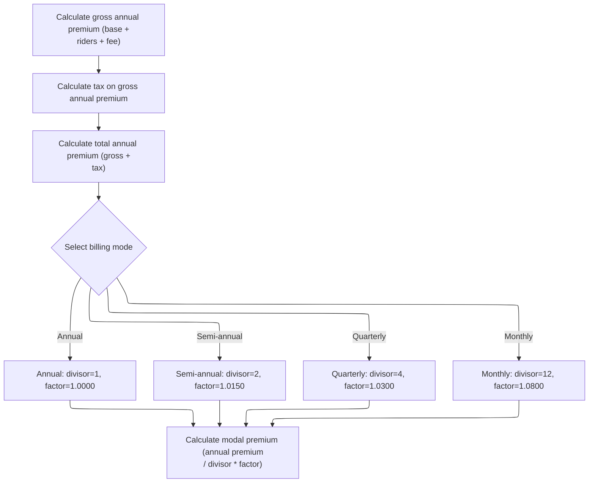

This section calculates the total premium for a term life insurance policy, including all fees and taxes, and adjusts the amount based on the selected billing mode.

| Rule ID | Category        | Rule Name                        | Description                                                                                                                    | Implementation Details                                                                                                                                                                                                                                                                                                                                                                                                                                                                                                                                                                                                                                            |
| ------- | --------------- | -------------------------------- | ------------------------------------------------------------------------------------------------------------------------------ | ----------------------------------------------------------------------------------------------------------------------------------------------------------------------------------------------------------------------------------------------------------------------------------------------------------------------------------------------------------------------------------------------------------------------------------------------------------------------------------------------------------------------------------------------------------------------------------------------------------------------------------------------------------------- |
| BR-001  | Calculation     | Gross annual premium calculation | The gross annual premium is calculated by summing the base premium, rider premiums, and policy fee.                            | The gross annual premium is a numeric value rounded to two decimal places. It includes the base premium, rider premiums, and policy fee. Policy fee values are: 45.00 for plan term 10, 55.00 for plan term 20, 60.00 otherwise.                                                                                                                                                                                                                                                                                                                                                                                                                                  |
| BR-002  | Calculation     | Tax calculation                  | Tax is calculated as a percentage of the gross annual premium, using the plan-specific tax rate.                               | Tax rate is <SwmToken path="cobol/NB-UW-001.cob" pos="126:3:5" line-data="                 MOVE 0.0200 TO PM-TAX-RATE">`0.0200`</SwmToken> for plan term 10 and 20, <SwmToken path="cobol/NB-UW-001.cob" pos="126:3:5" line-data="                 MOVE 0.0200 TO PM-TAX-RATE">`0.0200`</SwmToken> otherwise. The tax amount is rounded to two decimal places.                                                                                                                                                                                                                                                                                                    |
| BR-003  | Calculation     | Total annual premium calculation | The total annual premium is calculated by adding the gross annual premium and the tax amount.                                  | The total annual premium is a numeric value rounded to two decimal places.                                                                                                                                                                                                                                                                                                                                                                                                                                                                                                                                                                                        |
| BR-004  | Calculation     | Modal premium calculation        | The modal premium is calculated by dividing the total annual premium by the modal divisor and multiplying by the modal factor. | The modal premium is a numeric value rounded to two decimal places. It represents the amount paid per billing cycle, adjusted for billing mode, fees, and taxes.                                                                                                                                                                                                                                                                                                                                                                                                                                                                                                  |
| BR-005  | Decision Making | Billing mode adjustment          | The billing mode determines the modal divisor and factor used to adjust the annual premium for the payment schedule.           | Annual: divisor=1, factor=<SwmToken path="cobol/NB-UW-001.cob" pos="422:3:5" line-data="                 MOVE 1.0000 TO WS-MODAL-FACTOR">`1.0000`</SwmToken>; Semi-annual: divisor=2, factor=<SwmToken path="cobol/NB-UW-001.cob" pos="425:3:5" line-data="                 MOVE 1.0150 TO WS-MODAL-FACTOR">`1.0150`</SwmToken>; Quarterly: divisor=4, factor=<SwmToken path="cobol/NB-UW-001.cob" pos="428:3:5" line-data="                 MOVE 1.0300 TO WS-MODAL-FACTOR">`1.0300`</SwmToken>; Monthly: divisor=12, factor=<SwmToken path="cobol/NB-UW-001.cob" pos="431:3:5" line-data="                 MOVE 1.0800 TO WS-MODAL-FACTOR">`1.0800`</SwmToken>. |

<SwmSnippet path="/cobol/NB-UW-001.cob" line="404">

---

In <SwmToken path="cobol/NB-UW-001.cob" pos="404:1:7" line-data="       1800-CALCULATE-TOTAL-PREMIUM.">`1800-CALCULATE-TOTAL-PREMIUM`</SwmToken>, we sum up the base premium, rider premiums, and policy fee to get the gross annual premium. Then we calculate tax on that amount and add it to get the total annual premium before adjusting for billing mode.

```cobol
       1800-CALCULATE-TOTAL-PREMIUM.
      * NB-801: Gross annual premium includes base, riders, and fee.
           COMPUTE PM-GROSS-ANNUAL-PREMIUM ROUNDED =
                   PM-BASE-ANNUAL-PREMIUM
                 + PM-RIDER-ANNUAL-TOTAL
                 + PM-POLICY-FEE-ANNUAL

      * NB-802: Tax is calculated on the gross annual premium.
           COMPUTE PM-TAX-AMOUNT ROUNDED =
                   PM-GROSS-ANNUAL-PREMIUM * PM-TAX-RATE

           COMPUTE PM-TOTAL-ANNUAL-PREMIUM ROUNDED =
                   PM-GROSS-ANNUAL-PREMIUM + PM-TAX-AMOUNT
```

---

</SwmSnippet>

<SwmSnippet path="/cobol/NB-UW-001.cob" line="419">

---

After calculating the total annual premium, we use EVALUATE to set the modal divisor and factor based on billing mode. This determines how the annual premium is split and adjusted for the payment schedule.

```cobol
           EVALUATE TRUE
              WHEN PM-MODE-ANNUAL
                 MOVE 1 TO WS-MODAL-DIVISOR
                 MOVE 1.0000 TO WS-MODAL-FACTOR
              WHEN PM-MODE-SEMI
                 MOVE 2 TO WS-MODAL-DIVISOR
                 MOVE 1.0150 TO WS-MODAL-FACTOR
              WHEN PM-MODE-QUARTERLY
                 MOVE 4 TO WS-MODAL-DIVISOR
                 MOVE 1.0300 TO WS-MODAL-FACTOR
              WHEN PM-MODE-MONTHLY
                 MOVE 12 TO WS-MODAL-DIVISOR
                 MOVE 1.0800 TO WS-MODAL-FACTOR
           END-EVALUATE
```

---

</SwmSnippet>

<SwmSnippet path="/cobol/NB-UW-001.cob" line="434">

---

The modal premium is computed by dividing the total annual premium by the modal divisor and multiplying by the modal factor. This gives the client the exact amount they'll pay per billing cycle, including all fees and taxes.

```cobol
           COMPUTE PM-MODAL-PREMIUM ROUNDED =
                   (PM-TOTAL-ANNUAL-PREMIUM / WS-MODAL-DIVISOR)
                 * WS-MODAL-FACTOR.
```

---

</SwmSnippet>

## Referral and Issuance Checks

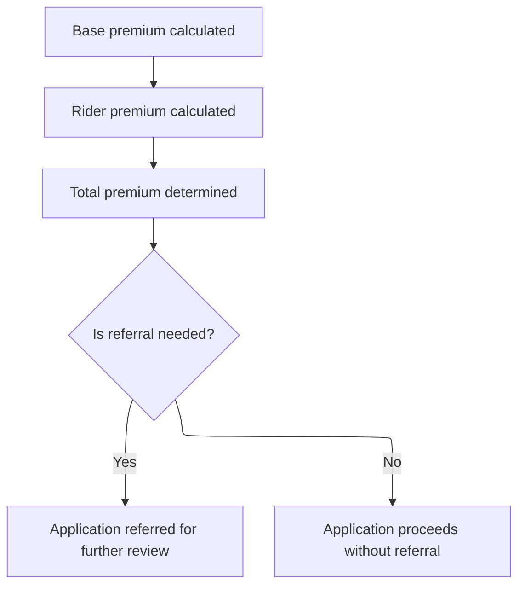

This section determines the total premium for a new policy and evaluates whether the application requires referral for additional review based on business criteria. It ensures that applications meeting certain risk or coverage thresholds are flagged for manual or reinsurance review before issuance.

| Rule ID | Category        | Rule Name                             | Description                                                                                                                            | Implementation Details                                                                                                                                                           |
| ------- | --------------- | ------------------------------------- | -------------------------------------------------------------------------------------------------------------------------------------- | -------------------------------------------------------------------------------------------------------------------------------------------------------------------------------- |
| BR-001  | Calculation     | Base premium calculation              | Calculate the base premium for the policy using the provided policy data and plan parameters.                                          | The base premium is determined using the plan code, coverage amount, and other relevant policy attributes. The calculation uses numeric values for coverage and plan parameters. |
| BR-002  | Calculation     | Rider premium calculation             | Calculate the rider premium for the policy if applicable, based on the policy data and rider selections.                               | The rider premium is calculated using numeric values for selected riders and their parameters. The result is added to the base premium.                                          |
| BR-003  | Calculation     | Total premium determination           | Determine the total premium by summing the base premium and all applicable rider premiums.                                             | The total premium is a numeric value representing the sum of the base and rider premiums.                                                                                        |
| BR-004  | Decision Making | Referral evaluation                   | Evaluate if the application requires referral for manual underwriting or reinsurance review based on coverage amount and risk factors. | Referral is triggered if business criteria for coverage amount or risk are met. The outcome is either referral for further review or proceeding without referral.                |
| BR-005  | Decision Making | Application referral outcome          | If referral criteria are met, the application is referred for further review and does not proceed to issuance at this stage.           | The application status is set to indicate referral for manual underwriting or reinsurance review. The outcome is not issuance at this stage.                                     |
| BR-006  | Decision Making | Application proceeds without referral | If referral criteria are not met, the application proceeds without referral and can continue to issuance.                              | The application status remains unchanged and the process continues toward issuance.                                                                                              |

<SwmSnippet path="/cobol/NB-UW-001.cob" line="68">

---

After finishing premium calculations in <SwmToken path="cobol/NB-UW-001.cob" pos="42:1:3" line-data="       MAIN-PROCESS.">`MAIN-PROCESS`</SwmToken>, we call <SwmToken path="cobol/NB-UW-001.cob" pos="71:3:7" line-data="           PERFORM 1900-EVALUATE-REFERRALS">`1900-EVALUATE-REFERRALS`</SwmToken> to see if the policy needs manual underwriting or reinsurance review based on coverage amount and risk factors. This step decides if the policy can be issued or needs extra review.

```cobol
           PERFORM 1600-CALCULATE-BASE-PREMIUM
           PERFORM 1700-CALCULATE-RIDER-PREMIUM
           PERFORM 1800-CALCULATE-TOTAL-PREMIUM
           PERFORM 1900-EVALUATE-REFERRALS
```

---

</SwmSnippet>

## Referral Decision Logic

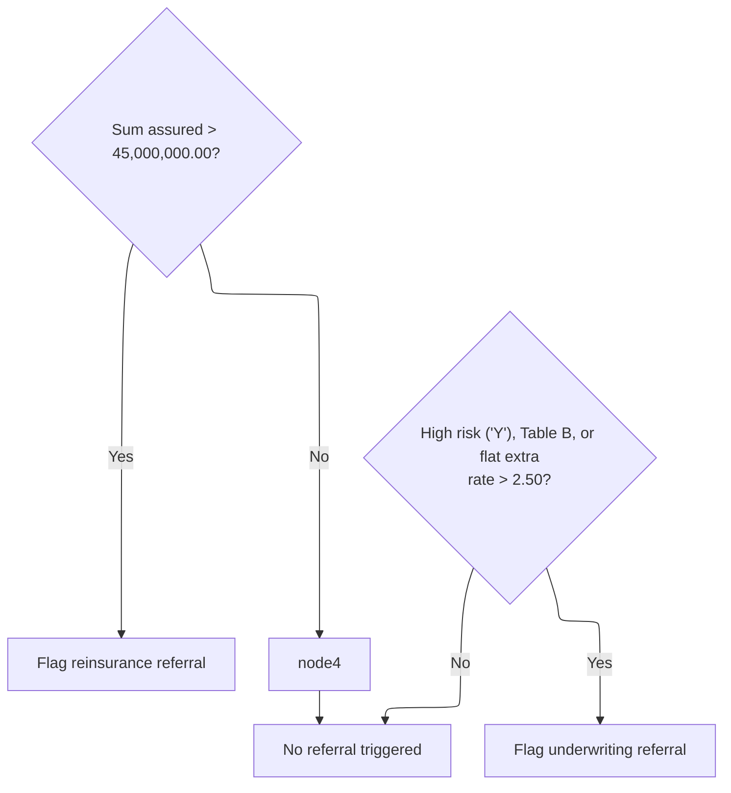

This section determines if a policy application needs to be referred to reinsurance or underwriting based on business thresholds for sum assured and risk attributes.

| Rule ID | Category        | Rule Name                                                | Description                                                                                                                                     | Implementation Details                                                                                                                                                    |
| ------- | --------------- | -------------------------------------------------------- | ----------------------------------------------------------------------------------------------------------------------------------------------- | ------------------------------------------------------------------------------------------------------------------------------------------------------------------------- |
| BR-001  | Decision Making | Large sum assured reinsurance referral                   | If the sum assured for a policy exceeds 45,000,000.00, the policy is flagged for reinsurance referral.                                          | The threshold for triggering this rule is 45,000,000.00. The output is a referral flag indicating reinsurance review is required.                                         |
| BR-002  | Decision Making | High risk or table B or flat extra underwriting referral | If the policy is classified as high risk, table B, or has a flat extra rate greater than 2.50, the policy is flagged for underwriting referral. | High risk is indicated by 'Y'. Table B is indicated by 'TB'. Flat extra rate threshold is 2.50. The output is a referral flag indicating underwriting review is required. |
| BR-003  | Decision Making | No referral triggered                                    | If none of the referral criteria are met, no referral is triggered for the policy.                                                              | No referral flags are set if none of the criteria are met. The output is the absence of referral flags.                                                                   |

<SwmSnippet path="/cobol/NB-UW-001.cob" line="438">

---

In <SwmToken path="cobol/NB-UW-001.cob" pos="438:1:5" line-data="       1900-EVALUATE-REFERRALS.">`1900-EVALUATE-REFERRALS`</SwmToken>, we check if the sum assured is huge or if the policy is table-rated, high-risk, or has a big flat extra rate. If any of these hit, we flag the policy for reinsurance or manual underwriting referral.

```cobol
       1900-EVALUATE-REFERRALS.
      * NB-901: Large cases require facultative reinsurance review.
           IF PM-SUM-ASSURED > 45000000000.00
              MOVE 'Y' TO WS-REINSURANCE-REFERRAL
           END-IF
```

---

</SwmSnippet>

<SwmSnippet path="/cobol/NB-UW-001.cob" line="445">

---

After checking the referral conditions, the function sets <SwmToken path="cobol/NB-UW-001.cob" pos="100:9:13" line-data="           MOVE &#39;N&#39; TO WS-REINSURANCE-REFERRAL">`WS-REINSURANCE-REFERRAL`</SwmToken> or <SwmToken path="cobol/NB-UW-001.cob" pos="447:9:13" line-data="              MOVE &#39;Y&#39; TO WS-UW-REFERRAL">`WS-UW-REFERRAL`</SwmToken> as needed. These flags are used in <SwmToken path="cobol/NB-UW-001.cob" pos="42:1:3" line-data="       MAIN-PROCESS.">`MAIN-PROCESS`</SwmToken> to decide if the policy needs extra review and to inform the client.

```cobol
           IF PM-UW-TABLE-B OR PM-HIGH-RISK-AVOC OR
              PM-FLAT-EXTRA-RATE > 00002.50
              MOVE 'Y' TO WS-UW-REFERRAL
           END-IF.
```

---

</SwmSnippet>

## Final Decision and Policy Issuance

This section determines the final outcome for a new business policy: either referring the contract for manual underwriting/reinsurance, or issuing the policy and marking it active. It sets all key output fields for downstream systems and client notification.

| Rule ID | Category        | Rule Name                            | Description                                                                                                                                                                                                                  | Implementation Details                                                                                                                                                                                                                              |
| ------- | --------------- | ------------------------------------ | ---------------------------------------------------------------------------------------------------------------------------------------------------------------------------------------------------------------------------- | --------------------------------------------------------------------------------------------------------------------------------------------------------------------------------------------------------------------------------------------------- |
| BR-001  | Calculation     | Policy issuance and date calculation | If there are no referral flags set, the policy is issued: all key dates are set to the process date, the expiry date is calculated as process date plus term years times 365 days, and the contract status is set to active. | Issue, effective, paid-to, and last maintenance dates are set to the process date (8-digit number). Expiry date is calculated as process date plus (term years \* 365 days), without leap year adjustment. Contract status is set to 'AC' (active). |
| BR-002  | Decision Making | Referral outcome handling            | If the contract is flagged for referral (manual underwriting or reinsurance), the contract is marked as referred, a referral result code and message are set, and the process exits without issuing the policy.              | The result code is set to 2. The result message is set to 'REFERRED FOR MANUAL UW OR REINSURANCE REVIEW'. The contract status is set to 'PE' (pending).                                                                                             |
| BR-003  | Writing Output  | Policy issuance success response     | After a policy is issued, the result code is set to zero, the result message is set to 'POLICY ISSUED SUCCESSFULLY', and a success response is returned to the client.                                                       | Result code is set to 0. Result message is set to 'POLICY ISSUED SUCCESSFULLY'.                                                                                                                                                                     |

<SwmSnippet path="/cobol/NB-UW-001.cob" line="73">

---

After coming back from <SwmToken path="cobol/NB-UW-001.cob" pos="71:3:7" line-data="           PERFORM 1900-EVALUATE-REFERRALS">`1900-EVALUATE-REFERRALS`</SwmToken>, <SwmToken path="cobol/NB-UW-001.cob" pos="42:1:3" line-data="       MAIN-PROCESS.">`MAIN-PROCESS`</SwmToken> checks if either referral flag is set. If so, it marks the contract as referred, sets the result code/message, and exits, so the client gets a clear referral notice instead of an issued policy.

```cobol
           IF WS-REFERRED OR WS-MANUAL-UW
              MOVE 2 TO WS-RESULT-CODE
              MOVE "REFERRED FOR MANUAL UW OR REINSURANCE REVIEW"
                TO WS-RESULT-MESSAGE
              MOVE "PE" TO PM-CONTRACT-STATUS
              PERFORM 9100-RETURN-SUCCESS
              GOBACK
           END-IF
```

---

</SwmSnippet>

<SwmSnippet path="/cobol/NB-UW-001.cob" line="82">

---

If there are no errors or referrals, <SwmToken path="cobol/NB-UW-001.cob" pos="42:1:3" line-data="       MAIN-PROCESS.">`MAIN-PROCESS`</SwmToken> calls <SwmToken path="cobol/NB-UW-001.cob" pos="82:3:7" line-data="           PERFORM 2000-ISSUE-POLICY">`2000-ISSUE-POLICY`</SwmToken> to activate the policy and set all key dates. This step finalizes the policy and marks it as active.

```cobol
           PERFORM 2000-ISSUE-POLICY
```

---

</SwmSnippet>

<SwmSnippet path="/cobol/NB-UW-001.cob" line="450">

---

<SwmToken path="cobol/NB-UW-001.cob" pos="450:1:5" line-data="       2000-ISSUE-POLICY.">`2000-ISSUE-POLICY`</SwmToken> sets all key dates to the process date, then calculates the expiry date by adding term years times 365 days. Contract status is set to 'AC' to mark the policy as active. Leap years aren't handled, so expiry might be off by a day or two for long terms.

```cobol
       2000-ISSUE-POLICY.
      * NB-1001: Successful issue sets policy active and populates dates.
           MOVE PM-PROCESS-DATE TO PM-ISSUE-DATE
                                 PM-EFFECTIVE-DATE
                                 PM-PAID-TO-DATE
                                 PM-LAST-MAINT-DATE
           COMPUTE WS-DATE-INT =
               FUNCTION INTEGER-OF-DATE (PM-EFFECTIVE-DATE)
               + (PM-TERM-YEARS * 365)
           COMPUTE PM-EXPIRY-DATE =
               FUNCTION DATE-OF-INTEGER (WS-DATE-INT)
           MOVE "AC" TO PM-CONTRACT-STATUS.
```

---

</SwmSnippet>

<SwmSnippet path="/cobol/NB-UW-001.cob" line="83">

---

After issuing the policy, <SwmToken path="cobol/NB-UW-001.cob" pos="42:1:3" line-data="       MAIN-PROCESS.">`MAIN-PROCESS`</SwmToken> sets the result code to zero, updates the message to 'POLICY ISSUED SUCCESSFULLY', and calls <SwmToken path="cobol/NB-UW-001.cob" pos="85:3:7" line-data="           PERFORM 9100-RETURN-SUCCESS">`9100-RETURN-SUCCESS`</SwmToken>. The client gets a clear success response and the policy is now active.

```cobol
           MOVE 0 TO WS-RESULT-CODE
           MOVE "POLICY ISSUED SUCCESSFULLY" TO WS-RESULT-MESSAGE
           PERFORM 9100-RETURN-SUCCESS
           GOBACK.
```

---

</SwmSnippet>

&nbsp;

*This is an auto-generated document by Swimm 🌊 and has not yet been verified by a human*

<SwmMeta version="3.0.0" repo-id="Z2l0aHViJTNBJTNBQ09CT0xfU2FtcGxlX01hcmNoXzIwMjYlM0ElM0FtdWRhc2luMQ==" repo-name="COBOL_Sample_March_2026"><sup>Powered by [Swimm](https://app.swimm.io/)</sup></SwmMeta>
